# Deploy IoT Weather Station and Connected Data Architecture

## Introduction

You'll make an IoT Weather Station with a Raspberry Pi and Sense HAT. Additionally, you'll add on data analytics to this IoT Weather Station Platform with Connected Data Architecture communication between the MiNiFi, HDF Sandbox and HDP Sandbox.

## Prerequisites

- Downloaded and Installed **Docker Engine** onto your computer, refer to [Install Docker](https://docs.docker.com/engine/installation/) if you need help
    - Set **Docker Memory to 12GB** to run both HDF and HDP Sandboxes on one laptop, refer to [Docker Preferences Overview](https://docs.docker.com/docker-for-mac/#preferences) if you need help configuring Docker Memory.
        - Link above will take you to Docker preferences for Mac. In the Docker documentation, choose your OS.
- Downloaded Latest [HDF and HDP Docker Sandboxes](https://hortonworks.com/downloads) for Docker Engine
- **Installed Latest HDF and HDP Docker Sandboxes** onto your computer, refer to [Sandbox Deployment and Install Guide](https://hortonworks.com/tutorial/sandbox-deployment-and-install-guide/section/3/) if you need help
- Downloaded and Installed Latest [Raspbian OS](https://www.raspberrypi.org/downloads/raspbian/) onto Raspberry Pi
    - If you need help installing Raspbian OS onto the Raspberry Pi, refer to **Appendix A**.
- Read "Analyze IoT Weather Station Data via Connected Data Architecture" Overview

## Outline

- [Step 1: Install Sense HAT and MiNiFi onto Raspberry Pi](#install-sense-hat-minifi-rpi-2)
- [Step 2: Calibrate Raspberry Pi Timezone](#calibrate-raspberry-pi-timezone-2)
- [Step 3: Start HDF Sandbox and Setup NiFi Site-To-Site](#start-hdf-setup-site-to-site-2)
- [Step 4: Start HDP Sandbox and Disable Irrelevant Services](#start-hdp-disable-irrelevant-services-2)
- [Step 5: Connect HDF and HDP to Deploy Connected Data Architecture](#connect-hdf-hdp-deploy-cda-2)
- [Summary](#summary-2)
- [Further Reading](#further-reading-2)
- [Appendix A: Install Raspbian OS onto Raspberry Pi](#appendix-a-install-raspbian-2)
- [Appendix B: Reset Raspberry Pi Time and Date for your Region](#reset-rpi-time-date-2)

### Step 1: Install Sense HAT and MiNiFi onto Raspberry Pi

### 1.1: Connect Sense HAT Hardware to Raspberry Pi

In this section, you learn to connect the Sense HAT to the Raspberry Pi using their header pins. The hardware needs to be connected to Raspberry Pi to draw
real-time sensor readings.

1\. Connect the Sense HAT's 40 female pins to the Raspberry Pi's 40 male pins.

**Figure 1:** Raspberry Pi 40 male pin headers

**Figure 2:** Sense HAT 40 female pin headers

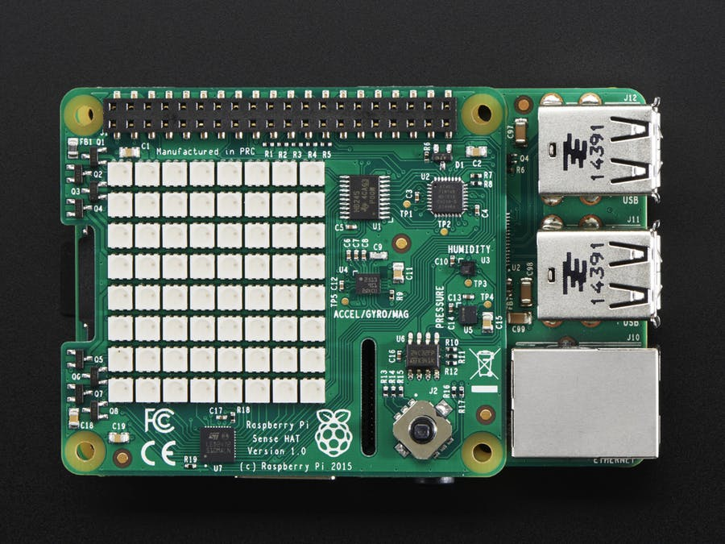

**Figure 3:** Sense HAT female pins connected to Raspberry Pi male pins

### 1.2: Power the Raspberry Pi and Establish Internet Connection

The Raspberry Pi needs Internet Access to be able to connect to your computer.

Make the connection between the Raspberry Pi and your router using an
ethernet cable. Plug in the Micro USB Power Supply to power your Raspberry Pi.

**Figure 4:** Raspberry Pi Ethernet Cable Connected for Internet Access

### 1.3: SSH into the Raspberry Pi

In this section, you learn to use **Adafruit's Pi Finder** to discover your Raspberry Pi's IP address, so you can access it remotely.

> Note: If you haven't installed Raspbian OS on your Raspberry Pi, refer to **Appendx A**.

1\. Download Raspberry **Pi Finder** for your appropriate OS at [Adafruit-Pi-Finder Latest Releases](https://github.com/adafruit/Adafruit-Pi-Finder/releases/tag/3.0.0)

2\. Open Raspberry **Pi Finder** and **Click Find My Pi!**:

**Figure 5:** Pi Finder GUI

**Pi Finder** - used to detect _Raspberry Pi IP address_ in a home setting

3\. Results include the **IP address**, **SSH User** and **SSH Password** of your Raspberry Pi:

**Figure 6:** Pi Finder Found My Pi

4\. SSH into the Pi from your laptop by pressing the **Terminal** button.

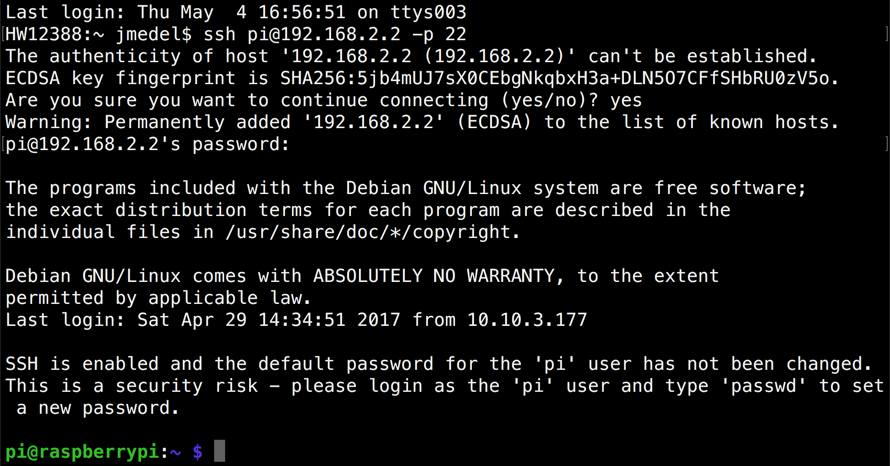

**Figure 7:** Pi Raspbian OS CLI

### 1.4: Install the Sense HAT Software onto Raspberry Pi

Download and install the Sense HAT Software using the following command:

~~~bash
sudo apt-get update
sudo apt-get install sense-hat
sudo pip3 install pillow
~~~

Now you have the Sense HAT software library, so you can create a program to retrieve sensor readings, you will utilize it in the next tutorial.

### 1.5: Install MiNiFi Java Agent onto Raspberry Pi

In this section, you install Java 8 and JDK 1.8 onto the Raspberry Pi because it is required to run MiNiFi.

Download and Install Java 8 and JDK1.8:

~~~bash
sudo apt-get update && sudo apt-get install oracle-java8-jdk
~~~

> Note: the install will take approximately 10 minutes depending on Raspbian OS resources being used.

2\. Download MiNiFi Java Agent from [Apache nifi minifi Downloads](http://nifi.apache.org/minifi/download.html) under section **Releases -> MiNiFi (Java) -> Binaries**.

3\. Click on `minifi-0.2.0-bin.zip`, then download MiNiFi from any of the links provided onto your computer.

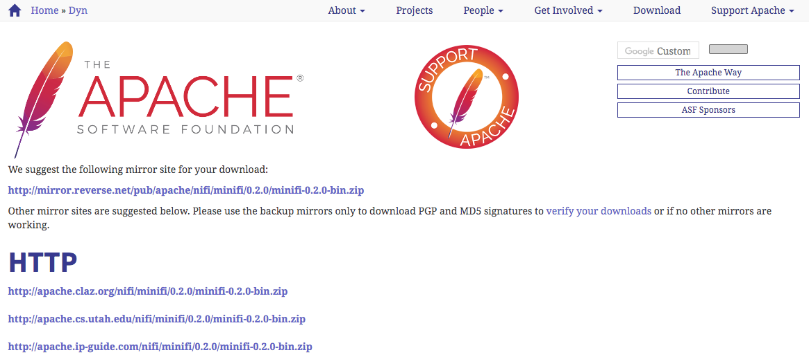

4\. Use Pi Finder's **Upload** button to transport MiNiFi application onto your
Raspberry Pi. Select `minifi-0.2.0-bin.zip` and click **Open**.

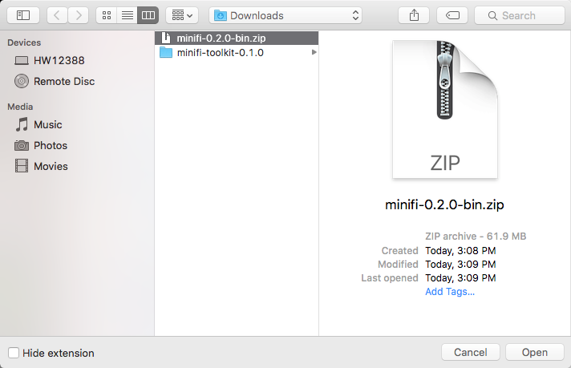

5\. Use the Pi Finder's **Terminal** button and then Unzip the MiNiFi project.

~~~bash
unzip minifi-0.2.0-bin.zip
~~~

A MiNiFi Agent is installed onto the Raspberry Pi. We'll explain more about the MiNiFi Agent in the next tutorial.

### 1.6: Download MiNiFi Toolkit onto your Computer

In this section, you download MiNiFi toolkit onto your computer because it is needed to convert NiFi flow to MiNiFi flow format. In the next tutorial, you will
built the MiNiFi flow in NiFi.

1\. Download MiNiFi Tookit from [Apache nifi minifi Downloads](http://nifi.apache.org/minifi/download.html) under section **Releases -> MiNiFi Toolkit Binaries -> 0.2.0 - Compatible with MiNiFi Java 0.2.0+**.

2\. Click on `minifi-toolkit-0.2.0-bin.zip` then download MiNiFi Toolkit from any of the links provided onto your computer.

3\. Go to the location where MiNiFi was downloaded and Unzip MiNiFi Toolkit
using your favorite decompression software:

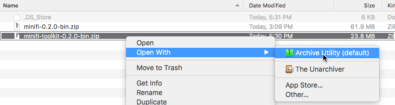

Now MiNiFi Toolkit is available for use in the next tutorial.

### Step 2: Calibrate Raspberry Pi Timezone

Why is it important to calibrate the timezone on the Raspberry Pi?

In order for your system to have the correct time and date, the timezone needs to be calibrated. An area where this configuration is important is in the next tutorial when you create the Python script that draws timestamp for each sensor readings.

SSH into the Raspberry Pi using Adafruit's Pi Finder **Terminal** button.

1\. Type `sudo raspi-config`

- **raspi-config** is used for changing OS configurations and will be used to recalibrate the current date/time for your timezone

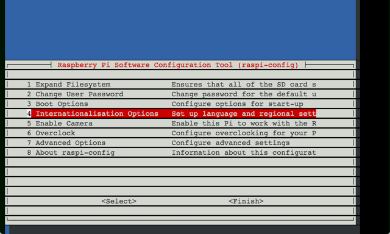

**Figure 8:** raspi-config main menu

2\. Select `4. Internationalisation Options`. Press "Enter" on keyboard.

3\. Select `I2 Change Timezone`.

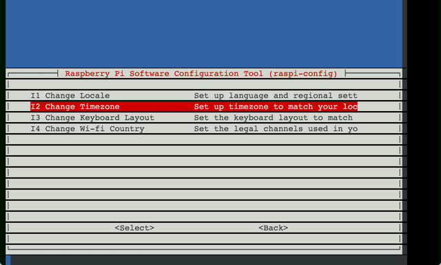

**Figure 9:** Internationalisation Options Menu

4\. Select your appropriate `Geographic area`.

- Ex: US

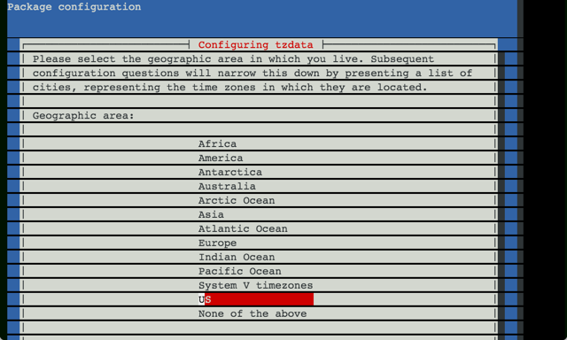

**Figure 10:** Geographic area Selection Items

5\. Select your appropriate `Time zone`.

- Ex: Pacific Ocean

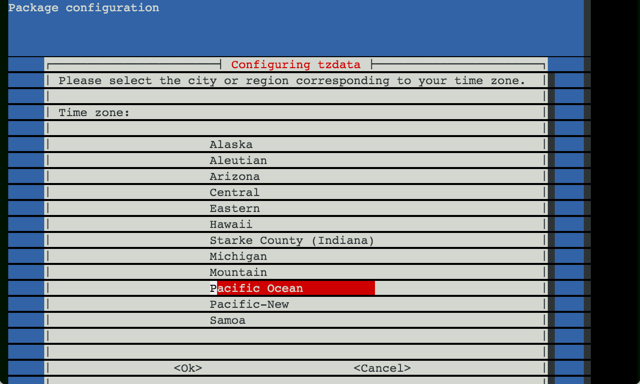

**Figure 11:** Time Zone Selection Items

6\. You are brought back to the menu. Select `<Finish>`. Your new calibrated time should display:

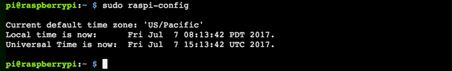

**Figure 12:** Time Zone Calibrated

### Step 3: Setup and Start HDF Sandbox

> Note: Before starting HDF and HDP Sandbox, you will need to set the Docker Engine memory to at least 12GB to run both sandboxes on one laptop.

**Option 1: For Users Who Haven't Deployed HDF Sandbox**

Run through this tutorial: [Deploying Hortonworks Sandbox on Docker](https://hortonworks.com/tutorial/sandbox-deployment-and-install-guide/section/3/). It will walk you the general approach to install Hortonworks Sandbox HDF onto Docker on your computer.

**Option 2: For Users Have Deployed HDF Sandbox**

Run through "Deploying Hortonworks Sandbox on Docker" section called ["Start Sandbox"](https://hortonworks.com/tutorial/sandbox-deployment-and-install-guide/section/3/#start-sandbox). If you do not have the start_sandbox-hdf script, this section will provide you downloadable access, so you run it to start your sandbox.

### 3.1 Login to Ambari Dashboard UI

1\. Login to Ambari at `sandbox-cda.hortonworks.com:9080`:

> Note: The user/password is `admin/admin`

### 3.2: Configure NiFi to Receive Data

In this section, you learn to configure Nifi Site-To-Site protocol, so NiFi nodes or MiNiFi agents can remotely connect to NiFi master node.

Head to `Advanced NiFi-Properties` in Ambari Config Settings for NiFi. Update the following configurations similar to the image below:

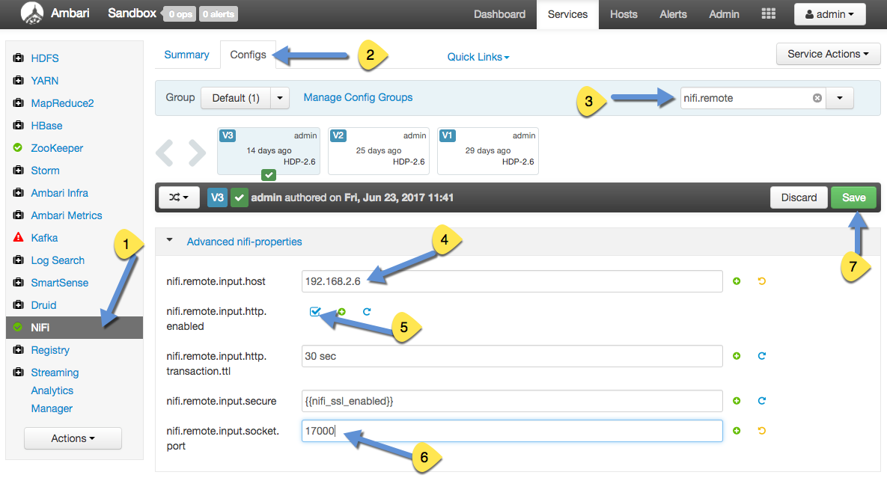

**Figure 13:** Update NiFi Config for Site-to-Site

1\. Enter **NiFi Service** in Ambari Stack

2\. Enter **NiFi Configs**

3\. Filter search for **nifi.remote**

4\. Insert **nifi.remote.input.host** with your `<host machine ip address>`

> Note: `<host machine ip address>` for linux/mac, can be found with the terminal command: `ifconfig | grep inet`. For Windows, use the command prompt command as an administrator: `ipconfig`, then under "Wireless LAN adapter Wi-Fi," retrieve the value from "IPv4 Address".

5\. Verify **nifi.remote.input.http.enabled** checked

6\. Insert **nifi.remote.input.socket.port** with `17000`

7\. Save the configuration. Write in Notes `Configured NiFi for Socket Site-To-Site`

Now NiFi is configured for Socket Site-To-Site protocol. If you encounter issues deploying MiNiFi to NiFi flow, it could be because the value **nifi.remote.iput.host** changed or **nifi.remote.input.socket.port** you chose is already being used. Of course there are other reasons for issues, but these two are ones to be mindful of.

### 3.3: Restart NiFi

Restart NiFi from Ambari with the **orange restart button** for the changes to take effect.

### 3.4: Add GeoLite2 database to HDF Sandbox CentOS

Add the GeoLite2 to HDF Sandbox CentOS, which is a database filled with Public IP Addresses mapped to geographic insights.

1\. Access HDF Web Shell Client at `sandbox-cda.hortonworks.com:14200`. User/Password is `root/hadoop`.

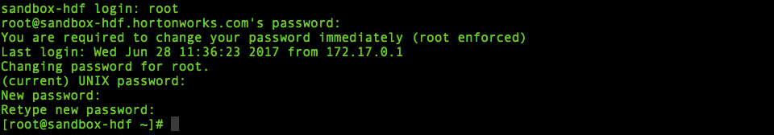

**Figure 14:** HDF Web Shell

> Note: You will be prompted to change the password if this is your first time logging into the Sandbox.

2\. Create directory for GeoFile. Change permissions of the directory to ensure NiFi has access.

~~~
mkdir -p /sandbox/tutorial-id/820/nifi/input/GeoFile
chmod 777 -R /sandbox/tutorial-id/820/nifi/
~~~

3\. Download GeoLite2-City.mmdb to specified location GeoEnrichIP looks:

~~~
cd /sandbox/tutorial-id/820/nifi/input/GeoFile
wget http://geolite.maxmind.com/download/geoip/database/GeoLite2-City.tar.gz
tar -zxvf GeoLite2-City.tar.gz
~~~

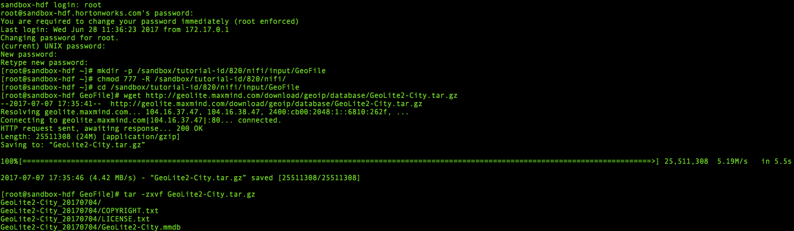

**Figure 15:** Downloaded and Extracted GeoLite2-City Database

4\. Get the full pathname to GeoLite2-City.mmdb:

~~~
cd GeoLite2-City_[date-updated]
ls
pwd
~~~

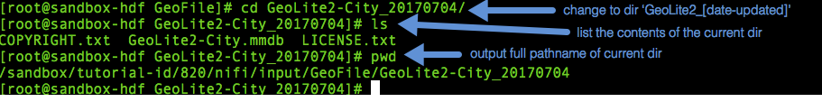

**Figure 16:** Grab Full Pathname to GeoLite2-City.mmdb file

Note down the folder name that GeoLite2-City.mmdb is located in. According to the image above, the full pathname is: `/sandbox/tutorial-id/820/nifi/input/GeoFile/GeoLite2-City_20170704/GeoLite2-City.mmdb`

> Note: GeoLite2-City_[date-updated] according to the image above is GeoLite2-City_20170704. However, at the time you download the GeoLite DB file, your [date-updated] will most likely be different than 20170704, so if needed, update the full pathname.

This full pathname will be used in tutorial 4 when you build the NiFi Flow that pulls in geographic insights.

### 3.5: Update the HDF core-site.xml to point to HDP HDFS

You will modify HDF's core-site.xml file, so that it points to the hostname that HDP's HDFS is located at. Thus, HDF services that reference this file will be able to connect to HDP's HDFS.

1\. Open the **core-site.xml** with your favorite text editor or use vi.

~~~bash
cd /etc/hadoop/conf
vi core-site.xml
~~~

2\. Replace all occurrences of "sandbox-hdf.hortonworks.com" with "sandbox.hortonworks.com" to point to HDP. Copy the command below, then paste in
vi command.

~~~bash
:%s/sandbox-hdf.hortonworks.com/sandbox.hortonworks.com/
~~~

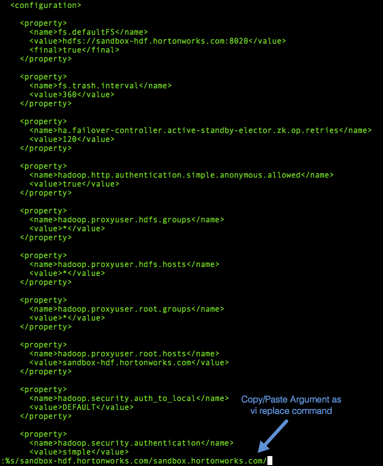

**Figure 17:** Copy/Paste vi Replace Command using the above command

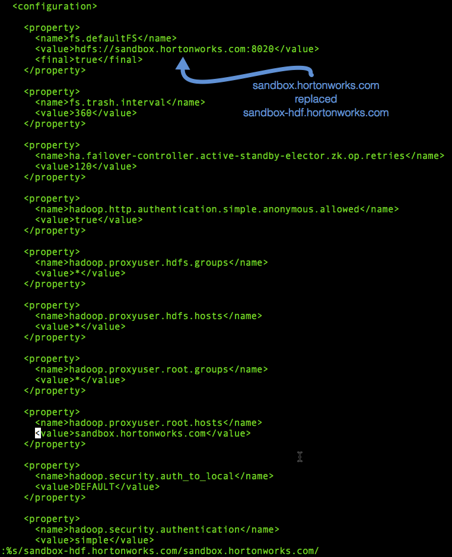

**Figure 18:** "sandbox.hortonworks.com" replaced "sandbox-hdf.hortonworks.com"

3\. Save the file. If you're using vi, Copy/Paste the command `:wq` as a vi
command.

### 3.6: Update the HDF hbase-site.xml to point to HDP hbase-site

You will modify HDF's hbase-site.xml file, so that it points to the hostname that HDP's HBase is located at. Thus, HDF services that reference this file will be able to connect to HDP's HBase.

1\. Open the **hbase-site.xml** with your favorite text editor.

~~~bash
cd /etc/hbase/conf
vi hbase-site.xml
~~~

2\. Replace all occurrences of "sandbox-hdf.hortonworks.com" with "sandbox.hortonworks.com" to point to HDP.

~~~bash
:%s/sandbox-hdf.hortonworks.com/sandbox.hortonworks.com/
~~~

3\. Save the file. If you're using vi, Copy/Paste the command `:wq` as a vi
command.

### Step 4: Setup and Start HDP Sandbox

**Option 1: For Users Who Haven't Deployed HDP Sandbox**

Run through this tutorial: [Deploying Hortonworks Sandbox on Docker](https://hortonworks.com/tutorial/sandbox-deployment-and-install-guide/section/3/). It will walk you the general approach to install Hortonworks Sandbox HDP onto Docker on your computer.

**Option 2: For Users Have Deployed HDP Sandbox**

Run through "Deploying Hortonworks Sandbox on Docker" section called ["Start Sandbox"](https://hortonworks.com/tutorial/sandbox-deployment-and-install-guide/section/3/#start-sandbox). If you do not have the start_sandbox-hdp script, this section will provide you downloadable access, so you run it to start your sandbox.

### 4.1: Login to Ambari Dashboard UI

Login to Ambari at `sandbox-cda.hortonworks.com:8080`:

user is `admin`. password you can learn to set up in [Learning the Ropes of Hortonworks Sandbox: Section 2.2](https://hortonworks.com/tutorial/learning-the-ropes-of-the-hortonworks-sandbox/#setup-ambari-admin-password)

### 4.2: Disable Oozie, Flume, Hive

These are services that will not be used in this project, so you should turn them off to save memory.

In the left hand side of HDP Services on the Ambari Stack, turn off **Oozie**, **Flume** and **Hive** with Ambari **Service Actions -> Stop** since you'll need more memory to run HBase.

### 4.3: Verify HBase RPC Bindings Are configured

You will verify HBase RPC Bindings are configured because they are needed for remote services to be able to connect to HBase.

1\. Go to HBase Service, Configs, Advanced. Scroll down to **Custom hbase-site**

2\. Check if the following properties exist, else add them and click
**Add Property ...**:

~~~bash
hbase.master.ipc.address=0.0.0.0
hbase.regionserver.ipc.address=0.0.0.0
hbase.rpc.engine=org.apache.hadoop.hbase.ipc.SecureRpcEngine
~~~

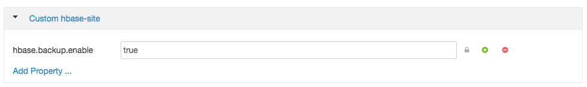

**Figure 19:** HBase RPC Bindings Not Configured

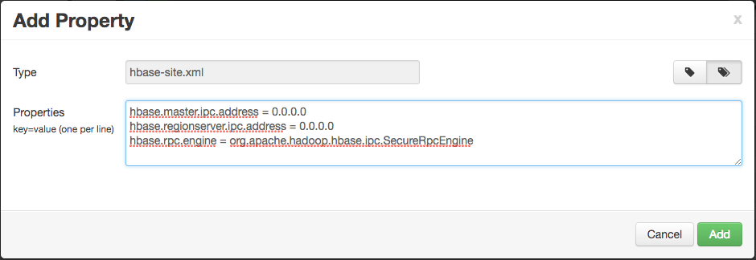

**Figure 20:** Add HBase RPC Bindings

3\. Once the Property has been added, **Save** the configuration and name it
`HBase RPC Bindings Configured`.

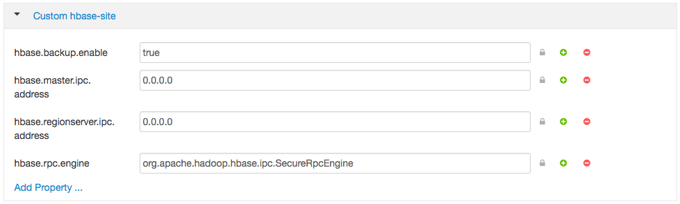

**Figure 21:** HBase RPC Bindings Configured

### 4.4: Restart HBase

Start the HBase Service with Ambari **Service Actions -> Start**. If **Maintenance Mode** is on, turn it off.

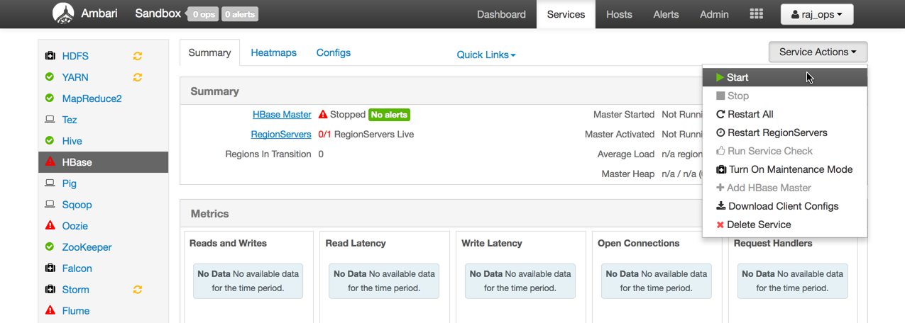

**Figure 22:** Start HBase via Ambari Service Actions

HBase service activated will be indicated by a green check mark.

### Step 5: Connect HDF and HDP to Deploy Connected Data Architecture

### 5.1: Update hosts file for HDF and HDP CentOS

Update the **hosts file** on CentOS for each Sandbox, so both sandbox server nodes can reach each other using their hostnames. Without sandboxes being aware of each other, HDF can't connect to HDP.

1\. Run the following command in your host machine's terminal or command prompt to find the ip address of each docker sandbox:

~~~bash
docker network inspect bridge
~~~

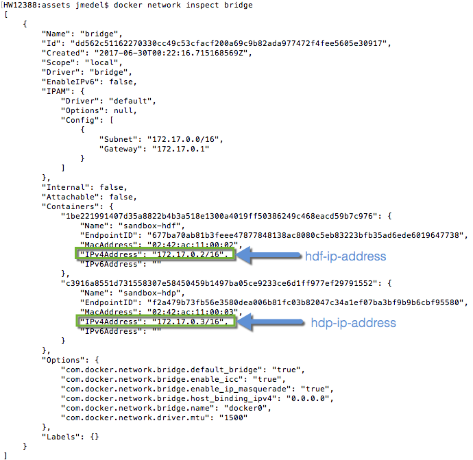

**Figure 23:** MAC OS Terminal shows Containers that Reside in Docker Bridge Network

> Note: the container ip address for HDP and HDF Sandbox. You will need these IP addresses in order for each sandbox to be reach each other.

2\. Navigate back to HDF Sandbox via Web Shell Client at `sandbox-cda.hortonworks.com:14200`

> Reminder: user/password is `root/password-you-set`

3\. Add to **HDF's hosts file**, HDP's IP address mapped to its hostname using the following command:

~~~bash
echo '{hdp-ip-address} sandbox.hortonworks.com' | sudo tee -a /etc/hosts
~~~

> Example from "sandbox-hdp" in Figure 9: `echo '172.17.0.3 sandbox.hortonworks.com' | sudo tee -a /etc/hosts`

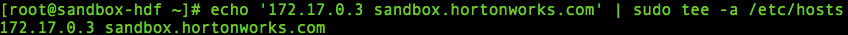

4\. Navigate to HDP Sandbox via Web Shell Client at `sandbox-cda.hortonworks.com:4200`

> Reminder: user/password is `root/password-you-set`

5\.  Add to **HDP's hosts file**, Add HDF's ip address mapped to its hostname using the following command:

~~~bash
echo '{hdf-ip-address} sandbox-hdf.hortonworks.com' | sudo tee -a /etc/hosts
~~~

> Example from "sandbox-hdf" in Figure 9: `echo '172.17.0.2 sandbox-hdf.hortonworks.com' | sudo tee -a /etc/hosts`

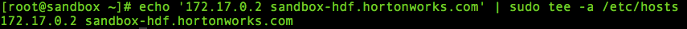

## Summary

Congratulations! You know how to setup your own IoT Weather Station using the Raspberry Pi, Sense HAT, MiNiFi, HDF Sandbox and HDP Sandbox. You are also familiar with how to install MiNiFi onto the Raspberry Pi. You also have begun setting up Connected Data Architecture between HDF and HDP SB nodes in a Docker Network. In the next tutorials, you'll focus on data preprocessing, data storage into a nosql database and analyzing the data in real-time as it saves to the database.

## Further Reading

- Learn to Install Raspbian OS through the official [Raspberry Pi Software Guide](https://www.raspberrypi.org/learning/software-guide/quickstart/)
- Learn to explore the Pi Finder through [The Adafruit Raspberry Pi Finder Guide](https://learn.adafruit.com/the-adafruit-raspberry-pi-finder/overview)
- Explore the functionality of each pin through [Raspberry Pi Pinout Diagram](http://www.jameco.com/Jameco/workshop/circuitnotes/raspberry_pi_circuit_note_fig2a.jpg)

### Appendix A: Install Raspbian OS onto Raspberry Pi

For users who need help installing Raspbian OS onto their Raspberry Pi, we have provided a step-by-step procedure. First you insert the microSD card into your computer, then download the Raspbian Image OS to your computer. We will walk you through two approaches for creating the bootable Raspbian OS. Approach 1 uses Etcher SD Card Image Utility GUI program whereas Approach 2 uses CLI.

Recommended Hardware:

- [IoT Weather Station Electronics List](http://a.co/8FNMlUu)

### Insert microSD Card into Computer

1\. Connect MicroSD to microSD Adapter.

**Figure 24:** MicroSD on left and microSD Card Adapter on right

2\. Insert the microSD Adapter into the computer.

**Figure 25:** microSD Adapter Inserted into Computer

### Download Raspbian OS Image

3\. Download [Rasbpian Jessie Lite OS Image](https://www.raspberrypi.org/downloads/raspbian/) onto your host machine.

4\. Unzip the OS Image.

### Approach 1: Create a Bootable Raspbian OS on microSD Card with Etcher.io (Windows/MAC/Linux)

You will create a Raspbian bootable OS on microSD card using etcher.io graphic install wizard instead of the command line.

1\. Download and install Etcher SD card image utility from etcher.io

2\. Use Etcher to transfer the Raspbian image to the location of your SD card. **Select Image** of Raspbian OS from the download location, then **Select Drive** (your microSD Card may already be selected by default) and choose **Flash!** to create a bootable Flash Image on the microSD.

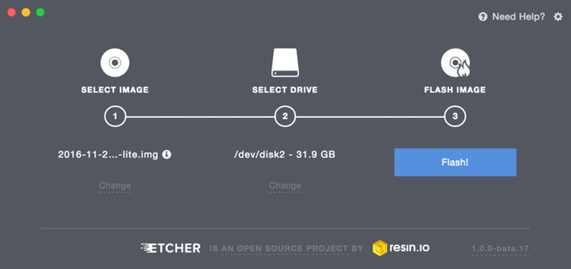

**Figure 26:** Etcher Dashboard to Create a Bootable OS on microSD

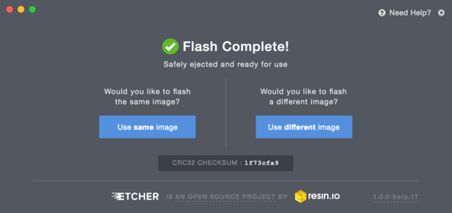

**Figure 27:** Flash Complete, Bootable OS Now Created

Once the operation completes, Etcher automatically unmounts the SD card and is safe to eject.

### Approach 2: Create a Bootable Raspbian OS on microSD with CLI (MAC/Linux)

1\. See a list of all devices that are mounted on laptop using command:

~~~bash
df
~~~

2\. Note down the device path listed next to the volume, look for the most recent volume added, it'll probably have name **/Volumes/BOOT** under Mounted On column.

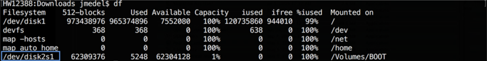

**Figure 28:** List of all Devices Mounted on Computer

3\. Open Disk Utility, select SD card, then press **Unmount**, so we can write to the entire card.

**Figure 29:** MAC Disk Utility to Unmount Device for Writing to it

4\. Head to terminal, in the Downloads folder where the Raspbian OS is located, run the DD command to write a bootable Raspbian OS onto micro SD card:

~~~
sudo dd bs=1m if=2017-02-16-raspbian-jessie-lite.img of=/dev/rdisk2
~~~

> Note: Explanation of three arguments used in dd: **bs = block size**, **if = location of raspbian input file**, **of = location of peripheral device output file**. Notice how in the **of=** argument, SD card volume changes from disk2s1 to rdisk2 to ensure the entire SD card is overloaded, not just the partition.

The DD operation will take 1 to 5 minutes until completion.

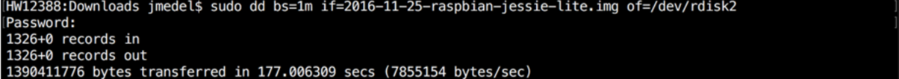

**Figure 30:** Progress of Creating Bootable OS on microSD

After the dd operation completes, you should see the Raspbian bootable OS  successfully transferred over to the SD card.

5\. To setup a headless raspberry pi, ssh can be enabled by placing a file named **ssh** onto the boot partition's base directory:

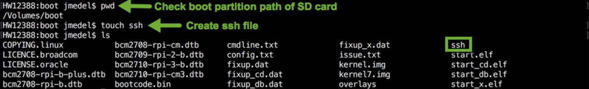

**Figure 31:** Create SSH file to Enable SSH Access to Raspberry Pi

> Note: the path to the SD card is `/Volumes/boot`. `touch ssh` creates a new file. `ls -ltr` verifies new file was created.

6\. Eject the microSD card Adapter and remove it from your laptop. Insert the microSD card into the micro SD card slot of the Raspberry Pi.

**Figure 32:** MicroSD Inserted into Raspberry Pi

7\. Connect ethernet cable to the Raspberry Pi to give it internet access, connect the 5V for power and the Pi should start up.

**Figure 33:** Raspberry Pi Ethernet Cable Connected for Internet Access

The Pi's default login credentials:

~~~bash
username/password = pi/raspberry
~~~

> Note: you will need the password for ssh access to the Raspberry Pi.
