# Collect Sense HAT Weather Data via CDA

## Introduction

You'll learn to create a python program collect sensor readings from the R-Pi Sense HAT for
temperature, humidity and barometric pressure. You'll also run MiNiFi
on top of the R-Pi to ingest the weather readings and route it to the location of
NiFi on HDF sandbox via Site-to-Site protocol. You'll also verify NiFi can
make contact with HDP by storing the data into Hadoop Distributed File System (HDFS).

## Prerequisites

- Completed previous tutorials in the series

## Outline

- [Step 1: Create a Python Script to Record Sense HAT Weather Data](#create-python-script-record-weather-data-3)
- [Step 2: Build NiFi Flow to Store MiNiFi Data to HDFS](#build-nifi-flow-store-minifi-data-to-hdfs-3)
- [Step 3: Build MiNiFi Flow to Push Data to NiFi](#build-minifi-flow-to-push-data-to-nifi-3)
- [Summary](#summary-3)
- [Further Reading](#further-reading-3)
- [Appendix A: Troubleshoot MiNiFi to NiFi Site-to-Site](#troubleshoot-minifi-to-nifi-site-to-site-3)
- [A.1: Check MiNiFi Logs](#check-minifi-logs-3)
- [A.2: Troubleshoot HDF Input Ports via OS X Firewall](#troubleshoot-hdf-input-ports-3)

### Step 1: Create a Python Script to Record Sense HAT Weather Data

You will learn to create a Python script on the Raspberry Pi that collects
weather readings from the Sense HAT. There are two approaches: **Approach 1**
you learn to implement the Python script step-by-step while **Approach 2** you
download the Python script onto the Raspberry Pi.

### Approach 1: Implement Python Script onto Raspberry Pi

We will explain sections of the code and their significance to the
project in 1.1 - 1.6. In 1.7, the full code for the WeatherStation is provided.

### 1.1: Gather Serial Number of Raspberry Pi

Serial number will be used to differentiate each Raspberry Pi Weather Station.

~~~python
# Attempt to get Raspberry Pi Serial Number
serial = get_serial()
~~~

The code calls **get_serial()** function and stores the Raspberry Pi's serial
number into variable **serial**..

~~~python
# Get Raspberry Pi Serial Number
def get_serial():
  # Extract serial from cpuinfo file
  cpuserial = "0000000000000000"
  try:
    f = open('/proc/cpuinfo','r')
    for line in f:
      if line[0:6]=='Serial':
        cpuserial = line[10:26]
    f.close()
  except:
    cpuserial = "ERROR000000000"

  return cpuserial
~~~

The **get_serial()** then searches the `/proc/cpuinfo` file for the word
**Serial**. Once that word is found, the cpu's serial number is stored into
variable **cpuserial**.

### 1.2: Gather Timestamp for Sensor Reading

Timestamp tells the time when the sensor readings were taken.

~~~python
# Get Current Time Preferred by OS
timestamp = get_time()
~~~

The code above calls the **get_time()** function and stores the current date
time into the into variable **timestamp**.

~~~python
# Get Current Time Preferred by OS
def get_time():
  current_time = datetime.datetime.now().strftime("%Y-%m-%dT%H:%M:%SZ")
  return current_time
~~~

Inside the **get_time()** function, **datetime.datetime.now()** retrieves the current date and time preferred by the OS,
then **strftime("%Y-%m-%dT%H:%M:%SZ")** formats the date time by year, month,
day, separated by character 'T' to indicate time of date in hours, minutes,
and seconds. This formatted data and time value is returned to **current_time**
as a string.

### 1.3: Gather Weather Readings from Sense HAT

Temperature, humidity and barometric pressure are retrieved from the Sense HAT.
`sense.get_temperature` grabs a temperature reading and stores it into the **temp_c** variable.

~~~python
# Attempt to get sensor reading.
temp_c = sense.get_temperature()
humidity_prh = sense.get_humidity()
humidity_prh = round(humidity_prh, 2)
pressure_mb = sense.get_pressure()
pressure_mb = round(pressure_mb, 2)
~~~

### 1.4: Try to Calibrate Sense HAT Temperature Sensor Readings

The Sense HAT Temperature Sensor readings is off from actual temperature due to
the Raspberry Pi's CPU emitting heat around the Sense HAT. The Raspberry Pi's
CPU temperature emits 55.8 Celsius (132.44 Fahrenheit). Thus, for us to be
able to gather useful data from the temperature sensor, we must calibrate the
sensor.

~~~python
# Get Raspberry Pi CPU Core Temperature
cpu_temp_c = get_cpu_temp_c()

# Calibrate Sense HAT Temperature Sensor Reading
temp_c = calibrate_temp_c(cpu_temp_c, temp_c)
temp_c = round(temp_c, 2)
~~~

In the code above, **get_cpu_temp_c()** function is called to acquire cpu
temperature, then that result is stored into the **cpu_temp_c** variable.

**temp_c** variable is overwritten with the calibrated Sense HAT temperature
reading by calling the **calibrate_temp_c(cpu_temp_c, temp_c)** function.

~~~python
# Get Raspberry Pi CPU Core Temperature via "vcgencmd" shell command
def get_cpu_temp_c():
  cpu_temp = subprocess.check_output("vcgencmd measure_temp", shell=True)
  # Break up a String and add the data to string array using separator "="
  array = cpu_temp.split("=")
  array2 = array[1].split("'")
  # Grab temperature value from array2 element 0
  cpu_tempc = float(array2[0])
  cpu_tempc = float("{0:.2f}".format(cpu_tempc))
  return cpu_tempc

# Sense HAT Temperature Readings are off due to CPU's temperature heat
# Calibrate temperature reading by using scaling factor: 5.466
# The scaling factor is the amount of degrees the
# Sense HAT is off by from actual temperature
def calibrate_temp_c(cpu_tempc, temp_c):
  temp_c - ((cpu_tempc - temp_c)/5.466)
  return temp_c
~~~

**get_cpu_temp_c()** function stores the CPU temperature output of
Raspberry Pi shell command "vcgencmd measure_temp" into **cpu_temp** variable.
Since this shell command outputs CPU temperature in form such as "temp=50.5'C",
two array variables (**array**, **array2**) are used to break up the string and
retrieve just the CPU temperature value, such as "50.5". A value is returned
anytime a user calls on this function.

**calibrate_temp_c(cpu_temp_c, temp_c)** takes as parameters: cpu_temp_c and
temp_c, then calculates a more accurate Sense HAT temperature reading while
taking into account the scaling factor: 5.466. The scaling factor is the amount of
degrees the Sense HAT is off by compared to actual temperature in a particular
location. Keep in mind the Sense HAT Temperature will probably still be off
compared to actual temperature because the Sense HAT is still physically close
to CPU heat.

If you're interested in knowing more about calculating the scaling factor,
read the following paragraph, else move to 1.5.

The scaling factor value, such as 5.466, can be retrieved by recording actual
temperature readings (ex: DHT22 sensor) multiple times in a 24 hour period.
In parallel, you would also record temperature readings from the Sense HAT.
Then you would take all your recordings of the actual temperature, find the
average and subtract it from the average recordings of Sense HAT temperature
readings. The scaling factor result should reveal the amount of degrees the
Sense HAT is off by compared to actual temperature.

### 1.5: Gather Public IP Address of Raspberry Pi

The Public IP address will be used to acquire meaningful geographic insights
to complement the weather data. So, we will be able to determine the city and
state in which weather readings were recorded.
The code extracts the Public IP address via rest call to IPIFY and then parses
the JSON for `ip` value.

~~~python
# Attempt to get Public IP
public_ip = get_public_ip()
~~~

The code above calls the **get_public_ip()** function and stores the Raspberry
Pi's Public IP address into **public_ip** variable.

~~~python
# Get Raspberry Pi Public IP via IPIFY Rest Call
def get_public_ip():
  ip = json.load(urllib2.urlopen('https://api.ipify.org/?format=json'))['ip']
  return ip
~~~

Inside the **get_public_ip()**,
**urllib2.urlopen('https://api.ipify.org/?format=json')** opens the url of
IPIFY HTTP request, which returns the Raspberry Pi's Public IP address in JSON
format as a file-like object. **json.load()** reads the data from the file-like
object, then **['ip']** attached to the end of **json.load()** is a JSONPath
Expression used to extract the ip address value and store it into **ip**
variable. Anytime the user calls **get_public_ip()**, they retrieve the Public
IP address of their Raspberry Pi.

### 1.6: Print Weather Attribute Values to Screen

With print statements, the variable values can be outputted to standard output and displayed on the screen:

~~~python
print "Serial = " + str(serial)
print "Time = \"" + str(timestamp) + "\""
print "Temperature_F = " + str(temp_f)
print "Humidity_PRH = " + str(humidity_prh)
print "Pressure_In = " + str(pressure_in)
print "Public_IP = " + str(public_ip)
~~~

### 1.7: Write Python WeatherStation.py Program (Full Code Available)

When "WeatherStation.py" is executed, it outputs weather sensor data for temperature, humidity and pressure to standard output in the console. Additionally, the Raspberry Pi weather station serial number, Public IP address and time of sensor reading are outputted to standard output. We will not use the Sense HAT 8x8 RGB LED Matrix to display the sensor readings.

1\. Open Raspberry Pi Terminal using Pi Finder **Terminal** button.

2\. Create a new file with name `WeatherStation.py`

3\. Type the following code into your favorite text editor.

4\. Save the file.

~~~Python
#!/usr/bin/python

# libraries
import json
import sys
import time
import datetime
import urllib2
import subprocess
from sense_hat import SenseHat

# Get Raspberry Pi Serial Number
def get_serial():
  # Extract serial from cpuinfo file
  cpuserial = "0000000000000000"
  try:
    f = open('/proc/cpuinfo','r')
    for line in f:
      if line[0:6]=='Serial':
        cpuserial = line[10:26]
    f.close()
  except:
    cpuserial = "ERROR000000000"

  return cpuserial

# Get Current Time Preferred by OS
def get_time():
  current_time = datetime.datetime.now().strftime("%Y-%m-%dT%H:%M:%SZ")
  return current_time

# Get Raspberry Pi Public IP via IPIFY Rest Call
def get_public_ip():
  ip = json.load(urllib2.urlopen('https://api.ipify.org/?format=json'))['ip']
  return ip

# Get Raspberry Pi CPU Core Temperature via "vcgencmd" shell command
def get_cpu_temp_c():
  cpu_temp = subprocess.check_output("vcgencmd measure_temp", shell=True)
  # Break up a String and add the data to string array using separator "="
  array = cpu_temp.split("=")
  array2 = array[1].split("'")
  # Grab temperature value from array2 element 0
  cpu_tempc = float(array2[0])
  cpu_tempc = float("{0:.2f}".format(cpu_tempc))
  return cpu_tempc

# Sense HAT Temperature Readings are off due to CPU's temperature heat
# Calibrate temperature reading by using scaling factor: 5.466
# The scaling factor is the amount of degrees the
# Sense HAT is off by from actual temperature
def calibrate_temp_c(cpu_tempc, temp_c):
  temp_c - ((cpu_tempc - temp_c)/5.466)
  return temp_c

# Convert Temperature Celsius to Fahrenheit
def convert_c_to_f(temp_c):
  temp_f = temp_c * 9.0 / 5.0 + 32.0
  return temp_f

# Convert Pressure Millibars to Inches
def convert_mb_to_in(pressure_mb):
  pressure_in = 0.0295301*(pressure_mb)
  return pressure_in

def main():
  # Initialize SenseHat
  sense = SenseHat()
  sense.clear()
  print 'Weather Logs'

  # Get Raspberry Pi Serial Number
  serial = get_serial()

  # Get Current Time Preferred by OS
  timestamp = get_time()

  # Get Weather Readings from Environmental Sensors
  temp_c = sense.get_temperature()
  humidity_prh = sense.get_humidity()
  humidity_prh = round(humidity_prh, 2)
  pressure_mb = sense.get_pressure()
  pressure_mb = round(pressure_mb, 2)

  # Get Raspberry Pi CPU Core Temperature
  cpu_temp_c = get_cpu_temp_c()

  # Calibrate Sense HAT Temperature Sensor Reading
  temp_c = calibrate_temp_c(cpu_temp_c, temp_c)
  temp_c = round(temp_c, 2)

  # Convert Temperature to Fahrenheit and Pressure to Inches
  temp_f = convert_c_to_f(temp_c)
  temp_f = round(temp_f, 2)
  pressure_in = convert_mb_to_in(pressure_mb)
  pressure_in = round(pressure_in, 2)

  # Get Public IP
  public_ip = get_public_ip()

  # 8x8 RGB
  #sense.clear()
  #info = 'Temperature (C): ' + str(temp) + 'Humidity: ' + str(humidity) + 'Pressure: ' + str(pressure)
  #sense.show_message(info, text_colour=[255, 0, 0])

  # Print Weather Data
  print "Serial = " + str(serial)
  print "Time = \"" + str(timestamp) + "\""
  print "Temperature_F = " + str(temp_f)
  print "Humidity_PRH = " + str(humidity_prh)
  print "Pressure_In = " + str(pressure_in)
  print "Public_IP = " + str(public_ip)

if __name__ == "__main__":
  main()
~~~

### Approach 2: Download Python Script onto Raspberry Pi

We provide a download link to the WeatherStation.py.

### Download Python weather-station.py

1\. Download the [WeatherStation.py script](assets/WeatherStation.py) on your computer.

2\. Upload **WeatherStation.py** to your Raspberry Pi using Pi Finder's **Upload** button.

### Step 2: Build NiFi Flow to Store MiNiFi Data to HDFS

### 2.1: Build NiFi to HDFS

In this section, you will build a NiFi flow on HDF Sandbox node to transport data ingested from MiNiFi node to HDFS on HDP Sandbox node.

1\. Navigate to NiFi UI at `sandbox-cda.hortonworks.com:9090/nifi/`

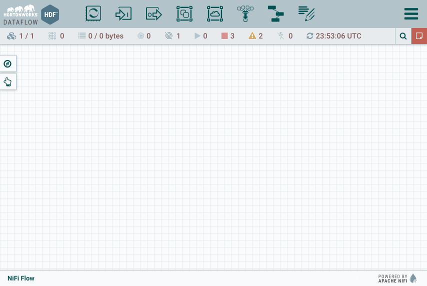

2\. In NiFi, add an Input Port  onto the canvas and name it `From_MiNiFi`.

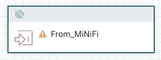

3\. Add a **PutHDFS** processor  onto the canvas. Right click on the **PutHDFS** processor to configure its properties by adding the properties specified in **Table 1**:

**Table 1: PutHDFS Property Values**

| Property | Value    |
| :------------- | :------------- |
| Hadoop Configuration Files     | `/etc/hadoop/conf/core-site.xml`  |
| Directory     | `/sandbox/tutorial-id/820/nifi/output/raw-data`  |

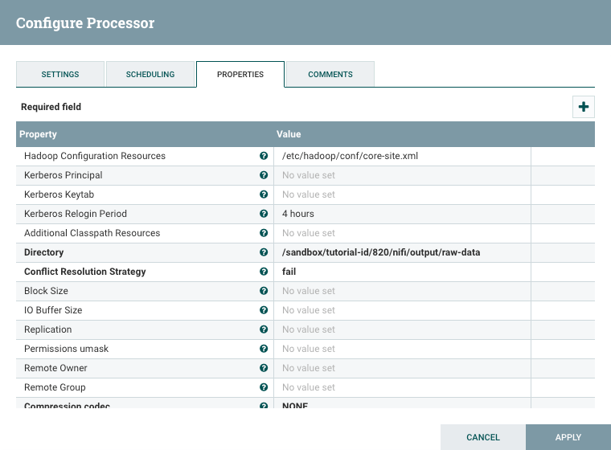

In the **Settings** tab, under Automatically Terminate Relationships, check the **failure** and **success** boxes. This relationship will delete flow files whether or not they have been successfully written to HDFS to clean up extra data once it reaches the end of the flow.

 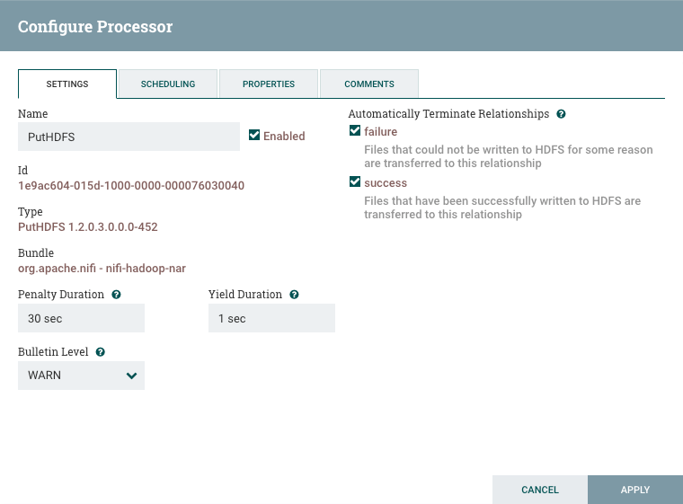

Then click **Apply** to set the change.

4\. Hover over the input port **From_MiNiFi**, an arrow will appear, click on the port and drag to make the connection to **PutHDFS**. A red dotted line will appear and once the mouse is hovering over the PutHDFS processor it will turn green, release the mouse to establish the connection. Then click **ADD**.

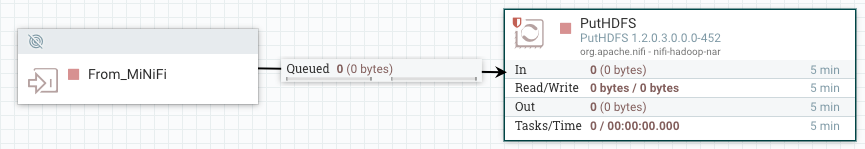

Now you will build the MiNiFi flow in NiFi.

### Step 3: Build MiNiFi Flow to Push Data to NiFi

You'll build the MiNiFi flow using NiFi, then use MiNiFi toolkit to transform NiFi
flow into a MiNiFi flow. Then you will upload the MiNiFi flow to the Raspberry
Pi using Adafruit's Pi Finder Upload feature. The MiNiFi flow will be collecting
data from the Sense HAT sensor running on the Raspberry Pi.

### 3.1: Build MiNiFi Flow Using NiFi

1\. Drag the Process Group icon  onto the NiFi canvas and name the Process Group: `MiNiFi_WeatherStation`. Click **ADD**.

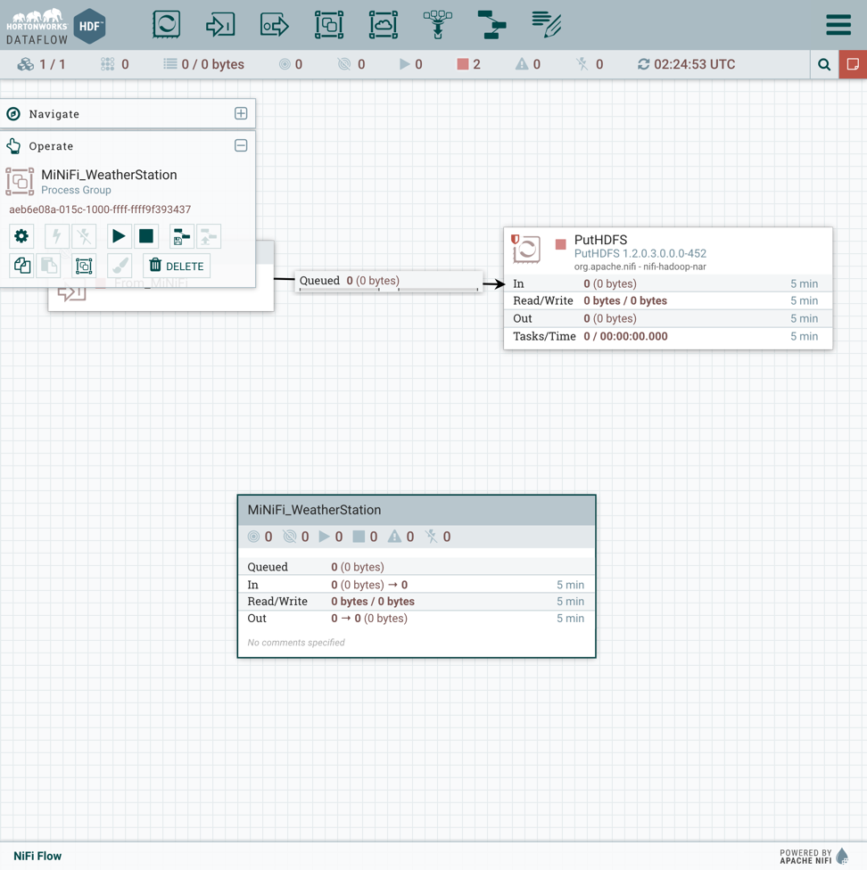

2\. Double click to enter this new Process Group. Add the **ExecuteProcess** processor onto the NiFi canvas.

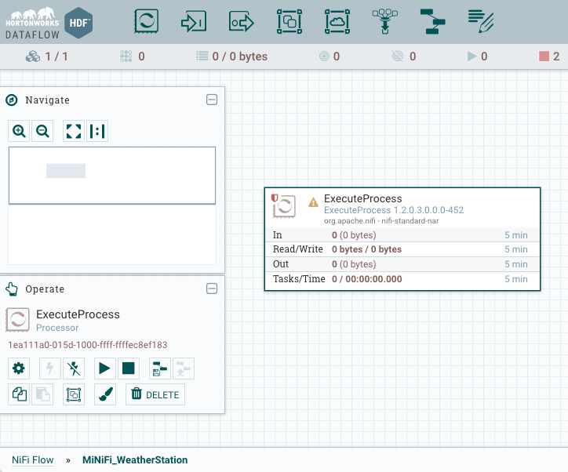

- ExecuteProcess: Executes the WeatherStation.py Python Script to bring the raw sensor data into MiNiFi every 5 seconds.

3\. Configure the properties in ExecuteProcess's Property Tab by adding the properties listed in **Table 2**:

**Table 2: ExecuteProcess Property Values**

| Property | Value    |
| :------------- | :------------- |
| Command      | `python`       |
| Command Arguments     | `/home/pi/WeatherStation.py`       |
| Batch Duration     | `5 sec`       |

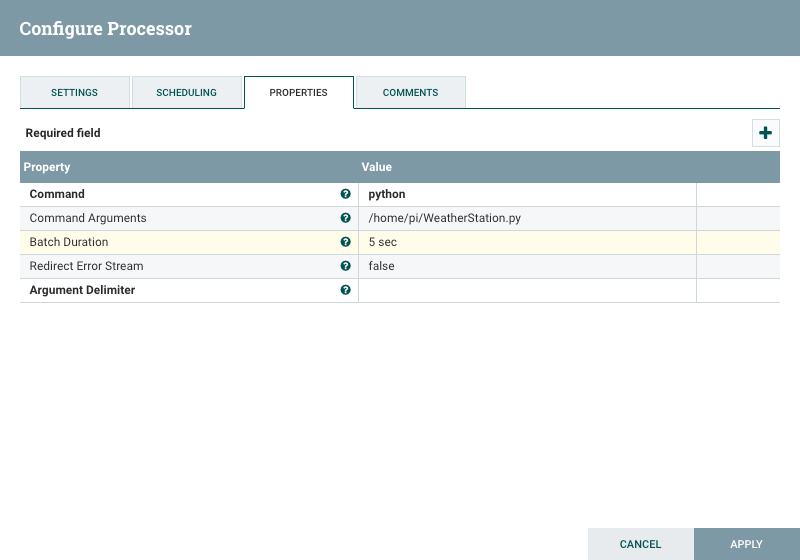

Under the Schedule tab, set **Run Schedule** to `1 sec`, so the task runs for that specific time.

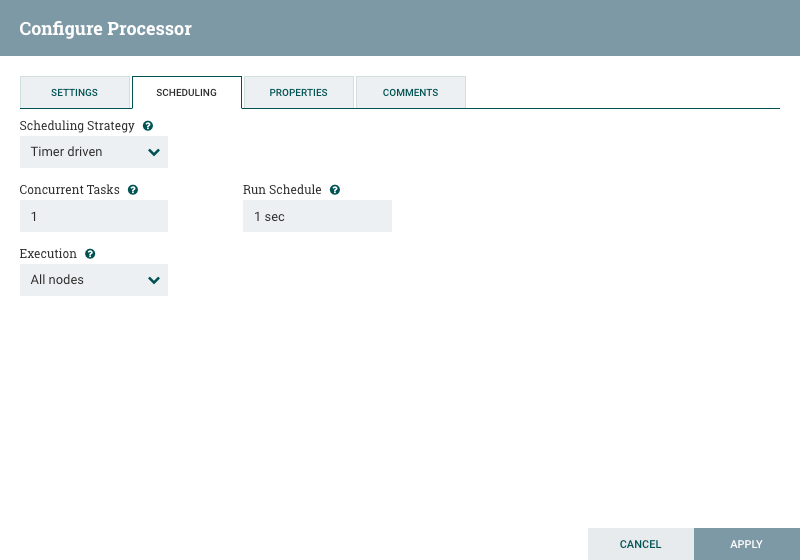

Under the Settings tab, check **Success** box.

Click **Apply**.

4\. Add the **Remote Process Group (RPG)** onto the canvas.

- Remote Process Group (RPG): sends sensor data from one computer (Raspberry Pi) to a remote NiFi instance running on a different computer (HDF Sandbox node)

5\. Configure the properties in RPG's Property Tab by adding the properties listed in **Table 3**:

**Table 3: RPG Property Values**

| Property | Value    |
| :------------- | :------------- |
| URLs     | `http://[host machine ip address]:9090/nifi/`       |

- URLs: MiNiFi uses this value to connect to the location of the remote NiFi instance.

> Note: `[host machine ip address]` for linux/mac, can be found with the terminal command: `ifconfig | grep inet`. For Windows, use the command prompt command as an administrator: `ipconfig`, then under "Wireless LAN adapter Wi-Fi," retrieve the value from "IPv4 Address".

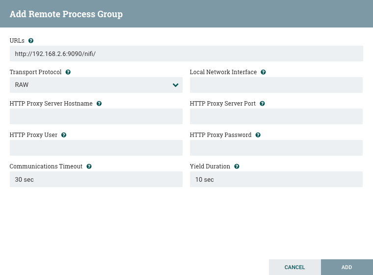

Click **ADD**.

6\. RPG connects MiNiFi to NiFi by referencing the name of NiFi's input port. Connect the **ExecuteProcess** processor to **RPG**, you will then be asked which input port to connect to, choose **From_MiNiFi**. Click **ADD**.

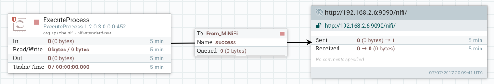

### 3.2: Save MiNiFi Flow as a NiFi Template

1\. Now that the flow is built for MiNiFi, go to the Operate Palette. Select the  **Save Template Icon**  Name the new flow: `weather-station-node-sj`.

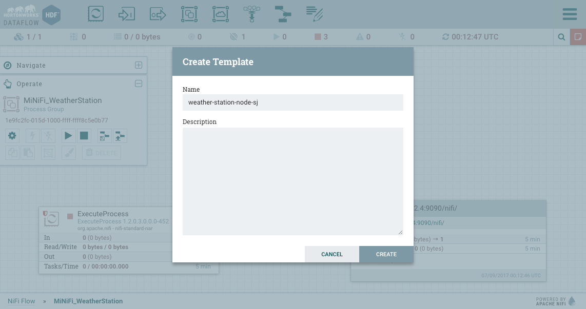

2\. In the top right corner, open the **Global Menu** , select **Templates**. Choose to download `weather-station-node-sj` by selecting the Download icon. download the template file.

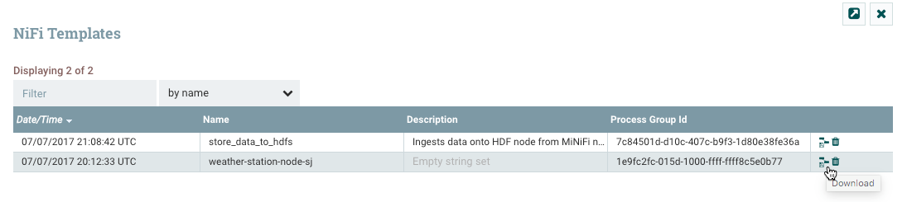

### 3.3: Convert NiFi Template to MiNiFi Template

You will use the MiNiFi Toolkit to convert the NiFi flow to a MiNiFi flow.

1\. Go to the location where you downloaded MiNiFi Toolkit Converter. Use the command to convert NiFi xml template to MiNiFi yaml template:

~~~bash
cd ~/path/to/minifi-toolkit-0.2.0/is/in/downloads
./minifi-toolkit-0.2.0/bin/config.sh transform weather-station-node-sj.xml config.yml
~~~

2\. Validate there are no issues with the new MiNiFi file:

~~~bash
./minifi-toolkit-0.2.0/bin/config.sh validate config.yml
~~~

> Note: You should receive no errors were found while parsing the configuration file.

3\. Open **Pi Finder** and use **Upload** button.
Transport the config.yml file from your host machine to your Raspberry Pi.

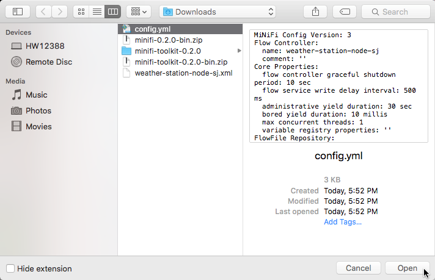

4\. Press the **Terminal** button on **Pi Finder**:

5\. Write the following command to move `config.yml` to minifi conf folder and
replace the default config.yml.

~~~bash
# Replace default config.yml with new config.yml on R-Pi
mv config.yml /home/pi/minifi-[version num]/conf/config.yml
~~~

> Ex command: mv config.yml /home/pi/minifi-0.2.0/conf/config.yml

6\. In MiNiFi `bin` directory on R-Pi, start MiNiFi program with the command:

~~~bash
cd minifi-[version num]
./bin/minifi.sh start
~~~

7\. Navigate back to the NiFi UI, go back into the NiFi Flow level by clicking on NiFi Flow in the bottom left corner.

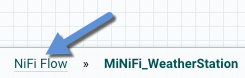

8\. Hold shift and hover the mouse over the **From_MiNFi to PutHDFS** flow  you built in step 2, then it should be highlighted.

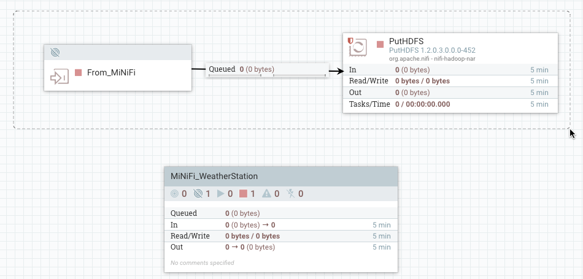

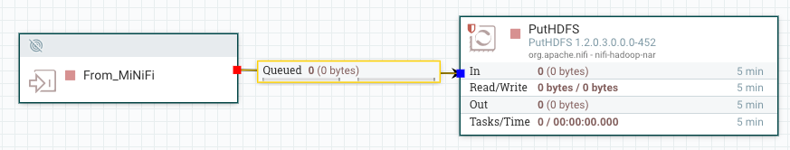

 From the Operate Pallette, click on the . You should see the MiNiFi data is being received by way of the NiFi input port and that data is being routed to HDFS on HDP.

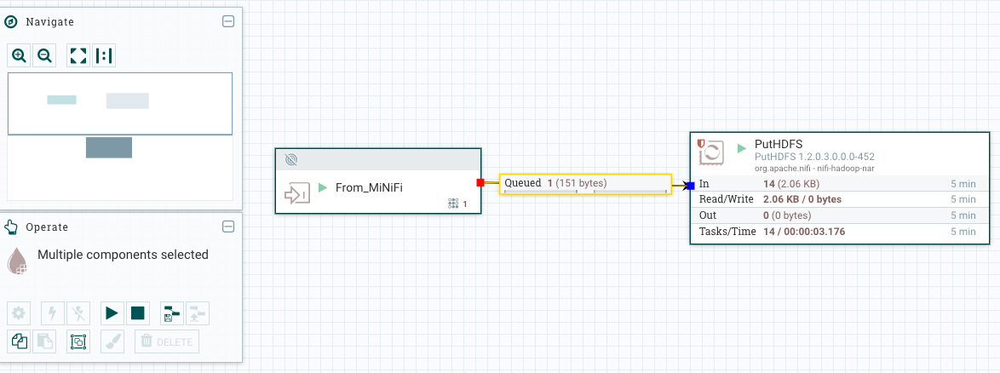

### 3.4: Check PutHDFS Status with Data Provenance

1\. Right click on **PutHDFS**, select **Data Provenance**.

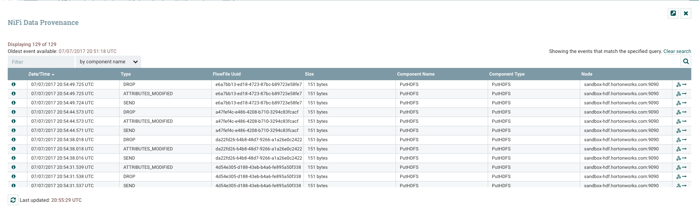

List of all actions occurring on the FlowFiles. As you can see there are FlowFiles being dropped, attributes modified and sent to HDFS. For the FlowFiles sent to HDFS, as far as NiFi running on HDF knows, those FlowFiles are successfully stored into HDFS.

2\. View a random Provenance Event using the view icon . A **Provenance Event Window** will appear, click on the **Content** tab. Select **View** to see the flowfile content:

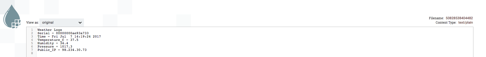

### 3.5: Check Data is Stored into HDFS via HDP Files View

1\. Login to Ambari UI at `sandbox-cda.hortonworks.com:8080`

> Note: user/password is admin and password is the string you set it to.

2\. Hover over the Views selector, choose **Files View**

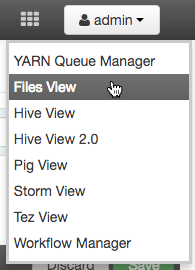

3\. Check that path `/sandbox/tutorial-id/820/nifi/output/raw-data` is populated with data.

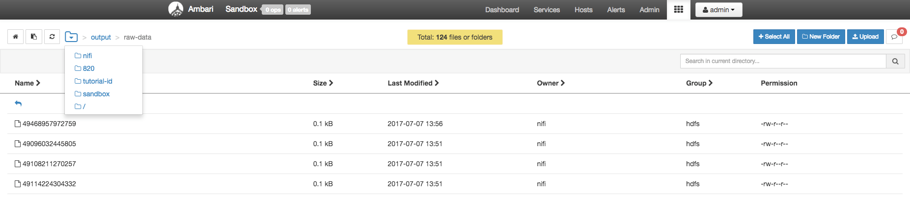

4\. Select a random file, click **Open**. After a couple seconds the file will load:

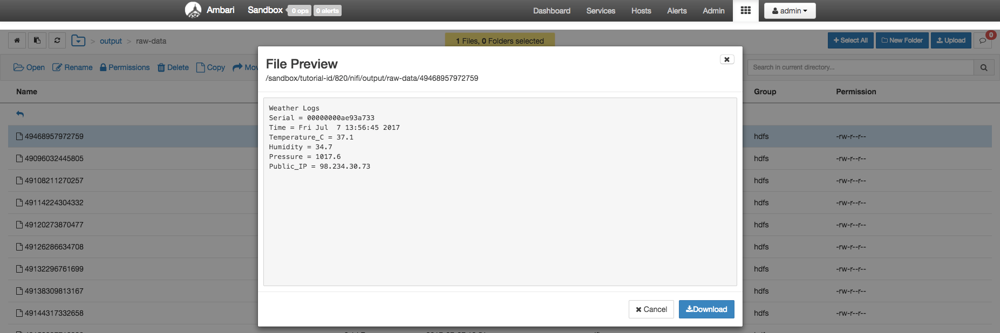

### Summary

Congratulations! You just learned how to build dataflows for MiNiFi through using NiFi. Additionally, you also built a flow that transports the weather edge node data from MiNiFi to NiFi on HDF to HDFS on HDP using Connected Data Architecture (CDA). Now you have the fundamental knowledge on how to transport data between systems using CDA.

### Further Reading

- Read more about the Sense HAT Functions from [Sense HAT API Reference](https://pythonhosted.org/sense-hat/api/)
- Read more about the SenseHAT Class Methods available in [sense_hat.py](https://github.com/RPi-Distro/python-sense-hat/blob/master/sense_hat/sense_hat.py)
- Read more about the Apache MiNiFi Project [minifi docs](https://nifi.apache.org/minifi/)

### Appendix A: Troubleshoot MiNiFi to NiFi Site-to-Site

### A.1: Check MiNiFi Logs

If you do not see data flowing into NiFi, the first place to check is the MiNiFi logs.

1\. From your R-Pi, navigate to the MiNiFi `logs` directory and open the `minifi-app.log`:

~~~bash
cd minifi-1.0.2.1.1.0-2/logs
less minifi-app.log
~~~

**WARNS, ERRORS** in the logs usually indicate the specific problem related to your dataflow.

### A.2: Troubleshoot HDF Input Ports via OS X Firewall

For MiNiFi to connect to HDF Docker Sandbox running on a MAC OS X, ports of the firewall need to open. Therefore, the NiFi port will be accessible by MiNiFi running on the R-Pi or other computers.

1\. Edit the `/etc/pf.conf` to make the necessary ports accessible by other computers:

~~~bash
sudo vi /etc/pf.conf
~~~

2\. Add the following two lines at the end of the file:

~~~bash
pass in proto tcp from any to any port 9090
pass in proto tcp from any to any port 17000
~~~

3\. Save and close the file. In vi, press escape key and `:wq` to exit the program.

4\. Open the network utility to verify the ports are open.

5\. Enter your computer's internal IP address and specify the range for ports as `14999 to 19100`.

> Note: open ports will appear in the port scan.
