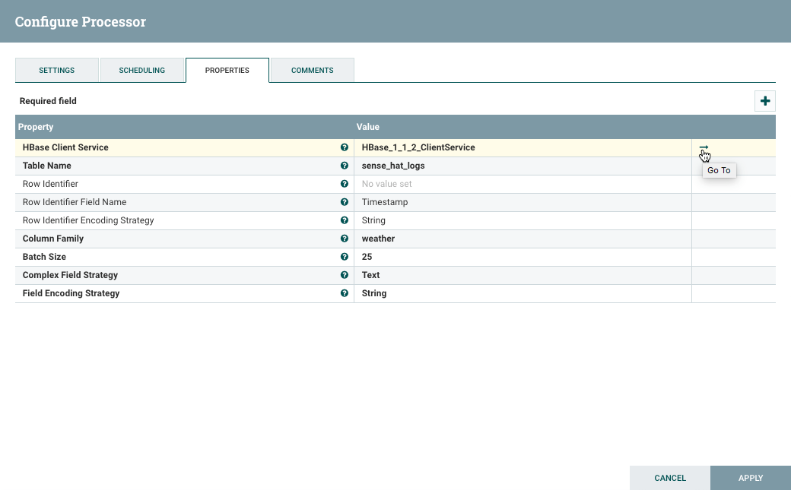

# Populate HDP HBase with HDF NiFi Flow

## Introduction

In the previous tutorial, you transported raw sensor data from MiNiFi to HDF NiFi to HDP HDFS. Now you'll further enrich the NiFi flow by adding geographic location attributes to the dataset. You'll then convert the data to JSON format for storing into HBase.

## Prerequisites

- Completed previous tutorials in the series

## Outline

- [Step 1: Create HBase Table "sense_hat_logs"](#create-hbase-table-sense-hat-logs-4)
- [Step 2: Enhance NiFi Flow to Store Geo Data to HBase](#import-enhance-nifi-flow-to-store-geo-data-to-hbase-4)
- [Step 3: Verify HBase Table Populated](#verify-hbase-table-populated-4)
- [Summary](#summary-4)
- [Further Readings](#further-reading-4)

### Step 1: Create HBase Table "sense_hat_logs"

In this section, you create an hbase table, so NiFi will have an area in HBase
to store the data.

1\. Access HDP Sandbox shell using Web Shell Client at `sandbox-cda.hortonworks.com:4200`.

> Note: user/password is root and whatever string you set your password to.

2\. Open HBase Shell:

~~~bash
hbase shell
~~~

3\. Create HBase Table:

~~~bash
create 'sense_hat_logs','weather'
~~~

> Note: table name is 'sense_hat_logs' and column family is 'weather'

### Step 2: Enhance NiFi Flow to Store Geo Data to HBase

In this section, you will download and import a prebuilt NiFi DataFlow template
to NiFi, but you will need to make some modifications to it. The template is called **WeatherDataMiNiFiToHBase**. You will go through
step-by-step each component within the NiFi flow to see how the flow was built.

1\. Download the [WeatherDataMiNiFiToHbase.xml](assets/WeatherDataMiNiFiToHbase.xml) template file onto your computer.

2\. Head to NiFi UI at `sandbox-cda.hortonworks.com:9090/nifi`.

3\. Use the template icon  located in the Operate Palette.

3\. **Browse**, find the template file, click **Open** and hit **Import**.

4\. From the **Components Toolbar**, drag the template icon  onto the graph and select the **WeatherDataMiNiFiToHBase** template file.

5\. Remove the queue between `Copy of From_MiNiFi` and `PreProcessDataForHBaseAndHadoop` by right clicking on the queue, then select **Delete**.

6\. Remove `Copy of From_MiNiFi` input port by right clicking on it, select **Delete**.

7\. Connect `From_MiNiFi` input port to `PreProcessDataForHBaseAndHadoop` Process Group. When the **Create Connection** window appears, select **ADD**.

8\. Enter into `PreProcessDataForHBaseAndHadoop` Process Group by double clicking on it.

9\. Re-configure the GeoEnrichIP processor. It currently has the **wrong folder path** to the GeoLite Database File.

Previous Configuration with Outdated Folder Path

Get the full pathname to GeoLite DB acquired in **Deploy IoT Weather Station via Connected Data Architecture tutorial** section **3.4: Add GeoLite2 database to HDF Sandbox CentOS**. Update **MaxMind Database File** with `/sandbox/tutorial-id/820/nifi/input/GeoFile/GeoLite2-City_[date-updated]/GeoLite2-City.mmdb` where [date-updated] is the latest date when the GeoLite database file was updated.

Updated Configuration with Correct Folder Path

Click on the NiFi Flow breadcrumb in the bottom left corner to go back to the root level.

10\. Configure HBase Client Service for **PutHBaseJSON**. Right click on **PutHBaseJSON**, select **Configure**. Head to the **Properties** tab. Click on the **arrow**
to go to the current HBase Client Service configuration, you will enable it.

11\. Enable the HBase Client Service, click on the lighting bolt symbol.

12\. An **Enable Controller Service** window appears, click on the **ENABLE**
button.

Once the HBase Client Service is enabled as in the image below:

Click on the **X** button in the top right corner. We will walkthrough the GeoEnriched NiFi flow, then start the portion that just connected to the input port.

13\. Analyze the enhanced GeoEnriched NiFi flow:

- **Input Port**: `From_MiNiFi` ingests sensor data from MiNiFi agent running on the Raspberry Pi. This port name must match the name specified by the input port relationship attribute on the MiNiFi remote process group, else NiFi won’t receive data from MiNiFi. `From_MiNiFi` sends raw weather data to an HDFS folder and to `PreProcessDataForHBaseAndHadoop` Process Group.

- **PutHDFS**: the first PutHDFS processor directory connected to `From_MiNiFi` stores raw weather data into HDP HDFS folder `/sandbox/tutorial-id/820/nifi/output/raw-data`.

| Property | Value    |
| :-------------: | :-------------: |
| Hadoop Configuration Resources | `/etc/hadoop/conf/core-site.xml` |
| Directory | `/sandbox/tutorial-id/820/nifi/output/raw-data` |

- **PreProcessDataForHBaseAndHadoop**: process group is comprised of multiple components (processors, ports, etc) that preprocess the data. An input port(ingestRawData), ExtractText, GeoEnrichIP, RouteOnAttribute, AttributesToJSON, UpdateAttribute, output port(sendProcessedData).

| Components | Description    |
| :-------------: | :-------------: |
| Input Port | IngestRawData port pulls in data from external NiFi level (NiFi Flow) |
| ExtractText | Uses regex expressions to extract weather data values  |
| GeoEnrichIP | Adds Geographic Insights to the flow from an IP address |
| RouteOnAttribute | Routes data if Geo Insights and Weather Readings are valid |
| AttributesToJSON | Takes data and converts the format to JSON |
| UpdateAttribute | Updates every data filename with a unique name |
| Output Port | sendProcessedData outputs data back out to external NiFi level (NiFi Flow) |

- **ExtractText**: Extracts values from text using java regex expression and stores those values into attributes. Sends the data to the rest of the flow only when the regex expressions have matches. `Include Capture Group 0` set to false ensures each regular expression only has a single group to avoid duplicate values with `<attribute-name>.0`.

| Property | Value    |
| :-------------: | :-------------: |
| Include Capture Group 0 | `false`    |
| Humidity | `(?<=Humidity_PRH = )([\w+.-]+)`    |
| Pressure_In     | `(?<=Pressure_In = )([\w+.-]+)`      |
| Public_IP     | `(?<=Public_IP = )([\w+.-]+)`      |
| Serial | `(?<=Serial = )([\w+.-]+)`    |
| Temp_F     | `(?<=Temperature_F = )([\w+.-]+)`      |
| Timestamp     | `(?<=")([^\"]+)`      |

- **GeoEnrichIP**: Takes Public IP from the Raspberry Pi and creates geographic attributes for Latitude, Longitude, City, Country, State (IP.geo.latitude, IP.ge.longitude, IP.geo.city, IP.geo.country and IP.geo.subdivision.isocode.N). GeLite2-City_[date-updated], date-updated represents the last date the database was updated. We changed the path earlier
since every time the GeoLite databases is downloaded the folder name changes.

| Property | Value    |
| :-------------: | :-------------: |
| MaxMind Database File     | `/sandbox/tutorial-id/820/nifi/input/GeoFile/GeoLite2-City_[date-version]/GeoLite2-City.mmdb`      |
| IP Address Attribute     | `Public_IP`      |

> Ex: MaxMind Database File = /sandbox/tutorial-id/820/nifi/input/GeoFile/GeoLite2-City_20170704/GeoLite2-City.mmdb

- **RouteOnAttribute**: Uses NiFi expression language (similar to Java expression language) to route the Attributes to remaining DataFlow based on weather data attributes are within range of an appropriate weather data criteria, such as Pressure standard range being between 1080 and 870.

Here is the NiFi Expressions used to establish the conditions for each FlowFile to move onto the remaining processors:

| Property | Value    |
| :-------------: | :-------------: |
| Check_City     | `${Public_IP.geo.city:isEmpty():not()}`      |
| Check_IP     | `${Public_IP:isEmpty():not()}`      |
| Check_Pressure     | `${Pressure_In:lt(32):and(${Pressure_In:gt(26)})}`      |
| Check_Serial     | `${Serial:isEmpty():not()}`      |
| Check_State     | `${Public_IP.geo.subdivision.isocode.0:isEmpty():not()}`      |
| Check_Temp     | `${Temp_F:lt(190.4)}`      |
| Check_Time     | `${Time:isEmpty():not():and(${Timestamp:isEmpty():not()})}`      |

- **AttributesToJson**: Takes the attributes names and values, then represents them in JSON format

| Property | Value    |
| :-------------: | :-------------: |
| **Attributes List**     | `Time, Timestamp, Public_IP.geo.city, Public_IP.geo.subdivision.isocode.0, Serial, Temp_F, Humidity, Pressure_In`      |

- **UpdateAttribute**: Modifies each flowfile filename to be different.

| Property | Value    |
| :-------------: | :-------------: |
| **Filename**     | `weatherdata-${now():format("yyyy-MM-dd-HHmmssSSS")}-${UUID()}.json`      |

- **Output Port**: sendProcessedData outputs data to external NiFi level (NiFi Flow), which gets routed to PutHBaseJSON and another PutHDFS processor.

- **PutHBaseJSON**: Stores the GeoEnriched Data a row at a time into HBase table ‘sense_hat_logs’ rows.

| Property | Value    |
| :-------------: | :-------------: |
| **Hbase Client Service**     | **HBase_1_1_2_ClientService**       |
| **Table Name**     | **sense_hat_logs**       |
| Row Identifier Field Name     | Timestamp       |
| Row Identifier Encoding Strategy     | String       |
| **Column Family**     | **weather**       |
| **Batch Size**     | **25**       |
| **Complex Field Strategy**     | **Text**       |
| **Field Encoding Strategy**     | **String**       |

- **PutHDFS**: Stores the GeoEnriched Data into HDP HDFS folder `/sandbox/tutorial-id/820/nifi/output/geoenriched-data`.

| Property | Value    |
| :-------------: | :-------------: |
| Hadoop Configuration Resources | `/etc/hadoop/conf/core-site.xml` |
| Directory | `/sandbox/tutorial-id/820/nifi/output/geoenriched-data` |

14\. Hold shift, press on your mouse and hover over PreProcessDataForHBaseAndHadoop Process Group, PutHBaseJSON and PutHDFS then release the mouse. These three components should be highlighted.

15\. Press the **start** button  to activate this section of the flow.

### Step 3: Verify HBase Table Populated

1\. Navigate back to HDP Web Shell Client at `sandbox-cda.hortonworks.com:4200`

> Note: user/password is root and whatever string you set your password to.

If the HBase shell is closed, Open it:

~~~bash
hbase shell
~~~

2\. Use the HBase **scan** command to see if table has data:

~~~bash
scan 'sense_hat_logs'
~~~

3\. The table should be filled with Weather Data:

### Summary

Congratulations! You just enhanced the previous NiFi flow to pull in geographic insights using **GeoEnrichIP** processor based on the Raspberry Pi's public IP address, so you can tell what the city and state the weather readings were drawn from. Additionally, you created an HBase table that allows NiFi to store this data into HDP. In the next tutorial, you will visualize the weather data using Zeppelin's Phoenix interpreter and visualization features.

### Further Reading

- Read more about HBase NoSQL Datastore at [Apache HBase Docs](https://hbase.apache.org/)
- Read more about NiFi at [Apache NiFi Docs](https://nifi.apache.org/)
- Read more about Hortonworks Data Platform - Data At Rest at [HDP Overview](https://hortonworks.com/products/data-center/hdp/)
- Read more about Hortonworks Data Flow - Data In Motion at [HDF Overview](https://hortonworks.com/products/data-center/hdf/) 
