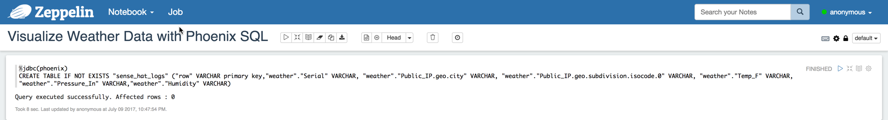

# Visualize Weather Data with Zeppelin's Phoenix Interpreter

## Introduction

You'll use Phoenix to perform SQL queries against the HBase table by mapping a phoenix table to HBase table. You'll visualize your results by running Phoenix in Zeppelin via the Phoenix Interpreter. You'll monitor temperature, humidity and barometric pressure readings via Line Graphs, Bar Graphs, Pie Charts and Map Visualization.

## Prerequisites

- Completed previous tutorials in the series

## Outline

- [Step 1: Create Zeppelin Notebook](#create-zeppelin-notebook-5)
- [Step 2: Create Phoenix Table Mapping to HBase Table](#create-phoenix-table-mapping-to-hbase-table-5)
- [Step 3: Monitor Temperature Over Time](#monitor-temperature-over-time-5)
- [Step 4: Monitor Humidity Over Time](#monitor-humidity-over-time-5)
- [Step 5: Monitor Pressure Over Time](#monitor-pressure-over-time-5)
- [Summary](#summary-5)
- [Further Readings](#further-readings-5)

### Step 1: Create Zeppelin Notebook

Select notebook next to the Zeppelin icon, and hit “Create new note” to create the Zeppelin Notebook. Name it `Visualize Weather Data with Phoenix SQL`. Choose "Default Interpreter" as `jdbc`.

### Step 2: Create Phoenix Table Mapping to HBase Table

We must create a phoenix table to map to our HBase table in order to perform SQL queries against HBase. Write or Copy/Paste the following query in the Zeppelin editor.

~~~SQL
%jdbc(phoenix)
CREATE TABLE IF NOT EXISTS "sense_hat_logs" ("row" VARCHAR primary key,"weather"."Serial" VARCHAR, "weather"."Public_IP.geo.city" VARCHAR, "weather"."Public_IP.geo.subdivision.isocode.0" VARCHAR, "weather"."Temp_F" VARCHAR,
"weather"."Pressure_In" VARCHAR,"weather"."Humidity" VARCHAR)
~~~

Run quick test to verify Phoenix table successfully mapped to HBase table.

Display the first 10 rows of the Phoenix table using Zeppelin's **Table Visualization**.

~~~SQL
%jdbc(phoenix)
select * from "sense_hat_logs" limit 10
~~~

**Figure 1:** Zeppelin's Table Visualization

### Step 3: Monitor Temperature Over Time

~~~SQL
%jdbc(phoenix)
select "row" AS DATE_TIME,
"Temp_F" AS TEMP_F
from "sense_hat_logs"
~~~

**Figure 2:** Temperature Line Chart Visualization

The graph reveals the temperature was its highest at 100.72
(July 9, 2017 at 11:51 PM) and lowest at 94.71 (July 9, 2017 at 11:34 PM).

As you will notice even after we tried to calibrate the Sense HAT's temperature
readings, the temperature is still off compared to actual temperature of the
living room. The best solution is to get the Sense HAT away from the Raspberry
Pi, but then that defeats the purpose of the Sense HAT being compact.

### Step 4: Monitor Humidity Over Time

Humidity is the ratio of actual water vapour in the air compared to the actual
amount of water vapour the air is able to hold at a particular temperature.
Relative humidity tells us how close the air is being saturated. The higher
the air temperature, the lower the relative humidity percentage and vise versa.

~~~SQL
%jdbc(phoenix)
select "row" AS DATE_TIME,
"Humidity" AS HUMIDITY_Percentage_RH
from "sense_hat_logs"
~~~

**Figure 2:** Humidity Line Chart Visualization

The chart above reveals the Relative Humidity Percentage was at its highest
around 40.8% (July 9, 2017 at 11:00 PM) while its lowest was 33.75%
(July 9, 2017 at 11:52 PM). At 40.8%, the air was more saturated
than 33.75%. Relative Humidity

### Step 5: Monitor Pressure Over Time

Barometric Pressure is the force exerted by the atmosphere at a particular point.
Forecasters monitor the changes in air pressure to predict short-term
changes in the weather.

~~~SQL
%jdbc(phoenix)
select "row" AS DATE_TIME,
"Pressure_In" AS PRESSURE
from "sense_hat_logs"
~~~

The chart above shows the barometric pressure stayed stable at around 29.98 and
29.97 over 10:42 PM on July 9, 2017 to 12:22 AM July 10, 2017.

After comparing the pressure for San Jose at "The Weather Channel," the readings
we obtained are within same range. The Weather Channel predicts that pressure
will increase from 29.90 inches. Our graph also supports that prediction.
This **rise in pressure** indicates that the **weather** may soon **clear**, turn **fair** and
**sunny**.

### Summary

Congratulations, now you know how to write Phoenix SQL queries against an HBase table. You performed Phoenix SQL like queries against HBase to monitor temperature, humidity and pressure over time. You also know how to use the Phoenix Interpreter integrated with Zeppelin to visualize the data associated with our weather sensor. Feel free to further explore the different Zeppelin Interpreters and other visualizations for your data analysis journey.

### Further Readings

- Read more about Zeppelin at [Apache Zeppelin Docs](https://zeppelin.apache.org/)
- Read more about Phoenix at [Apache Phoenix Docs](https://phoenix.apache.org/)
