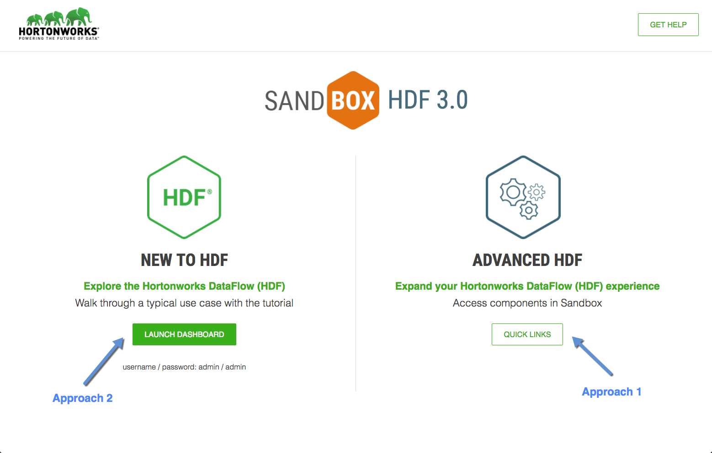
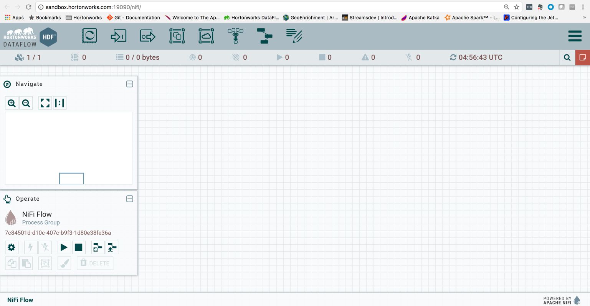
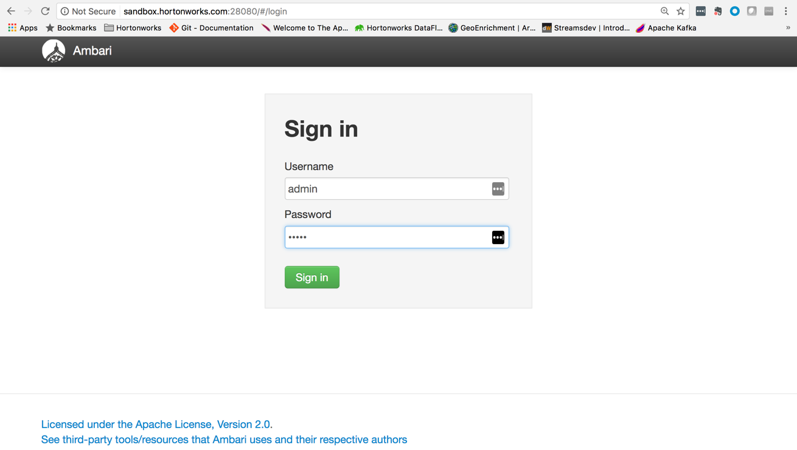
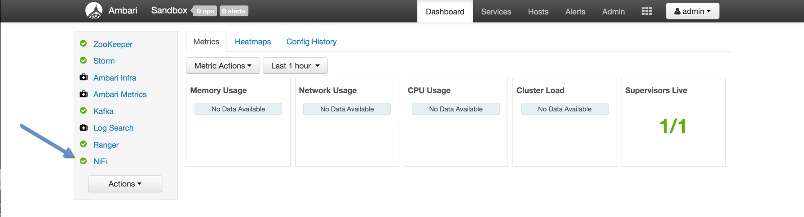
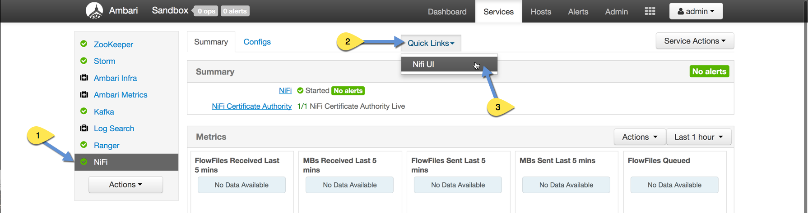

# Launch NiFi HTML UI

## Introduction

With the HDF Sandbox, Apache NiFi comes preinstalled in the Ambari Stack and preconfigured out of the box to utilize many of its features. In the tutorial, it shows you how to access the NiFi HTML UI in one of two ways: use the HDF Splash Screen Page "Advanced Quick Links" or Ambari UI "Quick Links".

## Prerequisites
-   Completed the prior tutorials within this tutorial series
-   Downloaded [HDF Sandbox](https://hortonworks.com/products/sandbox/) for VMWare, VirtualBox or Native Docker
-   [Installed and Deployed HDF 3.0 Sandbox](https://hortonworks.com/tutorial/sandbox-deployment-and-install-guide/) for VMWare, VirtualBox or Native Docker

## Outline
-   [Step 1: Open HDF Splash Page](#step-1-open-hdf-splash-page)
-   [Approach 1: Launch NiFi HTML UI from HDF Splash Quick Links](#access-nifi-html-ui-from-hdf-splash-page)
-   [Approach 2: Access NiFi HTML UI via Ambari](#access-nifi-html-ui-via-ambari)
-   [Summary](#summary)

Refer to Approach 1 to quickly launch NiFi HTML UI via HDF Splash Screen,
else go to Approach 2 to launch NiFi HTML UI from Ambari,
but first complete Step 1.

### Step 1: Open HDF Splash Page

1\. Open `sandbox-hdf.hortonworks.com:18888` with your favorite web browser:

### Approach 1: Launch NiFi HTML UI from HDF Splash Quick Links

1\. Select the **QUICK LINKS** button

2\. Hover over the NiFi 1.2.0 box and select **Go to UI**

NiFi HTML UI:

### Approach 2: Access NiFi HTML UI via Ambari

1\. Select the **LAUNCH DASHBOARD** button

2\. Login to Ambari UI with credentials (admin/admin).

3\. Verify the NiFi Service is running, it should have a green check mark:

4\. Select the NiFi Service, click on Quick Links dropdown and press the NiFi UI:

NiFi HTML UI:

## Summary

Congratulations! You explored two approaches for launching NiFi UI. You opened the HDF 3.0 Splash Page: Approach 1 was launching the Ambari Dashboard from the "New To HDF path" while Approach 2 was using the NiFi Quick Link from the "Advanced HDF path". Now you are ready to explore the next tutorial to began building our simple dataflow.
