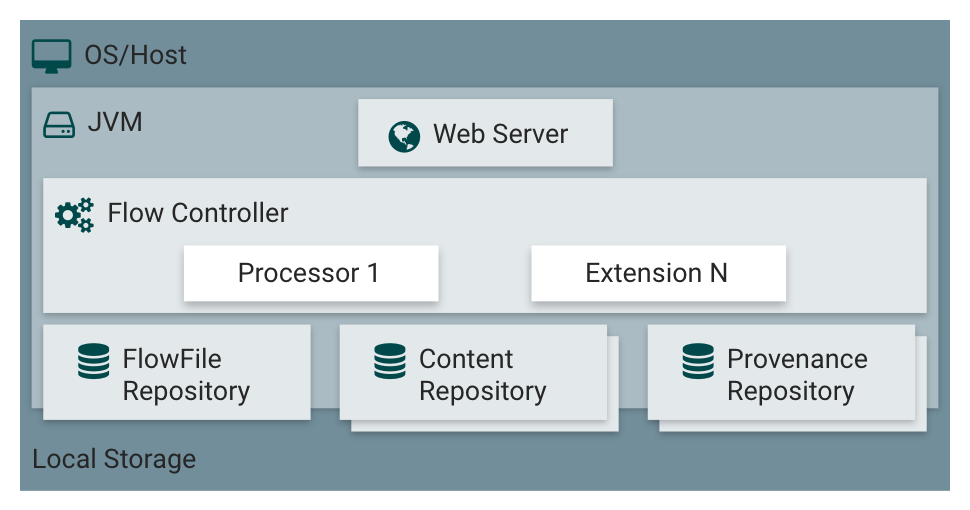

# NiFi DataFlow Automation Concepts

## Introduction

The concepts section is tailored toward enriching your hands-on experience in the tutorials. By the end of this section, you will be able to define NiFi, know how to create dataflows for specific use cases, acquire knowledge on how to build a NiFi DataFlow and become familiar with the core concepts of NiFi. The goal of this section is to help NiFi practitioners know how to use the NiFi documentation for their advantage.

## Outline

- [What is Apache NiFi?](#what-is-apache-nifi)
- [Who Uses NiFi, and for what?](#who-uses-nifi-and-for-what)
- [Understand NiFi DataFlow Build Process](#understand-nifi-dataflow-build-process)
- [The Core Concepts of NiFi](#the-core-concepts-of-nifi)
- [NiFi Architecture](#nifi-architecture)
- [A Brief History of NiFi](#a-brief-history-of-nifi)
- [Further Reading](#further-reading)

## What is Apache NiFi?

[Apache NiFi](https://nifi.apache.org/docs/nifi-docs/html/overview.html#what-is-apache-nifi) is an open source tool for automating and managing the flow of data between systems (Databases, Sensors, Data Lakes, Data Platforms). In the tutorial, we will use NiFi to process the flow of data between sensors, web services (NextBus and Google Places API), various locations and our local file system.

## Who Uses NiFi, and for what?

NiFi is used for **data ingestion** to pull data into NiFi, from numerous different data sources and create FlowFiles. For the tutorial, GetFile, GetHTTP, InvokeHTTP are processors you will use to stream data into NiFi from the local file system and ingest data from the internet. Once the data is ingested, as the DataFlow Manager (DFM), the user, you will create 2 process groups or sections of the dataflow that handle a particular purpose in data preprocessing. A process group is a complex processor composed of multiple processors. You will create a **Data Management** process group to monitor and obtain feedback about the current status of the NiFi DataFlow. You will use bulletins to troubleshoot problems in the dataflow. Bulletins are located on the processor and the management toolbar. They provide a tool-tip of the time, severity and message of the alert. While the data is managed, you will create **Data Enrichment** process group to enhance, refine and improve the quality of data to make it meaningful and valuable for users. NiFi enables users to filter out unnecessary information from data to make easier to understand. You will use NiFi to geographically enrich real-time data to show neighborhoods nearby locations as the locations change.

## Understand NiFi DataFlow Build Process

### Explore NiFi HTML User Interface

When NiFi is accessed at `sandbox.hortonworks.com:9090/nifi` by users who run NiFi from HDF sandbox or `sandbox.hortonworks.com:8080/nifi` by users who run NiFi from their local machine, [NiFi's User Interface (UI)](http://docs.hortonworks.com/HDPDocuments/HDF2/HDF-2.1.2/bk_dataflow-user-guide/content/User_Interface.html) appears on the screen. The UI is where dataflows will be developed. It includes a canvas and _mechanisms_ to build, visualize, monitor, edit, and administer our dataflows in the tutorials. The **components** toolbar contains all tools for building the dataflow. The **actions** toolbar consists of buttons that manipulate the components on the canvas. The **management** toolbar has buttons for the DFM to manage the flow and a NiFi administrator to manage user access & system properties. The **search** toolbar enables users to search for any component in the dataflow. The image below shows a visualization of where each mechanism is located.

### Find and Add Processor Overview

Every dataflow requires a set of processors. In the tutorials, you will use the processor icon  to add processors to the dataflow. Let’s view the add processor window. There are 3 options to find our desired processor. The **processor list** contains almost 190 items with descriptions for each processor. The **tag cloud** reduces the list by category, so if you know what particular use case your desired processor is associated with, select the tag and find the appropriate processor faster. The **filter bar** searches for the processor based on the keyword entered. The image below illustrates where each option is located on the add processor window.

### Configure Processor Dialog

As we add each processor to our dataflow, we must make sure they are properly configured. DataFlow Managers navigate around the 4 configuration tabs to control the processor's specific behavior and instruct the processor on how to process the data that is flowing. Let's explore these tabs briefly. The **Settings** tab allows users to change the processor's name, define relationships & includes many different parameters. The **Scheduling** tab affects how the processor is scheduled to run. The **Properties** tab affects the processor's specific behavior. The **Comments** tab provides a place for DFMs to include useful information about the processor's use-case. For the tutorial series, you will spend most of time modifying properties.

### Configure Processor Properties Tab

Let's further explore the properties tab, so we can be familiar with this tab in advance for the tutorials. If you want to know more about what a particular property does, hover over the **help symbol**  located next to the property name to find additional details about that property, its value and history. Some processors enable the DFM to add new properties into the property table. For the tutorials, you will add user-defined properties into processors, such as **UpdateAttribute**. The custom user-defined property you create will assign unique filenames to each FlowFile that transfer through this processor. View the processor properties tab below:

### Connections & relationships

As each processor configuration is completed, we must [connect](http://docs.hortonworks.com/HDPDocuments/HDF2/HDF-2.1.2/bk_dataflow-user-guide/content/Connecting_Components.html) it to another component. A connection is a linkage between processors (or components) that contain at least one relationship. The user selects the relationship and based on the processing outcome that will determine where the data is routed. Processors can have zero or more auto-terminate relationships. If the processing outcome for FlowFile is true for a processor with a relationship tied to itself, the FlowFile will be removed from the flow. For instance, if **EvaluateXPath** has an unmatched relationship defined to itself and when that outcome is true, then a FlowFile is removed from the flow. Else a FlowFile is routed to the next processor based on matched. View the visual to see the objects that define connections and relationships.

### Troubleshoot Common Processor Issues

When a processor has a warning symbol  in the upper left corner of the processor face, the processor configuration is invalid.

1\. To troubleshoot, hover over one of the processors, for instance the **GetFile** processor, and a warning message will appear. This message informs us of the requirements needed, so we can run this processor.

For instance, the warning message indicates: we need to specify a directory path to tell the processor where to pull data and a connection for the processor to establish a relationship.

### Running the NiFi DataFlow

Once we finish connecting and configuring the components in our dataflow, there are at least 3 conditions we should check to ensure our dataflow successfully runs. We must verify that all relationships are established, the components are valid, stopped, enabled and have no active tasks. After you complete the verification process, you can select the processors, click the play symbol  in the actions toolbar to run the dataflow. View the image of a dataflow that is active.

## The Core Concepts of NiFi

When we learned the process of building a dataflow, we crossed paths with many of the core concepts of NiFi. You may be wondering what is the meaning behind a FlowFile, processor, connection, and other terms? Let's learn briefly about these terms because they will appear throughout the tutorial series. We want you to have the best experience in the tutorial. **Table 1** summarizes each term.

**Table 1**: NiFi Core Concepts

| NiFi Term  | Description  |
|:---|---:|
| `FlowFile`  | `Data brought into NiFi that moves through the system. This data holds attributes and can contain content.` |
| `Processor` | `Tool that pulls data from external sources, performs actions on attributes and content of FlowFiles and publishes data to external source.` |
| `Connection`  | `Linkage between processors that contain a queue and relationship(s) that effect where data is routed.` |
| `Flow Controller` | `Acts as a Broker to facilitate the exchange of FlowFiles between processors.` |
| `Process Group` | `Enables the creation of new components based on the composition of processors, funnels, etc.` |
| `Data Provenance` | `History of actions that occur on the data as it moves throughout the flow. Enables users to check the data from any processor or component while the FlowFiles move throughout the dataflow.` |

## NiFi Architecture

Let's dive deeper into the infrastructure that enables NiFi to perform so well when it comes to building DataFlows that address various use cases.

NiFi executes within the Java Virtual Machine (JVM) located in the Host Operating System (OS/Host).

Inside the JVM,

- The Web Server enables us to access NiFi's User Interface from the web browser.
- The Flow Controller acts as the brains of the operation, it gives threads to extensions (custom processors), and keeps track of all the operations being executed by extensions
- The FlowFile Repository is the area NiFi keeps track of all the status updates regarding FlowFiles as they travel throughout the DataFlow
- The Content Repository is the location the content bytes of FlowFiles reside.
- The Provenance Repository consists of all the provenance event data.

## A Brief History of NiFi

Apache NiFi originated from the NSA Technology Transfer Program in Autumn of 2014. NiFi became an official Apache Project in July of 2015. NiFi has been in development for 8 years. NiFi was built with the idea to make it easier for people to automate and manage data-in-motion without having to write numerous lines of code. Therefore, the user interface comes with pallet of data flow components that can be dropped onto the graph and connected together. NiFi was also created to solve many challenges of data-in-motion, such as multi-way dataflows, data ingestion from any data source, data distribution with the required security and governance. NiFi can be used by a wide variety of users who come from a variety of backgrounds(development, business) and want to tackle the challenges stated above.

### Further Reading

The topics covered in the concepts section were brief and tailored toward the tutorial series.

- If you are interested in learning more in depth about these concepts, view [Getting Started with NiFi](https://nifi.apache.org/docs/nifi-docs/html/getting-started.html).
- If there is a particular feature you want to learn more about, view our [Hortonworks NiFi User Guide](http://docs.hortonworks.com/HDPDocuments/HDF2/HDF-2.1.2/bk_dataflow-user-guide/content/ch_user-guide.html)
- [Credit card fraud prevention on a connected data platform](https://hortonworks.com/blog/credit-card-fraud-prevention-on-a-connected-data-platform/)
- [Qualcomm, Hortonworks showcase connected car platform at tu-automotive detroit](https://hortonworks.com/blog/qualcomm-hortonworks-showcase-connected-car-platform-tu-automotive-detroit/)
- [Cybersecurity: conceptual architecture for analytic response](https://hortonworks.com/blog/cybersecurity-conceptual-architecture-for-analytic-response/)
