# Build a NiFi Process Group to Simulate NextBus API

## Introduction

You will build a portion of the NiFi DataFlow in a process group to simulate the NextBus API transit feed and check the data generating from the simulator.

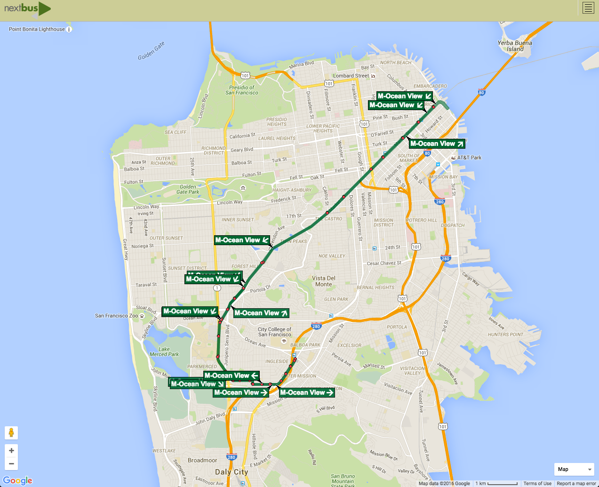

**Figure 1:** Here is a visualization of the transit data you will be ingesting into NiFi.

## Prerequisites
-   Completed the prior tutorials within this tutorial series

## Outline

- [Approach 1: Build SimulateXmlTransitEvents Process Group](#approach1-build-nifi-simulator-flow-3)
- [Step 1: Create a Process Group](#create-process-group-3)
- [Step 2: Add GetFile to Ingest NextBus Data Seed](#add-getfile-to-ingest-nextbus-data-seed-3)
- [Step 3: Add UnpackContent to Decompress the Zipped Data](#add-unpackcontent-to-decompress-the-zipped-data-3)
- [Step 4: Add ControlRate to Regulate Data Flow Speed](#add-controlrate-to-regulate-data-flow-speed-3)
- [Step 5: Add Output Port for External Component Connection](#add-output-port-for-external-component-connection-3)
- [Approach 2: Import SimulateXmlTransitEvents Process Group](#approach2-import-nifi-simulatexmltransitevents-process-group-3)
- [Summary](#summary-3)
- [Further Reading](#further-reading-3)

If you prefer to build the dataflow manually step-by-step, continue on to **Approach 1**. Else if you want to see the NiFi flow in action within minutes, refer to **Approach 2**.

## Approach 1: Build SimulateXmlTransitEvents Process Group

### 1.1 Create Label for Process Group

1\. Go to the **components** toolbar, drag and drop the Label icon  onto the NiFi canvas.

2\. Click on the right corner and stretch the label over approximately 24 squares.

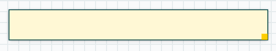

3\. Right click, select configure and name it `Generate Transit Location via Data Seed based on NextBus API`. Change the font size to `18px`.

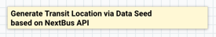

### Step 1: Create a Process Group

1\. Go to the **components** toolbar, drag and drop the **Process Group** icon  onto the NiFi canvas. Name it `SimulateXmlTransitEvents`. Press **ADD**.

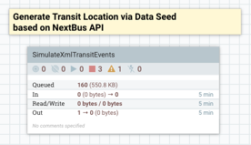

2\. Double click on new process group. At the bottom left corner, breadcrumbs will show you entered **SimulateXmlTransitEvents** Process Group.

### Step 2: Add GetFile to Ingest NextBus Data Seed

1\. Add the processor icon  onto the graph.

2\. Select the **GetFile** processor and press **ADD**.

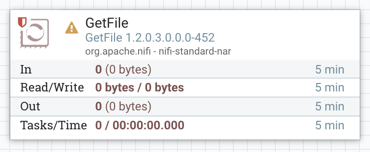

- Creates FlowFiles from files in a directory. NiFI will ignore files it doesn’t have read permissions for.

3\. Right click on the **GetFile** processor, click **configure** from dropdown menu

4\. Enter the **Properties** tab. Add the properties listed in **Table 1** to update the processor's appropriate properties. Press **OK** after changing a property.

**Table 1:** Update **GetFile** Property Values

| Property  | Value  |
|:---|---:|
| `Input Directory`  | `/sandbox/tutorial-id/640/nifi/input`  |
| `Keep Source File`  | `true`  |

- **Input Directory** location at which data is ingested into the dataflow

- **Keep Source File** source files in directory remain after all data is ingested

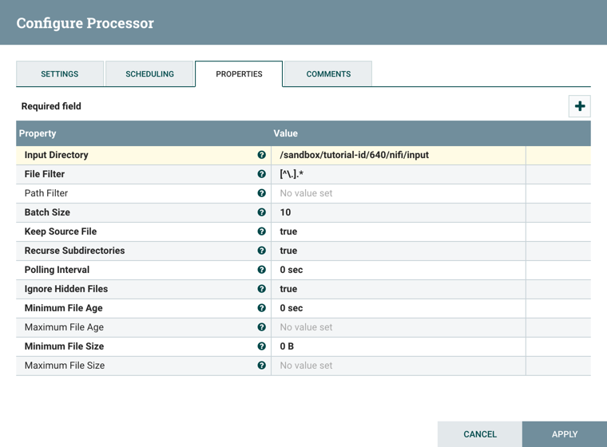

**Figure 2:** GetFile Property Tab Window

5\. Since each property is updated, navigate to the **Scheduling tab** and change the **Run Schedule** from 0 sec to `6 sec`, so the processor executes a task every 6 seconds. Therefore, overuse of system resources is prevented.

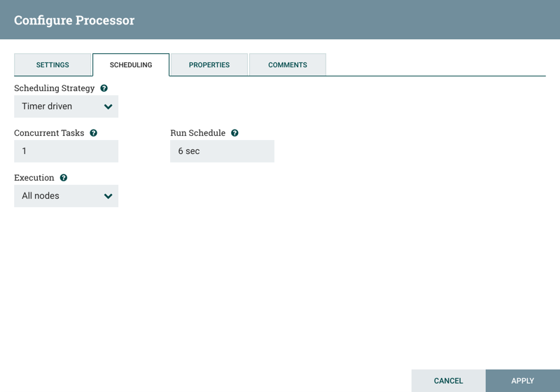

**Figure 3:** GetFile Scheduling Tab Window

6\. Click **Apply**.

### Step 3: Add UnpackContent to Decompress the Zipped Data

1\. Add the **UnpackContent** processor onto the NiFi canvas.

2\. Connect **GetFile** to **UnpackContent** processor by dragging the arrow icon from the first processor to the next. When the Create Connection window appears, verify **success** checkbox is checked, else check it. Click **Add**.

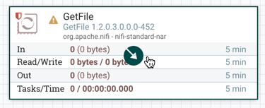

**Figure 4:** Arrow Icon Appears When Hovering Over **GetFile** Processor

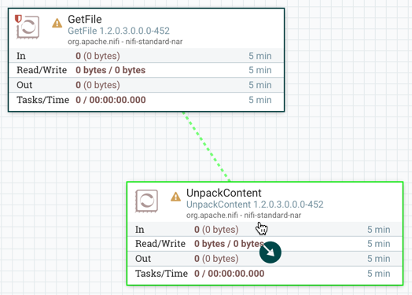

**Figure 5:** Drag Arrow Icon to Connect two Processors (GetFile -> UnpackContent)

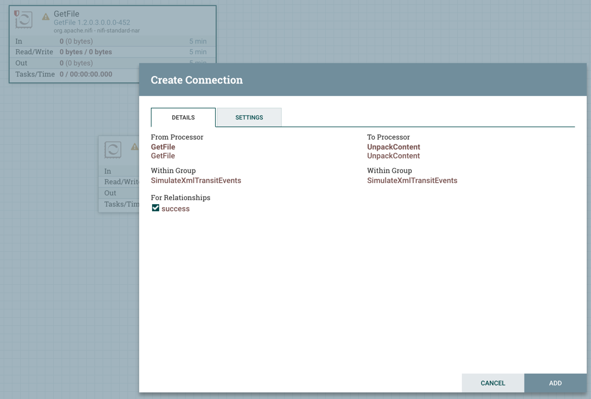

**Figure 6:** Connection Window for GetFile -> UnpackContent. **success** checkbox checked.

3\. Open the processor configuration **properties** tab. Add the properties listed in **Table 2** to update the processor's appropriate properties.

**Table 2:** Update **UnpackContent** Property Value

| Property  | Value  |
|:---|---:|
| `Packaging Format`  | `zip`  |

- **Packaging Format** tells the processor of packaging format used to decompress the file

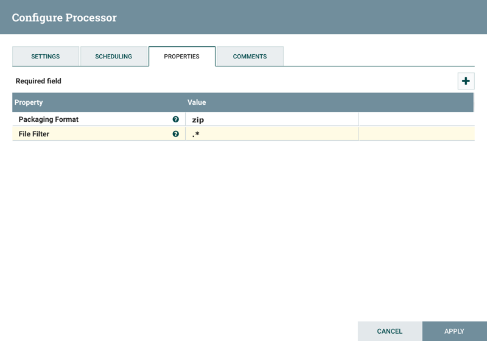

**Figure 7:** UnpackContent Property Tab Window

4\. Since each property is updated, navigate to the **Scheduling tab** and change the **Run Schedule** from 0 sec to `1 sec`, so the processor executes a task every 1 second and avoids back pressure downstream to the next processor.

5\. Open the processor config **Settings** tab, under Auto terminate relationships, check the **failure** and **original** checkboxes. Click **Apply**.

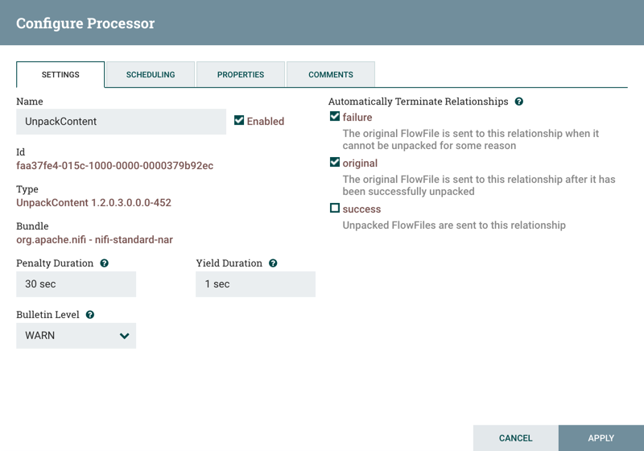

**Figure 8:** UnpackContent Settings Tab Window

### Step 4: Add ControlRate to Regulate Data Flow Speed

1\. Add the **ControlRate** processor onto the NiFi canvas.

2\. Connect **UnpackContent** to **ControlRate** processor. When the Create Connection window appears, verify **success** checkbox is checked, else check it. Click **Add**.

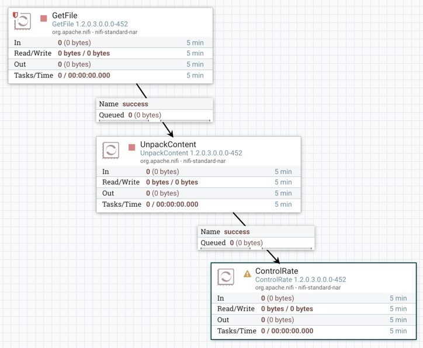

**Figure 9:** Connect UnpackContent to ControlRate

3\. Open the processor configuration **properties** tab. Add the properties listed in **Table 3** to update the processor's appropriate properties.

**Table 3:** Update ControlRate Property Values

| Property  | Value  |
|:---|---:|
| `Rate Control Criteria`  | `flowfile count`  |
| `Maximum Rate`  | `20`  |
| `Time Duration`  | `6 second`  |

- **Rate Control Criteria** instructs the processor to count the number of FlowFiles before a transfer takes place

- **Maximum Rate** instructs the processor to transfer 20 FlowFiles at a time

- **Time Duration** makes it so only 20 FlowFiles will transfer through this processor every 6 seconds.

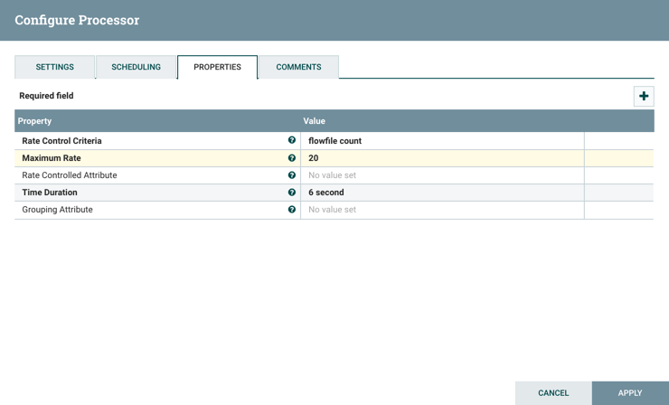

**Figure 10:** ControlRate Property Tab Window

4\. Open the processor config **Settings** tab, under Auto terminate relationships, check the **failure** checkbox. Click **Apply**.

### Step 5: Add UpdateAttribute to Make Each FlowFile Name Unique

1\. Add the **UpdateAttribute** processor onto the NiFi canvas.

2\. Connect **ControlRate** to **UpdateAttribute**. When the Create Connection window appears, verify **success** checkbox is checked, else check it. Click **Add**.

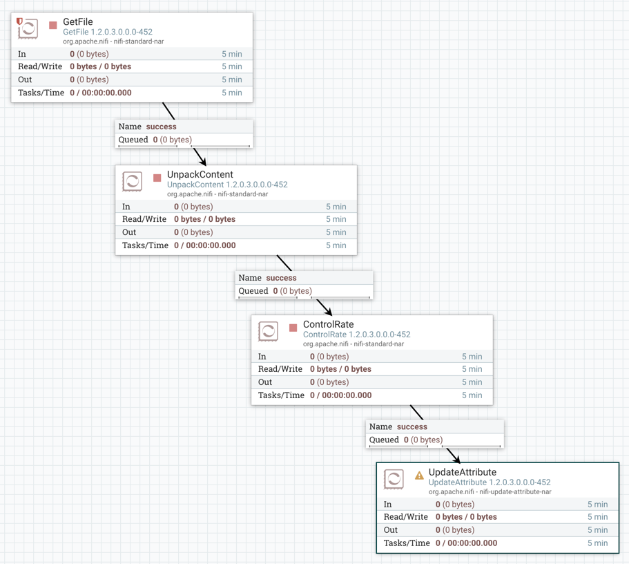

**Figure 11:** Connect ControlRate to UpdateAttribute

3\. Add a new dynamic property for NiFi expression, click on the **New property** button. Insert the following property name and value into your properties tab as shown in the table below:

**Table 4:** Add UpdateAttribute Property Value

| Property  | Value  |
|:---|---:|
| `filename`  | `transit-data-${UUID()}.xml`  |

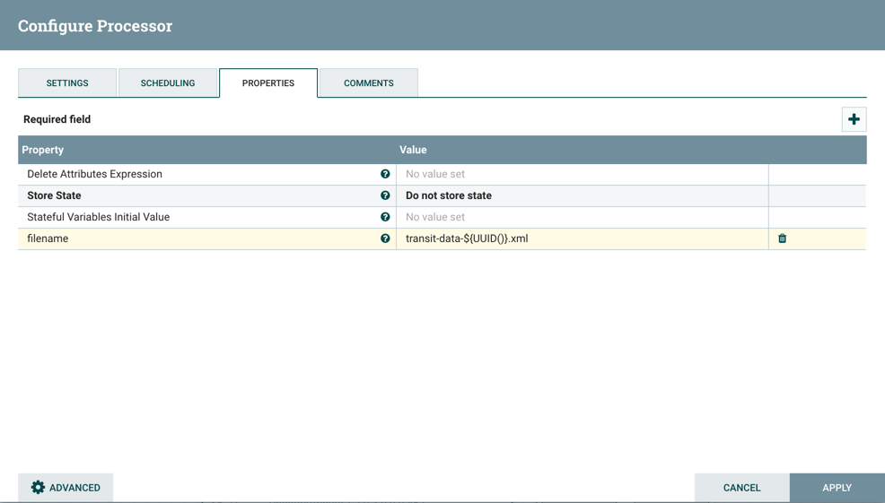

**Figure 12:** UpdateAttribute Property Tab Window

- **filename** updates each FlowFile with a unique identifier

4\. Click **Apply**.

### Step 6: Add PutFile to Store RawTransitEvents to Disk

1\. Add the **PutFile** processor onto the NiFi canvas.

2\. Connect **UpdateAttribute** to **PutFile**. When the Create Connection window appears, verify **success** checkbox is checked, else check it. Click **Add**.

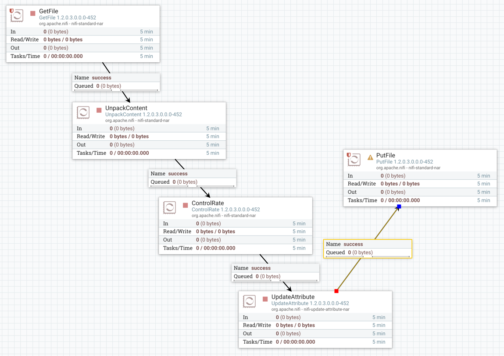

**Figure 13:** Connect **UpdateAttribute** to **PutFile**

3\. Open the processor configuration **properties** tab. Add the property listed in **Table 5** and if their original property already has a value, update it.

**Table 5:** Update PutFile Property Value

| Property  | Value  |
|:---|---:|
| `Directory`  | `/sandbox/tutorial-id/640/nifi/output/rawtransitevents`  |

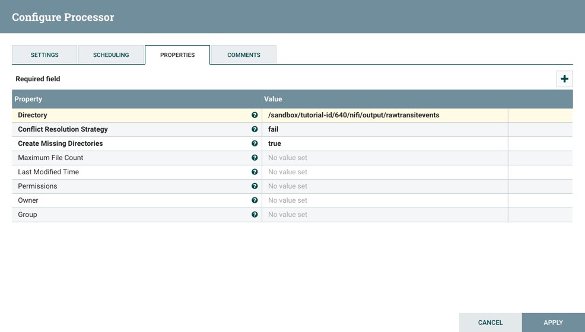

**Figure 14:** PutFile Configuration Property Tab Window

4\. Open the processor config **Settings** tab, under Auto terminate relationships, check the **failure** and **success** checkboxes. Click **Apply**.

### Step 7: Add Output Port for External Component Connection

1\. Add the **Output Port**  component onto the NiFi canvas. Name it `RawTransitEvents`.

2\. Connect **UpdateAttribute** to **RawTransitEvents** output port. When the Create Connection window appears, verify **success** checkbox is checked, else check it. Click **Add**.

**Figure 15:** Connect **UpdateAttribute** to **Output Port (RawTransitEvents)**

### Step 8: Check Data Stored to Local File System Via Web Shell Client

1\. Either select the process group or leave to unselected, then hit the **start** button  located in the Operate Palette to activate the **SimulateXmlTransitEvents** process group dataflow.

2\. Let the flow run for about 1 minute, then stop the flow by hitting the **stop** button.

3\. Launch Sandbox Web Shell Client via HDF Splash Screen from **[Advanced HDF SB Quick Links](http://sandbox-hdf.hortonworks.com:18888/splash2.html)** Link.

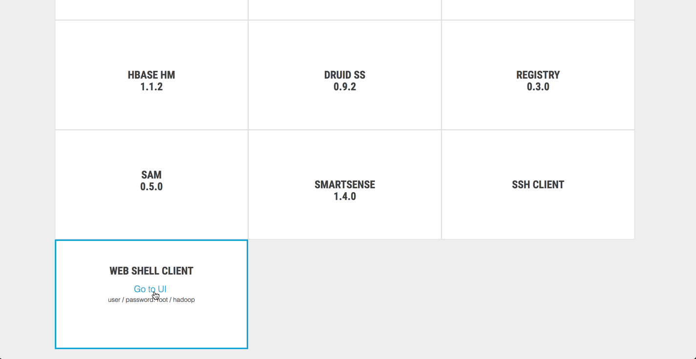

**Figure 16:** SB Quick Link for Web Shell Client

> Note: Username is "admin", initial password is "hadoop". You will be prompted to write the current password again, then set a new password.

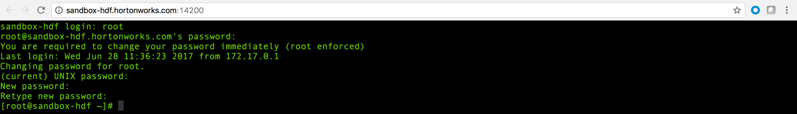

You have now ssh'd into the HDF Sandbox Server.

4\. Navigate to the output directory in which the transit data is being written to:

~~~bash
cd /sandbox/tutorial-id/640/nifi/output/rawtransitevents
~~~

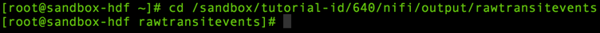

5\. Run the `ls` command to list files in the current directory:

~~~bash
ls
~~~

6\. Run the `cat` command to output the content of the data file to the console:

~~~bash
cat transit-data-{flowfile-UUID}.xml
~~~

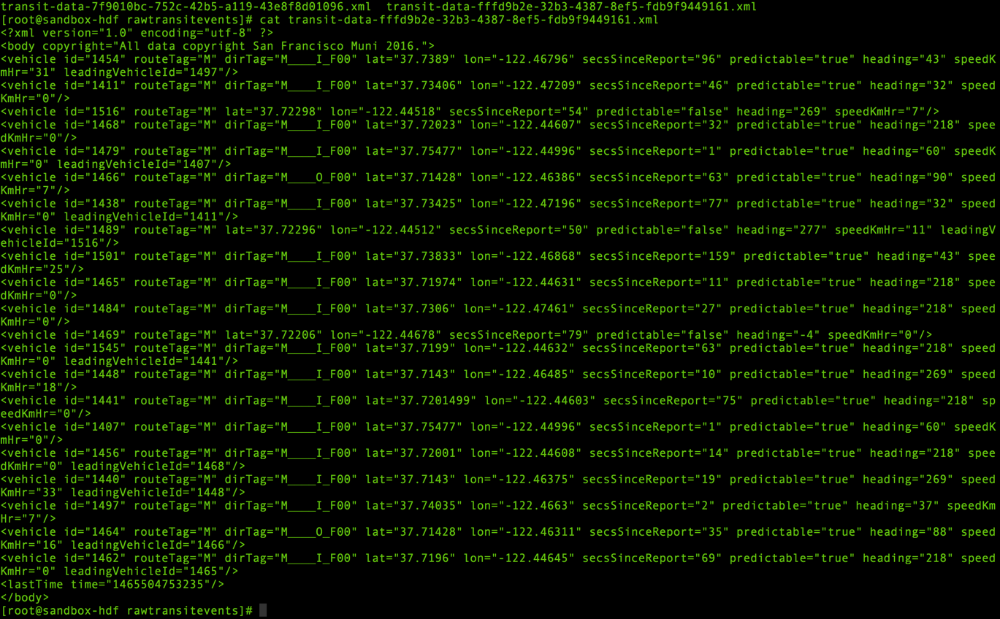

**Figure 17:** Output of Transit Data in Web Shell Client

## Approach 2: Import NiFi SimulateXmlTransitEvents Process Group

1\. Download the [tutorial-3-nifi-flow-SimulateXmlTransitEvents.xml](#assets/tutorial-3-build-a-nifi-process-group-to-simulate-nextbus-api/template/tutorial-3-SimulateXmlTransitEvents.xml) template file.

2\. Use the template icon  located in the Operate Palette.

3\. **Browse**, find the template file, click **Open** and hit **Import**.

4\. From the **Components Toolbar**, drag the template icon  onto the graph and select the **tutorial-3-nifi-flow-SimulateXmlTransitEvents.xml** template file.

5\. Right click on the process group, hit the **start** button  to activate the dataflow.

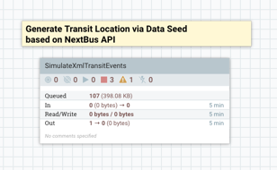

**Figure 18:** NiFi Flow that pulls in San Francisco Muni Transit Events from the XML Simulator, stores the raw transit events to the local file system and also sends the data out to the rest of the flow through the output port.

The building blocks of every dataflow consist of processors. When sections of the flow become complex, you can start grouping processors inside process groups. These tools perform actions on data to ingest, route, extract, split, aggregate or store it. Our dataflow process group above contains processors, each processor includes a high level description of their role in the tutorial:

- **SimulateXmlTransitEvents (Process Group)**
  - **GetFile** fetches the vehicle location simulator data for files in a directory.
  - **UnpackContent** decompresses the contents of FlowFiles from the traffic simulator zip file.
  - **ControlRate** controls the rate at which FlowFiles are transferred to follow-on processors enabling traffic simulation.
  - **UpdateAttribute** renames every FlowFile to give them unique names
  - **PutFile** stores data to local file system
  - **Output Port** makes the connection for the process group to connect to other components (process groups, processors, etc)

Refer to [NiFi's Documentation](https://nifi.apache.org/docs.html) to learn more about each processor described above.

### Summary

Congratulations! You just built a NiFi **SimulateXmlTransitEvents** process group to replicate the NextBus API, which generates transit data for passengers. You learned to use **GetFile** processor to ingest the transit data seed. The **UnpackContent** processor decompressed the transit data seed zip file and routed the data onto the rest of the flow. **ControlRate** processor controlled the rate at which each FlowFile was distributed to the remaining components of the flow. The **Output Port** allows for FlowFiles to be dispersed to the next process group you will learn to build in the next tutorial called **ParseTransitEvents**.

### Further Reading

- [Process Group](https://nifi.apache.org/docs/nifi-docs/html/user-guide.html#process_group_anatomy)
- [GetFile](https://nifi.apache.org/docs/nifi-docs/components/org.apache.nifi/nifi-standard-nar/1.3.0/org.apache.nifi.processors.standard.GetFile/index.html)
- [UnpackContent](https://nifi.apache.org/docs/nifi-docs/components/org.apache.nifi/nifi-standard-nar/1.3.0/org.apache.nifi.processors.standard.UnpackContent/index.html)
- [ControlRate](https://nifi.apache.org/docs/nifi-docs/components/org.apache.nifi/nifi-standard-nar/1.3.0/org.apache.nifi.processors.standard.ControlRate/index.html)
- Under "Adding Components to the Canvas," head to [Output Port](https://nifi.apache.org/docs/nifi-docs/html/user-guide.html#adding-components-to-the-canvas)
