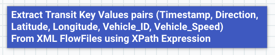
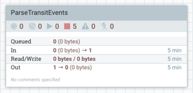
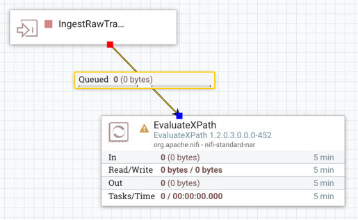
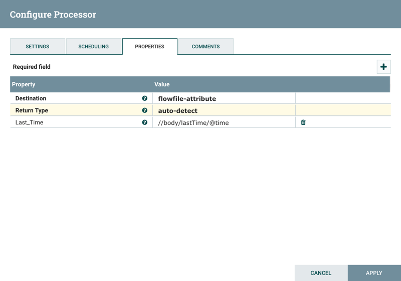
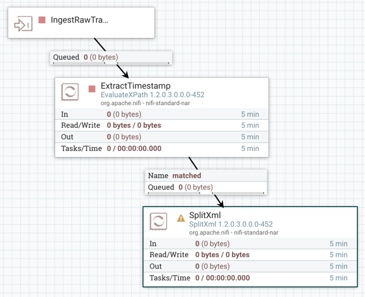
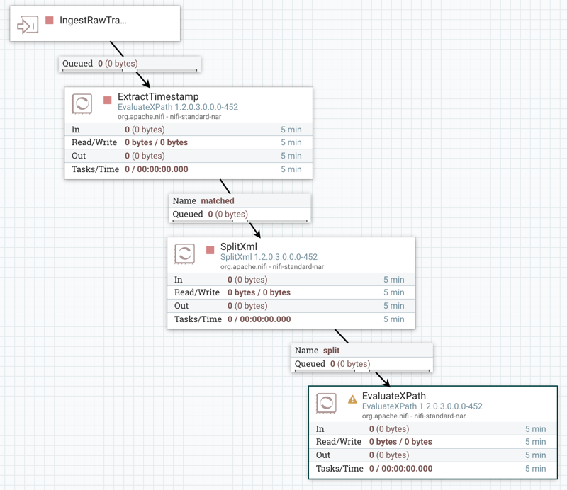
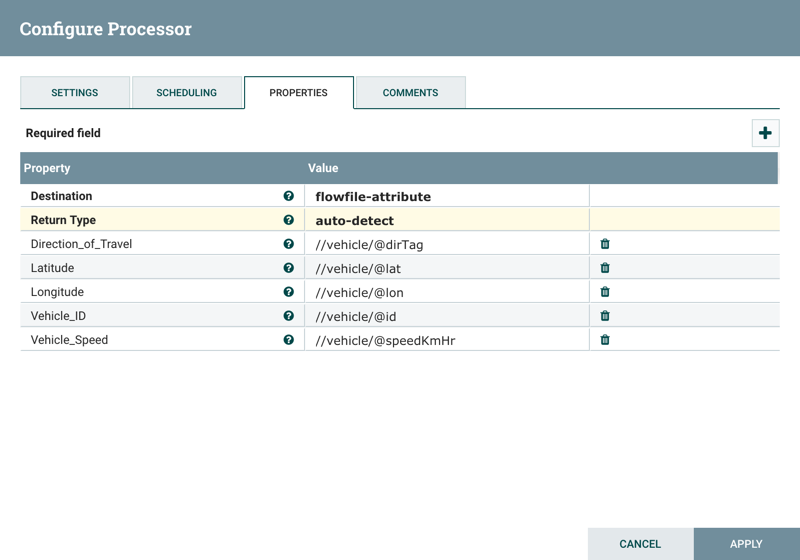
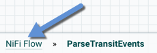
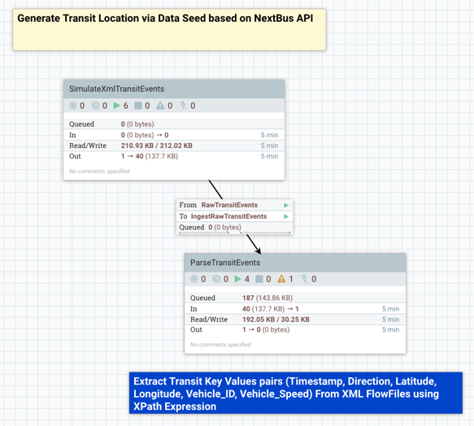
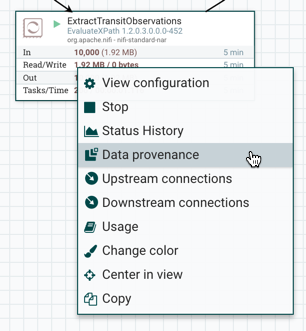

# Build a NiFi Process Group to Parse Transit Events

## Introduction

You will build a portion of the NiFi DataFlow in a process group to parse for **timestamp, vehicle location, speed, vehicle ID** and **other data **from a **San Francisco Muni Transit Simulator**.

## Prerequisites
-   Completed the prior tutorials within this tutorial series

## Outline

- [Approach 1: Manually Build ParseTransitEvents Process Group (PG)](#approach1-manually-build-parsetransitevents-process-group-4)
- [Step 1: Create a Process Group](#create-process-group-4)
- [Step 2: Add an Input Port to Ingest Data Into this PG](#add-an-input-port-to-ingest-data-into-this-pg-4)
- [Step 3: Add EvaluateXPath to Extract the Timestamp for Transit Observation](#add-evaluatexpath-to-extract-the-timestamp-for-transit-observation-4)
- [Step 4: Add SplitXml to Split A FlowFile into Multiple Separate FlowFiles](#add-splitxml-to-split-a-flowfile-into-multiple-separate-flowfiles-4)
- [Step 5: Add EvaluateXPath to Extract Transit Observations](#add-evaluatexpath-to-extract-transit-observations-4)
- [Step 6: Add an Output Port to Route Data Outside this PG](#add-an-output-port-to-route-data-outside-this-pg-4)
- [Step 7: Connect SimulateXmlTransitEvents to ParseTransitEvents](#connect-simulatexmltransitEvents-to-parseTransitevents-4)
- [Step 8: Verify EvaluateXPath is Extracting Values From XML](#verify-evaluatexpath-is-extracting-values-from-xml-4)
- [Approach 2: Import ParseTransitEvents Process Group](#approach2-import-parsetransitevents-process-group-4)
- [Summary](#summary-4)
- [Further Reading](#further-reading-4)

If you prefer to build the dataflow manually step-by-step, continue on to **Approach 1**. Else if you want to see the NiFi flow in action within minutes, refer to **Approach 2**.

### Approach 1: Manually Build ParseTransitEvents Process Group (PG)

### 1.1 Create Label for Process Group

1\. Add a Label  onto the NiFi canvas for the new process group. Right click, **Change color** to **Blue**.

2\. Right click, select configure and name it `Extract Transit Key Values pairs (Timestamp, Direction, Latitude, Longitude, Vehicle_ID, Vehicle_Speed) From XML FlowFiles using XPath Expression`. Choose Font Size to `18px`.

### Step 1: Create a Process Group (PG)

1\. Add a new Process Group onto the NiFi canvas and name it `ParseTransitEvents`

2\. Double click on the new Process Group to enter it.

### Step 2: Add an Input Port to Ingest Data Into this PG

1\. Add the **Input Port**  component onto the NiFi canvas. Name it `IngestRawTransitEvents`.

### Step 3: Add EvaluateXPath to Extract the Timestamp for Transit Observation

1\. Add the **EvaluateXPath** processor onto the NiFi canvas.

2\. Connect **IngestRawTransitEvents** input port to **EvaluateXPath** processor. When the Create Connection window appears, click **Add**.

**Figure 1:** Connect **IngestRawTransitEvents** to **EvaluateXPath**

3\. Open the processor configuration **properties** tab. Add the properties listed in **Table 1** and if the original properties have values, update them. For the second property in **Table 1**, add a new dynamic property for XPath expression, select the plus **( + )** button. Insert the following property name and value into your properties tab as shown in the table below:

**Table 1:** Update EvaluateXPath Property Values

| Property  | Value  |
|:---|---:|
| `Destination`  | `flowfile-attribute`  |
| `Last_Time`  | `//body/lastTime/@time`  |

- **Destination** result from XPath evaluation stored into FlowFile attribute

- **Last_Time** is a FlowFile Attribute and XPath expression that retrieves value of time node in the XML file

**Figure 2:** EvaluateXPath Configuration Property Tab Window

4\. Open the processor config **Settings** tab, change the name to **ExtractTimestamp**, then under Auto terminate relationships, check the **failure** and **unmatched** checkboxes. Click **Apply**.

### Step 4: Add SplitXml to Split A FlowFile into Multiple Separate FlowFiles

1\. Add the **SplitXml** processor onto the NiFi canvas.

2\. Connect **EvaluateXPath** to **SplitXML** processor. When the Create Connection window appears, verify **matched** checkbox is checked, else check it. Click **Add**.

**Figure 3:** Connect **EvaluateXPath** to **SplitXML**

3\. Keep SplitXML default configuration **properties**.

4\. Since each property is updated, navigate to the **Scheduling tab** and change the **Run Schedule** from 0 sec to `1 sec`, so the processor executes a task every 1 second.

5\.  Open the processor config **Settings** tab, under Auto terminate relationships, check the **failure** and **original** checkboxes. Click **Apply**.

### Step 5: Add EvaluateXPath to Extract Transit Observations

1\. Add the **EvaluateXPath** processor onto the NiFi canvas.

2\. Connect **SplitXML** to **EvaluateXPath** processor. When the Create Connection window appears, verify **split** checkbox is checked, if not check it. Click Add.

**Figure 4:** Connect **SplitXML** to **EvaluateXPath**

3\. Open the processor configuration **properties** tab. Add the properties listed in **Table 2** and if the original properties have values, update them. For the remaining properties in **Table 2**, add new dynamic properties for XPath expressions, click on the **( + )** button. Insert the following property name and value into your properties tab as shown in the table below:

**Table 2:** Update EvaluateXPath Property Values

| Property  | Value  |
|:---|---:|
| `Destination`  | `flowfile-attribute`  |
| `Direction_of_Travel`  | `//vehicle/@dirTag`  |
| `Latitude`  | `//vehicle/@lat`  |
| `Longitude`  | `//vehicle/@lon`  |
| `Vehicle_ID`  | `//vehicle/@id`  |
| `Vehicle_Speed`  | `//vehicle/@speedKmHr`  |

- **Destination** set to FlowFile attribute because the result of values from XPath expressions need to be stored in FlowFile attributes.

- **5 user-defined attributes** each represent data related to transit observations associated with the timestamp extracted earlier.

**Figure 5:** EvaluateXPath Configuration Property Tab Window

4\. Open the processor config **Settings** tab, change the name to **ExtractTransitObservations**, then under Auto terminate relationships, check the **failure** and **unmatched** checkboxes. Click **Apply**.

### Step 6: Add an Output Port to Route Data Outside this PG

1\. Add the **Output Port**  component onto the NiFi canvas. Name it `ParsedTransitEvents`.

2\. Connect **EvaluateXPath** to **ParsedTransitEvents** output port. When the Create Connection window appears, verify **matched** checkbox is checked, if not check it. Click Add.

**Figure 6:** Connect **EvaluateXPath** to **ParsedTransitEvents**

### Step 7: Connect SimulateXmlTransitEvents to ParseTransitEvents

1\. Re-enter the `NiFi Flow` breadcrumb.

2\. Connect **SimulateXmlTransitEvents** to **ParseTransitEvents** process group. When the Create Connection window appears, verify **From Output = RawTransitEvents** and connects to **To Input = IngestRawTransitEvents**. Click **Add**.

**Figure 7:** Connection of **SimulateXmlTransitEvents** and **ParseTransitEvents** PG

### Step 8: Verify EvaluateXPath is Extracting Values From XML

1\. Either select both process groups or leave them unselected, then hit the **start** button  located in the Operate Palette to activate the dataflow.

2\. Enter the **ParseTransitEvents** PG. Right click on the **ExtractTransitObservations** processor, select **Data Provenance**.

3\. View any event by selecting the view provenance event icon 

4\. Click on the **Attributes** tab. Select **Show modified attributes only** to display only the attributes being parsed with XPath expression language. As long as you see values mapped to their attribute name, you have verified the processor is extracting xml data from the flowfile successfully.

**Figure 4:** EvaluateXPath (ExtractTransitObservations) is parsing the XML data for **Direction_of_Travel**, **Latitude**, **Longitude**, **Vehicle_ID**, **Vehicle_Speed**.

### Approach 2: Import ParseTransitEvents Process Group

1\. Download the [tutorial-4-ParseTransitEvents.xml](#assets/tutorial-4-build-nifi-process-group-to-parse-transit-events/template/tutorial-4-ParseTransitEvents.xml) template file.

2\. Use the template icon  located in the Operate Palette.

3\. **Browse**, find the template file, click **Open** and hit **Import**.

4\. From the **Components Toolbar**, drag the template icon  onto the graph and select the **tutorial-1-nifi-flow-parse-transit-data.xml** template file.

5\. Hit the **start** button  to activate the dataflow.

**Figure 5:** **tutorial4-ParseTransitEvents.xml** template includes a NiFi Flow that pulls in San Francisco Muni Transit Events from the XML Simulator, parses through the data to extract key values and stores the transit observations as a JSON file.

Overview of the Process Groups and their Processors:

- **SimulateXmlTransitEvents (Process Group)**
  - **GetFile** fetches the vehicle location simulator data for files in a directory.
  - **UnpackContent** decompresses the contents of FlowFiles from the traffic simulator zip file.
  - **ControlRate** controls the rate at which FlowFiles are transferred to follow-on processors enabling traffic simulation.
  - **UpdateAttribute** renames every FlowFile to give them unique names
  - **PutFile** stores data to local file system
  - **Output Port** makes the connection for the process group to connect to other components (process groups, processors, etc)

- **ParseTransitEvents (Process Group)**
  - **Input Port** ingests data from SimulateXmlTransitEvents Process Group
  - **EvaluateXPath** extracts the timestamp of the last update for vehicle location data returned from each FlowFile.
  - **SplitXML** splits the parent's child elements into separate FlowFiles. Since vehicle is a child element in our xml file, each new vehicle element is stored separately.
  - **EvaluateXPath** extracts attributes: vehicle id, direction, latitude, longitude and speed from vehicle element in each FlowFile.
  - **Output Port** outputs data with the new FlowFile attribute (key/values) to the rest of the flow

Refer to [NiFi's Documentation](https://nifi.apache.org/docs.html) to learn more about each processor described above.

### Summary

Congratulations! You just built a NiFi **ParseTransitEvents** process group to parse the XML content and extract transit observations into FlowFile attributes. The **Input Port** pulls data from the **SimulateXmlTransitEvents** process group, which goes into an **EvaluateXPath** processor to pull out the **timestamp** for the vehicle observation and add that timestamp as a FlowFile attribute. The FlowFile content rows are then split into multiple FlowFiles via **SplitXml** processor. These single FlowFile records are routed to another **EvaluateXPath** processor to extract **transit observations** for multiple transit vehicles of that timestamp from earlier. This data with new FlowFile attributes is routed to the rest of the flow via **Output Port**.

### Further Reading

-   [Apache NiFi](https://hortonworks.com/apache/nifi/)
-   [Hortonworks DataFlow Documentation](http://docs.hortonworks.com/HDPDocuments/HDF2/HDF-2.1.2/bk_dataflow-user-guide/content/ch_user-guide.html)
-   [XPath Expression Tutorial](http://www.w3schools.com/xml/xpath_intro.asp)
