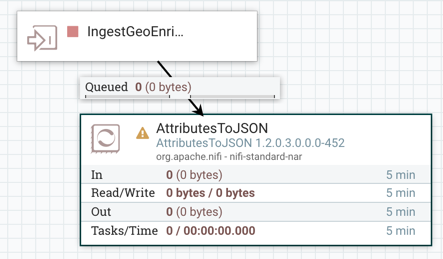

# Build a NiFi Process Group to Store Data As JSON

## Introduction

You will build a new process group called **StoreTransitEventsAsJSONToDisk** to take the FlowFile attributes, write them to a new FlowFile's content as JSON representation. You will then store these FlowFiles to the local filesystem.

## Prerequisites
-   Completed the prior tutorials within this tutorial series

## Outline

- [Approach 1: Manually Build StoreTransitEventsAsJSONToDisk Process Group (PG) ](#approach1-manually-build-simple-nifi-flow-6)
- [Step 1: Create a Process Group and Label For It](#create-a-process-group-and-label-for-it-6)
- [Step 2: Add an Input Port to Ingest Data Into this PG](#add-an-input-port-to-ingest-data-into-this-pg-6)
- [Step 3: Add AttributesToJSON to Represent FlowFile Attributes As JSON](#add-attributestojson-to-represent-flowfile-attributes-as-json-6)
- [Step 4: Add MergeContent to Combine Multiple FlowFiles Together](#add-mergecontent-to-combine-multiple-flowfiles-together-6)
- [Step 5: Add UpdateAttribute to Make Each FlowFile Name Unique](#add-updateattribute-to-make-each-flowfile-name-unique-6)
- [Step 6: Add PutFile to Store Data to Local File System](#add-putfile-to-store-data-to-local-file-system-6)
- [Step 7: Connect ValidateGeoEnrichedTransitData to StoreDataAsJSONToDisk](#connect-validategeoenrichedtransitdata-to-storedataasjsontodisk-6)
- [Step 8: Run the NiFi DataFlow](#run-the-nifi-dataflow-6)
- [Step 9: Check Data By NiFi's Data Provenance](#check-data-by-nifi's-data-provenance-6)
- [Approach 2: Import StoreTransitEventsAsJSONToDisk Process Group](#approach2-import-simple-nifi-flow-6)
- [Summary](#summary-6)
- [Further Reading](#further-reading-6)

If you prefer to build the dataflow manually step-by-step, continue on to **Approach 1**. Else if you want to see the NiFi flow in action within minutes, refer to **Approach 2**.

### Approach 1: Manually Build StoreTransitEventsAsJSONToDisk Process Group (PG)

### Step 1: Create Process Group and Label For It

1\. Add a Label  onto the NiFi canvas for the new process group. Right click, **Change color** to **Green**.

2\. Right click, select configure and name it `Take the FlowFile Attributes, Represent as JSON and Store Data to Local FileSystem`.

3\. Add a new Process Group onto the NiFi canvas and name it `StoreDataAsJSONToDisk`

4\. Double click on the new process group to enter it.

### Step 2: Add an Input Port to Ingest Data Into this PG

1\. Add the **Input Port**  component onto the NiFi canvas. Name it `IngestGeoEnrichedEvents`.

### Step 3: Add AttributesToJSON to Represent FlowFile Attributes As JSON

1\. Add the **AttributesToJSON** processor onto the NiFi canvas.

2\. Connect **IngestGeoEnrichedEvents** input port to **AttributesToJSON** processor. When the Create Connection window appears, verify **matched** checkbox is checked, else check it. Click **Add**.

**Figure 1:** Connect **IngestGeoEnrichedEvents** input port to **AttributesToJSON** processor

3\. Open the processor configuration **properties** tab. Add the properties listed in Table 1 and if their original properties already have values, update them.

**Table 1:** Update AttributesToJSON Property Values

| Property  | Value  |
|:---|---:|
| `Attributes List`  | `Vehicle_ID, Direction_of_Travel, Latitude, Longitude, Vehicle_Speed, Last_Time`  |
| `Destination`  | flowfile-content  |

- **Attributes List** takes FlowFile attribute parameters and presents them in JSON format
- **Destination** stores the output as content in the FlowFile

**Figure 2:** AttributesToJSON Configuration Property Tab Window

4\. Open the processor config **Settings** tab, under Auto terminate relationships, check the **failure** checkbox. Click **Apply**.

### Step 4: Add MergeContent to Combine Multiple FlowFiles Together

1\. Add the **MergeContent** processor onto the NiFi canvas.

2\. Connect **AttributesToJSON** to **MergeContent** processor. When the Create Connection window appears, verify **success** checkbox is checked, else check it. Click **Add**.

**Figure 3:** Connect **AttributesToJSON** to **MergeContent** processor

3\. Open the processor configuration **properties** tab. Add the properties listed in Table 2 and if their original properties already have values, update them.

**Table 2:** Update MergeContent Property Values

| Property  | Value  |
|:---|---:|
| `Minimum Number of Entries`  | `10`  |
| `Maximum Number of Entries`  | `15`  |
| `Delimiter Strategy`  | Text  |
| `Header`  | `[`  |
| `Footer`  | `]`  |
| `Demarcator` | `,` {now-press-shift-enter} |

- **Minimum Number of Entries** takes in at least specified amount of FlowFiles, then merges them into 1 FlowFiles
- **Maximum Number of Entries** takes in no more than specified amount of FlowFiles, then merges them
- **Delimiter Strategy** specifies that Header, Footer and Demarcator set the formatting conditions for text in the file
- **Header** inserts specified value at the beginning of the file
- **Footer** inserts specified value at the end of the file
- **Demarcator** inserts specified value(s) at the end of every line in the file

**Figure 4:** MergeContent Configuration Property Tab Window

4\. Open the processor config **Settings** tab, under Auto terminate relationships, check the **failure** and **original** checkboxes. Click **Apply**.

### Step 5: Add UpdateAttribute to Make Each FlowFile Name Unique

1\. Add the **UpdateAttribute** processor onto the NiFi canvas.

2\. Connect **MergeContent** to **UpdateAttribute** processor. When the Create Connection window appears, verify **merged** checkbox is checked, if not check it. Click **Add**.

**Figure 5:** Connect **MergeContent** to **UpdateAttribute** processor

3\. Add a new dynamic property for NiFi expression, click on the **New property** button. Insert the following property name and value into your properties tab as shown in the table below:

**Table 3:** Add UpdateAttribute Property Value

| Property  | Value  |
|:---|---:|
| `filename`  | `${UUID()}`  |

- **filename** updates each FlowFile with a unique identifier

**Figure 6:** UpdateAttribute Configuration Property Tab Window

### Step 6: Add PutFile to Store Data to Local File System

1\. Add the **PutFile** processor onto the NiFi canvas.

2\. Connect **UpdateAttribute** to **PutFile** processor. When the Create Connection window appears, verify **success** checkbox is checked, else check it. Click Add.

**Figure 7:** Connect **UpdateAttribute** to **PutFile** processor

3\. Open the processor configuration **properties** tab. Add the property listed in Table 4 and if their original property already has a value, update it.

**Table 4:** Update PutFile Property Value

| Property  | Value  |
|:---|---:|
| `Directory`  | `/sandbox/tutorial-id/640/nifi/output/observe-transit-data`  |

**Figure 8:** PutFile Configuration Property Tab Window

4\. Open the processor config **Settings** tab, under Auto terminate relationships, check the **failure** and **success** checkboxes. Click **Apply**.

### Step 7: Connect ValidateGeoEnrichedTransitData to StoreDataAsJSONToDisk

1\. Re-enter the `NiFi Flow` breadcrumb to exit **StoreDataAsJSONToDisk** PG.

2\. Connect **ValidateGeoEnrichedTransitData** to **StoreDataAsJSONToDisk** process group. When the Create Connection window appears, verify **From Output = SendGeoEnrichedTranistEvents** and connects to **To Input = IngestGeoEnrichedEvents**. Click **Add**.

**Figure 9:** Connect **ValidateGeoEnrichedTransitData** to **StoreDataAsJSONToDisk** PG

### Step 8: Run the NiFi DataFlow

1\. The processors are valid since the warning symbols disappeared. Notice that the processors have a red stop symbol  in the upper left corner and are ready to run. To select all processors, hold down the **shift-key** and drag your mouse across the entire data flow.

2\. Now that all processors are selected, go to the actions toolbar in the left window labeled Operate and click the start button . Your screen should look like the following:

**Figure 10:** Start **StoreDataAsJSONToDisk** PG

3\. To quickly see what the processors are doing and the information on their faces, right click on the graph, click the **refresh status** button 

### Step 9: Check Data By NiFi's Data Provenance

1\. Right click on the PutFile processor. Select `Data Provenance`. It is the 4th item in the dropdown menu.

NiFi searches for provenance events. The window will load with events, select any event. An event is a FlowFile that passes through a processor and the data that is viewable at that particular time.

2\. Select any event by pressing on the view provenance event symbol .

**Figure 11:** NiFi Data Provenance Window

3\. Once you select the event, a Provenance Event Dialog Window will appear. It contains Details, Attributes and Content regarding the particular event. Take a few minutes to view each tab. Let's navigate to the `Content` tab to view the data generated from the FlowFile. NiFi gives the user the option to download or view the content of the event. Click on the **View** button.

**Figure 12:** Provenance Event Window

4\. NiFi gives the user the option view the data in multiple formats. We will view it in original format.

**Figure 13:** View FlowFile JSON Content

Did you receive the data you expected?

### Approach 2: Import StoreDataAsJSONToDisk Process Group

1\. Download the [tutorial-6-StoreDataAsJSONToDisk.xml](#assets/tutorial-4-build-nifi-process-group-to-parse-transit-events/template/tutorial-6-StoreDataAsJSONToDisk.xml) template file.

2\. Use the **upload template** icon  located in the Operate Palette.

3\. **Browse**, find the template file, click **Open** and hit **Import**.

4\. From the **Components Toolbar**, drag the **add template** icon  onto the graph and select the **tutorial-1-nifi-flow-parse-transit-data.xml** template file.

5\. Hit the **start** button  to activate the dataflow.

**Figure 14:** **tutorial-6-StoreDataAsJSONToDisk.xml** template includes a NiFi Flow that pulls in San Francisco Muni Transit Events from the XML Simulator, parses through the data to extract key values and stores the transit observations as a JSON file.

Overview of the Process Groups and their Processors:

- **SimulateXmlTransitEvents (Process Group)**
  - **GetFile** fetches the vehicle location simulator data for files in a directory.
  - **UnpackContent** decompresses the contents of FlowFiles from the traffic simulator zip file.
  - **ControlRate** controls the rate at which FlowFiles are transferred to follow-on processors enabling traffic simulation.
  - **UpdateAttribute** renames every FlowFile to give them unique names
  - **PutFile** stores data to local file system
  - **Output Port** makes the connection for the process group to connect to other components (process groups, processors, etc)

- **ParseTransitEvents (Process Group)**
  - **Input Port** ingests data from SimulateXmlTransitEvents Process Group
  - **EvaluateXPath** extracts the timestamp of the last update for vehicle location data returned from each FlowFile.
  - **SplitXML** splits the parent's child elements into separate FlowFiles. Since vehicle is a child element in our xml file, each new vehicle element is stored separately.
  - **EvaluateXPath** extracts attributes: vehicle id, direction, latitude, longitude and speed from vehicle element in each FlowFile.
  - **Output Port** outputs data with the new FlowFile attribute (key/values) to the rest of the flow

- **ValidateGooglePlacesData (Process Group)**
  - **Input Port** ingests data from ParseTransitEvents Process Group
  - **RouteOnAttribute** checks the NextBus Simulator data by routing FlowFiles only if their attributes contain transit observation data (Direction_of_Travel, Last_Time, Latitude, Longitude, Vehicle_ID, Vehicle_Speed)
  - **InvokeHTTP** sends a rest call to Google Places API to pull in geo enriched data for transit location
  - **EvaluateJSONPath** parses the flowfile content for city and neighborhoods_nearby
  - **RouteOnAttribute** checks the new Google Places data by routing FlowFiles only if their attributes contain geo enriched data (city, neighborhoods_nearby)
  - **Output Port** outputs data with nonempty FlowFile attributes (key/values) to the rest of the flow

- **StoreTransitEventsAsJSONToDisk (Process Group)**
  - **Input Port** ingests data from ValidateGooglePlacesData Process Group
  - **AttributesToJSON** generates a JSON representation of the attributes extracted from the FlowFiles and converts XML to JSON format this less attributes.
  - **MergeContent** merges a group of JSON FlowFiles together based on a number of FlowFiles and packages them into a single FlowFile.
  - **UpdateAttribute** updates the attribute name for each FlowFile.
  - **PutFile** writes the contents of the FlowFile to a desired directory on the local filesystem.

Refer to [NiFi's Documentation](https://nifi.apache.org/docs.html) to learn more about each processor described above.

## Summary

Congratulations! For the **StoreTransitEventsAsJSONToDisk** Process Group, you learned to take the FlowFile attribute (key/value) pairs and represent them as a JSON format. You then used **MergeContent** to combine multiple FlowFiles together to create a larger FlowFile with multiple records. **UpdateAttribute** was used to ensure no FlowFiles would have duplicate names. **PutFile** was added to the flow to store the JSON data into the local file system.

## Further Reading

-   [Apache NiFi](https://hortonworks.com/apache/nifi/)
-   [Hortonworks DataFlow Documentation](http://docs.hortonworks.com/HDPDocuments/HDF2/HDF-2.1.2/bk_dataflow-user-guide/content/ch_user-guide.html)
-   [NiFi Expression Language Guide](https://nifi.apache.org/docs/nifi-docs/html/expression-language-guide.html)
-   [XPath Expression Tutorial](http://www.w3schools.com/xml/xpath_intro.asp)
-   [JSON Tutorial](https://www.w3schools.com/js/js_json_intro.asp)
