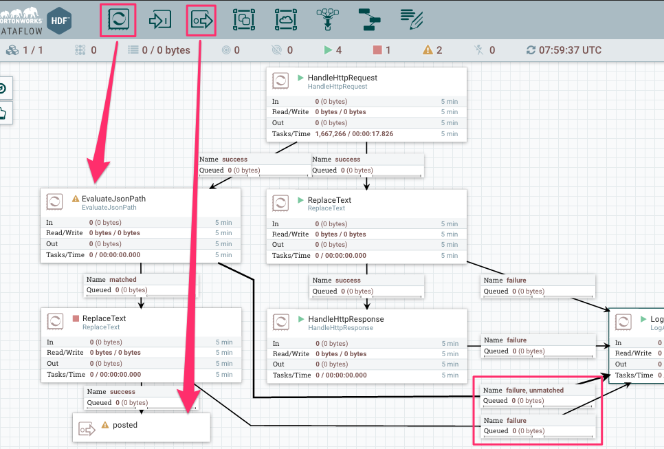
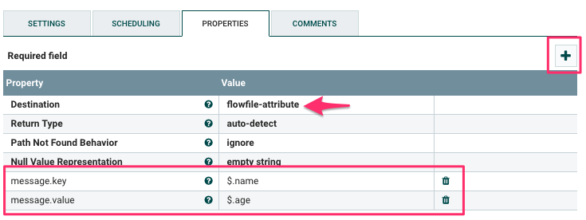
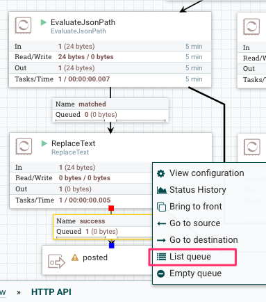

## 2-1: データ変換処理をデザインする

POSTで受信したデータをKafkaに登録する前に整形しましょう。
ここでは次のようなデータ変換を行います:

| FlowFile | Attributes | Content | memo |
|----------|------------|---------|------|
| POSTで受信したJSON | | {"name": "C", "age": 20} | |
| EvaluateJsonPath | message.key=C, message.value=20 | (同上) | JSONからname, ageをkey, valueとして抽出 |
| ReplaceText | message.key=C, message.value=20 | 20 | message.valueでコンテンツを上書き |
| KafkaにPublishするメッセージ | message.key=C | 20 | 最終的に必要な形 |

最終的なデータ形式を定めてから、入力データをどう変換すればその形になるのかを考えると良いでしょう。

## 2-2: 必要なプロセッサを配置する

次のプロセッサを追加します:

- EvaluateJsonPath: FlowFileのcontentをJSONとしてパースし、JSONPathで任意の要素の値を抽出します。抽出結果をFlowFileのAttributeに保存しましょう。
- ReplaceText: Kafkaに登録する際、FlowFileのContentがメッセージのvalueとなります。抽出したJSON内の値を再びFlowFileのContentに戻します。

先のイメージの様にこれらのプロセッサを`HandleHttpRequest`からつなぎます。不要なRelationshipはterminateして、エラー系のRelationshipはLogAttributeへとつなぎましょう。

Relationshipの線の上をダブルクリックすると、新しいポイントを追加できます。きれいに配置したい場合に便利です。

そして、`posted`という名前の`Output Port`を最後に配置しましょう。これは、HTTP POSTで受信したデータを、他のProcessGroupから利用するためのものです。

## 2-3: EvaluateJsonPathの設定

プロセッサには`Dynamic Property`をサポートするものがあります。EvaluateJsonPathもその一つで、値の抽出に利用するJSONPathを設定する際に利用します。

| Property | Value |
|----------|-------|
| Destination | flowfile-attribute |
| message.key | $.name |
| message.value | $.age |

`$.name`はルート要素直下の`name`の値を抽出するJSONPathです。結果を`message.key`というキーでFlowFileのAttributeに保存します。

## 2-4: ReplaceTextの設定

先のEvaluateJsonPathで抽出した数値をFlowFileのcontentに設定します。

| Property | Value |
|----------|-------|
| Replacement Value | ${message.value} |
| Replacement Strategy | Always Replace |

Replacement Valueでは、FlowFileのAttributeを指定しています。`$`で始まりますが、これはJSONPathではありません。
[NiFi Expression Language (通称EL)](https://nifi.apache.org/docs/nifi-docs/html/expression-language-guide.html)です。

Attribute値を抜き出すだけでなく、加工したり、条件判定したりできます。

## 2-5: EvalueateJsonPath、ReplaceTextを起動して動作確認

右クリックから`List queue`を選択すると、キューに溜まったFlowFileが確認できます。
インフォメーションアイコンをクリックして、FlowFileのAttributeやContentが期待通りに変換されているか確認しましょう。

## クイズ

- 「HandleHttpRequestから２つの`success`が出力されているのは何かにおうな...」と感じた方はするどいですね！このフローでは今追加した２つめのルートの結果にかかわらず、HandleHttpResponseは正常の結果を返してしまいます。ハンズオンとしてはエラー処理まで実装していると時間が足りないので割愛しますが、プロダクションシステムでは的確にエラーハンドリングも実装しておきたいところです。どのようにフローをデザインすると良いでしょうか?

### [前へ](tutorial-1.md) | [次へ](tutorial-3.md)