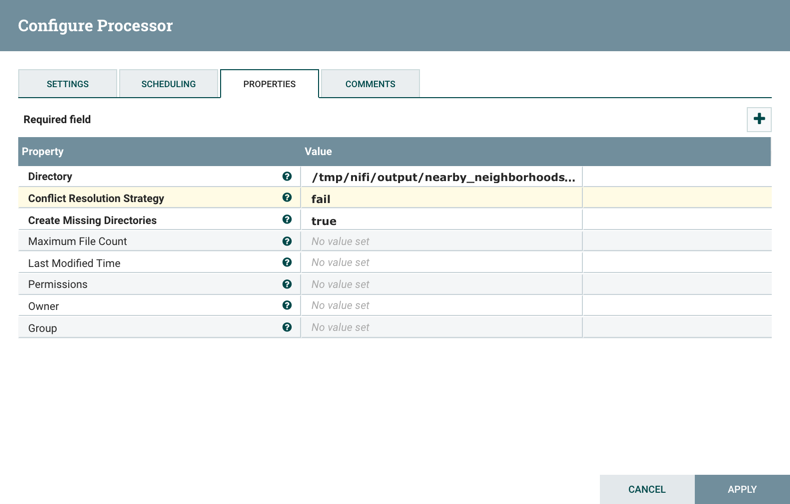

# Ingest Live Vehicle Routes via NextBus API

## Introduction
In this tutorial, you will replace the section of our dataflow that generates the simulation of vehicle location XML data with a new section that ingests a live stream of data from NextBus San Francisco Muni Agency on route OceanView into our NiFi DataFlow.

In this tutorial, you will build the Ingest NextBus SF Muni Live Stream section of the dataflow:

## Prerequisites
- Completed Tutorial 0: Launch NiFi HTML UI
- Completed Tutorial 1: Build A Simple NiFi DataFlow
- Completed Tutorial 2: Enrich Simple DataFlow via Places API

## Outline
- [Approach 1: Import Live Vehicle Routes NiFi Flow](#approach1-import-live-vehicle-routes-nifi-flow)
- [Approach 2: Manually Build Live Vehicle Routes NiFi Flow](##approach2-manually-build-live-vehicle-routes-nifi-flow)
- [NextBus Live Feed](#nextbus-live-feed)
- [Step 1: Attach NextBus Live Stream to the DataFlow](#attach-nextbus-live-stream)
- [Step 2: Run the NiFi DataFlow](#run-nifi-dataflow)
- [Summary](#summary-tutorial3)
- [Further Reading](#further-reading-tutorial3)

If you want to see the NiFi flow in action within minutes, refer to **Approach 1**. Else if you prefer to build the dataflow manually step-by-step, continue on to **Approach 2**.

## Approach 1: Import Live Vehicle Routes NiFi Flow

1\. Download the [Tutorial-3-ingest-live-vehicle-routes-nextbus-api.xml](assets/tutorial-3-ingest-live-vehicle-routes-via-nextbus-api/nifi-template/tutorial-3-ingest-live-vehicle-routes-nextbus-api.xml) template file. Then import the template file into NiFi.

2\. Hit the **start** button . to activate the dataflow.

## Approach 2: Manually Build Live Vehicle Routes NiFi Flow

## NextBus Live Feed 

NextBus Live Feed provides the public with live information regarding passenger information, such as vehicle location information, prediction times on transit vehicles, routes of vehicles and different agencies (San Francisco Muni, Unitrans City of Davis, etc). We will learn to use NextBus's API to access the XML Live Feed Data and create an URL. In this URL we will specify parameters in a query string. The parameters for the tutorial will include the vehicle location, agency, route and time.

After viewing the Live Feed Documentation, we created the following URL for the GetHTTP processor:

~~~
http://webservices.nextbus.com/service/publicXMLFeed?command=vehicleLocations&a=sf-muni&r=M&t=0
~~~

Let’s break apart the parameters, so we can better understand how to create custom URLs. There are 4 parameters:

- commands: command = vehicleLocations
- agency: a=sf-muni
- route: r=M
- time: t=0

Refer to [NextBus’s Live Feed Documentation](https://www.nextbus.com/xmlFeedDocs/NextBusXMLFeed.pdf) to learn more about each parameter.

### Step 1: Attach NextBus Live Stream to the DataFlow 

### GetHTTP

1. Delete GetFile, UnpackContent and ControlRate processors. We will replace them with the GetHTTP processor.
2. Add the **GetHTTP** processor and drag it to the place where the previous three processors were located. Connect GetHTTP to EvaluateXPath processor located above SplitXML. When the Create Connection window appears, select **success** checkbox. Click **Add**.
3. Open GetHTTP Config Property Tab window. We will need to copy and paste Nextbus XML Live Feed URL into the property value. Add the property listed in **Table 1**.

**Table 1:** Update GetHTTP Properties Tab

| Property  | Value  |
|:---|---:|
| `URL`  | `http://webservices.nextbus.com/service/publicXMLFeed?command=vehicleLocations&a=sf-muni&r=M&t=0` |
| `Filename`  | `vehicleLoc_SF_OceanView_${now():format("HHmmssSSS")}.xml` |

4\. Now that each property is updated. Navigate to the **Scheduling tab** and change the **Run Schedule** from 0 sec to `4 sec`, so that the processor executes a task every 1 second. Therefore, overuse of system resources is prevented.

5\. Open the processor config **Settings** tab, change the processor's Name from GetHTTP to `NextBusXMLFeed`. Click **Apply** button.

### Modify PutFile in Geo Enrich Section

1\. Open PutFile Configure **Properties Tab**. Change the Directory property value from the previous value to the value shown in **Table 2**:

**Table 2:** Update PutFile Properties Tab

| Property  | Value  |
|:---|---:|
| `Directory`  | `/tmp/nifi/output/nearby_neighborhoods_liveStream` |

**Directory** is changed to a new location for the real-time data coming in from NextBus live stream.

2\. Click **Apply**.

### Step 2: Run the NiFi DataFlow 

Now that we added NextBus San Francisco Muni Live Stream Ingestion to our dataflow , let's run the dataflow and verify if we receive the expected results in our output directory.

1\. Go to the actions toolbar and click the start button . Your screen should look like the following:

2\. Let's verify the data in output directory is correct. Navigate to the following directories and open a random one to check the data.

~~~
cd /tmp/nifi/output/nearby_neighborhoods_liveStream
ls
vi 002a7d47-b6bb-41e1-b930-0e172a54638b
~~~

Did you receive neighborhoods similar to the image below?

## Summary 

Congratulations! You learned how to use NextBus's API to connect to their XML Live Feed for vehicle location data. You also learned how to use the GetHTTP processor to ingest a live stream from NextBus San Francisco Muni into NiFi!

## Further Reading 

- [NextBus XML Live Feed](https://www.nextbus.com/xmlFeedDocs/NextBusXMLFeed.pdf)
- [Hortonworks NiFi User Guide](https://docs.hortonworks.com/HDPDocuments/HDF2/HDF-2.0.0/bk_user-guide/content/index.html)
- [Hortonworks NiFi Developer Guide](https://docs.hortonworks.com/HDPDocuments/HDF2/HDF-2.0.0/bk_developer-guide/content/index.html)
