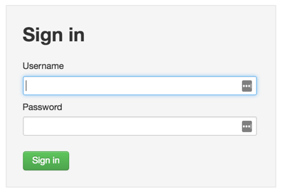
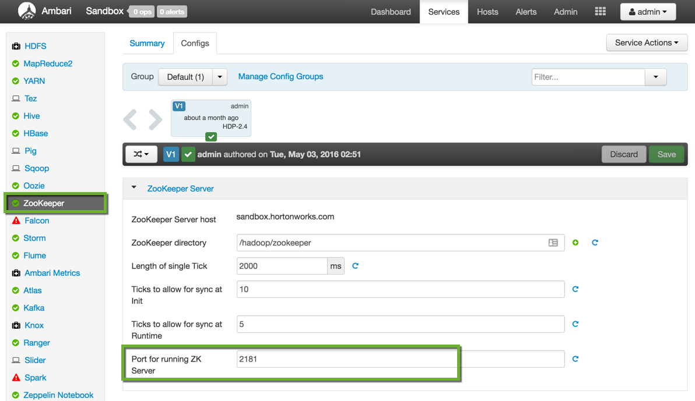
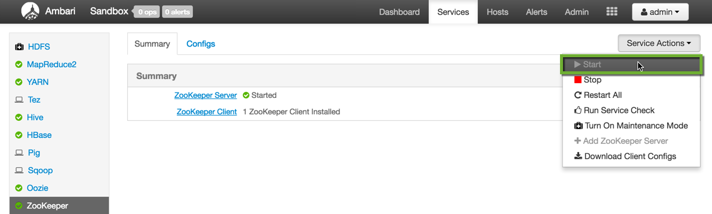
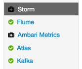
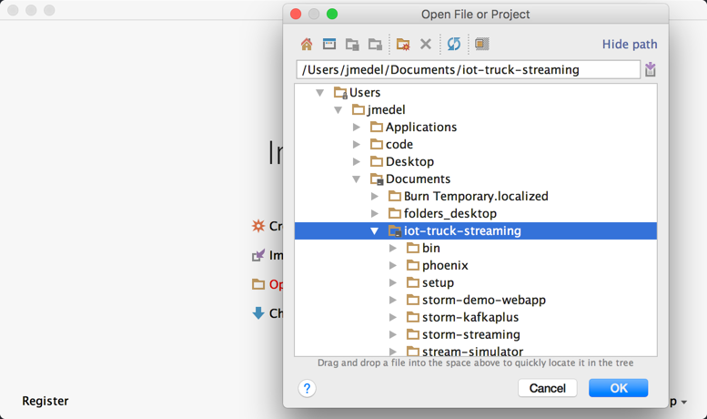
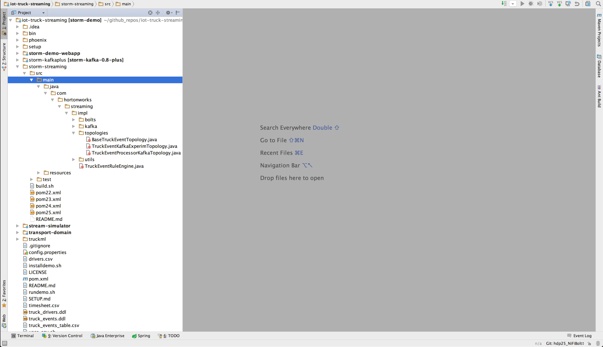
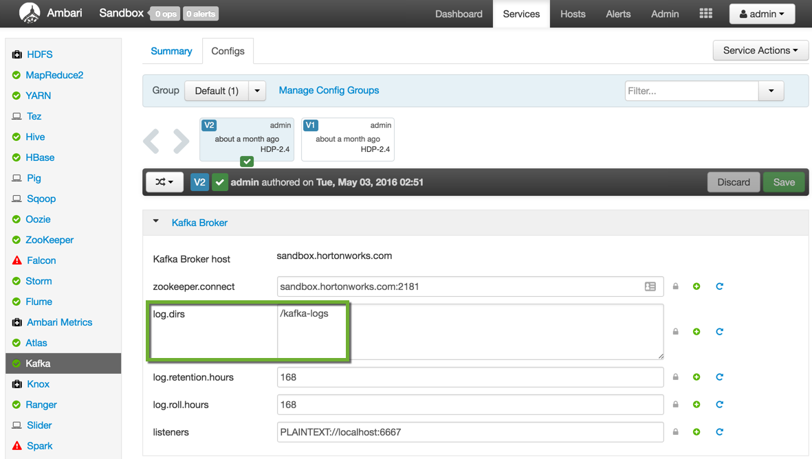
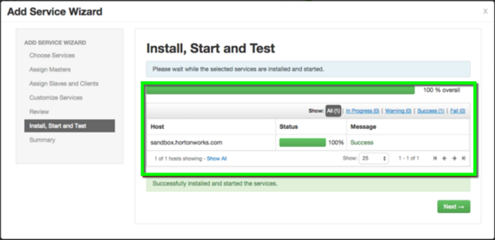

# Set Up Simulator, Apache Services and IDE Environment

## Introduction

In this tutorial, we are going to set up all the services required to run the Connected Car Application(Trucking Demo). We will install NiFi onto our Hortonworks Sandbox while activating Kafka and Storm for later use in the tutorial series. We will also walkthrough how to set up an IDE on our local machine for Storm development testing and deploy our Storm project to the Sandbox for further testing.

## Prerequisites

- Downloaded and Installed latest [Hortonworks Sandbox](https://hortonworks.com/products/hortonworks-sandbox/#install)
- If you are new to the sandbox shell, refer to [Learning the Ropes of the Hortonworks Sandbox](https://hortonworks.com/tutorial/learning-the-ropes-of-the-hortonworks-sandbox/)
- We recommend you have some experience with Java Concepts, Syntax and OOP, refer to this [Intro to Java Programming Course](https://www.udacity.com/course/intro-to-java-programming--cs046) if you are interested in building a strong foundation.
- Memory must be at least 8GB RAM, preferably 4 processor cores, else errors may occur in fourth tutorial
- For windows users, to run linux terminal commands in these tutorials, download [Git Bash](https://openhatch.org/missions/windows-setup/install-git-bash).
- Read **Table 1** to figure out some basic details about your sandbox

**Table 1: Virtual Machine Information** 

| Parameter  | Value (VirtualBox)  | Value(VMware)  | Value(MS Azure)  |
|---|---|---|---|
| Host Name  | 127.0.0.1  | 172.16.110.129  | 23.99.9.233  |
| Port  | 2222  | 2222  | 22  |
| Terminal Username  | root  | root  | {username-of-azure}  |
| Terminal Password  | hadoop  | hadoop  | {password-of-azure}  |

> Note: **Host Name** values are unique for VMware & Azure Sandbox compared to the table. For VMware and VirtualBox, **Host Name** is located on welcome screen. For Azure, **Host Name** is located under **Public IP Address** on Sandbox Dashboard. For Azure users, the terminal **username** and **password** is one you created while deploying the sandbox on azure. For VMware and VirtualBox users, terminal password changes after first login.

- Added `sandbox.hortonworks.com` to your `/private/etc/hosts` file (mac and linux users)
- Added `sandbox.hortonworks.com` to your `/c/Windows/System32/Drivers/etc/hosts` file (windows 7 users)

The following terminal commands in the tutorial instructions are performed in VirtualBox Sandbox and Mac machine. For windows users, to run the following terminal commands, download [Git Bash](https://openhatch.org/missions/windows-setup/install-git-bash).

If on mac or linux, to add `sandbox.hortonworks.com` to your list of hosts, open the terminal, enter the following command, replace {Host-Name} with the appropriate host for your sandbox:

~~~bash
echo '{Host-Name} sandbox.hortonworks.com' | sudo tee -a /private/etc/hosts
~~~

If on windows 7, to add `sandbox.hortonworks.com` to your list of hosts, open git bash, enter the following command, replace {Host-Name} with the appropriate host for your sandbox:

~~~bash
echo '{Host-Name} sandbox.hortonworks.com' | tee -a /c/Windows/System32/Drivers/etc/hosts
~~~

## Outline
- [Section 1: Setup NiFi Environment](#setup-nifi-environment)
- [Section 2: Setup Kafka Service](#setup-kafka-service)
- [Section 3: Setup Storm & HBase Service](#setup-storm-service)
- [Section 4: Run the Simulator by Terminal](#run-simulator-terminal)
- [Section 5: Setup Intellij IDE Locally and Run Topologies on Sandbox](#setup-intellij-locally)
- [Summary](#summary)
- [Further Reading](#further-reading-tutorial0)
- [Appendix A: Install Kafka](#install-kafka-tutorial0)
- [Appendix B: Enable remote desktop on sandbox and set up Storm topology as Eclipse project](#enable-remote-desktop-setup-topology-lab3)
- [Appendix C: Update iot-truck-streaming Project](#update-iot-truck-streaming-project-lab3)

## Section 1: Setup NiFi Environment 

- Install and Activate NiFi By Ambari Install Wizard

### Step 1: Install NiFi 

NiFi will be installed into the Ambari Stack of the Hortonworks Sandbox VirtualBox image because it
will be used to activate the truck events simulator and transport data to Kafka.

1\. If you do not have NiFi installed on your sandbox, refer to [Section 2: Setup NiFi on Sandbox by Ambari Wizard](https://hortonworks.com/tutorial/learning-ropes-apache-nifi#nifi-ambari-wizard) from Tutorial 0: Download, Install, and Start NiFi of
Learning the Ropes of Apache NiFi for step-by-step instructions.

### Step 2: Start NiFi 

1\. To activate the NiFi service, refer to [Section 2: Start NiFi via Ambari Service](https://hortonworks.com/tutorial/learning-ropes-apache-nifi#start-nifi-sandbox) from Tutorial 0: Set Up NiFi Environment of
Learning the Ropes of Apache NiFi for step-by-step instructions.

## Section 2: Setup Kafka Service 

- Activate Kafka and Configure with Zookeeper

We need to setup Kafka because it will be used as secure cluster or the location
where NiFi transports the data. Storm will pull that data from the cluster and
push it into it's topology(dataflow).

### Step 1: Start Kafka 

#### 1.1 Access Ambari

If you haven't reset your Ambari admin password, refer to Section **[2.2 SETUP AMBARI ADMIN PASSWORD MANUALLY](https://hortonworks.com/tutorial/learning-the-ropes-of-the-hortonworks-sandbox/#setup-ambari-admin-password)** from Learning the Ropes of the Hortonworks Sandbox. Login to Ambari to activate Kafka. Enter the URL in your browser `http://sandbox.hortonworks.com:8080`

> Note: username for admin is admin. Password is the password you defined.

#### 1.2 Use Ambari to Activate Kafka

1\. Click on Kafka located in the left sidebar list of installed services. (If Kafka is not installed, refer to [Appendix A: Install Kafka](https://hortonworks.com/tutorial/realtime-event-processing-nifi-kafka-storm/#install-kafka-tutorial0) instructions.):

2\. Click on **Service Actions -> Start** located at the top left of the Kafka Services Page:

3\. Check the **Turn off Maintenance Mode for Kafka** box and click on **Confirm Start**:

Wait for Kafka to start.

### Step 2: Configure Kafka with Zookeeper <a id="config-kafka-zookeeper"><a>

ZooKeeper is the coordination interface between the Kafka broker and consumers:

The important Zookeeper properties can be checked in Ambari.

#### 2.1  Configure ZooKeeper

Click on **ZooKeeper** in the list of services, then open the Configs tab. Verify ZooKeeper runs on port 2181:

If this port 2181 is busy or consumed by other processes, you can change the default port number of ZooKeeper to any other valid port number. If ZooKeeper is not running, you can start the Zookeeper service from Ambari:

#### 2.2 Configure Kafka

From the Kafka page, click on the **Configs** tab. Verify the `zookeeper.connect` property points to your ZooKeeper server name and port:

## Section 3: Setup Storm & HBase Services 

- Activate Storm & HBase

We need to setup the Storm & HBase services because storm will deploy a topology
that is configured to send data to HBase and HBase is used to create the tables
that storm populates.

### Step 1: Start Storm & HBase 

1\.  **View the HBase Services page**

From the previous tutorials: HDFS, Hive, YARN and Kafka should already be running but HBase may be down. From the Dashboard page of Ambari, click on HBase from the list of installed services.

#### 1.1 Setup HBase

2\. Start HBase

From the HBase page, click on **Service Actions -> Start**

Check the box and click on **Confirm Start**:

Wait for HBase to start (It may take a few minutes to turn green)

#### 1.2 Setup Storm

3\. Start Storm the same way we started HBase in the previous steps. We will need it later for streaming real-time event data.

4\. After starting storm, a green check symbol will be present:

Now that we have storm activated, we need to download a storm demo project for
later when we use Storm's Visualization feature.

5\. Let's SSH into the sandbox by shell:

~~~
ssh root@sandbox.hortonworks.com -p 2222
~~~

6\. We will download the demo project because it contains the necessary
code and configuration properties required for storm to deploy the topology.

~~~
cd ~
git clone -b hdp25experiment https://github.com/james94/iot-truck-streaming
~~~

7\. Navigate to the iot-truck-streaming folder, which is the location where the
appropriate storm configuration files reside for configuring our topology.

~~~
cd ~/iot-truck-streaming
~~~

8\. Since we are at the base of our project, let’s export our storm demo
configurations. We will create a new folder **storm_demo** as the new location
where storm will look for instructions on configuring the storm topology:

~~~
sudo mkdir /etc/storm_demo
sudo cp config.properties /etc/storm_demo/
sudo cp -R storm-demo-webapp/routes/ /etc/storm_demo/
~~~

> Note: Storm will refer to the properties in the config.properties file to configure the topology.

You can use the Ambari dashboard to check status of other components too. If **HDFS, Hive, YARN** are down, you can start them in the same way: by selecting the service and then using the Service Actions to start it. The remaining components do not have to be up. (Oozie can be stopped to save memory, as it is not needed for this tutorial)

## Section 4: Run the Simulator by Terminal 

- Understand the Stream Simulator Functionality
- Run the Simulator By Shell

The simulator must be setup in order for NiFi to pull data from it and push
that data into the dataflow.

### Stream Simulator 

The stream simulator is a lightweight framework that generates truck event data. The simulator uses [New York City Truck Routes (kml)](http://www.nyc.gov/html/dot/downloads/misc/all_truck_routes_nyc.kml) which defines driver road paths with Latitude and Longitude information.

The simulator uses **[Akka](http://akka.io/)** to simplify concurrency, messaging and inheritance. It has two **[Plain Old Java Objects (POJOS)](https://en.wikipedia.org/wiki/Plain_Old_Java_Object)**, one for Trucks and another for Drivers that generate the events. Consequently, the **AbstractEventEmitter** class becomes extended while the **onReceive** method generates events, creates new **[Actors](http://doc.akka.io/docs/akka/snapshot/java/untyped-actors.html)**, sends messages to Actors and delivers those events to an **EventCollector** class. This class’s purpose is to collect events generated from the domain objects and print them to standard output. Let’s run the simulator through the terminal and see the events that are generated.

### Step 1: Run the Simulator By shell 

Before we run the simulator, let's install and download the simulator. For VMware and Azure users, refer to [Table 1](#table1-virtual-machine-information) for more details on using ssh for that environment. For windows users, download [Git Bash](https://openhatch.org/missions/windows-setup/install-git-bash) to run the terminal commands.

#### 1.1 Setup The Simulator

1\. If you have not already ssh into sandbox shell, type the command to access the sandbox by shell:

~~~
ssh root@sandbox.hortonworks.com -p 2222
~~~

2\. Install Apache Maven. We will use it to compile the simulator code,
so we can activate the simulator by shell or NiFi later. Execute the command:

~~~
cd ~/iot-truck-streaming
./setup/bin/install_maven.sh
~~~

> Note: You will be prompted to allow maven to install, type 'y' for yes

After your maven package installs, you should obtain the message: Complete!

3\. For maven to run, it needs to detect the pom.xml file. Rename pom25.xml to pom.xml, copy/paste the commands:

~~~
mv -f storm-streaming/pom25.xml storm-streaming/pom.xml

/usr/maven/bin/mvn clean package -DskipTests
~~~

> Note: You should receive that all sub projects compiled successfully.

#### 1.2 Run The Simulator

1\. To test the simulator, run `generate.sh` script.

~~~
cd stream-simulator
chmod 750 *.sh
./generate.sh
~~~

> Note: press **ctrl+c** stop the simulator

You should see message data generated. The data in the image includes logs as can be seen in the top portion and truck events bottom portion. We will use NiFi to separate this data.

> Note: generate.sh runs java source code located at `iot-truck-streaming/stream-simulator/src/main/java/com/hortonworks/streaming/impl/collectors/StdOutEventCollector.java`. If you would like to see modify/run the code.

## Section 5: Setup Intellij IDE Locally and Run Topologies on Sandbox  

- Setup Intellij For Hadoop Related Development
- Run Topologies On Sandbox that were built on Local Machine

We will use Intellij as our editor to write and change storm code on our local computer and then send our storm project to the sandbox.

### Step 1: Install Intellij Locally

If you have not installed **Intellij**, refer to JetBrains [Installing and Launching](https://www.jetbrains.com/help/idea/2016.2/installing-and-launching.html) instructions.

### Step 2: Download Trucking Demo for Development with IDE

Earlier we cloned the iot-truck-streaming project from github onto our sandbox. Now we will clone it onto our local machine.

1\. Perform the git clone command on the local machine. Feel free to clone it in any directory, just remember the location. In the tutorial, let's clone it in our Documents folder.

~~~bash
cd ~/Documents
git clone -b hdp25experiment https://github.com/james94/iot-truck-streaming.git
~~~

> Note: You may receive an error if you don't have git installed on your local machine.

### Step 3: Open Trucking Demo in Intellij

1\. Open Intellij. On the welcome screen, click on the Open button. We will open our **iot-truck-streaming** project.

2\. Select **iot-truck-streaming** project.

3\. Intellij will display the project in its IDE.

### Step 4: Configure Intellij To Recognize Maven Project

You'll notice, the image icons next to the code files have small red circles on them. Intellij does not recognize the Trucking Demo is a Maven Project. The solution we will use is to run `mvn clean package` from the command line and cause Intellij to warn us that Maven Projects need to be imported to be recognized by the IDE. When the **Enable Auto-Import** box appears in Intellij, we will activate for Maven projects.

1\. Let's begin the process to run maven against our Trucking Demo Project.

#### 4.1 Specify pom.xml for Maven

- For maven to work, we have to tell it which pom file to use from the storm-streaming directory. Let's rename pom25 to pom using shell.

~~~bash
mv iot-truck-streaming/storm-streaming/pom25.xml iot-truck-streaming/storm-streaming/pom.xml
~~~

#### 4.2 Compile and Package Demo Files into Jar

- Now that we specified the pom for maven, it knows how to build the project. Let's execute the command:

~~~bash
cd iot-truck-streaming
mvn clean package -DskipTests
~~~

Output should show success for each sub project within the overall project.

### Apache Maven command:

mvn clean deletes everything in the target folder. For example, if this was the second time you ran the mvn command from iot-truck-streaming folder, the storm-streaming folder as well as other folders that contain pom.xml files will have their target folders impacted. Clean part of the command removes the old target folder, while the package part of the command compiles the code and packages it into jar files according to the pom file.

> Note: packaging may take around 9 minutes. Add -DskipTests to the end of mvn command to speed up process.

**Why is Maven important for development testing?**

It enables developers to test their large software projects that contain many
java files at fast speeds.

#### 4.3 Instruct Intellij to Enable Auto-Import for Maven Projects

1\. Switch to the Intellij IDE to see if it recognizes the Maven Project.

2\. As you run maven, you will see in Intellij that a box in the top right corner appears and states **Maven projects need to be imported**. Click on **Enable Auto-Import**.

#### 4.4 Intellij Recognizes Trucking Demo is Maven Project

- Notice that the icons next to the code files changed to blue circles.

> Note: If you want to make commits to github from Intellij, feel free to try out Intellij's git feature, else ignore the "Add Files to Git" Window if it appears.

#### 4.5 Intellij Setup To Develop Hadoop Projects Locally

1\. Now we can develop our storm code from the storm-streaming folder directly on our local machine. Feel free to explore the code, modify or add bolts, spouts, or topology.

2\. Once you've added or modified the code, we can run mvn command used earlier to package our storm project into a jar.

~~~bash
cd ~/Documents/iot-truck-streaming
mvn clean package -DskipTests
~~~

> Note: If you want to add an enhancement to the demo, all you need to do is re-execute the above steps and the new modifications will be added to the jar.

3\. As you will see, mvn generates a target folder in every sub project folder; for instance, let's view the project we are working on, storm-streaming, it's target folder contains:

~~~
ls -ltr storm-streaming/target
~~~

> Notice the target folder contains **storm-streaming-1.0-SNAPSHOT.jar** file. This jar is a collection of java classes for our storm project. When you add an enhancement to the demo and maven is executed, the jar file will be removed and replaced with a new version.

4\. Let's send our jar to the sandbox for later use in tutorial 3.

~~~bash
scp -P 2222 ~/Documents/iot-truck-streaming/storm-streaming/target/storm-streaming-1.0-SNAPSHOT.jar root@sandbox.hortonworks.com:/root/iot-truck-streaming/storm-streaming/target
~~~

> Note: Each time we update the demo, we have to transport the latest jar file to the sandbox.

## Summary

Since we can build jars on our local machine and have an instance of the **iot-truck-streaming** project on our sandbox with the appropriate configurations, we can make changes to our code locally, and then send the jar to any directory on our sandbox. In our case, we will send it to `storm-streaming/target` folder. This approach makes it easy to develop storm topologies locally, and test it on an HDP environment. Therefore, we can test if our code performs as expected by viewing the topology visually through the Storm View's Visualization. For example, did we connect our spouts and bolts properly. We can also use HBase to view if Storm sending the proper data to the tables. We will **perform these tests in tutorial 3**

## Further Reading 

Refer to Readings below if you want to learn best practices for installing and configuring the NiFi, Kafka, Storm, Simulator, IDE Environments

- [NiFi System Administrator's Guide](http://docs.hortonworks.com/HDPDocuments/HDF1/HDF-1.2.0.1/bk_AdminGuide/content/ch_administration_guide.html)
- [Installing and Configuring Kafka](https://docs.hortonworks.com/HDPDocuments/HDP2/HDP-2.3.2/bk_kafka-user-guide/content/ch_installing_kafka.html)
- [Installing and Configuring Storm](https://docs.hortonworks.com/HDPDocuments/HDP2/HDP-2.3.4/bk_installing_manually_book/content/ch_installing_storm_chapter.html)
- [Stream Simulator Documentation](https://github.com/hortonworks-gallery/iot-truck-streaming/tree/master/stream-simulator)
- Our Trucking Demo project is a Maven Project, refer to [Working with Build Tools(Maven/Gradle) Intellij](https://www.jetbrains.com/help/idea/2016.2/discover-intellij-idea.html#BuildTools) for more in depth resources on the topic
- [Meet Intellij IDEA](https://www.jetbrains.com/help/idea/2016.2/meet-intellij-idea.html)

## Appendix A: Install Kafka 

Follow these steps if your version of the Sandbox does not have Kafka installed:

1\.  From the Ambari Dashboard, select Actions -> Add Service:

2\.  Select Kafka from the list of Services and click Next:

3\.  Keep clicking Next with the selected defaults until you reach the following screen:

4\.  Set the value of logs.dir to  /tmp/kafka-logs

5\.  Click the Deploy button:

6\.  Wait for Kafka to install:

7\.  After Kafka is installed, you may be asked to restart some dependent Services. Please select the appropriate Services and click Restart.

## Appendix B: Enable remote desktop on sandbox and set up Storm topology as Eclipse project 

1.  Setup Ambari VNC service on the sandbox to enable remote desktop via VNC and install eclipse using steps here [https://github.com/hortonworks-gallery/ambari-vnc-service#setup-vnc-service](https://github.com/hortonworks-gallery/ambari-vnc-service%23setup-vnc-service)
2.  Import code as Eclipse project using steps here:

[https://github.com/hortonworks-gallery/ambari-vnc-service#getting-started-with-storm-and-maven-in-eclipse-environment](https://github.com/hortonworks-gallery/ambari-vnc-service%23getting-started-with-storm-and-maven-in-eclipse-environment)

## Appendix C: Update iot-truck-streaming Project 

*   Copy /etc/hbase/conf/hbase-site.xml to src/main/resources/ directory

~~~bash
[root@sandbox ~]# cd /iot-truck-streaming
[root@sandbox ~]# cp /etc/hbase/conf/hbase-site.xml src/main/resources/
~~~

*   Check pom.xml to ensure it includes the below dependencies (check after **line 104**)

~~~html
    <dependency>
      <groupId>xerces</groupId>
      <artifactId>xercesImpl</artifactId>
      <version>2.9.1</version>
    </dependency>

    <dependency>
      <groupId>xalan</groupId>
      <artifactId>xalan</artifactId>
      <version>2.7.1</version>
    </dependency>

    <dependency>
      <groupId>org.htrace</groupId>
      <artifactId>htrace-core</artifactId>
      <version>3.0.4</version>
    </dependency>

    <dependency>
      <groupId>org.apache.hadoop</groupId>
      <artifactId>hadoop-hdfs</artifactId>
      <version>2.6.0</version>
    </dependency>
~~~

*   recompile the Maven project. This may run for 10+ min

~~~bash
[root@sandbox ~]# mvn clean package
~~~

The maven build should succeed.
