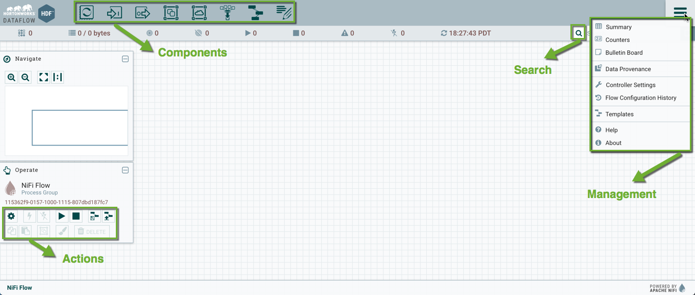
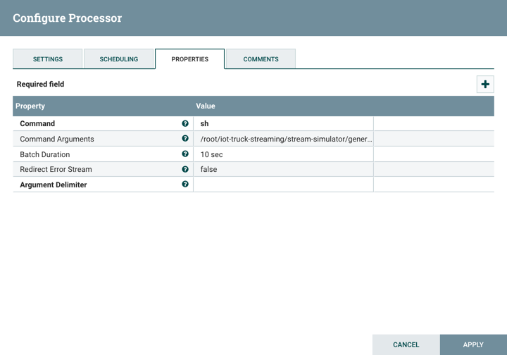
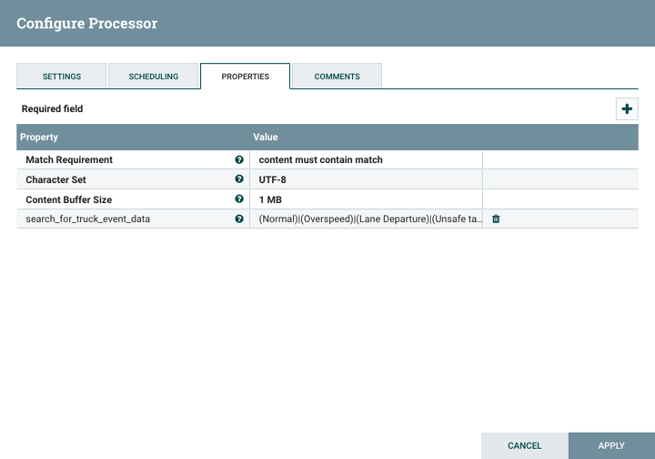
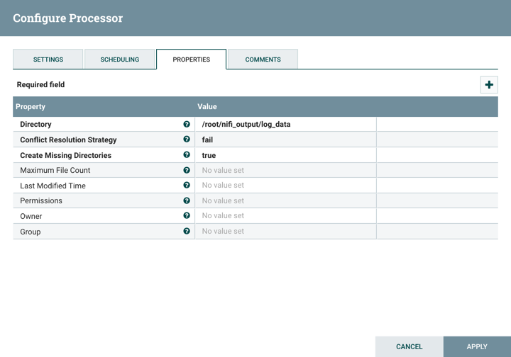
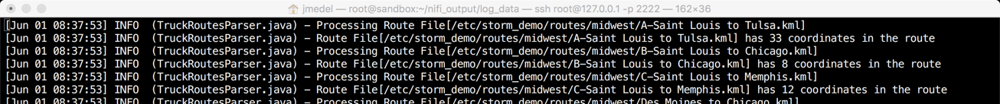
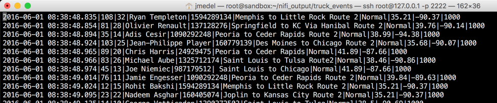

# Tutorial 1: Ingest, Route and Land Real Time Events with Apache NiFi

## Introduction

Apache NiFi can collect and transport data from numerous sources and provide interactive command and control of live flows with full and automated data provenance. We will install NiFi onto our Hortonworks Sandbox and become familiar with the NiFi Web Interface. We will create a flow of data using Hortonworks DataFlow to activate the truck stream simulator to generate truck data, remove the log data, extract the live truck events data and store the events into a file. We will use a file to verify that the correct data is being inserted into the file.

## Prerequisites
- Tutorial 0: Set Up Simulator, Apache Services and IDE Environment
- Downloaded and Installed latest [Hortonworks Sandbox](https://hortonworks.com/products/hortonworks-sandbox/#install)
- If you are new to the sandbox shell, refer to [Learning the Ropes of the Hortonworks Sandbox](https://hortonworks.com/hadoop-tutorial/learning-the-ropes-of-the-hortonworks-sandbox/)

## Outline
- [Apache NiFi](#apache-nifi-lab0)
- [Step 1: Explore NiFi Web Interface](#step1-explore-nifi-interface-lab0)
- [Step 2: Understand NiFi DataFlow Build Process](#step2-create-nifi-dataflow-lab0)
- [Step 3: Build Stream Simulator DataFlow Section](#step3-build-stream-simulator-dataflow-lab0)
- [Step 4: Build Filter Logs & Enrich TruckEvents DataFlow Section](#step4-build-filter-logs-enrich-truckevents-lab0)
- [Step 5: Run NiFi DataFlow](#run-nifi-dataflow-lab0)
- [Summary](#summary-lab0)
- [Further Reading](#further-reading-lab0)

## Tutorial Overview
- Understand the Stream Simulator
- Run Stream Simulator From Terminal
- Create NiFi DataFlow to Generate and Store Truck events

## Apache NiFi 

[Apache NiFi](https://nifi.apache.org/docs/nifi-docs/html/overview.html#what-is-apache-nifi) is an open source tool for automating and managing the flow of data between systems. To create an effective dataflow, users must understand the various types of processors . This tool is the most important building block available to NiFi because it enables NiFi to perform:

- Data Transformation
- Routing and Mediation
- Database Access
- Attribute Extraction
- System Interaction
- Data Ingestion
- Data Egress/Sending Data
- Splitting and Aggregation
- HTTP
- Amazon Web Services

NiFi is designed to help tackle modern dataflow challenges, such as system failure, data access exceeds capacity to consume, boundary conditions are mere suggestions, systems evolve at different rates, compliance and security.

## Step 1: Explore NiFi Web Interface 

NiFi’s web interface consists of 5 components to build data flows: The **components** toolbar, the **actions** toolbar, the **management** toolbar, the **search** bar and the **help** button. View the image below for a visualization of the user interface for orchestrating a dataflow. Near the top of the UI are multiple toolbars essential for building dataflows.

## Step 2: Understand NiFi DataFlow Build Process 

We can begin to build a data flow by adding, configuring and connecting the processors. We will also troubleshoot common problems that occur when creating data flows.
By the end of the IoT Tutorial Series, you will have built the following dataflow. Refer back to this image if you want to replicate the processors positions on the graph:

**Figure 1:** This [IoT_Lab_Series_DataFlow.xml](https://raw.githubusercontent.com/james94/tutorials/hdp/assets/realtime-event-processing-with-hdf/IoT_Lab_Series_DataFlow.xml) dataflow performs System Interaction, Splitting and Aggregation, Attribute Extraction, Routing and Mediation and Data Egress/Sending Data.

### 2.1 Download, Import and Drop the Template onto the Graph (Optional)

If you want to view and run the dataflow from the template, follow the steps below, else skip these two steps and move forward.

1\. To open the template xml in NiFi, hover over to the management toolbar and click on the template icon . Click on the Browse button and find the dataflow xml file that you downloaded and click open. The template should appear in your NiFi Flow Templates spreadsheet.

2\. To display your dataflow template xml onto the screen, drag the template icon from the components toolbar onto the graph. The dataflow should appear as in the dataflow image above, except this dataflow will be missing the PutKafka processor. We will add it in the next tutorial.

### 2.2 Overiew of Processors in NiFi DataFlow

Eight processors are needed to ingest, filter and store live stream data relating to truck events into your dataflow. Each processor holds a critical role in transporting the enriched data to a destination:

[ExecuteProcess](https://nifi.apache.org/docs/nifi-docs/components/org.apache.nifi.processors.standard.ExecuteProcess/index.html) Runs the operating system command to activate the stream simulator and the StdOut is redirected such that the content is written to StdOut becomes the content of the outbound FlowFile.

[SplitText](https://nifi.apache.org/docs/nifi-docs/components/org.apache.nifi.processors.standard.SplitText/index.html) takes in one FlowFile whose content is textual and splits it into 1 or more FlowFiles based on the configured number of lines. Each FlowFile is 1 line.

[UpdateAttribute](https://nifi.apache.org/docs/nifi-docs/components/org.apache.nifi.processors.attributes.UpdateAttribute/index.html) updates each FlowFile with a unique attribute name. ${UUID()}.

[RouteOnContent](https://nifi.apache.org/docs/nifi-docs/components/org.apache.nifi.processors.standard.RouteOnContent/index.html) search content of the FlowFile to see if it matches the regex regular expression, such as (Normal), (Overspeed), (“Lane Departure”). The expressions are driving event keywords. If so, the Flowfile is routed to the processor with the configured relationship.

[MergeContent(x2)](https://nifi.apache.org/docs/nifi-docs/components/org.apache.nifi.processors.standard.MergeContent/index.html) merges many FlowFiles into a single FlowFile. In the tutorial, each FlowFile is merged by concatenating their content together. There will be two processors: one of them will merge all the truck events into a single FlowFile while the other merges all the log data together.

[PutFile(x2)](https://nifi.apache.org/docs/nifi-docs/components/org.apache.nifi.processors.standard.PutFile/index.html) writes the contents of a FlowFile to a directory on a local file system. There will be two processors: one that writes the filtered logs data to log_data folder. The other that writes the filtered truck event data to truck_events folder.

### 2.3 Troubleshoot Common Processor Issues

You will notice each time you add a new processor, it will have a warning symbol  in the upper left corner of the processor face. These warning symbols indicate the processors are invalid.

1\. Hover over one of the processors to troubleshoot the issue. This message informs us of the requirements to make a processor valid, such as the ExecuteProcess.

The warning message indicates: we need to enter a command into the value field of the **property** command since it is empty and connect this processor to another component to establish a relationship.
Each Processor will have its own alert message. Let’s configure and connect each processor to remove all the warning messages, so we can have a complete data flow.

### 2.4 Add, Configure & Connect processors

We will build our NiFi DataFlow by adding, configuring and connecting processors. When adding processors, you have three ways to find your desired processor from the **Add Processor** window: **Tags** section left of the table, **Processor List** located in the table and **filter bar** positioned above the table. After we add our processor, we can configure it from the Configure Processor window using the 4 tabs: **Settings**, **Scheduling**, **Properties** and **Commands**. For this tutorial, we will spend most of our time in the properties tab. The properties in **bold** must contain default or updated values for the processor to run. If you are curious to learn more about a specific property, hover over the help icon next to the Property Name to read a description on that property. Every processor has a relationship on how it transfers data to the next processor, another word for this is connection. Relationships affect how data is transferred between processors. For instance, you can have a **split** relationship that when true transfer a bunch of FlowFiles that were split from one large FlowFile to the next processor.

If you would like to read more about configuring and connecting processors, refer to [Hortonworks Apache NiFi User Guide](https://docs.hortonworks.com/HDPDocuments/HDF2/HDF-2.0.0/bk_user-guide/content/index.html), Building a DataFlow: section 6.2 and 6.5.

## Step 3: Build Stream Simulator DataFlow Section 

### 3.1 ExecuteProcess

1\. Drag and drop the processor icon onto the graph. Add the **ExecuteProcess** processor. Click the **Add** button.

2\. Right click on ExecuteProcess processor and click the **Configure** button. Move to the **Properties** tab. Add the properties listed in Table 1 to the processor's appropriate properties and if their original properties already have values, update them.

**Table 1:** Update ExecuteProcess Property Values

| Property  | Value  |
|---|---|
| **Command**  | **sh**  |
| Command Arguments  | `/root/iot-truck-streaming/stream-simulator/generate.sh`  |
| Batch Duration  | 10 sec  |

**Command** instructs processor on what type of command to run
**Command Arguments** inform processor which particular directory to look for script files
**Batch Duration** instructs processor to run a task every 10 seconds

**Figure 1:** ExecuteProcess Configuration Property Tab Window

3\. Move to the **Scheduling** tab. Modify the **Run Schedule** field from 0 sec to `1 sec`, which makes the processor every 1 second. Click **Apply**.

### 3.2 SplitText

1\. Add the **SplitText** processor below ExecuteProcess. Connect ExecuteProcess to SplitText processor. When the Create Connection window appears, verify **success** checkbox is checked, if not check it. Click **Add**.

2\. Open SplitText **Properties Tab**, add the properties listed in Table 2 to the processor's appropriate properties and if their original properties already have values, update them.

**Table 2:** Update SplitText Property Values

| Property  | Value  |
|---|---|
| **Line Split Count**  | **1**  |
| **Remove Trailing Newlines**  | **false**  |

**Line Split Count** adds 1 line to each split FlowFile
**Remove Trailing Newlines** controls whether newlines are removed at the end of each split file. With the value set to false, newlines are not removed.

**Figure 2:** SplitText Configuration Property Tab Window

3\. Move to the **Settings** tab. Check the **failure** and **original** checkbox under **Auto terminate relationships**. Click the **Apply** button.

### 3.3 UpdateAttribute

1\. Add the **UpdateAttribute** processor below SplitText. Connect SplitText to UpdateAttribute processor. When the Create Connection window appears, verify **splits** checkbox is checked, if not check it. Click **Add**.

2\. Open SplitText **Properties Tab**, add a new dynamic property for NiFi expression, select the **New property** button. Insert the following property name and value into your properties tab as shown in Table 3 below:

**Table 3:** Update UpdateAttribute Property Value

| Property  | Value  |
|---|---|
| filename  | `{UUID()}`  |

**filename** uses NiFi Expression language to assign each FlowFile a unique name

3\. Click **Apply**.

## Step 4: Build Filter Logs & Enrich TruckEvents DataFlow Section 

### 4.1 RouteOnContent

1\. Add the **RouteOnContent** processor onto the right of the ExecuteProcess. Connect the UpdateAttribute processor to RouteOnContent. In the Create Connection window, check the **success** checkbox for the relationship.

2\. Open RouteOnContent **Properties Tab**, add the properties listed in Table 4 to the processor's appropriate properties and if their original properties already have values, update them. For the second property and onward, add a new dynamic property for NiFi expression, select the **New property** button. Insert the following property name and value, refer to Table 4.

**Table 4:** Update RouteOnContent Property Values

| Property  | Value  |
|---|---|
| **Match Requirement**  | `content must contain match`  |
| search_for_truck_event_data  | `(Normal)|(Overspeed)|(Lane Departure)|(Unsafe tail distance)|(Unsafe following distance)`  |

**Match Requirements** specifies condition for FlowFile to be transferred to next processor
**search_for_truck_event_data** is Regex Expression that searches each FlowFile for the truck event keywords

**Figure 3:** RouteOnContent Configuration Property Tab Window

3\. Click **OK**. Move to the **Settings** tab, under Auto terminate relationships, check the **unmatched** checkbox. Click **Apply**.

### 4.2 MergeContent(truck_events)

1\. Add the **MergeContent** processor below RouteOnContent. Connect the RouteOnContent processor to this MergeContent processor. In the Create Connection window, check the **search_for_truck_event_data** checkbox for the relationship. All the FlowFiles sent to this processor are truck events.

2\. Open MergeContent **Properties Tab**. Add the properties listed in Table 5 and if their original properties already have values, update them.

**Table 5:** Update MergeContent(truck_events) Property Values

| Property  | Value  |
|---|---|
| **Minimum Number of Entries**  | **50**  |
| Maximum Number of Entries  | 70  |

**Minimum Number of Entries** specifies minimum amount of FlowFiles to gather at the queue before FlowFiles merge together
**Maximum Number of Entries** specifies maximum amount of FlowFiles to gather at the queue before FlowFiles merge together

**Figure 4:** MergeContent(truck_events) Configuration Property Tab Window

3\. Navigate to the **Settings** tab, rename the processor: `MergeContent(truck_events)`. Under Auto terminate relationships, check the **failure** and **original** checkboxes. Click **Apply**.

### 4.3 MergeContent(logs)

1\. Right click the MergeContent processor created in the previous step and copy it.  Move the mouse slightly to the right of MergeContent(truck_events) processor and paste it. Connect the RouteOnContent processor to this new MergeContent processor. In the Create Connection window, check the **unmatched** checkbox for the relationship. All the FlowFiles sent to this processor are logs and data we don’t want kafka to receive.

2\. Open configure **Settings** tab, and rename the processor `MergeContent(logs)`. Click **Apply**.

### 4.4 PutFile(truck_events)

1\. Add the **PutFile** processor below MergeContent slightly to the left. Connect the MergeContent(truck_events) to this new PutFile processor. In the Create Connection window, check the **merged** checkbox for the relationship. All the FlowFiles sent to this processor are truck event data we do want kafka to receive.

2\. Open PutFile **Properties Tab**. Add the properties listed in Table 6 and if their original properties already have values, update them.

**Table 6:** Update PutFile(truck_events) Property Values

| Property  | Value  |
|---|---|
| **Directory**  | `/root/nifi_output/truck_events`  |

**Directory** instructs processor which directory to store the output data files

**Figure 5:** PutFile(truck_events) Configuration Property Tab Window

3\. Open configure **Settings** tab, and rename the processor `PutFile(truck_events)`. Then check the **failure** and **success** checkbox below the Auto terminated relationships. Click **Apply**.

### 4.5 PutFile(logs)

1\. Right click the PutFile(truck_events) processor created in the previous step and copy it. Move the mouse slightly above MergeContent(logs) processor and paste it. Connect the MergeContent(logs) to this new PutFile processor. In the Create Connection window, check the **merged** checkbox for the relationship. All the FlowFiles sent to this processor are logs and data we don’t want kafka to receive.

2\. Open PutFile **Properties Tab**. Add the properties listed in Table 7 and if their original properties already have values, update them.

Table 7: Update PutFile(logs) Property Values

| Property  | Value  |
|---|---|
| **Directory**  | `/root/nifi_output/log_data`  |

**Figure 6:** PutFile(logs) Configuration Property Tab Window

3\. Open configure **Settings** tab, and rename the processor `PutFile(log)`. Click **Apply**.

We added, configured and connected all processors, your NiFi DataFlow should look similar as below:

## Step 5: Run NiFi DataFlow 

1\. The processors are valid since the warning symbols disappeared. Notice the processors have a stop symbol  in the upper left corner and are ready to run. To select all processors, hold down the shift-key and drag your mouse across the entire data flow. This step is important if you have different dataflows on the same graph.

2\. Now all processors are selected, go to the actions toolbar and click the start button . Your screen should look like the following:

Note: To run the DataFlow again, you will need to copy & paste the ExecuteProcess processor onto the graph, then delete the old one, and connect the new one to the splittext processor. You will need to repeat this process each time you want to run the DataFlow. This step will ensure dataflow flows through each processor. Currently,the ExecuteProcess processor is getting a patch to fix this problem.

3\. To quickly see what the processors are doing and the information on their faces, right click on the graph, click the **refresh status** button 

> Note: On each processor face, the In, Read/Write and Out all have data increasing.

### 5.1 Check Data Stored In Correct Directory

To check that the log and truck event data were written to the correct directory, wait 20 seconds, then open your terminal and navigate to their appropriate directories. Make sure to SSH into your sandbox.

### 5.2 Verify Logs Stored In log_data Directory

1\. Navigate to through directory path: `/root/nifi_output/log_data`, view the files and open two random files to verify only log data is being sent to this directory.

~~~
cd /root/nifi_output/nifi_output/log_data
ls
cat 28863080789498
~~~

Once the file is opened, you should obtain similar output as below:

### 5.3 Verify Events Stored In truck_events Directory

1\. Navigate to truck events directory: `/root/nifi_output/truck_events`, view the files. Open two random file to verify only event data is being sent to this directory.

~~~
cd /root/nifi_output/truck_events
ls
cat 28918091050702
~~~

Once the file is opened, you should obtain similar output as below:

## Summary 

Congratulations! You made it to the end of the tutorial and built a NiFi DataFlow that reads in a simulated stream of data, filters truck events from log data, stores the truck event data into a specific directory and writes that data to a file. You also learned how to use Apache Maven to package and compile code in order to run the simulator through the shell or by NiFi. You even explored troubleshooting common issues that occur when creating a flow of data. If you are interested in learning to integrate NiFi with other technologies, such as Kafka continue onto our next lab in the IoT tutorial series.

## Further Reading 

- [Apache NiFi Documentation](https://nifi.apache.org/docs.html)
- [Hortonworks DataFlow Documentation](https://docs.hortonworks.com/HDPDocuments/HDF2/HDF-2.0.0/bk_user-guide/content/index.html)
- [Apache NiFi Video Tutorials](https://nifi.apache.org/videos.html)
- [Apache Maven Documentation](https://maven.apache.org/)
- [Regex Expression Language](http://regexr.com/)
