# Real-Time Event Processing In NiFi, SAM, Schema Registry and SuperSet (Mac/Linux)

> This tutorial is tailored for the MAC and Linux OS user.

## Introduction

In this tutorial, you will learn how to build the Stream Analytics Manager (SAM) Topology in visual canvas. You will create schemas in the Schema Registry, which SAM and NiFi rely on to pull data into the flow. Once SAM Topology is deployed, you will learn to create different visualization slices with SuperSet running on top of Druid.

## Prerequisites

- [Downloaded HDF 3.0 Sandbox](https://hortonworks.com/downloads/#sandbox)
- [Deployed and Installed HDF 3.0 Sandbox](https://hortonworks.com/tutorial/sandbox-deployment-and-install-guide/)
- 4 cores/ 8GB RAM for the VM or Container environment

1\. On your local machine, update the `/private/etc/hosts` file with the following value: `sandbox-hdf.hortonworks.com` and remove the "#" hash symbol:

~~~bash
127.0.0.1   localhost   sandbox-hdf.hortonworks.com
~~~

2\. Download SAM Demo Dependencies onto your local machine.

~~~bash
cd ~/Downloads
wget https://github.com/hortonworks/data-tutorials/raw/master/tutorials/hdf/realtime-event-processing-in-nifi-sam-sr-superset/assets/templates.zip
unzip templates.zip
~~~

This templates folder includes the NiFi flow, SAM topology, SAM custom UDF and Schemas for Schema Registry.

**Setup HDF to Run SAM Demo**

1\. Login to the Ambari UI at `http://sandbox-hdf.hortonworks.com:9080` using `admin/admin`.

2\. In the left hand sidebar, select "Streaming Analytics Manager (SAM)," Summary tab appears, click on "Service Actions", click on the "Start" button and turn off "maintenance mode".

3\. Open your terminal on your host machine. SSH into the HDF sandbox. The "bootstrap-storage.sh drop-create" command resets the tables in mysql to store SAM metadata. "bootstrap.sh pulls" creates SAM (streamline) default components, notifiers, udfs and roles. Run the commands:

~~~bash
ssh root@localhost -p 12222
cd /usr/hdf/current/streamline
./bootstrap/bootstrap-storage.sh drop-create
./bootstrap/bootstrap.sh
~~~

4\. Go to SAM Service in the the left hand sidebar of Ambari Dashboard. Then
click on "Config" -> "Streamline Config". Search "registry.url" in the filter box, then enter "registry.url" field:
`http://sandbox-hdf.hortonworks.com:17788/api/v1`.

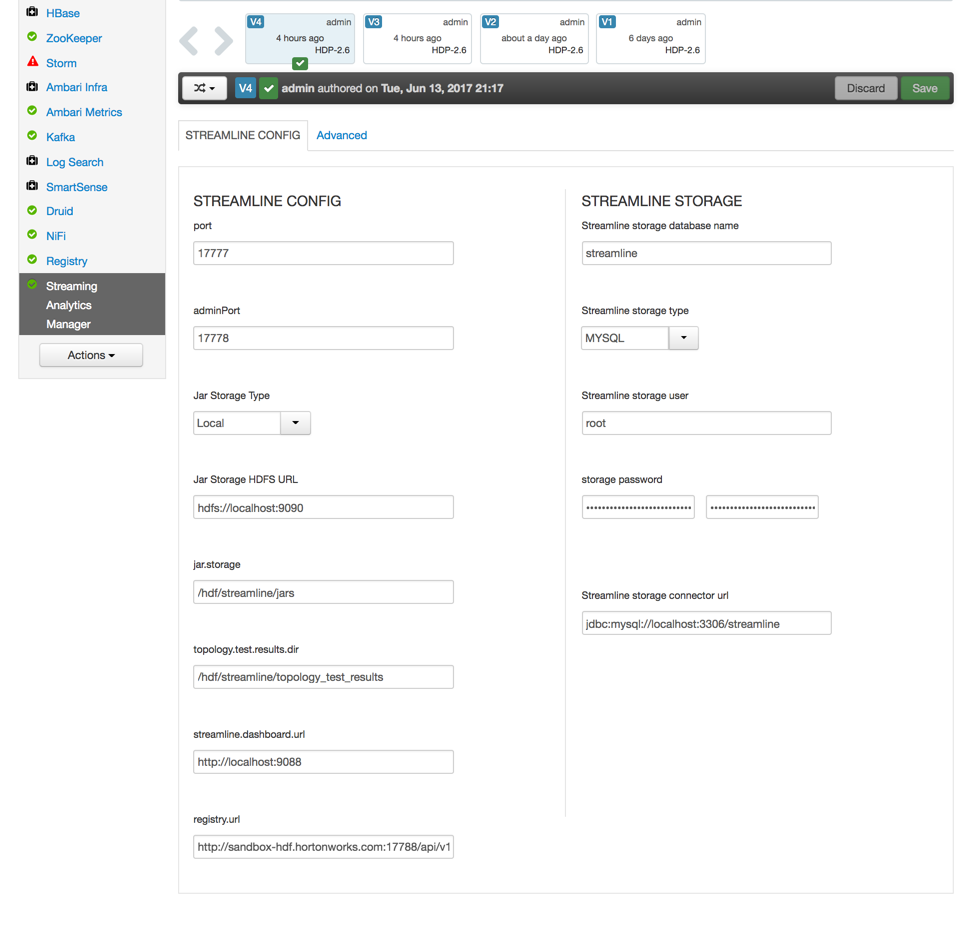

Then save the configuration and call it "updated registry.url". Restart SAM service.

5\. Go to Druid Service, "Config", "Advanced" to update directories, so Druid can write to them. In the search box, type **druid.indexer.logs.directory**. Update this config with `/home/druid/logs`.

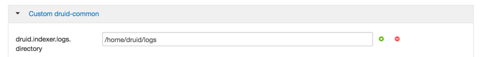

6\. Search for **druid.storage.storageDirectory** and update the config with `/home/druid/data`.

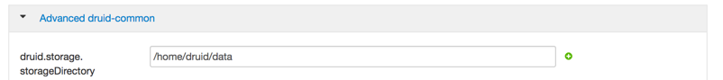

Once both configs have been updated, save the configuration and call it: "updated directories, so druid can write to them".

7\. From the left hand sidebar, choose HDFS and start the service like you did with SAM earlier.

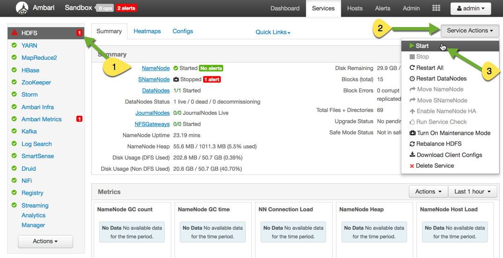

8\. Start **Storm, Ambari Metrics, Kafka, Druid, Registry** and **Streaming Analytics Manager (SAM)** the same way you started HDFS.

## Outline

- [Concepts](#concepts)
- [Step 1: Add MAPBox API Key to Druid Service](#step1)
- [Step 2: Check Kafka Truck Topics Are Created](#step2)
- [Step 3: Create Truck Schemas in Schema Registry](#step3)
- [Step 4: Deploy NiFi Flow to GeoEnrich Kafka Data](#step4)
- [Step 5: Deploy SAM Topology to Preprocess Data for Druid SuperSet](#step5)
- [Step 6: Execute Data-Loader on the App](#step6)
- [Step 7: Create a SuperSet Dashboard with Slices](#step7)
- [Summary](#summary)
- [Further Reading](#further-reading)
- [Appendix: Troubleshoot Real-time Event Processing Demo](#appendix)

### Concepts

### SuperSet

SuperSet is a visual, intuitive and interactive data exploration platform. This platform offers a fast way to create and share dashboards with friends and business clients of your visualized datasets. Various visualization options are available to analyze the data and interpret it. The Semantic Layer allows users to control how the data stores are displayed in the UI. The model is secure and allows users to intricate rules in which only certain features are accessible by select individuals. SuperSet can be integrated with Druid or other data stores (SQLAlchemy, Python ORM, etc) of the user's choice offering flexibility to be compatible with multiple systems.

### Druid

Druid is an open source analytics database developed for business intelligence queries on data. Druid provides data ingestion is in real-time with low latency, flexible data exploration and quick aggregation. Deployments often reach out to trillions of event in relation to numerous petabytes of data.

### Stream Analytics Manager (SAM)

Stream Analytics Manager is a drag and drop program that enables stream processing developers to build data topologies within minutes compared to traditional practice of writing several lines of code. Now users can configure and optimize how they want each component or processor to perform computations on the data. They can perform windowing, joining multiple streams together and other data manipulation. SAM currently supports the stream processing engine known as Apache Storm, but it will later support other engines such as Spark and Flink. At that time, it will be the users choice on which stream processing engine they want to choose.

### Schema Registry

Schema Registry (SR) stores and retrieves Avro Schemas via RESTful interface. SR stores a version history containing all schemas. Serializers are provided to plug into Kafka clients that are responsible for schema storage and retrieve Kafka messages sent in Avro format.

### Step 1: Add MapBox API Key to Druid Service

Mapbox is a service that allows you to create map visualizations of the data and we will use it in SuperSet. In order to use Mapbox’s map visualization feature in SuperSet, you need to add the MapBox API Key as a Druid Configuration.

1\. To get the API key, go to `mapbox.com`, create an account. Then you will
select Mapbox Studio -> "My Access Tokens" -> "Create a new token" -> name it
`DruidSuperSetToken` and keep the defaults.

**Mapbox Studio**

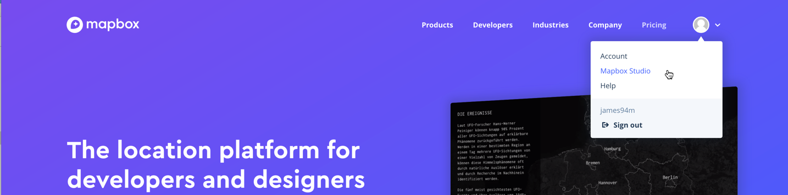

**My access tokens**

**Create a new token: DruidSuperSetToken**

- Leave default parameters and name the token: `DruidSuperSetToken`.

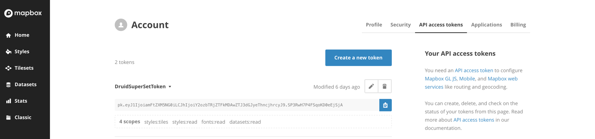

2\. From Ambari Druid Service, click Config -> Advanced -> In the filter field, search for: `MAPBOX_API_KEY`
and this property will appear. Update the **MAPBOX_API_KEY** with the one you obtained from mapbox.com.

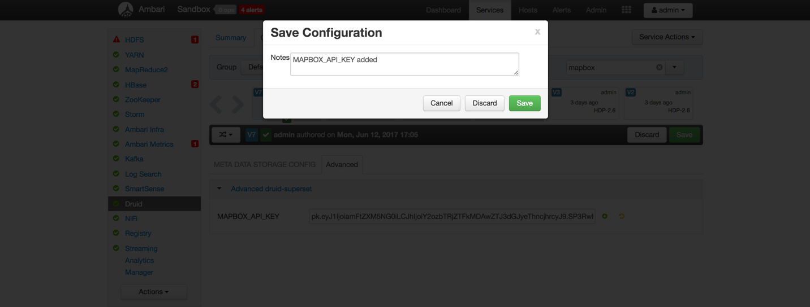

- Click on Save, Enter into Save Configuration: `MAPBOX_API_KEY added`, then press Save again. Proceed Anyway.

3\. Restart **Druid SuperSet** Component.

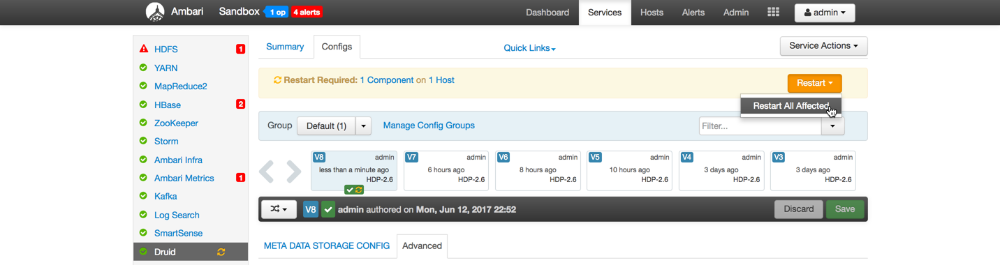

### Step 2: Check Kafka Truck Topics Are Created

1\. Switch to user hdfs and create directories and give permissions to all users, so SAM can write data to all those directories.

~~~bash
su hdfs
hdfs dfs -mkdir /apps/trucking-app
hdfs dfs -chmod 777 /apps/trucking-app
cd /usr/hdp/current/kafka-broker/bin/
./kafka-topics.sh --list --zookeeper sandbox-hdf.hortonworks.com:2181
~~~

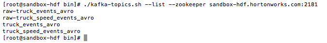

### Step 3: Create Truck Schemas in Schema Registry

Access Schema Registry at `sandbox-hdf.hortonworks.com:17788` or through Ambari Quick Links "Registry UI". Create 4 Truck Schemas.

1\. Click on "+" button to add new schemas. A window called "Add New Schema" will appear.

2\. Add the following characteristics to the New Schema (first schema) with the information from **Table 1**.

**Table 1**: raw-truck_events_avro Schema

|Property | Value |
|:--:|:--:|
| Name     | raw-truck_events_avro     |
| Desc       | Raw Geo events from trucks in Kafka Topic       |
| Group | truck-sensors-kafka |
| Browse File | raw-truck_events_avro.avsc |

**Browse File**: go into the "templates" folder downloaded from earlier and it will have all the Schema templates in the "Schema" folder.

Once the schema information fields have been filled and template uploaded, click **Save**.

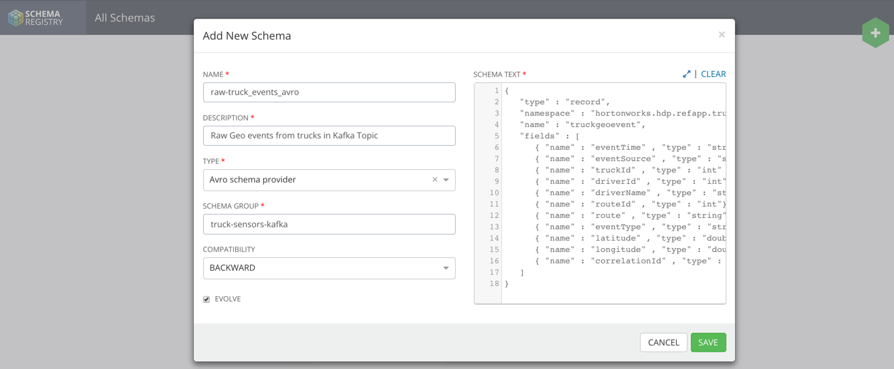

> Note: Groups are like logical group. A way for app developers to pull Schema from the same overall schema registry and group them under a name related to their project.

3\. Add the **second new schema** with the information from **Table 2**.

**Table 2**: raw-truck_speed_events_avro Schema

|Property | Value |
|:--:|:--:|
| Name     | raw-truck_speed_events_avro     |
| Desc     | Raw Speed Events from trucks in Kafka Topic     |
| Group | truck-sensors-kafka |
| Browse File | raw-truck_speed_events_avro.avsc |

Once the schema information fields have been filled and template uploaded, click **Save**.

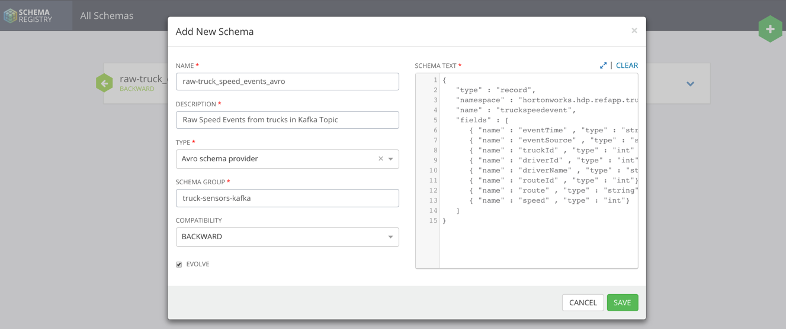

4\. Add the **third new schema** with the information from **Table 3**.

**Table 3**: truck_events_avro Schema

|Property | Value |
|:--:|:--:|
| Name     | truck_events_avro     |
| Desc | Schema for the kafka topic named 'truck_events_avro' |
| Group | truck-sensors-kafka |
| Browse File | truck_events_avro.avsc |

Once the schema information fields have been filled and template uploaded, click **Save**.

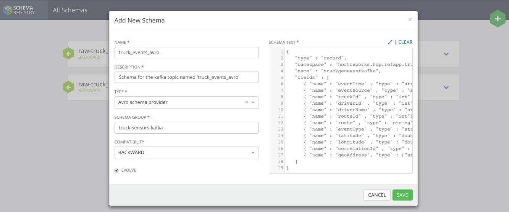

5\. Add the **fourth schema** with the information from **Table 4**.

**Table 4**: truck_speed_events_avro Schema

|Property | Value |
|:--:|:--:|
| Name | truck_speed_events_avro |
| Desc | Schema for the kafka topic named 'truck_speed_events_avro' |
| Group | truck-sensors-kafka |
| Browse File | truck_speed_events_avro.avsc |

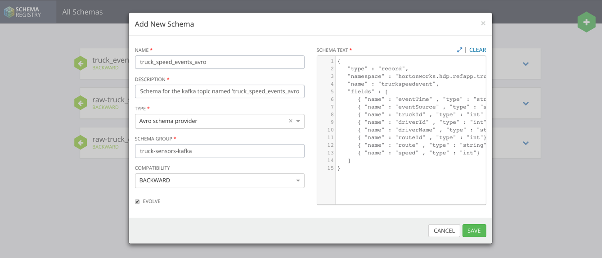

Click **Save**.

### Step 4: Deploy NiFi Flow to GeoEnrich Kafka Data

1\. Launch NiFi "Quick Link" from Ambari NiFi Service Summary window or open NiFi UI at `http://sandbox-hdf.hortonworks.com:19090/nifi`.

2\. Use NiFi upload template button in the "Operate panel" to upload `Nifi_and_Schema_Registry_Integration.xml` found in the "templates" -> "nifi" folder downloaded from earlier.

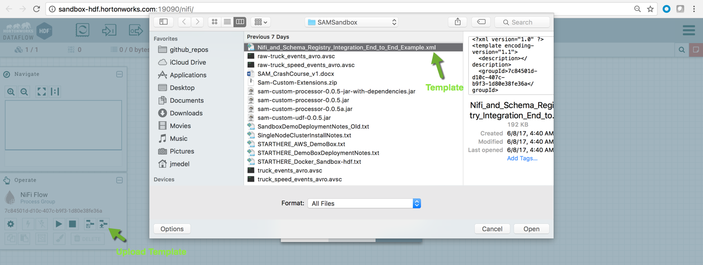

3\. Drag the template icon onto the canvas from the "components toolbar" and add the template just uploaded.

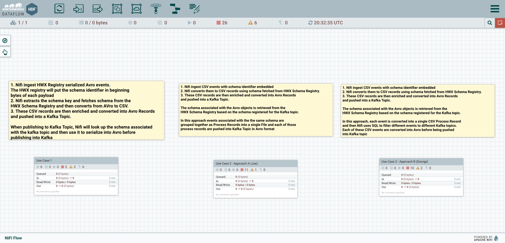

4\. Click on the gear in the left corner of the "Operate panel", then open the "Controller Services" tab.

5\. Check "HWX Schema Registry" service. Verify the Schema Registry REST API URL points to the appropriate Schema Registry port running on your HDF 3.0 Sandbox. It should be `http://sandbox-hdf.hortonworks.com:17788/api/v1`.

6\. Verify the "HWX Schema Registry" service is enabled. Verify all other referencing services dependent on "HWX Schema Registry" are enabled. If they are not enabled as shown below, click on the **Lightning Bolt** symbol to enable them.

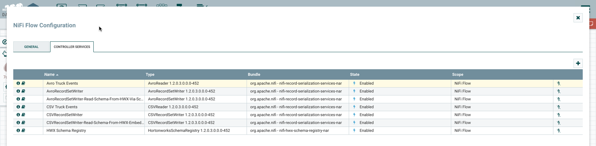

7\. From the root level of the NiFi flow as can be seen in the bottom left corner "NiFi Flow", **Start the NiFi flow**. Right click on "Use Case 1" Process Group and select "Start". It won't start populating with data until the "Data-Loader" executes.

### Step 5: Deploy SAM Topology to Preprocess Data for Druid SuperSet

1\. Launch Streaming Analytics Manager (SAM) "Quick Link" from Ambari SAM Service Summary window or open SAM UI at `http://sandbox-hdf.hortonworks.com:17777/`.

2\. In the left corner, click on Tool "Configuration" -> Select "Service Pool" Link

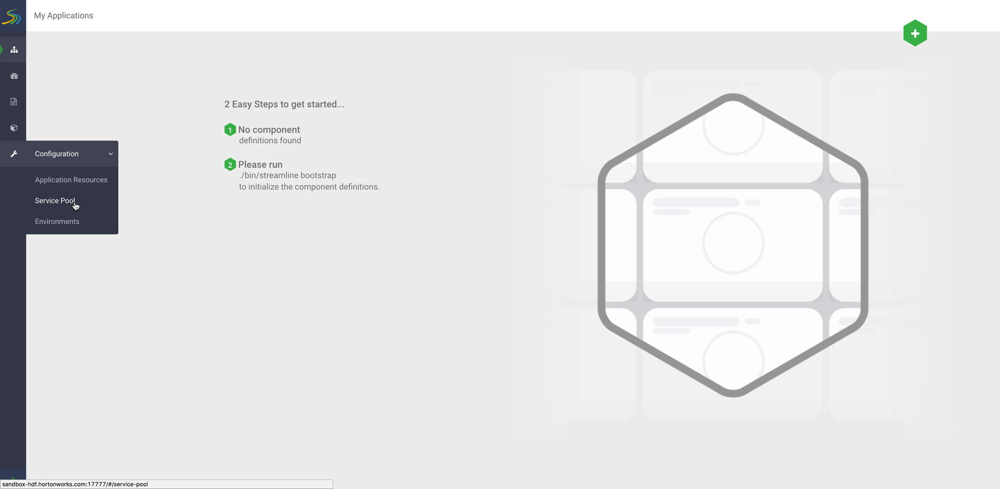

3\. Insert Ambari API URL: http://sandbox-hdf.hortonworks.com:8080/api/v1/clusters/Sandbox

4\. Login with username/password: `admin / admin`

- **Point SAM Service Pool to Ambari API URL**

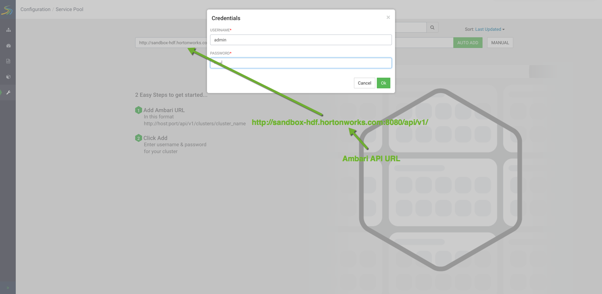

- **SAM Cluster Created**

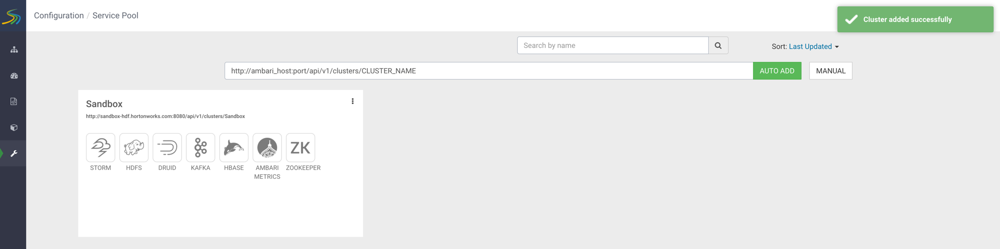

5\. Click on the SAM Logo top left corner to return to home screen.

6\. Click on Tool "Configuration" -> Click on "Environments". Click on the "+" button to add a
new environment with the following property values in regards to the table below:

Table 5: Environment metadata

| Property | Value   |
| :------------- | :------------- |
| Name   | HDF3_Docker_Sandbox    |
| Description   | SAM Environment Config    |
| Services | Include all services |

Click OK to create the Environment.

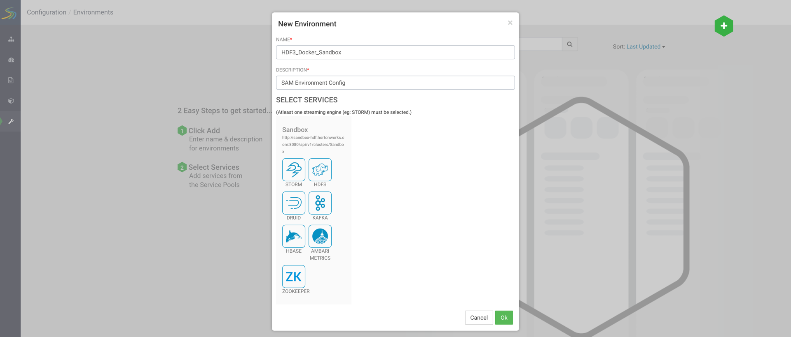

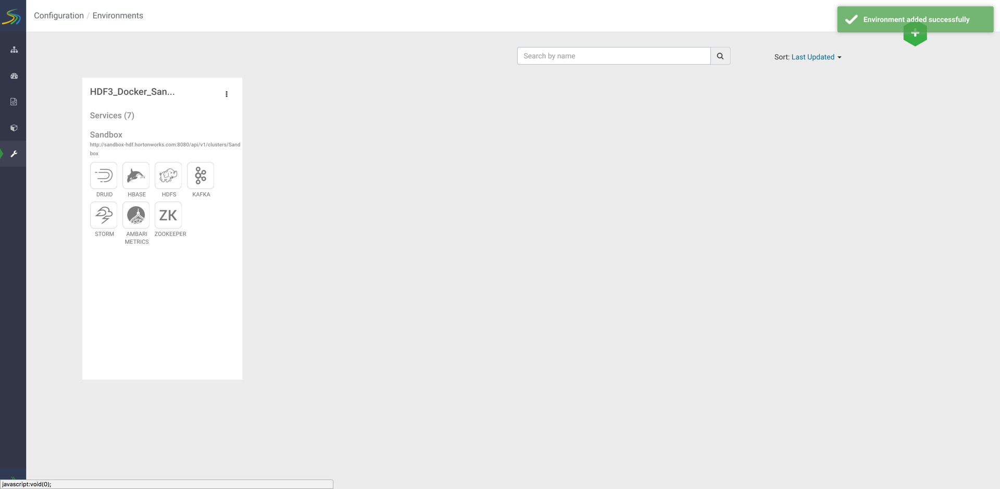

7\. Click on "Tool" icon in the left hand corner, then "Application Resources",
then press UDF tab. Click '+' to Add a new UDF. Include the following property
values in the "ADD UDF" window fields in regards to the table below, then click OK:

| Property | Value   |
| :------------- | :------------- |
| Name   | ROUND    |
| Display Name   | ROUND    |
| Description   | Rounds a double to integer    |
| Type  | FUNCTION    |
| Classname   | hortonworks.hdf.sam.custom.udf.math.Round    |
| UDF JAR  | sam-custom-udf-0.0.5.jar    |

> Note: The UDF JAR can be found in the "templates" folder inside the "sam" folder downloaded from earlier.

- **ADD New UDF**

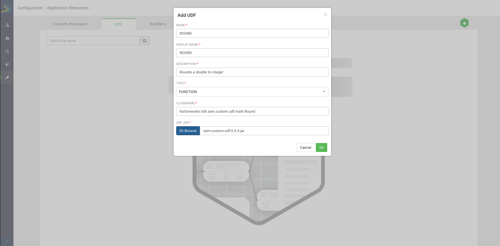

- **ROUND UDF Added**

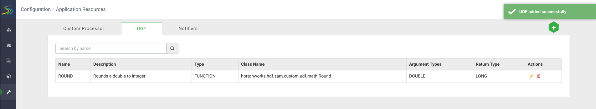

Press the SAM logo to return to the "My Application" page.

8\. Click the "+" button to add a new application. Select "Import Application". Choose "IOT-Trucking-Ref-App.json" template from the "sam" folder.

- Application Name: `IOT-Trucking-Demo`
- Environment: HDF3_Docker_Sandbox

Click **OK**.

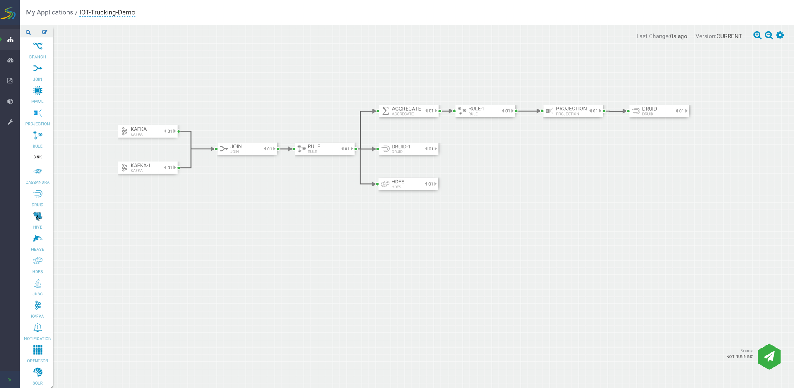

9\. From the SAM topology that appears on the canvas, verify both Kafka Sinks. Double click each one, then for "Security Protocol", verify "PLAINTEXT" is selected. The Kafka Broker URL should point to `sandbox-hdf.hortonworks.com:6667`.

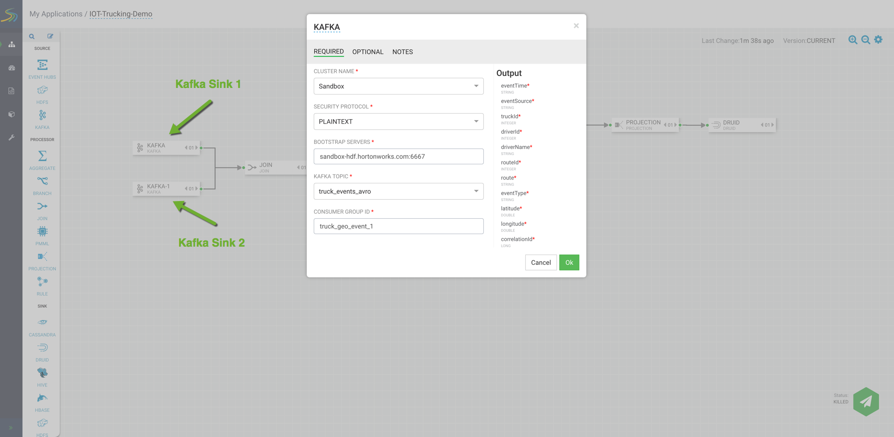

10\. Verify the Druid Sinks and verify the ZOOKEEPER CONNECT STRING URL is set to `sandbox-hdf.hortonworks.com:2181`, else update it.

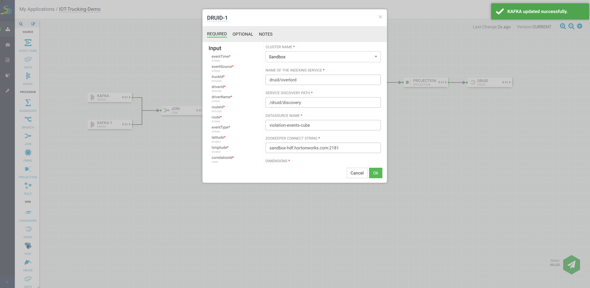

11\. Click **Run** icon in Bottom Right corner to deploy the SAM topology.

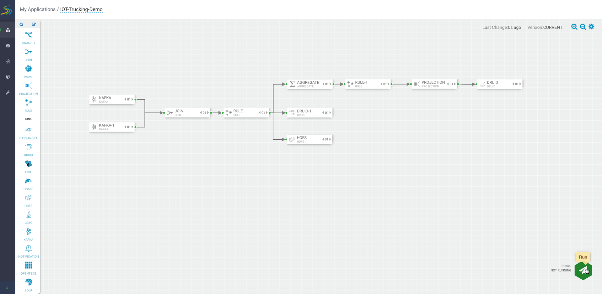

- Note: "Are you sure want to continue with this configuration?" window will appear, keep default settings and click OK.

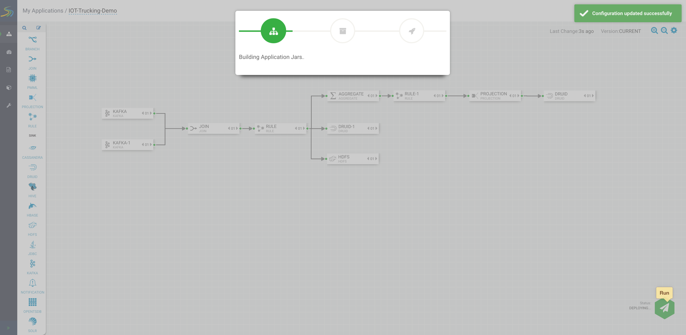

It should show the demo deployed successfully.

### Step 6: Execute Data-Loader on the App

1\. Exit from hdfs user, and then execute the Data-Loader to generate data and transport to the Kafka Topics.

~~~bash
exit
cd /root/Data-Loader
tar -zxvf routes.tar.gz
nohup java -cp /root/Data-Loader/stream-simulator-jar-with-dependencies.jar  hortonworks.hdp.refapp.trucking.simulator.SimulationRegistrySerializerRunnerApp 20000 hortonworks.hdp.refapp.trucking.simulator.impl.domain.transport.Truck  hortonworks.hdp.refapp.trucking.simulator.impl.collectors.KafkaEventSerializedWithRegistryCollector 1 /root/Data-Loader/routes/midwest/ 10000 sandbox-hdf.hortonworks.com:6667 http://sandbox-hdf.hortonworks.com:17788/api/v1 ALL_STREAMS NONSECURE &
~~~

By running the Data-Loader, data is persisted to the Kafka Topics, which NiFi and SAM pull data from.

2\. Check the nohup.out file is populated with data:

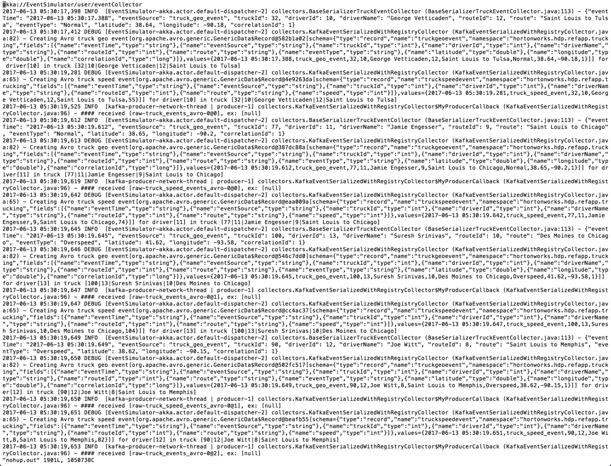

### 6.1 Verify Data Flow and Stream Processes the Data

3\. Head back to the NiFi UI. It should be pulling in Truck Events from the Kafka Consumers, else you did something wrong previously.

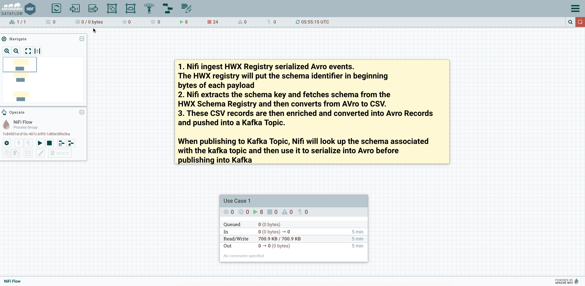

4\. Head back to the SAM UI, go to the **root level of SAM** by clicking on the **SAM
logo** in the top left corner. It will ask if you want to navigate away from the page, click **OK**. Then it
should provide an overview of the application. To see a more detailed view of
the app, click on the app.

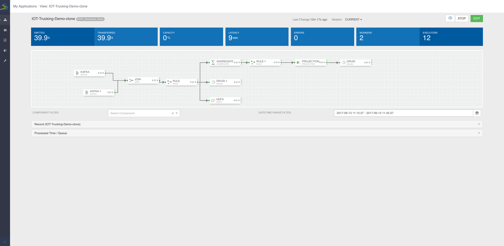

5\. Click on the Storm Monitor and verify storm is processing tuples.

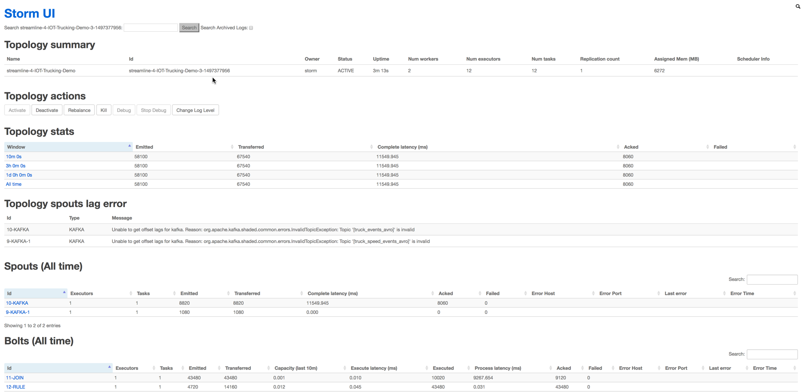

### Step 7: Create a SuperSet Dashboard with Slices

1\. From Ambari dashboard, click on Druid service, then press the "Quick Links" dropdown and select SuperSet.

2\. If you aren't logged in by default, login credentials are `admin / hadoophadoop`.

3\. Click on "Sources," then "Refresh Druid Metadata." The two Data Sources created by the SAM topology should appear within 25 minutes.

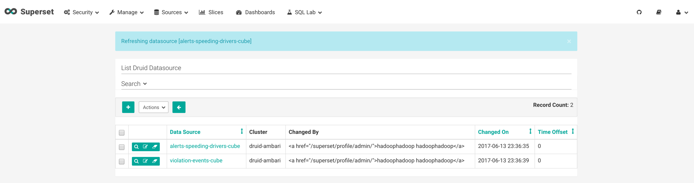

4\. Select `violation-events-cube-2` as your "Data Source" and you'll be taken
to the "Datasource & Chart Type" page in which you can create data
visualizations.

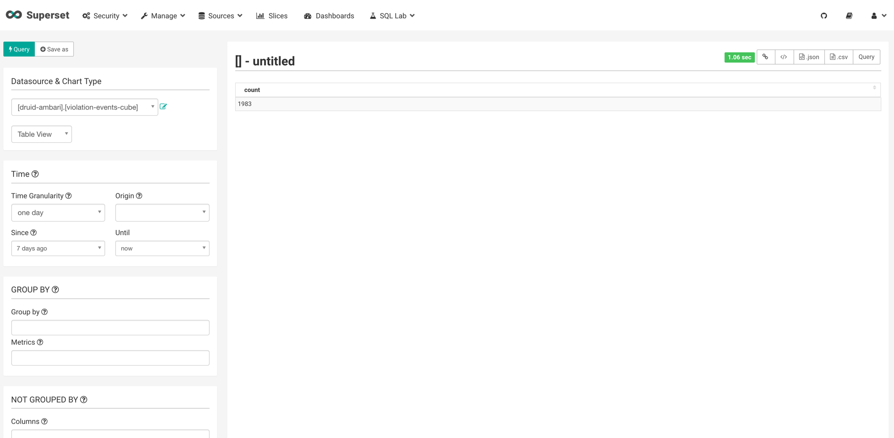

### Create a "Sunburst" DriverViolationsSunburst Visualization

1\. Under Data Source & Chart Type, click on "Table View" and set the Chart
type to `Sunburst`.

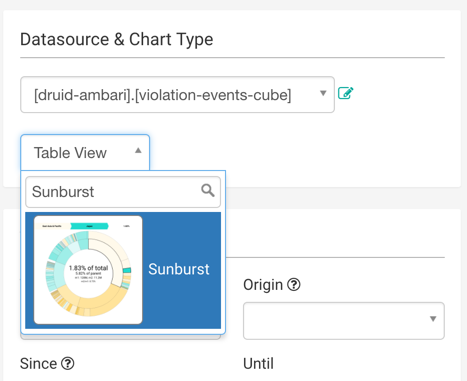

2\. Under "Time", Set "Time Granularity" to `one day`. Set "Since" to `7 days ago` and "Until" to
`now`.

3\. Set Hierarchy to `driverName, eventType`

4\. Run Query by pressing the "green query button" at the top left, check output. The Sunburst visualization takes 18.49 seconds.

5\. Click the Save as button and save with name `DriverViolationsSunburst` and add to new Dashboard `TruckDriverMonitoring`

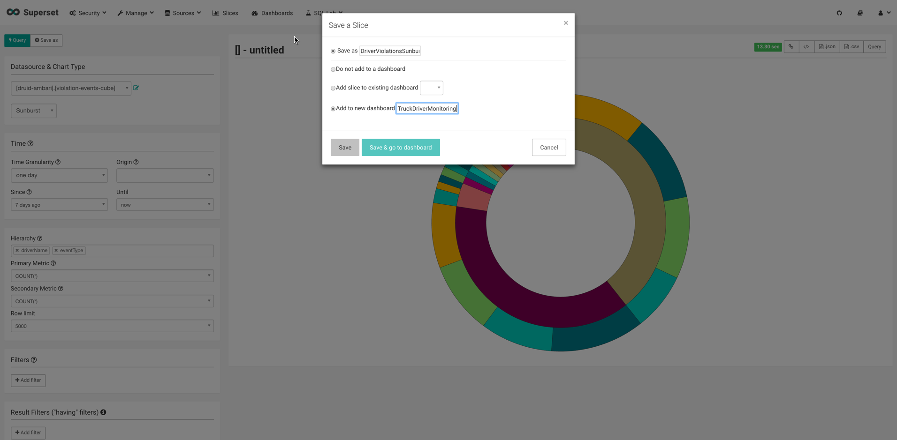

### Create a "Mapbox" DriverViolationMap Visualization

1\. For "Table View", choose `Mapbox`.

2\. Keep previous configs for **Time**.

2\. Change "Longitude" and "Latitude" to their namesake variables (Longitude and Latitude)

3\. Set "Clustering Radius" to `20`

4\. Set "GroupBy" to `latitude,longitude,route`

5\. Set "Label" to `route`

6\. Set "Map Style" to `Outdoors`

7\. Under Viewport, set "Default Long field" to `-90.1`, Lat to `38.7`, Zoom to `5.5`

8\. Run the Query.

9\. Click the "Save As" button, select "Save as" name `DriverViolationMap`, then
select "Add slice to existing dashboard" and choose from dropdown `TruckDriverMonitoring`. Hit "Save".

### Visit Your Dashboard of SuperSet Slice Visualizations

1\. Click on Dashboards tab and you will be taken to the list of Dashboards.

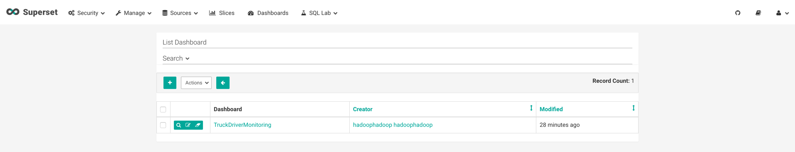

2\. Select TruckDriverMonitoring dashboard.

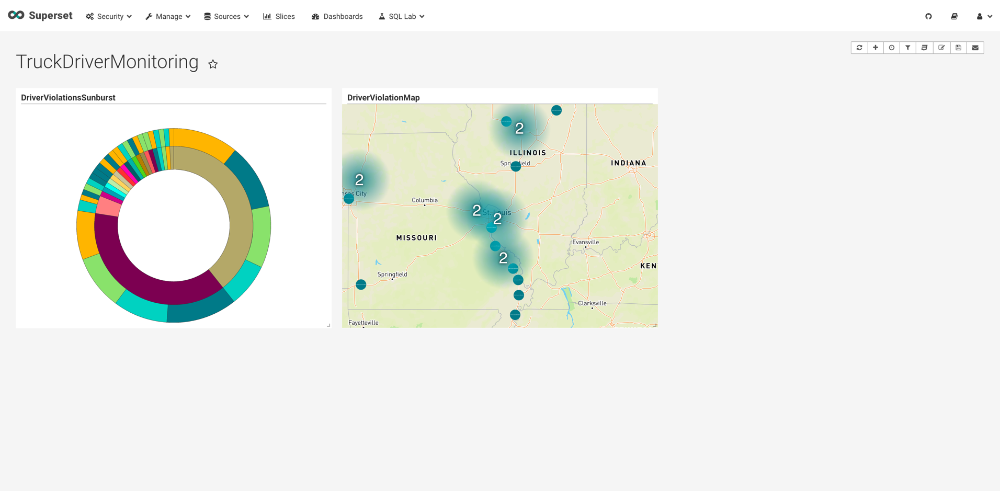

### Try out the other SuperSet Visualizations (Optional)

1\. Explore other Visualizations by creating new slices with the "+" button on the Dashboard "TruckDriverMonitoring"

2\. Create New Visualization Slices

## Summary

Congratulations! You deployed the SAM demo that processes truck event data by using the robust queue (Kafka), the data flow management engine (NiFi), stream processing engine (Storm). You also learned to create a visual data flow for complex data computation using Stream Analytics Managers and visualized the data with Druid SuperSet.

## Further Reading

- [Stream Analytics Manager (SAM)](https://docs.hortonworks.com/HDPDocuments/HDF3/HDF-3.0.0/bk_streaming-analytics-manager-user-guide/content/ch_sam-manage.html)
- [Druid SuperSet Visualization](https://community.hortonworks.com/articles/80412/working-with-airbnbs-superset.html)
- [SuperSet](http://airbnb.io/superset/)
- [Druid](http://druid.io/docs/latest/design/index.html)
- [Schema Registry](http://docs.confluent.io/current/schema-registry/docs/index.html)

Appendix: Troubleshoot Real-time Event Processing Demo

### Appendix A: Shutdown the SAM Application

1\. kill the data-loader

~~~bash
(ps -ef | grep data-loader)
~~~

2\. let NiFi drain kafka queue. You will see the data in the NiFi flow diminish to 0.

3\. Stop all services from Ambari.

4\. Shutdown the HDF 3.0 Sandbox Instance

### Appendix B: Create Kafka Topics if they Didn't Exist

1\. SSH into HDF 3.0 Sandbox

~~~bash
ssh root@localhost -p 12222
sudo su -
~~~

2\. Delete Kafka Topics in case they already exist for fresh app deployment.

~~~bash
/usr/hdp/current/kafka-broker/bin/kafka-topics.sh --delete --if-exists --zookeeper sandbox-hdf.hortonworks.com:2181 --topic raw-truck_events_avro
/usr/hdp/current/kafka-broker/bin/kafka-topics.sh --delete --if-exists --zookeeper sandbox-hdf.hortonworks.com:2181 --topic raw-truck_speed_events_avro
/usr/hdp/current/kafka-broker/bin/kafka-topics.sh --delete --if-exists --zookeeper sandbox-hdf.hortonworks.com:2181 --topic truck_events_avro
/usr/hdp/current/kafka-broker/bin/kafka-topics.sh --delete --if-exists --zookeeper sandbox-hdf.hortonworks.com:2181 --topic truck_speed_events_avro
~~~

3\. Recreate Kafka Topics

~~~bash
/usr/hdp/current/kafka-broker/bin/kafka-topics.sh --create --if-not-exists --zookeeper sandbox-hdf.hortonworks.com:2181 --replication-factor 1 --partition 1 --topic raw-truck_events_avro
/usr/hdp/current/kafka-broker/bin/kafka-topics.sh --create --if-not-exists --zookeeper sandbox-hdf.hortonworks.com:2181 --replication-factor 1 --partition 1 --topic raw-truck_speed_events_avro
/usr/hdp/current/kafka-broker/bin/kafka-topics.sh --create --if-not-exists --zookeeper sandbox-hdf.hortonworks.com:2181 --replication-factor 1 --partition 1 --topic truck_events_avro
/usr/hdp/current/kafka-broker/bin/kafka-topics.sh --create --if-not-exists --zookeeper sandbox-hdf.hortonworks.com:2181 --replication-factor 1 --partition 1 --topic truck_speed_events_avro
~~~

### Appendix C: Add Notification Sink to SAM Topology

1\. In the left hand side bar of processor, scroll to the Notification Sink.
Drag replacement Notification Sink and connect it to the topology. Accept the
default connections.

- **Scroll to the Notification Sink**

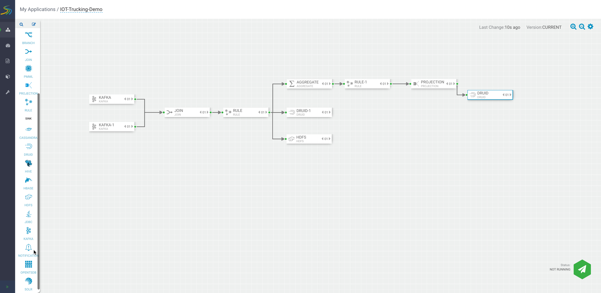

- **Drag the Notification Sink onto Canvas**

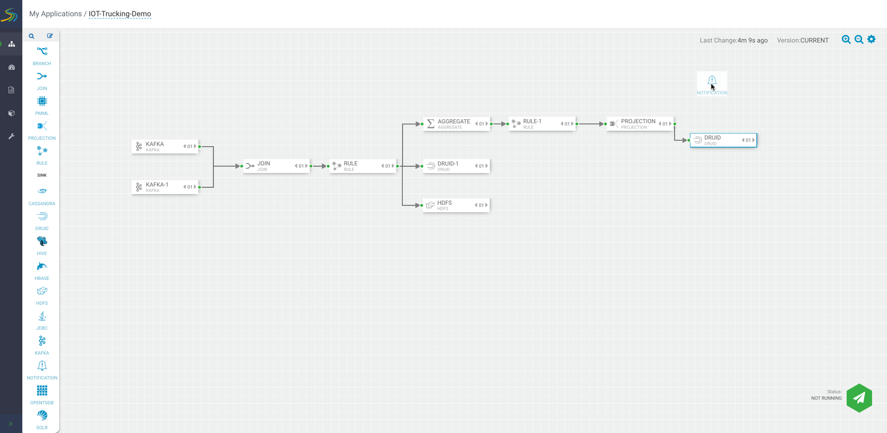

2\. Edit the Notification sink and add the following property values:

| Property | Value     |
| :------------- | :------------- |
| Username       | hwx.se.test@gmail.com       |
| Password       | StrongPassword       |
| Host       | smtp.gmail.com      |
| Port       | 587      |
| From/To Email       | hwx.se.test@gmail.com      |
| Subject       | Driver Violation      |
| Message       | Driver ${driverName} is speeding at ${speed_AVG} mph over the last 3 minutes      |

### Appendix D: Add SAM Demo Extensions

The SAM Demo Extension comes with custom processors and UDFs. You will be able to incorporate these components into your topology by adding them in "Application Resources" -> "Custom Processor" or "UDF".

1\. Download SAM Demo Extensions

~~~bash
git clone https://github.com/georgevetticaden/sam-custom-extensions.git
~~~

2\. Download maven onto the HDF 3.0 Sandbox

~~~bash
sudo wget http://repos.fedorapeople.org/repos/dchen/apache-maven/epel-apache-maven.repo -O /etc/yum.repos.d/epel-apache-maven.repo
sudo sed -i s/\$releasever/6/g /etc/yum.repos.d/epel-apache-maven.repo
sudo yum install -y apache-maven
mvn --version
~~~

3\. Run maven clean package to package the project code for the custom processors and UDFs into their own jar files.

~~~bash
mvn clean package -DskipTests
~~~

Then press OK.
