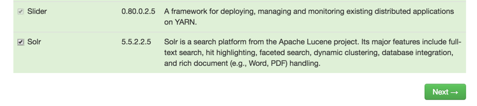
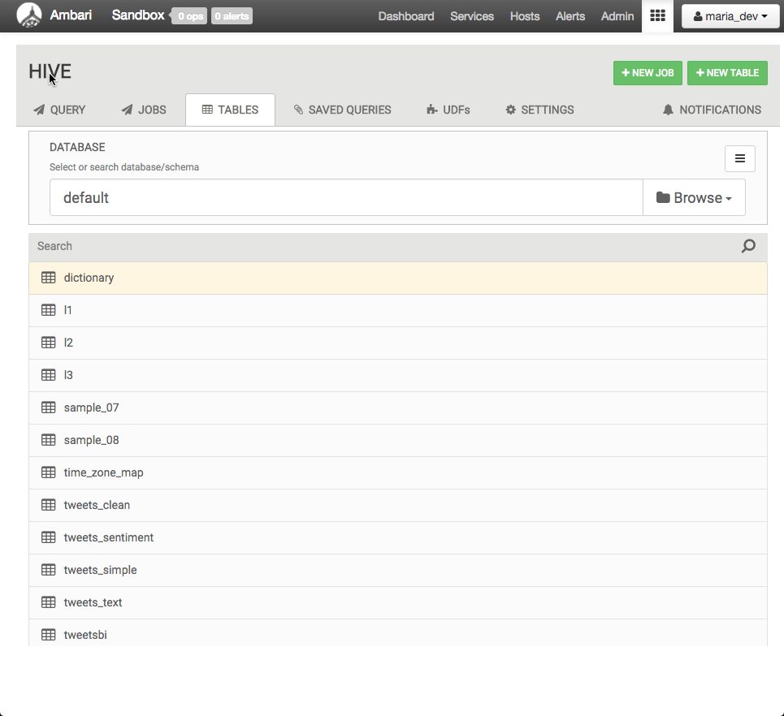
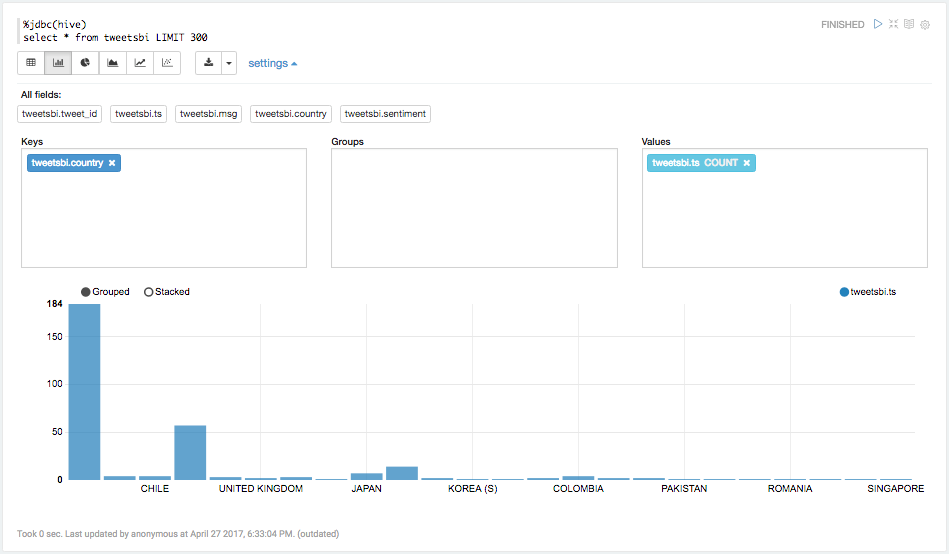
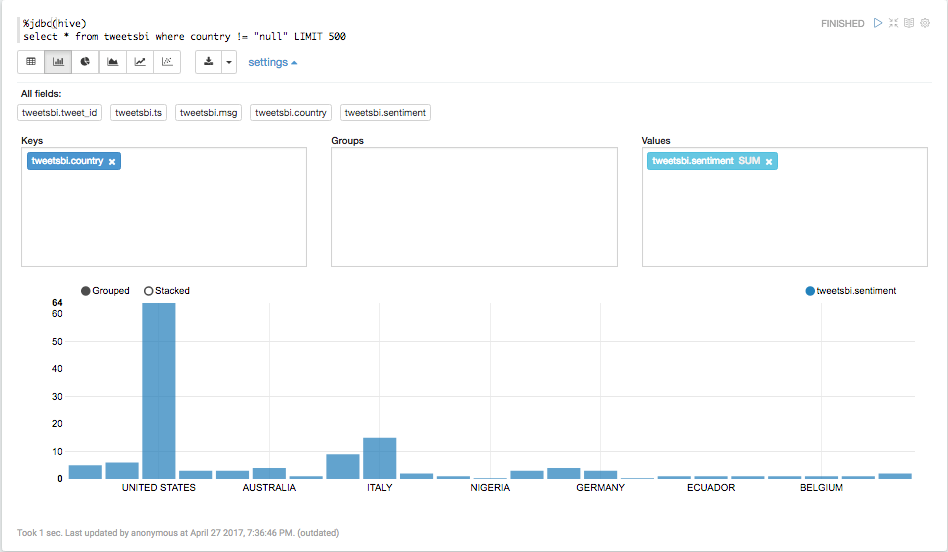
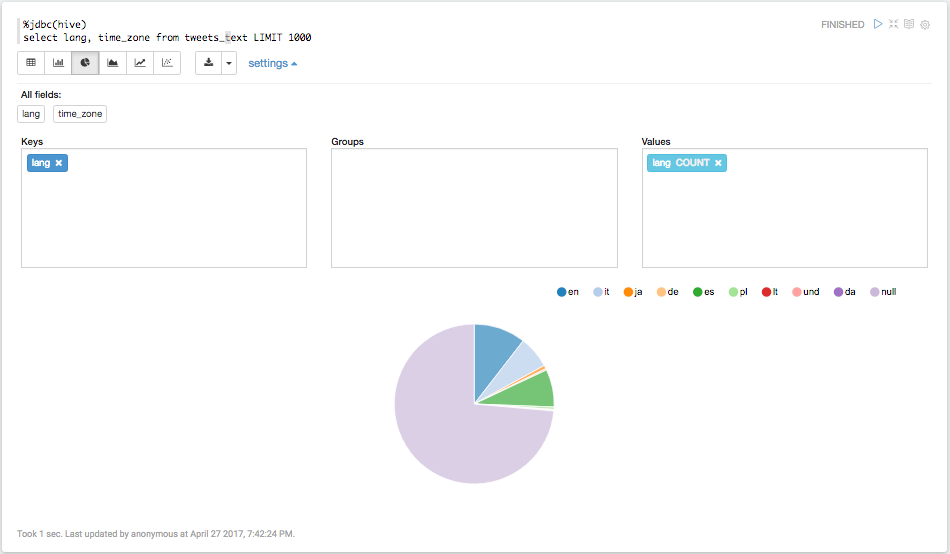

# Analyzing Social Media and Customer Sentiment With Apache NiFi and HDP Search

## Introduction

In this tutorial, we will learn to install Apache NiFi on your Hortonworks Sandbox if you do not have it pre-installed already. Using NiFi, we create a data flow to pull tweets directly from the [Twitter API](https://dev.twitter.com/overview/documentation).

We will use [Solr](https://hortonworks.com/hadoop/solr/) and the [LucidWorks HDP Search](https://hortonworks.com/press-releases/hortonworks-partners-lucidworks-bring-search-big-data/) to view our streamed data in realtime to gather insights as the data arrives in our Hadoop cluster.

Next, we will use Hive to analyze the social sentiment after we have finished collecting our data from NiFi.

Finally, we will use [Apache Zeppelin](https://hortonworks.com/hadoop/zeppelin/) to create charts, so we can visualize our data directly inside of our Hadoop cluster.

### List of technologies in this tutorial:

- [Hortonworks Sandbox](https://hortonworks.com/products/hortonworks-sandbox/)
- [Apache NiFi](https://hortonworks.com/products/dataflow/)
- [Solr + LucidWorks HDP Search](https://hortonworks.com/press-releases/hortonworks-partners-lucidworks-bring-search-big-data/)
- [Hive and Ambari Views](https://hortonworks.com/hadoop/hive/)
- [Apache Zeppelin](https://hortonworks.com/hadoop/zeppelin/)
- [Twitter API](https://dev.twitter.com/)

## Prerequisites

- Downloaded and Installed the [Hortonworks Sandbox with HDP](https://hortonworks.com/hdp/downloads/)
- [Learning the Ropes of the Hortonworks Sandbox](https://hortonworks.com/tutorial/learning-the-ropes-of-the-hortonworks-sandbox/)
- [Deploying Hortonworks Sandbox on Microsoft Azure](https://hortonworks.com/tutorial/deploying-hortonworks-sandbox-on-microsoft-azure/)

## Outline

-   [Install Apache NiFi](#install-apache-nifi)
-   [Configure and Start Solr](#configure-and-start-solr)
-   [Create a Twitter Application](#creating-a-twitter-application)
-   [Create a Data Flow with Nifi](#creating-a-data-flow-with-nifi)
-   [Generating Random Tweet Data for Hive and Solr](#generating-random-tweet-data-for-hive-and-solr)
-   [Analyze and Search Data with Solr](#analyze-and-search-data-with-solr)
-   [Analyze Tweet Data in Hive](#analyzing-tweet-data-in-hive)
-   [Visualize Sentiment with Zeppelin](#visualizing-sentiment-with-zeppelin)
-   [Further Reading](#further-reading)

## Install Apache Nifi <a id="install-apache-nifi"></a>

The first thing you're going to need if you haven't done it already is install the Apache Nifi service on your Sandbox. Follow the [Set up Nifi Environment section](https://hortonworks.com/tutorial/learning-ropes-apache-nifi/#section_3) of [Analyze Traffic Pattern with Apache Nifi](https://hortonworks.com/tutorial/learning-ropes-apache-nifi/).

## Configure and Start Solr <a id="configure-and-start-solr"></a>

Make sure that Ambari Infra is stopped, we now need to install HDP Search.

Login to Ambari user credentials: Username - **raj_ops** and Password - **raj_ops**. Click on Actions button at the bottom and then Add Service:


Next, you will view a list of services that you can add. Scroll to the bottom and select `Solr`, then press `Next`.



Accept all default values in next few pages, and then you can see the progress of your installation:


After a minute, you can see Solr successfully installed:


Press Next, you will be asked to restart some services. Restart HDFS, YARN, Mapreduce2 and HBase.

We just need to make a few quick changes.

Open your terminal shell and SSH back into the sandbox. We're going to need to run the following commands as the **solr** user. run

~~~bash
su solr
~~~

Then we need to edit the following file path to make sure that Solr can recognize a tweet's timestamp format. First we're going to copy the config set over to twitter's **tweet_configs** folder:

~~~bash
cp -r /opt/lucidworks-hdpsearch/solr/server/solr/configsets/data_driven_schema_configs /opt/lucidworks-hdpsearch/solr/server/solr/configsets/tweet_configs
~~~

~~~bash
vi /opt/lucidworks-hdpsearch/solr/server/solr/configsets/tweet_configs/conf/solrconfig.xml
~~~


Once the file is opened in `vi` type

**Note** In **vi** the command below should not be run in **INSERT** mode.  `/` will do a find for the text that you type after it.

~~~
/solr.ParseDateFieldUpdateProcessorFactory
~~~

This will bring you to the part of the config where we need to add the following:

~~~html
<str>EEE MMM d HH:mm:ss Z yyyy</str>
~~~

Make sure this is inserted just above all of the other `<str>` tags.

**Note** In `vi`, to type or insert anything you must be in _insert mode_. Press `i` on your keyboard to enter insert mode in `vi`.

After inserting the above, the portion of the file should look something like this:

~~~html
<processor class="solr.ParseLongFieldUpdateProcessorFactory"/>
  <processor class="solr.ParseDateFieldUpdateProcessorFactory">
    <arr name="format">
      <str>EEE MMM d HH:mm:ss Z yyyy</str>
      <str>yyyy-MM-dd'T'HH:mm:ss.SSSZ</str>
      <str>yyyy-MM-dd'T'HH:mm:ss,SSSZ</str>
      <str>yyyy-MM-dd'T'HH:mm:ss.SSS</str>
      <str>yyyy-MM-dd'T'HH:mm:ss,SSS</str>
      <str>yyyy-MM-dd'T'HH:mm:ssZ</str>
      </arr>
    </processor>
</processor>
~~~

Finally press the **Escape key** on your keyboard and type `:wq` to save and close the `solrconfig.xml` file.

Next we need to replace a JSON file. Use the following commands to move the original and download the replacement file:

~~~bash
cd /opt/lucidworks-hdpsearch/solr/server/solr-webapp/webapp/banana/app/dashboards/

mv default.json default.json.orig

wget https://raw.githubusercontent.com/hortonworks/data-tutorials/master/tutorials/hdp/analyzing-social-media-and-customer-sentiment-with-apache-nifi-and-hdp-search/assets/default.json
~~~


Then we are going to add a collection called "tweets"

~~~bash
/opt/lucidworks-hdpsearch/solr/bin/solr create -c tweets -d tweet_configs -s 1 -rf 1 -p 8983
~~~

> Note: Here -c indicates the name
-d is the config directory
-s is the number of shards
-rf is the replication factor
-p is the port at which Solr is running


We can now go back to running commands as the **root** user. Run

~~~bash
exit
~~~

This will log you out of the `solr` user

Great! Now Solr should be installed and running on your sandbox!

Ensure that you can access the Solr UI by navigating to [http://sandbox.hortonworks.com:8983/solr/](http://sandbox.hortonworks.com:8983/solr/)


## Create a Twitter Application <a id="creating-a-twitter-application"></a>

If you would rather not register your own Twitter application and use previous data, please head to the [next section](#analyze-and-search-data-with-solr) where you can download the sample dataset.

If you want to pull live data from Twitter in this tutorial you'll need to register your own Twitter application. It's quite simple and only takes a few short steps

First head over to the [Twitter Apps Website](http://apps.twitter.com) and Sign In using your Twitter account (or make one if you don't have one yet!)

Then click **Create a New App**.


After you've clicked that you'll need to fill in some details about your application. Feel free to put whatever you want.


 Then click **Create Your Twitter Application** at the bottom of the screen after reading the developer agreement.

> **Note** that you might need to add your mobile phone to your Twitter account before creating your application

Once you've done that you should be greeted by a dashboard for your Twitter application. Head over to the permissions tab and select the **Read Only** Option and **Update** your application.


Finally you need to generate your OAuth key. You can do this by clicking **Test OAuth** on the top of the permissions page, or by heading to **Keys and Access Tokens** and then finding the option that allows you to generate your OAuth tokens.

Finally, your keys and access tokens should look similar to the following:


Please make note of your **Consumer Key**, **Consumer Secret**, **Access Token**, and **Access Token Secret**. You will need these to create the data flow in NiFi.

## Create a Data Flow with NiFi <a id="creating-a-data-flow-with-nifi"></a>

The first thing you'll need to do here is download the NiFi data flow template for the [Twitter Dashboard here](https://raw.githubusercontent.com/hortonworks/data-tutorials/master/tutorials/hdp/analyzing-social-media-and-customer-sentiment-with-apache-nifi-and-hdp-search/assets/Twitter_JSON_Flow.xml)

Make note of where you download this file. You'll need it in the next step.

Open up the NiFi user interface found at [http://sandbox.hortonworks.com:9090/nifi](http://sandbox.hortonworks.com:9090/nifi). Then you'll need to import the template you just downloaded into NiFi.

Import the template by clicking `Templates` icon in the right of the Operate box.


Then click **on the search sign** to select the template and navigate to the `Twitter_JSON_Flow.xml` file that you just previously downloaded.


Once you've selected the file you can click **UPLOAD**.


You should now see the Success message that your file is uploaded, press **OK**


Now that we've got the template imported into NiFi we can instantiate it. Drag the template icon (the 7th from the left) onto the workspace.


Then a dialog box should appear. Make sure that **Twitter_JSON_Flow** is selected and click **Add**.


After clicking **ADD** you should have a screen similar to the following:


Great! The NiFi flow has been set up. The _boxes_ are what NiFi calls processors. Each of the processors can be connected to one another and help make data flow. Each processor can perform specific tasks. They are at the very heart of NiFi's functionality.


**Note!** You can make you flows looks very clean by having the connections between all of your processors at 90 degree angles with respect to one another. You can do this by [**double clicking a connection arrow to create a vertex**](https://community.hortonworks.com/content/kbentry/1828/tip-bend-those-connections.html). This will allow you to customize the look of your flow

Try **right-clicking** on a few of the the processors and look at their configuration. This can help you better understand how the Twitter flow works.

Now we'll need to configure the Twitter Hose processor with the access tokens that we made earlier for our Twitter application.

Right click on the **Grab Garden Hose** element and click **Configure**


Then you're going to need to place all of those Twitter API tokens from earlier in their respective places. Then hit **Apply**.


Once you've got all of your properties set up you can take a look at the configurations of some of the other processors in our data.

The processors are valid since the warning symbols disappeared. Notice that the processors have a stop symbol  in the upper left corner and are ready to run. To select all processors, hold down the shift-key and drag your mouse across the entire data flow.

Now that all processors are selected, go to the actions toolbar and click the start button . You can see your workflow running.

### Common Errors
If the GetTwitter processor reports an authorization error, it might be because the sandbox's system clock has the wrong time. Confirm that the correct time is displayed on the Nifi dashboard. If it's off, you can fix it by running these commands:

```
yum install -y ntp
service ntpd stop
ntpdate pool.ntp.org
service ntpd start
```
If the PutHDFS processor reports an LZOCodec error, you need to open the HDFS configuration tab in Ambari and delete all references to LZOCodec. Restarting HDFS and Nifi after making these changes should fix this issue.


## Generating Random Tweet Data for Hive and Solr <a id="generating-random-tweet-data-for-hive-and-solr"></a>

This section is for anyone who didn't want to set up a Twitter app so they could stream custom data. We're just going to use a script to generate some data and then put that into Hive and Solr. Skip to the next section if you have already set up NiFi to collect tweets.

First you'll need to SSH into the sandbox execute the following command

~~~bash
wget https://raw.githubusercontent.com/hortonworks/data-tutorials/master/tutorials/hdp/analyzing-social-media-and-customer-sentiment-with-apache-nifi-and-hdp-search/assets/twitter-gen.sh
~~~

Then run the command with your specified number of tweets that you would like to generate.

~~~bash
bash twitter-gen.sh {NUMBER_OF_TWEETS}
~~~

Example:

~~~bash
bash twitter-gen.sh 2000
~~~

The script will generate the data and put it in the directory `/tmp/data/`

You can now continue on with the rest of the tutorial.

## Analyze and Search Data with Solr <a id="analyze-and-search-data-with-solr"></a>

Now that we have our data in HDP-Search/Solr we can go ahead and start searching through our data.
If you are using NiFi to stream the data you can head over to the Banana Dashboard at [http://sandbox.hortonworks.com:8983/solr/banana/index.html](http://sandbox.hortonworks.com:8983/solr/banana/index.html)

The dashboard was designed by the `default.json` file that we had downloaded previously. You can find more about [Banana here](https://github.com/LucidWorks/banana)

You should be able to see the constant flow of data here and you can analyze some of it as it is dropped into the Solr index from NiFi. Try exploring the charts and see what each one does. It should be important to note that all of the graphs on the page include data that was queried straight from Solr to create those images using [d3.js](http://d3js.org/). You can see the queries for each graph by clicking the small **gear icon** located in each box.


**Note** If you didn't use NiFi to import the data from Twitter then you won't see anything on the dashboard.

Let's go do some custom search on the data! Head back to the normal Solr dashboard at [http://sandbox.hortonworks.com:8983/solr](http://sandbox.hortonworks.com:8983/solr)

Select the **tweets shard** that we created before from the `Core Selector` menu on the bottom left of the screen.


Once you've selected the tweets shard we can take a look to see what Solr has done with our data.


1. We can see how many documents or records have been stored into this index in Solr. As long as NiFi continues to run this number will become larger as more data is ingested. If you used the `twitter-gen.sh` script then this number should be close to the amount of tweets that you generated.
2. Here we can see the size on the disk that the data is taking up in Solr. We don't have many tweets collected yet, so this number is quite small.
3. On the left side bar there are a number of different tabs to view the data that's stored within Solr. We're going to focus on the **Query** one, but you should explore the others as well.

Click on the query tab, and you should be brought to screen similar to the following:


We're only going to be using 3 of these fields before we execute any queries, but let's quickly outline the different query parameters

- **fq**: This is a filter query parameter it lets us retrieve data that only contains certain values that we're looking for. Example: we can specify that we only want tweets after a certain time to be returned.
- **sort**: self-explanatory. You can sort by a specified field in ascending or descending order. we could return all tweets by alphabetical order of Twitter handles, or possible by the time they were tweeted as well.
- **start, rows**: This tells us where exactly in the index we should start searching, and how many rows should be returned when we execute the query. The defaults for each of these is `0` and `10` respectively.
- **fl**: Short for _field list_ specify which fields you want to be returned. If the data many, many fields, you can choose to specify only a few that are returned in the query.
- **df**: Short for _default fields_ you can tell which fields solr should be searching in. You will not need this if the query fields are already defined.
- **Raw Query Params**: These will be added directly the the url that is requested when Solr send the request with all of the query information.
- **wt**: This is the type of data that solr will return. We can specify many things such as JSON, XML, or CSV formatting.

We aren't going to worry about the rest of the flags. Without entering any parameters click **Execute Query**.


From this you should be able to view all of the tweet data that is collected. Try playing with some of the parameters and add more to the **rows** value in the query to see how many results you can obtain.

Now let's do a real query and see if we can find some valuable data.

- For **q** type `language_s:en`
- For **sort** type `screenName_s asc`
- For **rows** type `150`
- For **fl** type `screenName_s, text_t`
- For **wt** choose `csv`


Let's try one last query. This time you can omit the **sort** field and chooses whichever **wt** format you like. Keep the **fl** parameter as is though.

- Specify an **fq** parameter as `language_s:en`
- In the query box, pick any keyword. I am going to use `stock`


## Analyze Tweet Data in Hive <a id="analyzing-tweet-data-in-hive"></a>

Now that we've taken a look at some of our data and searched it with Solr, let's see if we can refine it a bit more.

But before moving ahead, let us setup **Hive-JSON-Serde** to read the data in **JSON** format.
We have to use the maven to compile the serde. Go back to the terminal and follow the below steps to setup the maven:

~~~
wget http://mirror.olnevhost.net/pub/apache/maven/binaries/apache-maven-3.2.1-bin.tar.gz
~~~

Now, extract this file:

~~~
tar xvf apache-maven-3.2.1-bin.tar.gz
~~~


Now since our maven is installed, let us download the Hive-JSON-Serde. Type the following command:

~~~
git clone https://github.com/rcongiu/Hive-JSON-Serde
~~~

This command must have created the new directory, go inside to that directory using cd:

~~~
cd Hive-JSON-Serde
~~~

Next, run the command to compile the serde:

~~~
./../apache-maven-3.2.1/bin/mvn -Phdp23 clean package
~~~


Wait for its completion, and then you have to copy the serde jar to the Hive lib:

~~~
cp json-serde/target/json-serde-1.3.9-SNAPSHOT-jar-with-dependencies.jar /usr/hdp/2.6.0.3-8/hive/lib
cp json-serde/target/json-serde-1.3.9-SNAPSHOT-jar-with-dependencies.jar /usr/hdp/2.6.0.3-8/hive2/lib
~~~


**DO NOT** forget to Restart Hive from Ambari,


We're going to attempt to get the sentiment of each tweet by matching the words in the tweets with a sentiment dictionary. From this we can determine the sentiment of each tweet and analyze it from there.

First off, if your Twitter flow on the NiFi instance is still running, you'll need to shut it off. Open up the NiFi dashboard at [sandbox.hortonworks.com:9090/nifi](http://sandbox.hortonworks.com:9090/nifi) and click stop square  at the top of the screen.

Next, you'll need to SSH into the sandbox again and run the following two commands

~~~bash
# Virtualbox
	sudo -u hdfs hdfs dfs -chown -R maria_dev /tmp/tweets_staging
	sudo -u hdfs hdfs dfs -chmod -R 777 /tmp/tweets_staging
# Azure
	sudo -u hdfs hdfs dfs -chown -R azure /tmp/tweets_staging
	sudo -u hdfs hdfs dfs -chmod -R 777 /tmp/tweets_staging
~~~


After the commands complete let's go to the Hive view. Head over to [http://sandbox.hortonworks.com:8080](http://sandbox.hortonworks.com:8080/). Login into Ambari. Refer to [Learning the Ropes of the Hortonworks Sandbox](https://hortonworks.com/tutorial/learning-the-ropes-of-the-hortonworks-sandbox/) if you need assistance with logging into Ambari.
> **Note:** login credentials are `maria_dev/maria_dev` (Virtualbox), else `azure/azure` (Azure). Use the dropdown menu at the top to get to the Hive view.

Enter **Hive View 2.0**. Execute the following command to create a table for the tweets

~~~sql
ADD JAR /usr/hdp/2.6.0.3-8/hive2/lib/json-serde-1.3.9-SNAPSHOT-jar-with-dependencies.jar;

CREATE EXTERNAL TABLE IF NOT EXISTS tweets_text(
  tweet_id bigint,
  created_unixtime bigint,
  created_time string,
  lang string,
  displayname string,
  time_zone string,
  msg string)
ROW FORMAT SERDE 'org.openx.data.jsonserde.JsonSerDe'
LOCATION '/tmp/tweets_staging';
~~~


Now we're going to need to do some data analysis.

First you're going to need to head to the **HDFS Files View** and create a new directory in `/tmp/data/tables`

Then create two new directories inside of `/tmp/data/tables`. One named **time_zone_map** and another named **dictionary**


In each of the folders respectively you'll need to upload the [`dictionary.tsv` file](https://raw.githubusercontent.com/hortonworks/data-tutorials/master/tutorials/hdp/analyzing-social-media-and-customer-sentiment-with-apache-nifi-and-hdp-search/assets/dictionary.tsv), and the [`time_zone_map.tsv` file](https://raw.githubusercontent.com/hortonworks/data-tutorials/master/tutorials/hdp/analyzing-social-media-and-customer-sentiment-with-apache-nifi-and-hdp-search/assets/time_zone_map.tsv) to each of their respective directories.

After doing so, you'll need to run the following command on the Sandbox:

~~~bash
sudo -u hdfs hdfs dfs -chmod -R 777 /tmp/data/tables
~~~


Finally, run the following two commands in **Hive View 2.0**:

The first table created is **dictionary** and the dataset loaded into the table is located in this path: `/tmp/data/tables/dictionary`.

~~~sql
CREATE EXTERNAL TABLE if not exists dictionary (
	type string,
	length int,
	word string,
	pos string,
	stemmed string,
	polarity string )
ROW FORMAT DELIMITED
FIELDS TERMINATED BY '\t'
STORED AS TEXTFILE
LOCATION '/tmp/data/tables/dictionary';
~~~

The second table created is **time_zone_map** and the dataset loaded into the table is located in this path: `/tmp/data/tables/time_zone_map`.

~~~sql
CREATE EXTERNAL TABLE if not exists time_zone_map (
    time_zone string,
    country string,
    notes string )
ROW FORMAT DELIMITED
FIELDS TERMINATED BY '\t'
STORED AS TEXTFILE
LOCATION '/tmp/data/tables/time_zone_map';
~~~


Next we'll need to create two table views from our tweets which will simplify the columns the data we have access to.

**tweets_simple** view:

~~~sql
CREATE VIEW IF NOT EXISTS tweets_simple AS
SELECT
  tweet_id,
  cast ( from_unixtime( unix_timestamp(concat( '2016 ', substring(created_time,5,15)), 'yyyy MMM dd hh:mm:ss')) as timestamp) ts,
  msg,
  time_zone
FROM tweets_text;
~~~

**tweets_clean** view:

~~~sql
CREATE VIEW IF NOT EXISTS tweets_clean AS
SELECT
  t.tweet_id,
  t.ts,
  t.msg,
  m.country
 FROM tweets_simple t LEFT OUTER JOIN time_zone_map m ON t.time_zone = m.time_zone;
~~~


After running the above commands you should be able to run:

~~~sql
ADD JAR /usr/hdp/2.6.0.3-8/hive2/lib/json-serde-1.3.9-SNAPSHOT-jar-with-dependencies.jar;
SELECT * FROM tweets_clean LIMIT 100;
~~~


Now that we've cleaned our data we can get around to computing the sentiment. Use the following Hive commands to create some views that will allow us to do that.

**l1** view, **l2** view, **l3** view:

~~~sql
-- Compute sentiment
create view IF NOT EXISTS l1 as select tweet_id, words from tweets_text lateral view explode(sentences(lower(msg))) dummy as words;

create view IF NOT EXISTS l2 as select tweet_id, word from l1 lateral view explode( words ) dummy as word;

create view IF NOT EXISTS l3 as select
    tweet_id,
    l2.word,
    case d.polarity
      when  'negative' then -1
      when 'positive' then 1
      else 0 end as polarity
from l2 l2 left outer join dictionary d on l2.word = d.word;
~~~


Now that we were able to compute some sentiment values we can assign whether a tweet was **positive**, **neutral**, or **negative**. Use this next Hive command to do that.

**tweets_sentiment** table:

~~~sql
ADD JAR /usr/hdp/2.6.0.3-8/hive2/lib/json-serde-1.3.9-SNAPSHOT-jar-with-dependencies.jar;

create table IF NOT EXISTS tweets_sentiment stored as orc as select
  tweet_id,
  case
    when sum( polarity ) > 0 then 'positive'
    when sum( polarity ) < 0 then 'negative'
    else 'neutral' end as sentiment
from l3 group by tweet_id;
~~~

>Note: We will need to specify the location of the json-serde library JAR file since this table references another table that works with json data.


Lastly, to make our analysis somewhat easier we are going to turn those 'positive', 'negative', and 'neutral' values into numerical values using the next Hive command

**tweetsbi** table:

~~~sql
ADD JAR /usr/hdp/2.6.0.3-8/hive2/lib/json-serde-1.3.9-SNAPSHOT-jar-with-dependencies.jar;

CREATE TABLE IF NOT EXISTS tweetsbi
STORED AS ORC
AS SELECT
  t.*,
  case s.sentiment
    when 'positive' then 2
    when 'neutral' then 1
    when 'negative' then 0
  end as sentiment
FROM tweets_clean t LEFT OUTER JOIN tweets_sentiment s on t.tweet_id = s.tweet_id;
~~~

Load the tweetsbi data:

~~~
ADD JAR /usr/hdp/2.6.0.3-8/hive2/lib/json-serde-1.3.9-SNAPSHOT-jar-with-dependencies.jar;
SELECT * FROM tweetsbi LIMIT 100;
~~~

This command should yield our final results table as shown below.


Now we have created all of our hive tables and views. They should appear in the **TABLES** tab where you can see all tables and views in your current database:as shown below:




**Try the new Hive Visualization tab!**

 On the right hand side of the screen try clicking the **graph icon** in the column located in row 3. It will bring up a new tab where you can directly create charts using your query results in Hive!


Now that we can access the sentiment data in our Hive table let's do some visualization on the analysis using Apache Zeppelin.

## Visualize Sentiment With Zeppelin <a id="visualizing-sentiment-with-zeppelin"></a>

Make sure your Zeppelin service is started in Ambari, then head over to the Zeppelin at [http://sandbox.hortonworks.com:9995](http://sandbox.hortonworks.com:9995/).


Use the **Notebook** dropdown menu at the top of the screen and click **+ Create New Note**. After which, you can name the note **Sentiment Analysis**.


After creating the note, open it up to the blank Notebook screen and type the following command.

~~~sql
%jdbc(hive)
select * from tweetsbi LIMIT 300
~~~

We're limiting our query to just `300` results because right now we won't need to see everything. And if you've collected a lot of data from NiFi, then it could slow down your computer.

- Arrange your results so that your chart is a **bar graph**.
- The `tweetsbi.country` column is a **key** and the `tweetsbi.sentiment` as the **value**.
- Make sure that **sentiment** is labeled as **COUNT**.
- Run the query by **clicking the arrow on the right hand side**, or by pressing **Shift+Enter**.

Your results should look like the following:



After looking at the results we see that if we group by country that many tweets are actually labeled as null.

For the sake of visualization let's remove any tweets that might appear in our select statement that have a country value of "null", as well as increase our result limit to 500.

Scroll down to the next note and create run the following query, and set up the results the same way as above.

> **Note** Before running Hive queries, restart the Spark Interpreter since Spark jobs take up cluster resources. Click the **Interpreter** tab located near Zeppelin logo at the top of the page, under **Spark** click on the button that says **restart**.

~~~sql
%jdbc(hive)
select * from tweetsbi where country != "null" LIMIT 500
~~~



Great! Now given the data we have, we can at least have an idea of the distribution of users who's tweets come from certain countries!

You can also experiment with this and try a pie chart as well.


In our original raw tweet data from NiFi we also collected the language from our users as well. So we can also get an idea of the distribution of languages!

Run the following query and make

- **lang** as the **Key**
- **COUNT** for **lang** in **values**

~~~sql
%jdbc(hive)
select lang, time_zone from tweets_text LIMIT 1000
~~~



If you have not seen from our earlier analysis in Hive

- A bad or negative sentiment is **0**
- A neutral sentiment value is **1**.
- A positive sentiment value is **2**.

Using this we can now look at individual countries and see the sentiment distributions of each.

~~~sql
%jdbc(hive)
select sentiment, count(country), country from tweetsbi group by sentiment, country having country != "null"
~~~


Using this data you can determine how you might want to market your products to different countries!

## Further Reading

- [NiFi blogs](https://hortonworks.com/blog/category/nifi/)
- [Indexing and Searching Documents with Apache Solr](https://hortonworks.com/tutorial/searching-data-solr/)
- [Introduction to Data Science with Apache Zeppelin](https://hortonworks.com/blog/introduction-to-data-science-with-apache-spark/)
- [Hortonworks Community Connection](https://hortonworks.com/community/)
- [HDP Sandbox & Learning Forum](https://community.hortonworks.com/spaces/81/index.html)
- For more information on Solr you can [go here](https://hortonworks.com/hadoop/solr/)
- You can also visit the [Apache project Page](http://lucene.apache.org/solr/)
