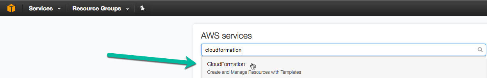
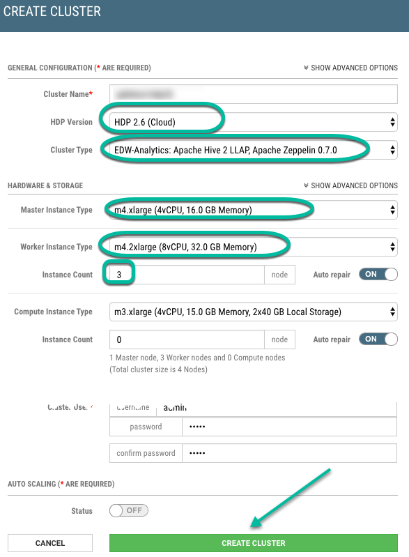
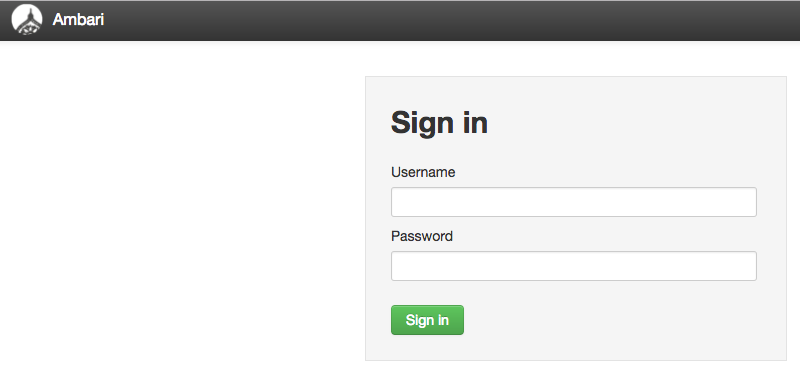
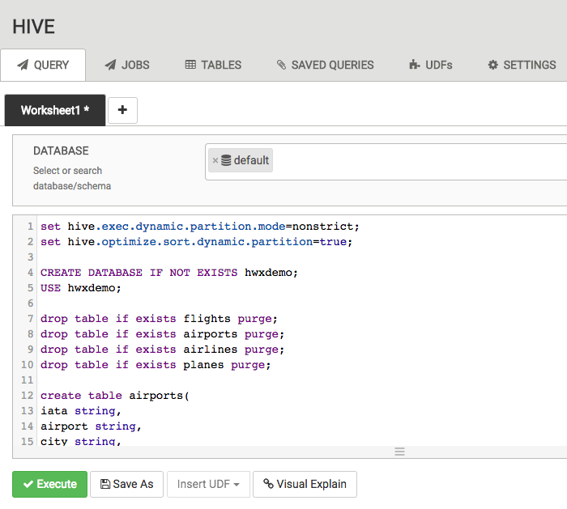
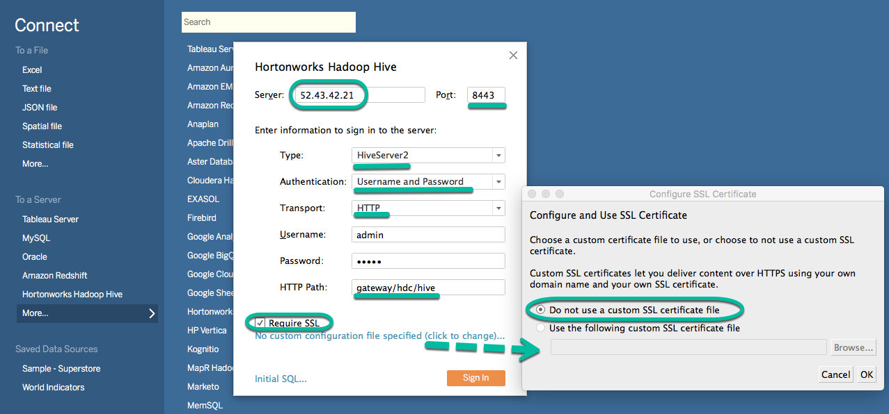

# Fast analytics in the cloud with Hive LLAP

## Introduction

Hadoop has always been associated with BigData, yet the perception is it’s only suitable for high latency, high throughput queries. With the contribution of the community, you can use Hadoop interactively for data exploration and visualization.  In this tutorial you’ll learn how to analyze large datasets using Apache Hive LLAP on Amazon Web Services (AWS) through the use of Business Intelligence (BI) tools like Tableau.

## Prerequisites

-   [Hortonworks Data Cloud (HDCloud) for AWS](https://hortonworks.com/products/cloud/aws/) is a platform for analyzing and processing data, enabling businesses to achieve insights more quickly and with greater flexibility than ever before. Instead of going through infinite configuration options, you can choose from a set of prescriptive cluster configurations and you can start modeling and analyzing your data sets in minutes. When you are done with your analysis, you can give the resources back to the cloud, reducing your costs. [Get Started](https://docs.hortonworks.com/HDPDocuments/HDCloudAWS/HDCloudAWS-1.14.4/index.html) with general instructions on how to launch a cloud controller instance and create cluster(s).

-   Must have an [Amazon Web Services(AWS)](https://aws.amazon.com/) account
-   Must have installed [Hortonworks ODBC Driver for Apache Hive](http://hortonworks.com/downloads/#addons)
-   Must have installed [Tableau](https://www.tableau.com/). For this tutorial, we're using Tableau version 10.2
-   [Download the SSL Certificate](http://docs.hortonworks.com/HDPDocuments/HDCloudAWS/HDCloudAWS-1.14.1/bk_hdcloud-aws/content/hive-jdbc/index.html#download-ssl-certificate) from the Protected Gateway

## Outline

-   [Create cluster for Hive LLAP](#create-cluster-for-hive-llap)
-   [Create Hive tables and load data](#create-hive-tables-and-load-data)
-   [Create data model on Tableau](#create-data-model-on-tableau)
-   [Lab 1: Airline Growth Trend](#lab-1-airline-growth-trend)
-   [Lab 2: Airport Delay](#lab-2-airport-delay)
-   [Summary](#summary)

## Create cluster for Hive LLAP

A few cluster modifications are required when creating a cluster to take advantage of Hive LLAP. After you login to AWS, search or go to the CloudFormation service:



From the CloudFormation service screen, Open CloudURL:
1. Select your CloudController Stack Name
2. Select the Outputs tab
3. Search for the Key "CloudController" and open the URL provided.


Login using your credentials:


Create a cluster as you normally do, with the exception of:
1. <mark>Cluster Type:</mark> EDW-Analytics: Apache Hive 2 LLAP, Apache Zeppelin 0.7.0
2. <mark>Master Instance Type:</mark> m4.xlarge (4vCPU, 16.0 GB Memory)
3. <mark>Worker Instance Type:</mark> m3.2xlarge (8vCPU, 30.0 GB Memory, 2x80 GB Local Storage)
4. <mark>Instance Count:</mark> 3

Settings should look similar to:



Once the cluster is created and running, login Ambari:




## Create Hive tables and load data
Now, we'll go into the Hive View 2.0 and create the necessary tables for our analysis:


Cut-Paste [DDL](assets/hiveview-ddl.sql) into the Hive Query Editor and execute:



Cut-Paste the following command into the Hive Query Editor to reload all the partitions from S3. We now have some data to play with:

```sql
msck repair table hwxdemo.flights;
```


## Create data model on Tableau

Read [documentation](http://docs.hortonworks.com/HDPDocuments/HDCloudAWS/HDCloudAWS-1.14.1/bk_hdcloud-aws/content/hive-jdbc/index.html#example-tableau) for details on connecting using Tableau.

We'll need to know the master's node IP address so we can connect to it via Tableau. Capture the IP address from Ambari:


Startup Tableau and connect using "Hortonworks Hadoop Hive" server. If the server is not displayed, click on "More...":


Connect to Hortonworks Hadoop Hive using the master's node IP address.
1. <mark>Server</mark>: master's node IP address
2. <mark>Port</mark>: 8443
3. <mark>Type</mark>: HiveServer2
4. <mark>Authentication</mark>: Username and Password
3. <mark>Transport</mark>: HTTP
3. <mark>HTTP Path</mark>: gateway/hdc/hive
4. Do not use a custom SSL certificate file
5. **Sign In**

The settings look like:



Now that we're connected with Tableau, we'll select the "hwxdemo" schema for our analysis.


We'll create our data model using the following 4 tables:


We create our data model using the following tables loaded in order with associations as described below:

1.  drag `flights` table
   -  no join condition needed
2.  drag `airlines` table
   - join condition: `Uniquecarrier = Code`
3. drag `planes` table
   - join condition: `Tailnum = Tailnum(Planes)`
4.  drag `airports` table
   - join condition: `Origin = Iata`
   - rename `airports` to `airports_origin`
5.  drag `airports` table
   - join condition: `Dest = Iata(Airports)`
   - rename `airports` to `airports_dest`

The final table associations should look like this:


## Lab 1: Airline Growth Trend

Using the data model built, we can visualize airline growth over the years:
[](https://www.youtube.com/embed/6ED4I2KME0w?start=847&end=984)

## Lab 2: Airport Delay

Using the data model built, we can visualize which airports have most delays:
[](https://www.youtube.com/embed/6ED4I2KME0w?start=994&end=1373)

## Summary

Congratulations! You've completed the tutorial.

As seen by this tutorial, it is easy to use Hive LLAP on Amazon Web Services (AWS). In using Business intelligence tools (BI tools), like Tableau, you are able to interactively explore and analyze your data.
