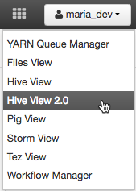

# Hadoop Tutorial – Getting Started with HDP

# Concepts

## Introduction

In this tutorial, we will explore important concepts that will strengthen your foundation in the Hortonworks Data Platform (HDP). Apache Hadoop is a layered structure to process and store massive amounts of data. In our case, ApacheTM Hadoop will be recognized as an enterprise solution in the form of HDP. At the base of HDP exists our data storage environment known as the Hadoop Distributed File System. When data files are accessed by Hive, Pig or another coding language, YARN is the Data Operating System that enables them to analyze, manipulate or process that data. HDP includes various components that open new opportunities and efficiencies in healthcare, finance, insurance and other industries that impact people.

## Prerequisites
-   Downloaded and Installed [Hortonworks Sandbox](https://hortonworks.com/downloads/#sandbox)
-   [Learning the Ropes of the Hortonworks Sandbox](https://hortonworks.com/tutorial/learning-the-ropes-of-the-hortonworks-sandbox/)

## Outline

-   [1. Concept: Hadoop & HDP](#concepts-hadoop-hdp)
-   [2. Concept: HDFS](#concepts-hdfs)
-   [3. Concept: MapReduce & YARN](#concepts-mapreduce-yarn)
-   [4. Concept: Hive and Pig](#concepts-hive-pig)
-   [Further Reading](#further-reading)

## 1. Concept: Hadoop & HDP 

In this module you will learn about ApacheTM Hadoop® and what makes it scale to large data sets. We will also talk about various components of the Hadoop ecosystem that make Apache Hadoop enterprise ready in the form of Hortonworks Data Platform (HDP) distribution. This module discusses Apache Hadoop and its capabilities as a data platform. The core of Hadoop and its surrounding ecosystem solution vendors provide enterprise requirements to integrate alongside Data Warehouses and other enterprise data systems. These are steps towards the implementation of a modern data architecture, and towards delivering an enterprise ‘Data Lake’

### 1.1 Goals of this module

-   Understanding Hadoop.
-   Understanding five pillars of HDP
-   Understanding HDP components and their purpose.

### 1.2 Apache Hadoop

Apache Hadoop is an open source framework for distributed storage and processing of large sets of data on commodity hardware. Hadoop enables businesses to quickly gain insight from massive amounts of structured and unstructured data. Numerous Apache Software Foundation projects make up the services required by an enterprise to deploy, integrate and work with Hadoop. Refer to the blog reference below for more information on Hadoop.

-   Hortonworks Blog : [Understanding Hadoop 2.0](https://hortonworks.com/blog/understanding-hadoop-2-0/)

The base Apache Hadoop framework is composed of the following modules:

-   **Hadoop Common** – contains libraries and utilities needed by other Hadoop modules.
-   **Hadoop Distributed File System (HDFS)** – a distributed file-system that stores data on commodity machines, providing very high aggregate bandwidth across the cluster.
-   **Hadoop YARN** – a resource-management platform responsible for managing computing resources in clusters and using them for scheduling of users’ applications.
-   **Hadoop MapReduce** – a programming model for large scale data processing.

Each project has been developed to deliver an explicit function and each has its own community of developers and individual release cycles. There are five pillars to Hadoop that make it enterprise ready:

-   **Data Management**– Store and process vast quantities of data in a storage layer that scales linearly. Hadoop Distributed File System (HDFS) is the core technology for the efficient scale out storage layer, and is designed to run across low-cost commodity hardware. Apache Hadoop YARN is the pre-requisite for Enterprise Hadoop as it provides the resource management and pluggable architecture for enabling a wide variety of data access methods to operate on data stored in Hadoop with predictable performance and service levels.
    -   **[Apache Hadoop YARN](https://hortonworks.com/hadoop/yarn)– **Part of the core Hadoop project, YARN is a next-generation framework for  Hadoop data processing extending MapReduce capabilities by supporting non-MapReduce workloads associated with other programming models.
    -   **[HDFS](https://hortonworks.com/hadoop/hdfs/)– **Hadoop Distributed File System (HDFS) is a Java-based file system that provides scalable and reliable data storage that is designed to span large clusters of commodity servers.
-   **Data Access**– Interact with your data in a wide variety of ways – from batch to real-time. Apache Hive is the most widely adopted data access technology, though there are many specialized engines. For instance, Apache Pig provides scripting capabilities, Apache Storm offers real-time processing, Apache HBase offers columnar NoSQL storage and Apache Accumulo offers cell-level access control. All of these engines can work across one set of data and resources thanks to YARN and intermediate engines such as Apache Tez for interactive access and Apache Slider for long-running applications. YARN also provides flexibility for new and emerging data access methods, such as Apache Solr for search and programming frameworks such as Cascading.
    -   **[Apache Hive](https://hortonworks.com/hadoop/hive)– **Built on the MapReduce framework, Hive is a data warehouse that enables easy data summarization and ad-hoc queries via an SQL-like interface for large datasets stored in HDFS.
    -   **[Apache Pig](https://hortonworks.com/hadoop/pig)– **A platform for processing and analyzing large data sets. Pig consists of a high-level language (Pig Latin) for expressing data analysis programs paired with the MapReduce framework for processing these programs.
    -   **[MapReduce](https://hortonworks.com/hadoop/mapreduce/)– **MapReduce is a framework for writing applications that process large amounts of structured and unstructured data in parallel across a cluster of thousands of machines, in a reliable and fault-tolerant manner.
    -   **[Apache Spark](https://hortonworks.com/hadoop/spark)– **Spark is ideal for in-memory data processing. It allows data scientists to implement fast, iterative algorithms for advanced analytics such as clustering and classification of datasets.
    -   **[Apache Storm](https://hortonworks.com/hadoop/storm)– **Storm is a distributed real-time computation system for processing fast, large streams of data adding reliable real-time data processing capabilities to Apache Hadoop® 2.x
    -   **[Apache HBase](https://hortonworks.com/hadoop/hbase)– **A column-oriented NoSQL data storage system that provides random real-time read/write access to big data for user applications.
    -   **[Apache Tez](https://hortonworks.com/hadoop/tez)– **Tez generalizes the MapReduce paradigm to a more powerful framework for executing a complex DAG (directed acyclic graph) of tasks for near real-time big data processing.
    -   **[Apache Kafka](https://hortonworks.com/hadoop/kafka)– **Kafka is a fast and scalable publish-subscribe messaging system that is often used in place of traditional message brokers because of its higher throughput, replication, and fault tolerance.
    -   **[Apache HCatalog](https://hortonworks.com/hadoop/hcatalog)– **A table and metadata management service that provides a centralized way for data processing systems to understand the structure and location of the data stored within Apache Hadoop.
    -   **[Apache Slider](https://hortonworks.com/hadoop/slider)– **A framework for deployment of long-running data access applications in Hadoop. Slider leverages YARN’s resource management capabilities to deploy those applications, to manage their lifecycles and scale them up or down.
    -   **[Apache Solr](https://hortonworks.com/hadoop/solr)– **Solr is the open source platform for searches of data stored in Hadoop. Solr enables powerful full-text search and near real-time indexing on many of the world’s largest Internet sites.
    -   **[Apache Mahout](https://hortonworks.com/hadoop/mahout)– **Mahout provides scalable machine learning algorithms for Hadoop which aids with data science for clustering, classification and batch based collaborative filtering.
    -   **[Apache Accumulo](https://hortonworks.com/hadoop/accumulo)– **Accumulo is a high performance data storage and retrieval system with cell-level access control. It is a scalable implementation of Google’s Big Table design that works on top of Apache Hadoop and Apache ZooKeeper.
-   **Data Governance and Integration**– Quickly and easily load data, and manage according to policy. Workflow Manager provides workflows for data governance, while Apache Flume and Sqoop enable easy data ingestion, as do the NFS and WebHDFS interfaces to HDFS.
    -   **[Workflow Management](http://docs.hortonworks.com/HDPDocuments/HDP2/HDP-2.6.0/bk_workflow-management/content/index.html)– **Workflow Manager allows you to easily create and schedule workflows and monitor workflow jobs. It is based on the Apache Oozie workflow engine that allows users to connect and automate the execution of big data processing tasks into a defined workflow.
    -   **[Apache Flume](https://hortonworks.com/hadoop/flume)– **Flume allows you to efficiently aggregate and move large amounts of log data from many different sources to Hadoop.
    -   **[Apache Sqoop](https://hortonworks.com/hadoop/sqoop)– **Sqoop is a tool that speeds and eases movement of data in and out of Hadoop. It provides a reliable parallel load for various, popular enterprise data sources.

-   **Security**– Address requirements of Authentication, Authorization, Accounting and Data Protection. Security is provided at every layer of the Hadoop stack from HDFS and YARN to Hive and the other Data Access components on up through the entire perimeter of the cluster via Apache Knox.
    -   **[Apache Knox](https://hortonworks.com/hadoop/knox)– **The Knox Gateway (“Knox”) provides a single point of authentication and access for Apache Hadoop services in a cluster. The goal of the project is to simplify Hadoop security for users who access the cluster data and execute jobs, and for operators who control access to the cluster.
    -   **[Apache Ranger](https://hortonworks.com/hadoop/ranger)– **Apache Ranger delivers a comprehensive approach to security for a Hadoop cluster. It provides central security policy administration across the core enterprise security requirements of authorization, accounting and data protection.

-   **Operations**–  Provision, manage, monitor and operate Hadoop clusters at scale.
    -   **[Apache Ambari](https://hortonworks.com/hadoop/ambari)– **An open source installation lifecycle management, administration and monitoring system for Apache Hadoop clusters.
    -   **[Apache Oozie](https://hortonworks.com/hadoop/oozie)– **Oozie Java Web application used to schedule Apache Hadoop jobs. Oozie combines multiple jobs sequentially into one logical unit of work.
    -   **[Apache ZooKeeper](https://hortonworks.com/hadoop/zookeeper)– **A highly available system for coordinating distributed processes. Distributed applications use ZooKeeper to store and mediate updates to important configuration information.

Apache Hadoop can be useful across a range of use cases spanning virtually every vertical industry. It is becoming popular anywhere that you need to store, process, and analyze large volumes of data. Examples include digital marketing automation, fraud detection and prevention, social network and relationship analysis, predictive modeling for new drugs, retail in-store behavior analysis, and mobile device location-based marketing.  To learn more about Apache Hadoop, watch the following introduction:

<iframe width="500" height="375" src="https://www.youtube.com/embed/6UtD53BzDNk?feature=oembed&amp;enablejsapi=1" frameborder="0" allowfullscreen="" id="player0"></iframe>

### 1.3 Hortonworks Data Platform (HDP)

Hortonworks Data Platform (HDP) is a packaged software Hadoop distribution that aims to ease deployment and management of Hadoop clusters. Compared with simply downloading the various Apache code bases and trying to run them together a system, HDP greatly simplifies the use of Hadoop. Architected, developed, and built completely in the open, HDP provides an enterprise ready data platform that enables organizations to adopt a Modern Data Architecture.

With YARN as its architectural center it provides a data platform for multi-workload data processing across an array of processing methods – from batch through interactive to real-time, supported by key capabilities required of an enterprise data platform — spanning Governance, Security and Operations.

The Hortonworks **Sandbox** is a single node implementation of HDP. It is packaged as a virtual machine to make evaluation and experimentation with HDP fast and easy. The tutorials and features in the Sandbox are oriented towards exploring how HDP can help you solve your business big data problems. The Sandbox tutorials will walk you through how to bring some sample data into HDP and how to manipulate it using the tools built into HDP. The idea is to show you how you can get started and show you how to accomplish tasks in HDP. HDP is free to download and use in your enterprise and you can download it here: [Hortonworks Data Platform](https://hortonworks.com/download/)

## 2. Concept: HDFS 

A single physical machine gets saturated with its storage capacity as data grows. With this growth comes the impending need to partition your data across separate machines. This type of File system that manages storage of data across a network of machines is called a Distributed File System. [HDFS](https://hortonworks.com/blog/thinking-about-the-hdfs-vs-other-storage-technologies/) is a core component of Apache Hadoop and is designed to store large files with streaming data access patterns, running on clusters of commodity hardware. With Hortonworks Data Platform HDP 2.2, HDFS is now expanded to support [heterogeneous storage](https://hortonworks.com/blog/heterogeneous-storage-policies-hdp-2-2/)  media within the HDFS cluster.

### 2.1 Goals of this module

-   Understanding HDFS architecture
-   Understanding Hortonworks Sandbox Amabri File User View

### 2.2 Hadoop Distributed File System

HDFS is a distributed file system that is designed for storing large data files. HDFS is a Java-based file system that provides scalable and reliable data storage, and it was designed to span large clusters of commodity servers. HDFS has demonstrated production scalability of up to 200 PB of storage and a single cluster of 4500 servers, supporting close to a billion files and blocks. HDFS is a scalable, fault-tolerant, distributed storage system that works closely with a wide variety of concurrent data access applications, coordinated by YARN. HDFS will “just work” under a variety of physical and systemic circumstances. By distributing storage and computation across many servers, the combined storage resource can grow linearly with demand while remaining economical at every amount of storage.

An HDFS cluster is comprised of a NameNode, which manages the cluster metadata, and DataNodes that store the data. Files and directories are represented on the NameNode by inodes. Inodes record attributes like permissions, modification and access times, or namespace and disk space quotas.

The file content is split into large blocks (typically 128 megabytes), and each block of the file is independently replicated at multiple DataNodes. The blocks are stored on the local file system on the DataNodes.

The Namenode actively monitors the number of replicas of a block. When a replica of a block is lost due to a DataNode failure or disk failure, the NameNode creates another replica of the block. The NameNode maintains the namespace tree and the mapping of blocks to DataNodes, holding the entire namespace image in RAM.

The NameNode does not directly send requests to DataNodes. It sends instructions to the DataNodes by replying to heartbeats sent by those DataNodes. The instructions include commands to:

-   replicate blocks to other nodes,
-   remove local block replicas,
-   re-register and send an immediate block report, or
-   shut down the node.

-   For more details on HDFS: [https://hortonworks.com/hadoop/hdfs/](https://hortonworks.com/hadoop/hdfs/)

With the [next generation HDFS data architecture](https://hortonworks.com/blog/hdfs-2-0-next-generation-architecture/) that comes with HDP 2.4, HDFS has evolved to provide [automated failure](https://hortonworks.com/blog/namenode-high-availability-in-hdp-2-0/) with a hot standby, with full stack resiliency. The video provides more clarity on HDFS.

<iframe width="500" height="281" src="https://www.youtube.com/embed/1_ly9dZnmWc?feature=oembed&amp;enablejsapi=1" frameborder="0" allowfullscreen="" id="player1"></iframe>

### 2.3 Ambari Files User View on Hortonworks Sandbox

Ambari Files User View

Ambari Files User View provides a user friendly interface to upload, store and move data. Underlying all components in Hadoop is the Hadoop Distributed File System([HDFS](https://hortonworks.com/hadoop/hdfs/)™).  This is the foundation of the Hadoop cluster. The HDFS file system manages how the datasets are stored in the Hadoop cluster. It is responsible for distributing the data across the datanodes, managing replication for redundancy and administrative tasks like adding, removing and recovery of data nodes.

## 3. Concept: MapReduce & YARN 

Cluster computing faces several challenges such as how to store data persistently and keep it available if nodes fail or how to deal with node failures during a long running computation. Also there is network bottleneck which delays the time of processing data. MapReduce offers a solution by bring computation close to data thereby minimizing data movement. It is a simple programming model designed to process large volumes of data in parallel by dividing the job into a set of independent tasks.

The biggest limitation with MapReduce programming is that map and reduce jobs are not stateless. This means that Reduce jobs have to wait for map jobs to be completed first. This limits maximum parallelism and therefore [YARN](https://hortonworks.com/blog/philosophy-behind-yarn-resource-management/) was born as a generic resource management and distributed application framework.

### 3.1 Goals of the Module

-   Understanding Map and Reduce jobs.
-   Understanding YARN

### [3.2 Apache MapReduce](https://hortonworks.com/hadoop/mapreduce/)

MapReduce is the key algorithm that the Hadoop data processing engine uses to distribute work around a cluster. A MapReduce job splits a large data set into independent chunks and organizes them into key, value pairs for parallel processing. This parallel processing improves the speed and reliability of the cluster, returning solutions more quickly and with greater reliability.

The **Map** function divides the input into ranges by the InputFormat and creates a map task for each range in the input. The JobTracker distributes those tasks to the worker nodes. The output of each map task is partitioned into a group of key-value pairs for each reduce.

-   `map(key1,value) -> list<key2,value2>`

The **Reduce** function then collects the various results and combines them to answer the larger problem that the master node needs to solve. Each reduce pulls the relevant partition from the machines where the maps executed, then writes its output back into HDFS. Thus, the reduce is able to collect the data from all of the maps for the keys and combine them to solve the problem.

-   `reduce(key2, list<value2>) -> list<value3>`

The current Apache Hadoop MapReduce System is composed of the JobTracker, which is the master, and the per-node slaves called TaskTrackers. The JobTracker is responsible for _resource management_ (managing the worker nodes i.e. TaskTrackers), _tracking resource consumption/availability_ and also _job life-cycle management_ (scheduling individual tasks of the job, tracking progress, providing fault-tolerance for tasks etc).

The TaskTracker has simple responsibilities – launch/teardown tasks on orders from the JobTracker and provide task-status information to the JobTracker periodically.

The Apache Hadoop projects provide a series of tools designed to solve big data problems. The Hadoop cluster implements a parallel computing cluster using inexpensive commodity hardware. The cluster is partitioned across many servers to provide a near linear scalability. The philosophy of the cluster design is to bring the computing to the data. So each datanode will hold part of the overall data and be able to process the data that it holds. The overall framework for the processing software is called MapReduce. Here’s a short video introduction to MapReduce:

<iframe width="500" height="281" src="https://www.youtube.com/embed/ht3dNvdNDzI?feature=oembed&amp;enablejsapi=1" frameborder="0" allowfullscreen="" id="player2"></iframe>

### [3.3 Apache YARN](https://hortonworks.com/blog/apache-hadoop-yarn-background-and-an-overview/) (Yet Another Resource Negotiator)

Hadoop HDFS is the data storage layer for Hadoop and MapReduce was the data-processing layer in Hadoop 1x. However, the MapReduce algorithm, by itself, isn’t sufficient for the very wide variety of use-cases we see Hadoop being employed to solve. Hadoop 2.0 presents YARN, as a generic resource-management and distributed application framework, whereby, one can implement multiple data processing applications customized for the task at hand. The fundamental idea of YARN is to split up the two major responsibilities of the JobTracker i.e. resource management and job scheduling/monitoring, into separate daemons: a global **ResourceManager** and per-application **ApplicationMaster** (AM).

The ResourceManager and per-node slave, the NodeManager (NM), form the new, and generic, **system** for managing applications in a distributed manner.

The ResourceManager is the ultimate authority that arbitrates resources among all the applications in the system. The per-application ApplicationMaster is, in effect, a _framework specific_ entity and is tasked with negotiating resources from the ResourceManager and working with the NodeManager(s) to execute and monitor the component tasks.

[ResourceManager](https://hortonworks.com/blog/apache-hadoop-yarn-resourcemanager/) has a pluggable **Scheduler**, which is responsible for allocating resources to the various running applications subject to familiar constraints of capacities, queues etc. The Scheduler is a _pure scheduler_ in the sense that it performs no monitoring or tracking of status for the application, offering no guarantees on restarting failed tasks either due to application failure or hardware failures. The Scheduler performs its scheduling function based on the _resource requirements_ of the applications; it does so based on the abstract notion of a **_Resource Container_ **which incorporates resource elements such as memory, CPU, disk, network etc.

[NodeManager](https://hortonworks.com/blog/apache-hadoop-yarn-nodemanager/) is the per-machine slave, which is responsible for launching the applications’ containers, monitoring their resource usage (CPU, memory, disk, network) and reporting the same to the ResourceManager.

The per-application ApplicationMaster has the responsibility of negotiating appropriate resource containers from the Scheduler, tracking their status and monitoring for progress. From the system perspective, the ApplicationMaster itself runs as a normal _container_.

Here is an architectural view of YARN:

One of the crucial implementation details for MapReduce within the new YARN **system** that I’d like to point out is that we have reused the existing MapReduce **framework** without any major surgery. This was very important to ensure **compatibility** for existing MapReduce applications and users. Here is a short video introduction for YARN.

<iframe width="500" height="281" src="https://www.youtube.com/embed/wlouNFscZS0?start=147&amp;feature=oembed&amp;enablejsapi=1" frameborder="0" allowfullscreen="" id="player3"></iframe>

## 4. Concept: Hive and Pig 

### 4.1 Introduction: Apache Hive

Hive is an SQL like query language that enables those analysts familiar with SQL to run queries on large volumes of data.  Hive has three main functions: data summarization, query and analysis. Hive provides tools that enable easy data extraction, transformation and loading (ETL).

### 4.2 Goals of the module

-   Understanding Apache Hive
-   Understanding Apache Tez
-   Understanding Ambari Hive User Views on Hortonworks Sandbox

### [4.3 Apache Hive](https://hive.apache.org/)**™**

Data analysts use Hive to explore, structure and analyze that data, then turn it into business insights. Hive implements a dialect of SQL (Hive QL) that focuses on analytics and presents a rich set of SQL semantics including OLAP functions, sub-queries, common table expressions and more. Hive allows SQL developers or users with SQL tools to easily query, analyze and process data stored in Hadoop.Hive also allows programmers familiar with the MapReduce framework to plug in their custom mappers and reducers to perform more sophisticated analysis that may not be supported by the built-in capabilities of the language.

Hive users have a choice of 3 runtimes when [executing SQL queries](https://hortonworks.com/blog/5-ways-make-hive-queries-run-faster/). Users can choose between Apache Hadoop MapReduce, Apache Tez or Apache Spark frameworks as their execution backend.

Here are some advantageous characteristics of Hive for enterprise SQL in Hadoop:

| Feature | Description |
|---------|-------------|
| Familiar| Query data with a SQL-based language |
| Fast    | Interactive response times, even over huge datasets |
| Scalable and Extensible| As data variety and volume grows, more commodity machines can be added, without a corresponding reduction in performance|

### 4.3.1 How Hive Works

The tables in Hive are similar to tables in a relational database, and data units are organized in a taxonomy from larger to more granular units. Databases are comprised of tables, which are made up of partitions. Data can be accessed via a simple query language and Hive supports overwriting or appending data.

Within a particular database, data in the tables is serialized and each table has a corresponding Hadoop Distributed File System (HDFS) directory. Each table can be sub-divided into partitions that determine how data is distributed within sub-directories of the table directory. Data within partitions can be further broken down into buckets.

### 4.3.2 Components of Hive

-   [**HCatalog**](https://cwiki.apache.org/confluence/display/Hive/HCatalog) is a component of Hive. It is a table and storage management layer for Hadoop that enables users with different data processing tools — including Pig and MapReduce — to more easily read and write data on the grid. HCatalog holds a set of files paths and metadata about data in a Hadoop cluster. This allows scripts, MapReduce and Tez, jobs to be decoupled from data location and metadata like the schema. Additionally, since HCatalog also supports tools like Hive and Pig, the location and metadata can be shared between tools. Using the open APIs of HCatalog external tools that want to integrate, such as Teradata Aster, can also use leverage file path location and metadata in HCatalog.

> At one point HCatalog was its own Apache project. However, in March, 2013, [HCatalog’s project merged](https://hive.apache.org/hcatalog_downloads.html) with Hive.  HCatalog is currently released as part of Hive.

-   [**WebHCat**](https://cwiki.apache.org/confluence/display/Hive/WebHCat) provides a service that you can use to run Hadoop MapReduce (or YARN), Pig, Hive jobs or perform Hive metadata operations using an HTTP (REST style) interface.

Here is a short video introduction on Hive:

<iframe width="500" height="281" src="https://www.youtube.com/embed/Pn7Sp2-hUXE?feature=oembed&amp;enablejsapi=1" frameborder="0" allowfullscreen="" id="player4"></iframe>

### [4.3.3 Apache Tez](https://tez.apache.org/)

Apache Tez is an extensible framework for building high performance batch and interactive data processing applications, coordinated by YARN in Apache Hadoop. Tez improves the MapReduce paradigm by dramatically improving its speed, while maintaining MapReduce’s ability to scale to petabytes of data. Important Hadoop ecosystem projects like Apache Hive and Apache Pig use Apache Tez, as do a growing number of third party data access applications developed for the broader Hadoop ecosystem.

Apache Tez provides a developer API and framework to write native [YARN](https://hortonworks.com/hadoop/yarn/) applications that bridge the spectrum of interactive and batch workloads. It allows those data access applications to work with petabytes of data over thousands nodes. The Apache Tez component library allows developers to create Hadoop applications that integrate natively with Apache Hadoop YARN and perform well within mixed workload clusters.

Since Tez is extensible and embeddable, it provides the fit-to-purpose freedom to express highly optimized data processing applications, giving them an advantage over end-user-facing engines such as [MapReduce](https://hortonworks.com/hadoop/mapreduce/) and [Apache Spark](https://hortonworks.com/hadoop/spark/). Tez also offers a customizable execution architecture that allows users to express complex computations as dataflow graphs, permitting dynamic performance optimizations based on real information about the data and the resources required to process it.

Here is a short video introduction on Tez.

<iframe width="500" height="281" src="https://www.youtube.com/embed/cPSfA1bhgVA?feature=oembed&amp;start=50&amp;enablejsapi=1" frameborder="0" allowfullscreen="" id="player5"></iframe>

### 4.3.4 Stinger and Stinger.next

The Stinger Initiative was started to enable Hive to support an even broader range of use cases at truly Big Data scale: bringing it beyond its Batch roots to support interactive queries – all with a common SQL access layer.

Stinger.next is a continuation of this initiative focused on even further enhancing the [speed](https://hortonworks.com/blog/benchmarking-apache-hive-13-enterprise-hadoop/), scale and breadth of SQL support to enable truly real-time access in Hive while also bringing support for transactional capabilities. And just as the original Stinger initiative did, this will be addressed through a familiar three-phase delivery schedule and developed completely in the open Apache Hive community.

### 4.3.5 Ambari Hive View 2.0 on Hortonworks Sandbox

To make it easy to interact with Hive we use a tool in the Hortonworks Sandbox called the Ambari Hive View 2.0. It provides an interactive interface to Hive 2. We can create, edit, save and run queries, and have Hive evaluate them for us using a series of MapReduce jobs or Tez jobs.

Let’s now open Ambari Hive View 2.0 and get introduced to the environment. Go to the Ambari User View icon and select Hive View 2.0:

Ambari Hive View 2.0

-   There are six tabs to interact with SQL:
    -   **QUERY**: This is the interface shown above and the primary interface to write, edit and execute new SQL statements
    -   **JOBS**: This allows you to look at past queries or currently running queries.  It also allows you to see all SQL queries you have authority to view.  For example, if you are an operator and an analyst needs help with a query, then the Hadoop operator can use the History feature to see the query that was sent from the reporting tool.
    -   **TABLES**: Provides one central place to view, create, delete, and manage tables of whichever databases that you select.
    -   **SAVED QUERIES**: shows all the queries that have been saved by the current user. Click the gear icon to the right of the query list to view the history of a query or to delete it.
    -   **UDFs**: User-defined functions (UDFs) can be added to queries by pointing to a JAR file on HDFS and indicating the Java classpath, which contains the UDF definition. After the UDF is added here, an Insert UDF button appears in the Query Editor that enables you to add the UDF to your query.
    -   **SETTINGS**: Allows you to append settings to queries that you execute in Hive View.

The Apache Hive project provides a data warehouse view of the data in HDFS. Using a SQL dialect, [HiveQL](https://cwiki.apache.org/confluence/display/Hive/LanguageManual) (HQL), Hive lets you create summarizations of your data and perform ad-hoc queries and analysis of large datasets in the Hadoop cluster. The overall approach with Hive is to project a table structure on the dataset and then manipulate it with SQL. The notion of projecting a table structure on a file is often referred to as [Schema-On-Read](https://hortonworks.com/blog/hivehcatalog-data-geeks-big-data-glue/). Since you are using data in HDFS, your operations can be scaled across all the datanodes and you can manipulate huge datasets.

### 4.4 Introduction: Apache Pig

MapReduce allows allows you to specify map and reduce functions, but working out how to fit your data processing into this pattern may sometimes require you to write multiple MapReduce stages. With Pig, data structures are much richer and the transformations you can apply to data are much more powerful.

### 4.4.1 Goals of this Module

-   Understanding Apache Pig
-   Understanding Apache Pig on Tez
-   Understanding Ambari Pig User Views on Hortonworks Sandbox

### [4.4.2 Apache Pig](https://pig.apache.org/)**™**

Apache Pig allows Apache Hadoop users to write complex MapReduce transformations using a simple scripting language called Pig Latin. Pig translates the Pig Latin script into MapReduce so that it can be executed within YARN for access to a single dataset stored in the Hadoop Distributed File System (HDFS).

Pig was designed for performing a long series of data operations, making it ideal for three categories of Big Data jobs:

-   **Extract-transform-load (ETL)** data pipelines,
-   **Research** on raw data, and
-   **Iterative data processing.**

Whatever the use case, Pig will be:

| Characteristic | Benefit |
|----------------|---------|
| Extensible | Pig users can create custom functions to meet their particular processing requirements
| Easily Programmed | Complex tasks involving interrelated data transformations can be simplified and encoded as data flow sequences. Pig programs accomplish huge tasks, but they are easy to write and maintain.
| Self-Optimizing | Because the system automatically optimizes execution of Pig jobs, the user can focus on semantics.

Please refer the following video on Pig for more clarity:

<iframe width="500" height="281" src="https://www.youtube.com/embed/PQb9I-8986s?feature=oembed&amp;enablejsapi=1" frameborder="0" allowfullscreen="" id="player6"></iframe>

### 4.4.3 How Pig Works

Pig runs on Apache Hadoop YARN and makes use of MapReduce and the Hadoop Distributed File System (HDFS). The language for the platform is called Pig Latin, which abstracts from the Java MapReduce idiom into a form similar to SQL. While SQL is designed to query the data, Pig Latin allows you to write a data flow that describes how your data will be transformed (such as aggregate, join and sort).

Since Pig Latin scripts can be graphs (instead of requiring a single output) it is possible to build complex data flows involving multiple inputs, transforms, and outputs. Users can extend Pig Latin by writing their own functions, using Java, Python, Ruby, or other scripting languages. Pig Latin is sometimes extended using UDFs (User Defined Functions), which the user can write in any of those languages and then call directly from the Pig Latin.

The user can run Pig in two modes, using either the “pig” command or the “java” command:

-   **MapReduce Mode.** This is the default mode, which requires access to a Hadoop cluster. The cluster may be a pseudo- or fully distributed one.
-   **Local Mode.** With access to a single machine, all files are installed and run using a local host and file system

#### 4.4.4 Ambari Pig User Views on Hortonworks Sandbox

To get to the Ambari Pig User View on Sandbox, click on the User Views icon at top right and select **Pig**:

This will bring up the Ambari Pig User View interface. Your Pig View does not have any scripts to display, so it will look like the following:

On the left is a list of your scripts, and on the right is a composition box for writing scripts. A special feature of the interface is the Pig helper at the bottom. The Pig helper will provide us with templates for the statements, functions, I/O statements, HCatLoader() and Python user defined functions. At the very bottom are status areas that will show the results of our script and log files.

The following screenshot shows and describes the various components and features of the Pig User View:

## Further Reading

- HDFS is one of the 4 components of [Apache Hadoop](http://hadoop.apache.org/) the other 3 are Hadoop Common, [Hadoop YARN](http://hadoop.apache.org/docs/current/hadoop-yarn/hadoop-yarn-site/YARN.html) and [Hadoop MapReduce](https://hortonworks.com/hadoop/mapreduce/).
- To learn more about YARN watch the following [YARN introduction video](https://www.youtube.com/watch?v=ZYXVNxmMchc&list=PL2y_WpKCCNQc-7RJNoYym4_g7EZb3yzJW).
- [Hadoop 2.7.0 Blog](https://hortonworks.com/blog/apache-hadoop-2-7-0-released/)
- [Understanding Hadoop 2.0](https://hortonworks.com/blog/understanding-hadoop-2-0/)

- [Apache Ambari](https://ambari.apache.org/) is an open source and open community based web based tool for Hadoop operations which has been extended via [Ambari User Views](https://cwiki.apache.org/confluence/display/AMBARI/Views) to provide a growing list of developer tools as User Views.
- Follow this link to learn more about the [Ambari User VIews included in HDP](https://hortonworks.com/hadoop/ambari/).

**Hive Blogs**:

-   [Cost-Based Optimizer Makes Apache Hive 0.14 More Than 2.5X Faster](https://hortonworks.com/blog/cost-based-optimizer-makes-apache-hive-0-14-more-than-2-5x-faster/)
-   [Discover HDP 2.2: Even Faster SQL Queries with Apache Hive and Stinger.next](http://www.slideshare.net/hortonworks/discoverhdp22faster-sql-queries-with-hive)
-   [Announcing Apache Hive 2.1](https://hortonworks.com/blog/announcing-apache-hive-2-1-25x-faster-queries-much/)
-   [HIVE 0.14 Cost Based Optimizer (CBO) Technical Overview](https://hortonworks.com/blog/hive-0-14-cost-based-optimizer-cbo-technical-overview/)
-   [5 Ways to Make Your Hive Queries Run Faster](https://hortonworks.com/blog/5-ways-make-hive-queries-run-faster/)
-   [Secure JDBC and ODBC Clients’ Access to HiveServer2](https://hortonworks.com/blog/secure-jdbc-odbc-clients-access-hiveserver2/)
-   [Speed, Scale and SQL: The Stinger Initiative, Apache Hive 12 & Apache Tez](https://hortonworks.com/blog/speed-scale-sql-stinger-initiative-apache-hive-12-apache-tez/)
-   [Hive/HCatalog – Data Geeks & Big Data Glue](https://hortonworks.com/blog/hivehcatalog-data-geeks-big-data-glue/)

**Tez Blogs**

-   [Apache Tez: A New Chapter in Hadoop Data Processing](https://hortonworks.com/blog/apache-tez-a-new-chapter-in-hadoop-data-processing/)
-   [Data Processing API in Apache Tez](https://hortonworks.com/blog/expressing-data-processing-in-apache-tez)

**ORC Blogs**

-   [Apache ORC Launches as a Top-Level Project](https://hortonworks.com/blog/apache-orc-launches-as-a-top-level-project/)
-   [ORCFile in HDP 2: Better Compression, Better Performance](https://hortonworks.com/blog/orcfile-in-hdp-2-better-compression-better-performance/)
-   To learn more about HDFS watch the following [HDFS introduction video](https://www.youtube.com/watch?v=1_ly9dZnmWc).

**HDFS Blogs:**

- [Heterogeneous Storage Policies in HDP 2.2](https://hortonworks.com/blog/heterogeneous-storage-policies-hdp-2-2/)
- [HDFS Metadata Directories Explained](https://hortonworks.com/blog/hdfs-metadata-directories-explained/)
- [Heterogeneous Storages in HDFS](https://hortonworks.com/blog/heterogeneous-storages-hdfs/)
- [HDFS 2.0 Next Generation Architecture](https://hortonworks.com/blog/hdfs-2-0-next-generation-architecture/)
- [NameNode High Availability in HDP 2.0](https://hortonworks.com/blog/namenode-high-availability-in-hdp-2-0/)
- [Introducing… Tez: Accelerating processing of data stored in HDFS](https://hortonworks.com/blog/introducing-tez-faster-hadoop-processing/)

**YARN Blogs:**

-   [YARN series-1](https://hortonworks.com/blog/resource-localization-in-yarn-deep-dive/)
-   [YARN series-2](https://hortonworks.com/blog/apache-hadoop-yarn-hdp-2-2-substantial-step-forward-enterprise-hadoop/)

**Slider Blogs:**

-   [Announcing Apache Slider 0.60.0](https://hortonworks.com/blog/announcing-apache-slider-0-60-0/)
-   [Onboarding Long Running Services to Apache Hadoop YARN Using Apache Slider](https://hortonworks.com/blog/onboarding-long-running-services-apache-hadoop-yarn-using-apache-slider/)
-   [Build YARN Apps on Hadoop with Apache Slider: Technical Preview Now Available](https://hortonworks.com/blog/apache-slider-technical-preview-now-available/)

**Capacity Scheduler Blogs:**

-   [Understanding Apache Hadoop’s Capacity Scheduler](https://hortonworks.com/blog/understanding-apache-hadoops-capacity-scheduler/)
-   [Configuring YARN Capacity Scheduler with Ambari](https://hortonworks.com/tutorial/configuring-yarn-capacity-scheduler-ambari/)
-   [Multi-Tenancy in HDP 2.0: Capacity Scheduler and YARN](https://hortonworks.com/blog/multi-tenancy-in-hdp-2-0-capacity-scheduler-and-yarn/)
-   [Better SLAs via Resource-preemption in YARN’s Capacity Scheduler](https://hortonworks.com/blog/better-slas-via-resource-preemption-in-yarns-capacityscheduler/)
