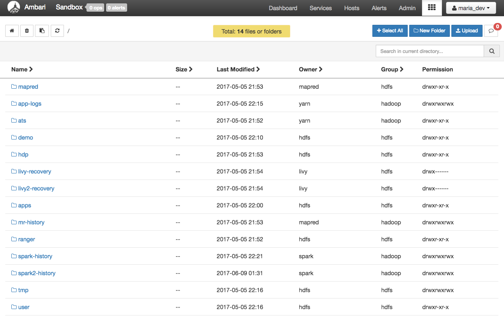
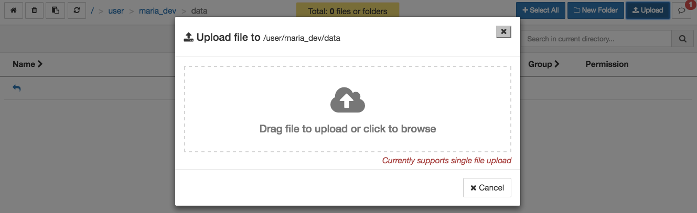
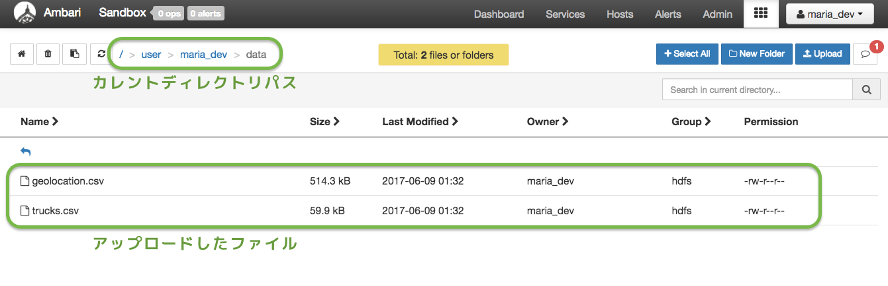

# Lab 1：センサデータをHDFSに読み込ませよう
## はじめに

このセクションでは，Ambari User Viewsを利用して，センサデータをダウンロードし，HDFSに読み込ませます．ファイルを管理するために，Ambari Files User Viewを導入します．ディレクトリの作成，ファイルシステムの案内，HDFSへのファイルのアップロードなどのタスクを実行します．さらに，他のファイル関連のタスクも実行します．基礎を習得したら，Ambari File User Viewを利用して，2つのファイルをHDFSに読み込ませましょう．

## 前提条件

このチュートリアルは，Hortonworks Sandboxを利用して，HDPに入門するための一連のチュートリアルの一部です．このチュートリアルを進める前に，以下の条件を満たしていることを確認してください．

- [Hortonworks Sandbox](https://hortonworks.com/downloads/#sandbox)をダウンロードおよびインストール済み
- [Hortonworks Sandboxの使い方を学習している](https://hortonworks.com/hadoop-tutorial/learning-the-ropes-of-the-hortonworks-sandbox/)（任意）
- このチュートリアルを完了するのに**20分**ほど掛かります．

## 概要
- [HDFSの背景](#hdfs-backdrop)
- [Step 1.1 ：センサデータファイルをダウンロードして展開](#step1.1) - [Geolocation.zip](https://app.box.com/HadoopCrashCourseData)
- [Step 1.2：HDFSにセンサデータを読み込ませる](#step1.2)
- [まとめ](#summary)
- [参考文献](#further-reading)

## HDFSの背景 

1台の物理マシンでは，データが増加するにつれてストレージ容量が限界に達してしまいます．このデータ増加のために，データを別々のマシンに分割する必要があります．ネットワークのマシン間でデータのストレージを管理するこのタイプのファイルシステムは，分散ファイルシステムと呼ばれます．[HDFS](https://hortonworks.com/blog/thinking-about-the-hdfs-vs-other-storage-technologies/)はApache Hadoopの中心的なコンポーネントであり，コモディティハードウェアのクラスタ上で実行されるストリーミングデータアクセスパターンを含む大きなファイルを格納するように設計されています．Hortonworks Data Platform HDP 2.2では，HDFSがクラスタ内の[様々なストレージメディア](https://hortonworks.com/blog/heterogeneous-storage-policies-hdp-2-2/)をサポートするように拡張されました．

## Step 1.1：センサデータファイルをダウンロードして展開 
1. サンプルセンサデータはここからダウンロードできます： [Geolocation.zip](https://app.box.com/HadoopCrashCourseData)
2. Geolocation.zipをダウンロードし，ファイルを展開します．次のファイルを含むGeolocationフォルダが展開されます．
- geolocation.csv - これはトラックから収集されたジオロケーションデータです．トラックの場所，日付，時刻，イベントの種類，速度などを示す**レコード**が含まれています．
- trucks.csv - これはリレーショナルデータベースからエクスポートされたデータで，トラックモデル，運転手ID，トラックID，および集計された燃費（マイレージ）に関する情報が含まれています．

## Step 1.2：HDFSにセンサデータを読み込ませる 
1. Ambariのダッシュボードに移動し，**HDFS File View**を開きます．ユーザ名ボタンの横にあるメニューアイコンのボタンをクリックし，メニュー項目から**Files View**を選択します．

	

2. HDFSファイルシステムの一番上のルートから始め，ログインしているユーザ（この場合は*maria_dev*）の全てのファイルが表示されます．

	

3. `/user/maria_dev`のディレクトリのリンクをクリックして移動します．
4. 今回のユースケースで利用するデータをアップロードするために`data`ディレクトリを作成しましょう．**New Folder**のボタンをクリックして，`maria_dev`ディレクトリ内に`data`ディレクトリを作成します．そして，`data`ディレクトリに移動します．

	

**Step 1.2.1：dataフォルダにGeolocationとTrucksのCSVファイルをアップロード**

1. 新しく作成したディレクトリ`/user/maria_dev/data`にまだ移動していない場合，そのディレクトリに移動します．次に，**upload**ボタンをクリックして，**geolocation.csv**と**trucks.csv**をアップロードします．
2. ファイルのアップロードウィンドウが表示されるので，雲の画像をクリックします．

	

3. 別のウィンドウが表示されるので，2つのcsvファイルをダウンロードしたディレクトリに移動します．1度に1つのファイルが選択できるので，**Open**を押してアップロードを完了します．これを繰り返し，両方のアップロードが完了するとFiles ViewのUIに表示されます．

	

4. ここで，ファイルやディレクトリに対して，**開く**，**名前変更**，**権限変更**，**削除**，**コピー**，**移動**，**ダウンロード**，**ファイル連結**などの操作を実行できます．

	

**Step 1.1.2：データディレクトリへの書き込み権限を許可する**

1. ディレクトリ`/user/maria_dev`に含まれている`data`ディレクトリをクリックします．
2. **Permissions**をクリックします
3. 全ての**Write**ボックスの背景が**青色**にチェックされていることを確認してください．

視覚的な説明については画像を参照してください．

## まとめ 

おめでとうございます！今回のチュートリアルで得たスキルと知識をまとめましょう．
**Hadoop Distributed File System（HDFS）**は，複数のマシン間でデータを管理するために構築されたものです．そして，AmbariのHDFS **Files View**を利用することで，HDFSにデータをアップロードできます．

## 参考文献 
- [HDFS](http://hortonworks.com/apache/hdfs/)
- [Manage Files on HDFS with Command Line: Hands-on Tutorial](http://hortonworks.com/hadoop-tutorial/using-commandline-manage-files-hdfs/)
- [HDFS User Guide](https://hadoop.apache.org/docs/stable/hadoop-project-dist/hadoop-hdfs/HdfsUserGuide.html)
- Build your HDFS Architecture Knowledge [HDFS Architecture Guide](https://hadoop.apache.org/docs/r1.0.4/hdfs_design.html)
- [HDP OPERATIONS: HADOOP ADMINISTRATION](http://hortonworks.com/training/class/hdp-operations-hadoop-administration-1/)

### [前へ](tutorial-1.md) | [次へ](tutorial-3.md)

