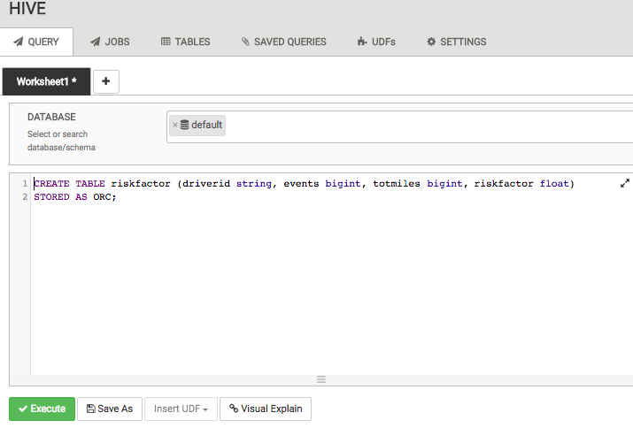

# Lab 3：Pigでリスクファクタを算出しよう
## はじめに

このチュートリアルでは，[Apache Pig](https://hortonworks.com/hadoop/pig/)について説明します．最初のセクションでは，HDFSにデータを読み込ませ，Hiveを利用してデータを操作する方法を学習しました．Truckのセンサデータを利用して，全てのドライバに関するリスクをよく理解しているはずです．このセクションでは，Apache Pigを利用して，リスクを計算する方法について説明します．

## 前提条件

このチュートリアルは，Hortonworks Sandboxを利用して，HDPに入門するための一連のチュートリアルの一部です．このチュートリアルを進める前に，以下の条件を満たしていることを確認してください．

- Hortonworks Sandbox
- [Hortonworks Sandboxの使い方を学習している](https://hortonworks.com/hadoop-tutorial/learning-the-ropes-of-the-hortonworks-sandbox/)
- Lab 1：センサデータをHDFSに読み込ませよう
- Lab 2：Hiveでデータ操作をしよう
- このチュートリアルを完了するのに1時間ほど掛かります．

## 概要
- [Pigの基本](#pig-basics)
- [Step 3.1：Pigスクリプトの作成](#step3.1)
- [Step 3.2：Quick Recap](#step3.2)
- [Step 3.3：TezでPigスクリプトを実行](#step3.3)
- [まとめ](#summary)
- [参考文献](#further-reading)

## Pigの基本 <a id="pig-basics"></a>

PigはApache Hadoopで利用される高水準なスクリプト言語です．Pigを利用すると，データを扱う人はJavaを知らずとも複雑なデータ変換を記述できます．PigのシンプルなSQLのようなスクリプト言語はPig Latinと呼ばれ，スクリプト言語やSQLに精通している開発者には魅力的です．

Apache Hadoopで必要な全てのデータ操作はPigで行うことができます．Pigのユーザ定義関数（UDF）機能により，JRuby，Jython，Javaなどの多くの言語でコードを呼び出すことができます．他の言語のPigスクリプトも埋め込むことができます．それにより，Pigをコンポーネントとして利用して，実際のビジネス上の問題に取り組む，より巨大で複雑なアプリケーションを構築できるようになります．

Pigは構造化データや非構造化データを含む，多くのソースからデータを処理し，その結果をHadoopデータファイルシステムに格納します．

Pigのスクリプトは，Apache Hadoopクラスタで実行される一連のMapReduceジョブに変換されます．

**trucks_mileageデータからriskfactorテーブルを作成する**

次にPigを利用して各ドライバのリスクファクタを計算します．Pigコードを実行する前に，HCatStorer() クラスの要件を1つ満たすテーブルがHiveに存在している必要があります．Pigコードは，riskfactorという名前のテーブルに対して次の構造を想定しています．Hive View 2.0クエリエディタで以下のDDLを実行します．

```sql
CREATE TABLE riskfactor (driverid string, events bigint, totmiles bigint, riskfactor float)
STORED AS ORC;
```



**riskfactorテーブルが正常に作成されたことを確認する**

`riskfactor`テーブルが正常に作成されたことを確認します．今は中には何もありませんが，Pigスクリプトを入力していきます．これで，Pigを利用してリスクファクタを計算する準備が整いました．PigとAmbariの中からPigスクリプトを実行する方法を確認していきましょう．


## Step 3.1：Pigスクリプトの作成 <a id="step3.1"></a>

このステップでは，Pigスクリプトを作成して実行します．Ambari Pig Viewを利用します．それでは始めましょう．

**Step 3.1.1：Ambari Pig User Viewの画面に入る**

メニューからPig Viewを選択して，Ambari Pig User Viewに移動します．


Ambari Pig User Viewのインターフェースには，まだスクリプトが存在しないので以下のように表示されます．


左側にはスクリプトのリストがあり，右側にはスクリプトを書くための構成ボックスがあります．特別なインターフェース機能は，スクリプトファイルの名前の下に存在する`PIG helper`です．Pigヘルパーはステートメント，関数，I/Oステートメント，HCatLoader()およびPythonユーザ定義関数のテンプレートを提供します．一番下にはスクリプトとログファイルの結果を示すステータス領域があります．

次のスクリーンショットでは，Pig Viewの様々なコンポーネントと機能を示しています．


**Step 3.1.2：新しいスクリプトを作成する**

それではPigスクリプトを記述しましょう．ビューの右上隅にある**New Script**ボタンをクリックします．


名前を`riskfactor.pig`にし，**Create**ボタンをクリックします．


**Step 3.1.3：HCatalogを利用して，Pigのデータを読み込む**

HCatalogを利用してPigのデータを読み込みます．HCatalogでは，Hadoop環境内のツールやユーザ間でスキーマを共有できます．また，クエリやスクリプトからスキーマや位置情報を除外し，それらを共有のスクリプトに集約させることもできます．HCatalogにあるので，HCatLoader()関数も利用することができます．Pigではテーブルに名前やエイリアスをつけることができ，スペースの割り当てや構造の定義を気にする必要はありません．テーブルをどのように処理しているかを気にする必要があります．


- スクリプトファイルの名前の下にあるPig helperを利用して，その行のテンプレートを利用することができます．Pig helper => HCatalog => LOAD テンプレートをクリックしてください．
- %TABLE%エントリは赤色で強調表示されています．`geolocation`であるテーブルの名前を入力します．
- テンプレートの前に`a =` を忘れずに入力してください．これで結果をaに保存します．`=`の前後にスペースが必要であることに注意してください．
- 完成したコードは以下のようになります．

```pig
a = LOAD 'geolocation' USING org.apache.hive.hcatalog.pig.HCatLoader();
```

上記のスクリプトはこの場合，HCatLoader()関数を利用して`geolocation`という名前のファイルからデータを読み込みます．上記のPigコードをriskfactor.pigウィンドウにコピー＆ペーストします．

注：load演算子の詳細は，[Pig Latin Basics - load](http://pig.apache.org/docs/r0.14.0/basic.html#load)を参照してください．

**Step 3.1.4：データセットをフィルタリングする**

次のステップは，レコードのサブセットを選択することです．そのためイベントが正常ではないドライバのレコードが存在します．これをPigで行うためにFilter演算子を利用します．テーブルをPigでフィルタリンクし，`event !=` `"``normal``"`な全てのレコードを保存し，これをbに格納します．この簡単なステートメントで，Pigはテーブルの各レコードを検索し，条件を満たさないレコードを全て除外してくれます．


- Pig Helper => Relatinal Operators => FILTERテンプレートをクリックして，Pigヘルプを再び利用することができます．
- %VAR%を”a”に置き換えることができます（ヒント：タブは次のフィールドにジャンプします）．
- %COND%は`event !=` `'``normal``'``;`です（注：通常は一重引用符を利用し，忘れずに末尾のセミコロンを付ける必要があります）．
- 完成したコードは以下のようになります．

```pig
b = filter a by event != 'normal';
```

上記のPigコードをriskfactor.pigウィンドウにコピー＆ペーストします．

注：filter演算子の詳細は，[Pig Latin Basics - filter](http://pig.apache.org/docs/r0.14.0/basic.html#filter)を参照してください．

**Step 3.1.5：データセットをイテレートする**

適切なレコードセットがあるので，それらを繰り返し処理してみましょう．グループ化されたデータに対して，`foreach`演算子を利用して，すべてのレコードを反復処理します．また，ドライバに関する非正常なイベントの数を知りたいので，データセットの全ての行に`1`を追加します．


- Pig helper => Relation Operators => FOREACHテンプレートをクリックして，再度Pig Helpを利用してください．
- %DATA%はbで，2番目の%NEW_DATA%はdriveid，event，整数1として存在します
- 完成したコードは以下のようになります

```pig
c = foreach b generate driverid, event, (int) '1' as occurance;
```

上記のPigコードを`riskfactor.pig`ウィンドウにコピー＆ペーストします．

注：foreach演算子の詳細は，[Pig Latin Basics - foreach](http://pig.apache.org/docs/r0.14.0/basic.html#foreach)を参照してください．

**Step 3.1.6：各ドライバの非正常なイベントの総数を計算する**

group文は，レコードを1つ以上の関係でグループ化することができます．今回の場合，ドライバIDをグループ化して，各行を繰り返して，非正常なイベントを合計します．


- Pig helper => Relational Operators => GROUP %VAR% BY %VAR%テンプレートを利用します．
- 最初の%VAR%はcで，2番めの%VAR%はdriveidです
- 完成したコードは以下のようになります

```pig
d = group c by driverid;
```

上記のPigコードを`riskfactor.pig`ウィンドウにコピー＆ペーストします．
次にイベントを追加するためにForeach文を再度利用します．

```pig
e = foreach d generate group as driverid, SUM(c.occurance) as t_occ;
```

注：group演算子の詳細は，[Pig Latin Basics - group](http://pig.apache.org/docs/r0.14.0/basic.html#group)を参照してください．

**Step 3.1.7：drivermileageテーブルの読み込みと結合操作を実行する**

このセクションでは，Hcatalogを利用してdrivemileageテーブルをPigに読み込ませ，driveidに対して結合操作を実行します．得られたデータセットは，特定のドライバの合計マイル数と非正常イベント総数を返します．


- Hcatloader()を利用してdrivermileageを読み込む

```pig
g = LOAD 'drivermileage' using org.apache.hive.hcatalog.pig.HCatLoader();
```

- Pig helper => Relational Operators => JOIN %VAR% BYテンプレートを利用します．
- %VAR％をeに置換し，BYのあとに`driverid， g by driverid;`を挿入します 
- 完成したコードは以下のようになります．

```sql
h = join e by driverid, g by driverid;
```

上記のPigコードを`riskfactor.pig`ウィンドウにコピー＆ペーストします．

注：join演算子の詳細は，[Pig Latin Basics - join](http://pig.apache.org/docs/r0.14.0/basic.html#join)を参照してください．

**Step 3.1.8：ドライバのリスクファクタを算出する**

このセクションでは，ドライバのリスクファクタを全てのドライバに関連付けます．ドライバのリスクファクタを計算するには，非正常な事故の発生数を合計マイル数で除算します．


- Foreach文を利用して，ドライバごとのドライバリスク係数を計算します．
- 以下のコードを利用して，Pigスクリプトに貼り付けます．

```pig
final_data = foreach h generate $0 as driverid, $1 as events, $3 as totmiles, (float) $3/$1 as riskfactor;
```

- 最後のステップとして，Hcatalogを利用してデータをテーブルに格納します．

```pig
store final_data into 'riskfactor' using org.apache.hive.hcatalog.pig.HCatStorer();
```

上記に最終的なコードを示します．

注：store演算子の詳細は，[Pig Latin Basics - store](http://pig.apache.org/docs/r0.14.0/basic.html#store)を参照してください．

**Step 3.1.9：Pig引数を追加**

引数`-useHCatalog`（大文字小文字を区別します）をPigに追加します．


最終的なPigスクリプトは以下のようになります．

```pig
a = LOAD 'geolocation' using org.apache.hive.hcatalog.pig.HCatLoader();
b = filter a by event != 'normal';
c = foreach b generate driverid, event, (int) '1' as occurance;
d = group c by driverid;
e = foreach d generate group as driverid, SUM(c.occurance) as t_occ;
g = LOAD 'drivermileage' using org.apache.hive.hcatalog.pig.HCatLoader();
h = join e by driverid, g by driverid;
final_data = foreach h generate $0 as driverid, $1 as events, $3 as totmiles, (float) $3/$1 as riskfactor;
store final_data into 'riskfactor' using org.apache.hive.hcatalog.pig.HCatStorer();
```


`riskfactor.pig`を保存するには，左側の列の`Save`ボタンをクリックします．

## Step 3.2：Quick Recap <a id="step3.2"></a>

コードを実行する前にもう一度見直しましょう．

- 行aは，HCatalogからGeolocationテーブルを読み込みます．
- 行bは，イベントが「正常」ではない全て行をフィルタリングします．
- 次に，occurrenceという列を追加し，値`1`を割り当てます．
- レコードをdriveridでグループ化し，各ドライバの発生数を合成します．
- この時点で各ドライバのマイル情報が必要なので，Hiveを利用して作成したテーブルを読み込みます．
- 最終結果を出すため，driveridによってeでのイベント数とgのマイレージデータを結合します．
- 現在のマイル数をイベント数で除算することで，簡単にリスク係数を計算することができます．

Pigスクリプトが適切なライブラリを読み込めるよう，HCatalogを利用するようにPig Editorに設定する必要があります．Pig引数のテキストボックスに，`-useHCatalog`と入力し，Addボタンをクリックします．


Pig Viewでの引数セクションは次のようになります．


## Step 3.3：TezでPigスクリプトを実行 <a id="step3.3"></a>

**Step 3.3.1：Pigスクリプトを実行する**

**Execute on Tez**チェックボックスをクリックし，最後に青の**Execute**ボタンを押してジョブを送信します．Pigのジョブはクラスタに送られ，Pigジョブの実行状況を示す新しいタブが生成されます．上部にはジョブの進捗状況バーが表示されます．


**Step 3.3.2：結果セクションの表示**

ジョブが完了するのを待機すると，ジョブの出力が結果セクションに表示されます．スクリプトは結果を出力しないことに注意してください．結果はHiveテーブルに保存されるので，結果セクションには何も表示されません．


**Logs**ドロップダウンメニューをクリックして，スクリプト実行時の状況を確認します．ここにエラーが表示されます．

**Step 3.3.3：ログの表示セクション（デバッグ練習）**

**Why are Logs important?**

ログセクションは，期待していた出力が行われなかった後にコードをデバッグするのに役立ちます．例えば，次のセクションでは，riskfactorテーブルからサンプルデータを読み込み，何も表示されません．ジョブが失敗した原因をログに記録します．起こりうる共通の問題はPigがGeolocationテーブルやdrivermileageテーブルからデータを正常に読み取ることができない場合です．

これらのテーブルから読み取られたPigが正常か確認し，そのデータをriskfactorテーブルに格納しましょう．以下と同様の出力が得られるはずです．


ログはPigスクリプトについてどのような結果を示しているか．


- Geolocationテーブルから8000レコードを読み込む
- drivermileageテーブルから100レコードを読み込む
- riskfactorテーブルに99レコードを格納

**Step 3.3.4：Pigスクリプトが正常にHiveテーブルに挿入されたかどうか確認**

Ambari Hive View 2.0に戻って，riskfactorテーブルを参照して，Pigジョブがこのテーブルに正常に入力されているか確認します．ここには以下のように表示されているはずです．


このとき，ガロンあたりの平均トラックマイルテーブル（avg_mileage）とリスクファクタテーブル（riskfactor）が存在しているはずです．

## まとめ <a id="summary"></a>

おめでとうございます！このチュートリアルで学んだPigコマンドをまとめて，GeolocationデータとTruckデータのリスクファクタ分析を計算しましょう．今回，HiveからLOAD {hive_table}…HCatLoader()スクリプトを利用してデータにアクセスする方法を学びました．foreach，group，joinまたはstore {hive_table}…HCatStorer()スクリプトを利用して，データを操作，変換，および処理できるようになりました．これらの演算子の詳細を確認するには各演算子のドキュメントを含む[Pig Latin Basics](http://pig.apache.org/docs/r0.14.0/basic.html)をご覧ください．

## 参考文献 <a id="furher-reading"></a>

Pig Latinの基礎を学び，これらのリソースを利用して膨大なデータセットを処理および分析する上で，このスクリプトプラットフォームが有益である理由を更に知ることができます．


- Pigプログラミングについては更に勉強したいときは[Pig Tutorials](https://hortonworks.com/hadoop/pig/#tutorials)をどうぞ
- [Apache Pig](https://hortonworks.com/hadoop/pig/)
- [Programming Pig](http://www.amazon.com/Programming-Pig-Alan-Gates/dp/1449302645/ref=sr_1_2?ie=UTF8&qid=1455994738&sr=8-2&keywords=pig+latin&refinements=p_72%3A2661618011)
- Pigの様々な演算子については[Pig Latin Basics](http://pig.apache.org/docs/r0.14.0/basic.html)を参照してください
- [HDP DEVELOPER: APACHE PIG AND HIVE](https://hortonworks.com/training/class/hadoop-2-data-analysis-pig-hive/)


### [前へ](tutorial-3.md) | [次へ](tutorial-5.md)