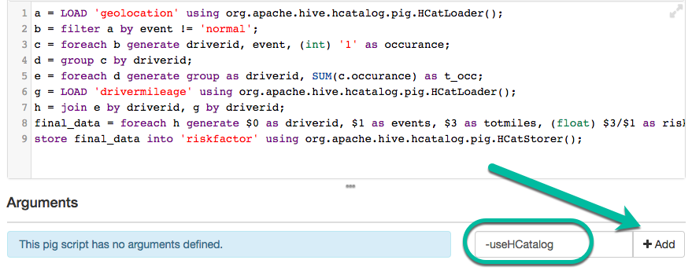
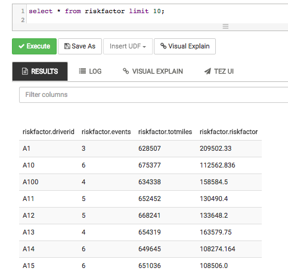

# Hadoop Tutorial – Getting Started with HDP

## Pig - Risk Factor

## Introduction

In this tutorial, you will be introduced to [Apache Pig](https://hortonworks.com/hadoop/pig/). In the earlier section of lab, you learned how to load data into HDFS and then manipulate it using Hive. We are using the Truck sensor data to better understand risk associated with every driver. This section will teach you to **compute risk using Apache Pig**.

## Prerequisites

The tutorial is a part of series of hands on tutorial to get you started on HDP using Hortonworks sandbox. Please ensure you complete the prerequisites before proceeding with this tutorial.

-   Hortonworks Sandbox
-   [Learning the Ropes of the Hortonworks Sandbox](https://hortonworks.com/tutorial/learning-the-ropes-of-the-hortonworks-sandbox/)
-   Loading Sensor Data into HDFS
-   Hive - Data ETL

## Outline

-   [Pig Basics](#pig-basics)
-   [Create Pig Script](#create-pig-script)
-   [Quick Recap](#quick-recap)
-   [Execute Pig Script on Tez](#execute-pig-script-on-tez)
-   [Summary](#summary)
-   [Further Reading](#further-reading)

## Pig Basics

Pig is a **high-level scripting language** used with Apache Hadoop. Pig enables data workers to **write complex data transformations** without knowing Java. Pig’s _simple SQL-like scripting language_ is called Pig Latin, and appeals to developers already familiar with scripting languages and SQL.

Pig is complete, so you can do all required data manipulations in Apache Hadoop with Pig. Through the **User Defined Functions**(UDF) facility in Pig, Pig can invoke code in many languages like _JRuby, Jython and Java_. You can also embed Pig scripts in other languages. The result is that you can use Pig as a component to build larger and more complex applications that tackle real business problems.

Pig works with data from many sources, including **structured and unstructured data**, and store the results into the Hadoop Data File System.

Pig scripts are **translated into a series of MapReduce jobs** that are **run on the Apache Hadoop cluster**.

### Create Table riskfactor from Existing trucks_mileage Data

Next, you will use Pig to compute the risk factor of each driver. Before we can run the Pig code, the _table must already exist in Hive_ to satisfy one of the _requirements for the HCatStorer() class_. The Pig code expects the following structure for a table named `riskfactor`. Execute the following DDL in the Hive View 2.0 query editor:

~~~sql
CREATE TABLE riskfactor (driverid string, events bigint, totmiles bigint, riskfactor float)
STORED AS ORC;
~~~

### Verify Table riskfactor was Created Successfully

Verify the `riskfactor` table was created successfully. It will be empty now, but you will populate it from a Pig script. You are now ready to compute the risk factor using Pig. Let’s take a look at Pig and how to execute Pig scripts from within Ambari.

## Create Pig Script

In this phase of the tutorial, we create and run a Pig script. We will use the Ambari Pig View. Let’s get started…

### Log in to Ambari Pig User Views

To get to the Ambari Pig View, click on the Ambari Views icon at top right and select **Pig**:

This will bring up the Ambari Pig User View interface. Your Pig View does not have any scripts to display, so it will look like the following:

On the left is a list of your scripts, and on the right is a composition box for writing scripts. A **special interface feature** is the _Pig helper_ located below the name of your script file. The _Pig helper_ provides us with templates for the statements, functions, I/O statements, HCatLoader() and Python user defined functions. At the very bottom are status areas that will show the results of our script and log files.

The following screenshot shows and describes the various components and features of the Pig View:

### Create a New Script

Let’s enter a Pig script. Click the **New Script** button in the upper-right corner of the view:

Name the script **riskfactor.pig**, then click the **Create** button:

### Load Data in Pig using Hcatalog

We will use **HCatalog** to _load data into Pig_. HCatalog allows us to _share schema across tools_ and users within our Hadoop environment. It also allows us to _factor out schema_ and _location information from_ our _queries and scripts_ and _centralize them in a common repository_. Since it is in HCatalog we can use the **HCatLoader() function**. Pig allows us to give the table a name or alias and not have to worry about allocating space and defining the structure. We just have to worry about how we are processing the table.

-   We can use the Pig helper located below the name of your script file to give us a template for the line. Click on the **Pig helper -> HCatalog -> LOAD** template
-   The entry **%TABLE%** is highlighted in red for us. Type the name of the table which is `geolocation`.
-   Remember to add the **a =** before the template. This saves the results into a. Note the **‘=’** has to have a space before and after it.
-   Our completed line of code will look like:

~~~pig
a = LOAD 'geolocation' USING org.apache.hive.hcatalog.pig.HCatLoader();
~~~

The script above loads data, in our case, from a file named **geolocation** using the _HCatLoader()_ function. Copy-and-paste the above Pig code into the riskfactor.pig window.

> Note: Refer to [Pig Latin Basics - load](http://pig.apache.org/docs/r0.14.0/basic.html#load) to learn more about the **load** operator.

### Filter your data set

The next step is to **select a subset of the records**, so we have the records of drivers _for which the event is not normal_. To do this in Pig we **use the Filter operator**. We **instruct Pig to Filter** our table and keep _all records where event !=“normal”_ and store this in b. With this one simple statement, Pig will look at each record in the table and filter out all the ones that do not meet our criteria.

-   We can use Pig Help again by clicking on the **Pig helper-> Relational Operators -> FILTER** template
-   We can replace **%VAR%** with **“a”** (hint: tab jumps you to the next field)
-   Our **%COND%** is “**event !='normal';** ” (note: single quotes are needed around normal and don’t forget the trailing semi-colon)
-   Complete line of code will look like:

~~~pig
b = filter a by event != 'normal';
~~~

Copy-and-paste the above Pig code into the riskfactor.pig window.

> Note: Refer to [Pig Latin Basics - filter](http://pig.apache.org/docs/r0.14.0/basic.html#filter) to learn more about the **filter** operator.

### Iterate your data set

Since we have the right set of records, let's iterate through them. We use the **“foreach”** operator on the grouped data to iterate through all the records. We would also like to **know the number of non normal events associated with a driver**, so to achieve this we _add ‘1’ to every row_ in the data set.

-   Use Pig Help again by clicking on the **Pig helper -> Relational Operators -> FOREACH** template
-   Our **%DATA%** is **b** and the second **%NEW_DATA%** is “**driverid, event, (int) ‘1’ as occurance;**”
-   Complete line of code will look like:

~~~pig
c = foreach b generate driverid, event, (int) '1' as occurance;
~~~

Copy-and-paste the above Pig code into the riskfactor.pig window:

> Note: Refer to [Pig Latin Basics - foreach](http://pig.apache.org/docs/r0.14.0/basic.html#foreach) to learn more about the **foreach** operator.

### Calculate the total non normal events for each driver

The **group** statement is important because it _groups the records by one or more relations_. In our case, we want to group by driver id and iterate over each row again to sum the non normal events.

-   Use the template **Pig helper -> Relational Operators -> GROUP %VAR% BY %VAR%**
-   First **%VAR%** takes **“c”** and second **%VAR%** takes “**driverid;**”
-   Complete line of code will look like:

~~~pig
d = group c by driverid;
~~~

Copy-and-paste the above Pig code into the riskfactor.pig window.

*   Next use Foreach statement again to add the occurance.

~~~pig
e = foreach d generate group as driverid, SUM(c.occurance) as t_occ;
~~~

> Note: Refer to [Pig Latin Basics - group](http://pig.apache.org/docs/r0.14.0/basic.html#group) to learn more about the **group** operator.

### Load drivermileage Table and Perform a Join Operation

In this section, we will load drivermileage table into Pig using **Hcatlog** and perform a **join** operation on driverid. The **resulting data** set will _give us total miles and total non normal events_ for a particular driver.

-   Load drivermileage using HcatLoader()

~~~pig
g = LOAD 'drivermileage' using org.apache.hive.hcatalog.pig.HCatLoader();
~~~

-   Use the template **Pig helper ->Relational Operators->JOIN %VAR% BY**
-   Replace **%VAR%** by ‘**e**’ and after **BY** put ‘**driverid, g by driverid;**’
-   Complete line of code will look like:

~~~pig
h = join e by driverid, g by driverid;
~~~

Copy-and-paste the above two Pig codes into the riskfactor.pig window.

> Note: Refer to [Pig Latin Basics - join](http://pig.apache.org/docs/r0.14.0/basic.html#join) to learn more about the **join** operator.

### Compute Driver Risk factor

In this section, we will associate a driver risk factor with every driver. To **calculate driver risk factor**, _divide total miles travelled by non normal event occurrences_.

-   We will use **Foreach** statement again to compute driver risk factor for each driver.
-   Use the following code and paste it into your Pig script.

~~~pig
final_data = foreach h generate $0 as driverid, $1 as events, $3 as totmiles, (float) $3/$1 as riskfactor;
~~~

-   As a final step, **store the data** into a table _using Hcatalog_.

~~~pig
store final_data into 'riskfactor' using org.apache.hive.hcatalog.pig.HCatStorer();
~~~
Here is the final code and what it will look like once you paste it into the editor.

> Note: Refer to [Pig Latin Basics - store](http://pig.apache.org/docs/r0.14.0/basic.html#store) to learn more about the **store** operator.

### Add Pig argument

Add Pig argument **-useHCatalog** (Case Sensitive).

**Final Pig script should look like:**

~~~pig
a = LOAD 'geolocation' using org.apache.hive.hcatalog.pig.HCatLoader();
b = filter a by event != 'normal';
c = foreach b generate driverid, event, (int) '1' as occurance;
d = group c by driverid;
e = foreach d generate group as driverid, SUM(c.occurance) as t_occ;
g = LOAD 'drivermileage' using org.apache.hive.hcatalog.pig.HCatLoader();
h = join e by driverid, g by driverid;
final_data = foreach h generate $0 as driverid, $1 as events, $3 as totmiles, (float) $3/$1 as riskfactor;
store final_data into 'riskfactor' using org.apache.hive.hcatalog.pig.HCatStorer();
~~~

Save the file `riskfactor.pig` by clicking the **Save** button in the left-hand column.

## Quick Recap

Before we execute the code, let’s review the code again:

-   The line `a = ` loads the geolocation table from HCatalog.
-   The line `b = ` filters out all the rows where the event is not ‘Normal’.
-   Then we add a column called occurrence and assign it a value of 1.
-   We then group the records by driverid and sum up the occurrences for each driver.
-   At this point we need the miles driven by each driver, so we load the table we created using Hive.
-   To get our final result, we join by the driverid the count of events in e with the mileage data in g.
-   Now it is real simple to calculate the risk factor by dividing the miles driven by the number of events

You need to configure the Pig Editor to use HCatalog so that the Pig script can load the proper libraries. In the Pig arguments text box, enter **-useHCatalog** and click the **Add** button:

> **Note** this argument is **case sensitive**. It should be typed exactly `-useHCatalog`.

The **Arguments** section of the Pig View should now look like the following:

## Execute Pig Script on Tez

### Execute Pig Script

Click **Execute on Tez** checkbox and finally hit the blue **Execute** button to submit the job. Pig job will be submitted to the cluster. This will generate a new tab with a status of the running of the Pig job and at the top you will find a progress bar that shows the job status.

### View Results Section

Wait for the job to complete. The output of the job is displayed in the **Results** section. Notice your script does not output any result – it stores the result into a Hive table – so your Results section will be empty.

Click on the **Logs** dropdown menu to see what happened when your script ran. Errors will appear here.

### View Logs section (Debugging Practice)

**Why are Logs important?**

The logs section is helpful when debugging code after expected output does not happen. For instance, say in the next section, we load the sample data from our **riskfactor** table and nothing appears. Logs will tell us why the job failed. A common issue that could happen is that pig does not successfully read data from the **geolocation** table or **drivermileage** table. Therefore, we can effectively address the issue.

Let's verify pig read from these tables successfully and stored the data into our **riskfactor** table. You should receive similar output:

What results do our logs show us about our Pig Script?

-   Read 8000 records from our **geolocation** table
-   Read 100 records from our **drivermileage** table
-   Stored 99 records into our **riskfactor** table

### Verify Pig Script Successfully Populated Hive Table

Go back to the Ambari Hive View 2.0 and browse the data in the `riskfactor` table to verify that your Pig job successfully populated this table. Here is what is should look like:

At this point we now have our truck average miles per gallon table (`avg_mileage`) and our risk factor table (`riskfactor`).

## Summary

Congratulations! Let’s summarize the Pig commands we learned in this tutorial to compute risk factor analysis on the geolocation and truck data. We learned to use Pig to access the data from Hive using the **LOAD {hive_table} …HCatLoader()** script. Therefore, we were able to perform the **filter**, **foreach**, **group**, **join**, and **store {hive_table} …HCatStorer()** scripts to manipulate, transform and process this data. To review these bold pig latin operators, view the [Pig Latin Basics](http://pig.apache.org/docs/r0.14.0/basic.html), which contains documentation on each operator.

## Further Reading

Strengthen your foundation of pig latin and reinforce why this scripting platform is benficial for processing and analyzing massive data sets with these resources:

-   To practice more pig programming, visit [Pig Tutorials](https://hortonworks.com/hadoop/pig/#tutorials)
-   [Apache Pig](https://hortonworks.com/hadoop/pig/)
-   [Programming Pig](http://www.amazon.com/Programming-Pig-Alan-Gates/dp/1449302645/ref=sr_1_2?ie=UTF8&qid=1455994738&sr=8-2&keywords=pig+latin&refinements=p_72%3A2661618011)
-   learn more about the various Pig operators, refer to [Pig Latin Basics](http://pig.apache.org/docs/r0.14.0/basic.html)
-   [HDP DEVELOPER: APACHE PIG AND HIVE](https://hortonworks.com/training/class/hadoop-2-data-analysis-pig-hive/)
