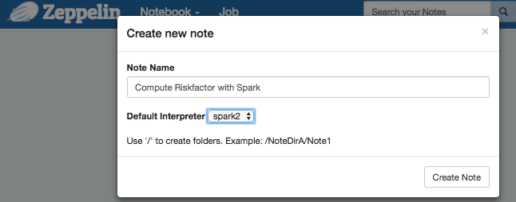
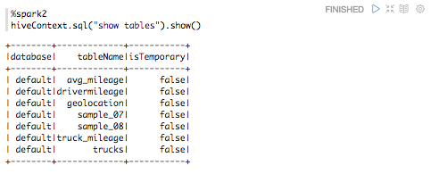
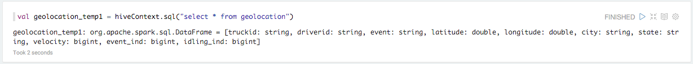
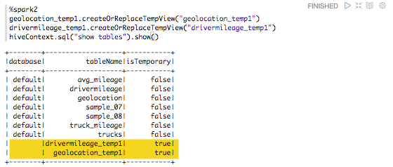
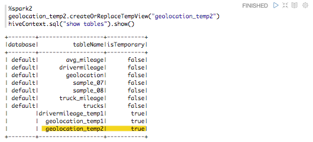
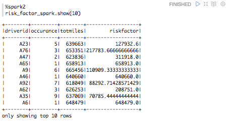
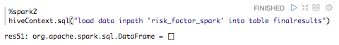
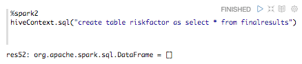
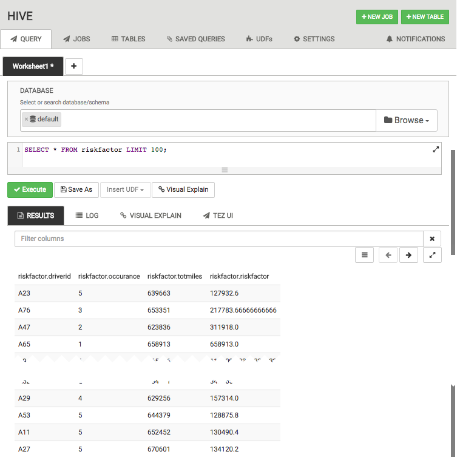

# Hadoop Tutorial – Getting Started with HDP

## Spark - Risk Factor

## Introduction

In this tutorial we will introduce Apache Spark. In the earlier section of the lab you have learned how to load data into HDFS and then manipulate it using Hive. We are using the Truck sensor data to better understand risk associated with every driver. This section will teach you how to compute risk using Apache spark.

## Prerequisites

This tutorial is a part of a series of hands on tutorials to get you started on HDP using the Hortonworks sandbox. Please ensure you complete the prerequisites before proceeding with this tutorial.

-   Hortonworks Sandbox
-   [Learning the Ropes of the Hortonworks Sandbox](https://hortonworks.com/tutorial/learning-the-ropes-of-the-hortonworks-sandbox/)
-   Loading Sensor Data into HDFS
-   Hive - Data ETL

## Outline

-   [Concepts](#concepts)
-   [Apache Spark Basics](#apache-spark-basics)
-   [Configure Spark services using Ambari](#configure-spark-services-using-ambari)
-   [Create a Hive Context](#create-a-hive-context)
-   [Create a RDD from Hive Context](#create-a-rdd-from-hive-context)
-   [Querying Against a Table](#querying-against-a-table)
-   [Load and save data into Hive as ORC](#load-and-save-data-into-hive-as-orc)
-   [Full Spark Code Review](#full-spark-code-review)
-   [Summary](#summary)
-   [Further Reading](#further-reading)
-   [Appendix A: Run Spark in the Spark Interactive Shell](#run-spark-in-shell)

## Concepts

MapReduce has been useful, but the amount of time it takes for the jobs to run can at times be exhaustive. Also, MapReduce jobs only work for a specific set of use cases. There is a need for computing framework that works for a wider set of use cases.

Apache Spark was designed to be a fast, general-purpose, easy-to-use computing platform. It extends the MapReduce model and takes it to a whole other level. The speed comes from the in-memory computations. Applications running in memory allow for much faster processing and response.

## Apache Spark Basics

[Apache Spark](https://hortonworks.com/hadoop/spark/) is a fast, in-memory data processing engine with elegant and expressive development [APIs](https://spark.apache.org/docs/1.6.1/api/R/index.html) in [Scala](https://spark.apache.org/docs/1.6.1/api/scala/index.html#package),[Java](https://spark.apache.org/docs/1.6.1/api/java/index.html), and [Python](https://spark.apache.org/docs/1.6.1/api/python/index.html) and [R](https://spark.apache.org/docs/1.6.1/api/R/index.html) that allow data workers to efficiently execute machine learning algorithms that require fast iterative access to datasets. Spark on [Apache Hadoop YARN](https://hortonworks.com/hadoop/YARN) enables deep integration with Hadoop and other YARN enabled workloads in the enterprise.

You can run batch application such as MapReduce types jobs or iterative algorithms that build upon each other. You can also run interactive queries and process streaming data with your application. Spark also provides a number of libraries which you can easily use to expand beyond the basic Spark capabilities such as Machine Learning algorithms, SQL, streaming, and graph processing. Spark runs on Hadoop clusters such as Hadoop YARN or Apache Mesos, or even in a Standalone Mode with its own scheduler. The Sandbox includes both Spark 1.6 and Spark 2.0.

Let's get started!

## Configure Spark services using Ambari

1\.  Log on to Ambari Dashboard as `maria_dev`. At the bottom left corner of the services column, check that Spark and Zeppelin are running.

**Note:** If these services are disabled, start these services.

2\. Open Zeppelin interface using browser URL:

~~~
http://sandbox.hortonworks.com:9995
~~~

You should see a Zeppelin Welcome Page:

Optionally, if you want to find out how to access the Spark shell to run code on Spark refer to [Appendix A](#run-spark-in-shell).

3\.  Create a Zeppelin Notebook

Click on a Notebook tab at the top left and select **Create new note**. Name your notebook `Compute Riskfactor with Spark`.

## Create a Hive Context

For improved Hive integration, [ORC file](https://hortonworks.com/blog/orcfile-in-hdp-2-better-compression-better-performance/) support for Spark. This allows Spark to read data stored in ORC files. Spark can leverage ORC file’s more efficient columnar storage and predicate pushdown capability for even faster in-memory processing. HiveContext is an instance of the Spark SQL execution engine that integrates with data stored in Hive. The more basic SQLContext provides a subset of the Spark SQL support that does not depend on Hive. It reads the configuration for Hive from hive-site.xml on the classpath.

### Import sql libraries:

If you have gone through Pig section, you have to drop the table riskfactor so that you can populate it again using Spark. Copy and paste the following code into your Zeppelin notebook, then click the play button. Alternatively, press `shift+enter` to run the code.

~~~scala
%jdbc(hive) show tables
~~~

If you see a table named `riskfactor`, let us drop it:

~~~scala
%jdbc(hive) drop table riskfactor
~~~

To verify table has been dropped, let us do show tables again:

~~~scala
%jdbc(hive) show tables
~~~

### Instantiate SparkSession

~~~scala
%spark2
val hiveContext = new org.apache.spark.sql.SparkSession.Builder().getOrCreate()
~~~

## Create a RDD from Hive Context

**What is a RDD?**

Spark’s primary core abstraction is called a Resilient Distributed Dataset or RDD. It is a distributed collection of elements that is parallelized across the cluster. In other words, a RDD is an immutable collection of objects that is partitioned and distributed across multiple physical nodes of a YARN cluster and that can be operated in parallel.

There are three methods for creating a RDD:

1.  Parallelize an existing collection. This means that the data already resides within Spark and can now be operated on in parallel.
2.  Create a RDD by referencing a dataset. This dataset can come from any storage source supported by Hadoop such as HDFS, Cassandra, HBase etc.
3.  Create a RDD by transforming an existing RDD to create a new RDD.

We will be using the later two methods in our tutorial.

**RDD Transformations and Actions**

Typically, RDDs are instantiated by loading data from a shared filesystem, HDFS, HBase, or any data source offering a Hadoop InputFormat on a YARN cluster.

Once a RDD is instantiated, you can apply a [series of operations](https://spark.apache.org/docs/1.2.0/programming-guide.html#rdd-operations). All operations fall into one of two types: [transformations](https://spark.apache.org/docs/1.2.0/programming-guide.html#transformations) or [actions](https://spark.apache.org/docs/1.2.0/programming-guide.html#actions).

-   **Transformation** operations, as the name suggests, create new datasets from an existing RDD and build out the processing DAG that can then be applied on the partitioned dataset across the YARN cluster. Transformations do not return a value. In fact, nothing is evaluated during the definition of these transformation statements. Spark just creates these Direct Acyclic Graphs or DAG, which will only be evaluated at runtime. We call this *lazy* evaluation.
-   An **Action** operation, on the other hand, executes a DAG and returns a value.

### View List of Tables in Hive Warehouse

Use a simple show command to see the list of tables in Hive warehouse.

~~~scala
%spark2
hiveContext.sql("show tables").show()
~~~

You will notice that the `geolocation` table and the `drivermileage` table that we created earlier in an tutorial are already listed in **Hive metastore** and can be directly queried upon.

### Query Tables To Build Spark RDD

We will do a simple select query to fetch data from `geolocation` and `drivermileage` tables to a spark variable. Getting data into Spark this way also allows to copy table schema to RDD.

~~~scala
%spark2
val geolocation_temp1 = hiveContext.sql("select * from geolocation")
~~~

~~~scala
%spark2
val drivermileage_temp1 = hiveContext.sql("select * from drivermileage")
~~~

## Querying Against a Table

### Registering a Temporary Table

Now let’s register temporary tables and use SQL syntax to query against that table.

~~~scala
%spark2
geolocation_temp1.createOrReplaceTempView("geolocation_temp1")
drivermileage_temp1.createOrReplaceTempView("drivermileage_temp1")
hiveContext.sql("show tables").show()
~~~

Next, we will perform an iteration and a filter operation. First, we need to filter drivers that have non-normal events associated with them and then count the number for non-normal events for each driver.

~~~scala
%spark2
val geolocation_temp2 = hiveContext.sql("SELECT driverid, count(driverid) occurance from geolocation_temp1 where event!='normal' group by driverid")
~~~

-   As stated earlier about RDD transformations, select operation is a RDD transformation and therefore does not return anything.

-   The resulting table will have a count of total non-normal events associated with each driver. Register this filtered table as a temporary table so that subsequent SQL queries can be applied to it.

~~~scala
%spark2
geolocation_temp2.createOrReplaceTempView("geolocation_temp2")
hiveContext.sql("show tables").show()
~~~

-   You can view the result by executing an action operation on the RDD.

~~~scala
%spark2
geolocation_temp2.show(10)
~~~

### Perform join Operation

In this section we will perform a join operation geolocation_temp2 table has details of drivers and count of their respective non-normal events. drivermileage_temp1 table has details of total miles travelled by each driver.

-   We will join two tables on common column, which in our case is `driverid`.

~~~scala
%spark2
val joined = hiveContext.sql("select a.driverid,a.occurance,b.totmiles from geolocation_temp2 a,drivermileage_temp1 b where a.driverid=b.driverid")
~~~

-   The resulting data set will give us total miles and total non-normal events for a particular driver. Register this filtered table as a temporary table so that subsequent SQL queries can be applied to it.

~~~scala
%spark2
joined.createOrReplaceTempView("joined")
hiveContext.sql("show tables").show()
~~~

-   You can view the result by executing action operation on RDD.

~~~scala
%spark2
joined.show(10)
~~~

### Compute Driver Risk Factor

In this section we will associate a driver risk factor with every driver. Driver risk factor will be calculated by dividing total miles travelled by non-normal event occurrences.

~~~scala
%spark2
val risk_factor_spark = hiveContext.sql("select driverid, occurance, totmiles, totmiles/occurance riskfactor from joined")
~~~

*   The resulting data set will give us total miles and total non normal events and what is a risk for a particular driver. Register this filtered table as a temporary table so that subsequent SQL queries can be applied to it.

~~~scala
%spark2
risk_factor_spark.createOrReplaceTempView("risk_factor_spark")
hiveContext.sql("show tables").show()
~~~

-   View the results

~~~scala
%spark2
risk_factor_spark.show(10)
~~~

## Load and Save Data into Hive as ORC

In this section we store data in a smart ORC (Optimized Row Columnar) format using Spark. ORC is a self-describing type-aware columnar file format designed for Hadoop workloads. It is optimized for large streaming reads and with integrated support for finding required rows fast. Storing data in a columnar format lets the reader read, decompress, and process only the values required for the current query. Because ORC files are type aware, the writer chooses the most appropriate encoding for the type and builds an internal index as the file is persisted.

Predicate pushdown uses those indexes to determine which stripes in a file need to be read for a particular query and the row indexes can narrow the search to a particular set of 10,000 rows. ORC supports the complete set of types in Hive, including the complex types: structs, lists, maps, and unions.

### Create an ORC table

Create a table and store it as ORC. Specifying as *orc* at the end of the SQL statement below ensures that the Hive table is stored in the ORC format.

~~~scala
%spark2
hiveContext.sql("create table finalresults( driverid String, occurance bigint, totmiles bigint, riskfactor double) stored as orc").toDF()
hiveContext.sql("show tables").show()
~~~

> Note: toDF() creates a DataFrame with columns driverid String, occurance bigint, etc.

### Convert data into ORC table

Before we load the data into hive table that we created above, we will have to convert our data file into ORC format too.

~~~scala
%spark2
risk_factor_spark.write.format("orc").save("risk_factor_spark")
~~~

### Load the data into Hive table using load data command

~~~scala
%spark2
hiveContext.sql("load data inpath 'risk_factor_spark' into table finalresults")
~~~

### Create the final table Riskfactor using CTAS

~~~scala
%spark
hiveContext.sql("create table riskfactor as select * from finalresults").toDF()
~~~

### Verify Data Successfully Populated Hive Table in Hive

Execute a select query to verify your table has been successfully stored. You can go to Ambari Hive user view to check whether the Hive table you created has the data populated in it.

## Full Spark Code Review

**Instantiate SparkSession**

~~~scala
%spark2
val hiveContext = new org.apache.spark.sql.SparkSession.Builder().getOrCreate()
~~~

**Shows tables in the default hive database**

~~~scala
hiveContext.sql("show tables").show()
~~~

**Select all rows and columns from tables, stores hive script into variable
and registers variables as RDD**

~~~scala
val geolocation_temp1 = hiveContext.sql("select * from geolocation")

val drivermileage_temp1 = hiveContext.sql("select * from drivermileage")

geolocation_temp1.createOrReplaceTempView("geolocation_temp1")
drivermileage_temp1.createOrReplaceTempView("drivermileage_temp1")

val geolocation_temp2 = hiveContext.sql("SELECT driverid, count(driverid) occurance from geolocation_temp1 where event!='normal' group by driverid")

geolocation_temp2.createOrReplaceTempView("geolocation_temp2")
~~~

**Load first 10 rows from geolocation_temp2, which is the data from
drivermileage table**

~~~scala
geolocation_temp2.show(10)
~~~

**Create joined to join 2 tables by the same driverid and register joined
as a RDD**

~~~scala
val joined = hiveContext.sql("select a.driverid,a.occurance,b.totmiles from geolocation_temp2 a,drivermileage_temp1 b where a.driverid=b.driverid")

joined.createOrReplaceTempView("joined")
~~~

**Load first 10 rows and columns in joined**

~~~scala
joined.show(10)
~~~

**Initialize risk_factor_spark and register as an RDD**

~~~scala
val risk_factor_spark = hiveContext.sql("select driverid, occurance, totmiles, totmiles/occurance riskfactor from joined")

risk_factor_spark.createOrReplaceTempView("risk_factor_spark")
~~~

**Print the first 10 lines from the risk_factor_spark table**

~~~scala
risk_factor_spark.show(10)
~~~

**Create table finalresults in Hive, save it as ORC, load data into it,
and then create the final table called riskfactor using CTAS**

~~~scala
hiveContext.sql("create table finalresults( driverid String, occurance bigint, totmiles bigint, riskfactor double) stored as orc").toDF()

risk_factor_spark.write.format("orc").save("risk_factor_spark")

hiveContext.sql("load data inpath 'risk_factor_spark' into table finalresults")

hiveContext.sql("create table riskfactor as select * from finalresults").toDF()
~~~

## Summary

Congratulations! Let’s summarize the spark coding skills and knowledge we acquired to compute risk factor associated with every driver. Apache Spark is efficient for computation because of its **in-memory data processing engine**. We learned how to integrate hive with spark by creating a **Hive Context**. We used our existing data from Hive to create an **RDD**. We learned to perform **RDD transformations and actions** to create new datasets from existing RDDs. These new datasets include filtered, manipulated and processed data. After we computed **risk factor**, we learned to load and save data into Hive as **ORC**.

## Further Reading

To learn more about Spark, checkout these resources:
-   [Apache Spark](https://hortonworks.com/hadoop/spark/)
-   [Apache Spark Welcome](http://spark.apache.org/)
-   [Spark Programming Guide](http://spark.apache.org/docs/latest/programming-guide.html#passing-functions-to-spark)
-   [Learning Spark](http://www.amazon.com/Learning-Spark-Lightning-Fast-Data-Analysis/dp/1449358624/ref=sr_1_1?ie=UTF8&qid=1456010684&sr=8-1&keywords=apache+spark)
-   [Advanced Analytics with Spark](http://www.amazon.com/Advanced-Analytics-Spark-Patterns-Learning/dp/1491912766/ref=pd_bxgy_14_img_2?ie=UTF8&refRID=19EGG68CJ0NTNE9RQ2VX)

## Appendix A: Run Spark in the Spark Interactive Shell 

1) Open your terminal or putty.  SSH into the Sandbox using `root` as login and `hadoop` as password.

~~~
ssh root@sandbox.hortonworks.com -p 2222
login: root
password: hadoop
~~~

Optionally, if you don’t have an SSH client installed and configured you can use the built-in web client which can be accessed from:

~~~
http://sandbox.hortonworks.com:4200/
login: root
password: hadoop
~~~

2) Let's enter the Spark interactive shell (spark repl). Type the command

~~~
spark-shell
~~~

This will load the default Spark Scala API. Issue the command `exit` to drop out of the Spark Shell.

The coding exercise we just went through can be also completed using a Spark shell. Just as we did in Zeppelin, you can copy and paste the code.
