# Hadoop Tutorial – Getting Started with HDP

## Data Reporting with Excel

## Introduction

In this tutorial, using Microsoft Excel 2016 for Windows and Power View, we'll visulaize data from previous sections of this tutorial. You may use other Businiess Intellegence (BI) tools of your choice.

## Prerequisites

The tutorial is a part of series of hands on tutorial to get you started on HDP using Hortonworks sandbox. Please ensure you complete the prerequisites before proceeding with this tutorial.

-   [Loading Sensor Data into HDFS](https://hortonworks.com/tutorial/hadoop-tutorial-getting-started-with-hdp/section/2/)
-   [Hive - Data ETL](https://hortonworks.com/tutorial/hadoop-tutorial-getting-started-with-hdp/section/3/)
-   Install [Hortonworks ODBC Driver for Apache Hive (v2.1.10)](http://hortonworks.com/downloads/#addons)
-   [Configure ODBC driver](http://hortonworks.com/wp-content/uploads/2013/05/Installing_Configuring_Hortonworks_ODBC_Driver_with_Sandbox_-Windows7.pdf)
-   Microsoft Excel 2016 for Windows + [Power View](https://support.office.com/en-us/article/Turn-on-Power-View-in-Excel-2016-for-Windows-f8fc21a6-08fc-407a-8a91-643fa848729a)

## Outline

-   [Access Data in Microsoft Excel](#access-data-in-microsoft-excel)
-   [Visualize Data with Microsoft Excel](#visualize-data-with-microsoft-excel)
-   [Summary](#summary)
-   [Further Reading](#further-reading)

## Access Data in Microsoft Excel

Let's bring in data from table **avg_mileage**. We created this table in the _Hive - Data ETL_ section.

1\. Open a new blank workbook.

2\. Select **Data** > **From Other Sources** > **From Microsoft Query**

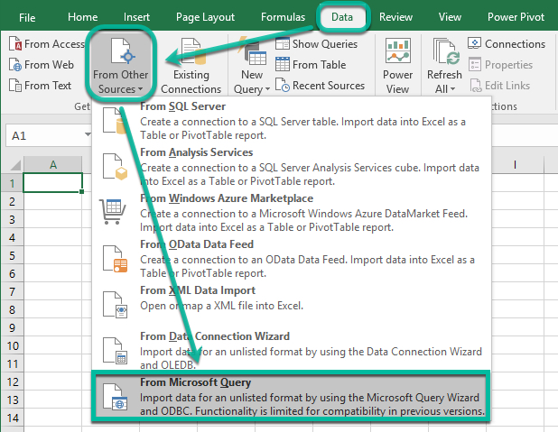

3\. On the Choose Data Source pop-up, select the Hortonworks ODBC data source you installed previously, then click **OK**.

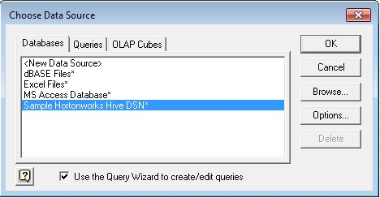

4\. In the Query Wizard, select the **avg_mileage** table and add columns to the query, then click **Next**.

 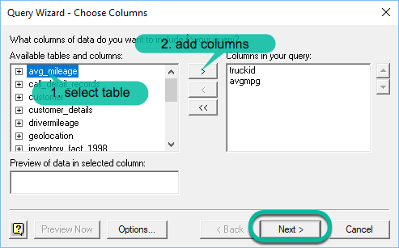

5\. For the following Query Wizard forms, accept the defaults and click **Next**.

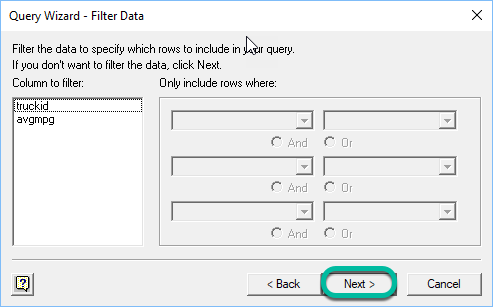

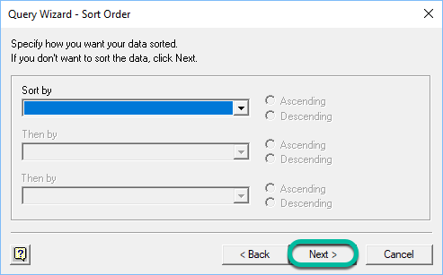

On this last form, click **Finish**.

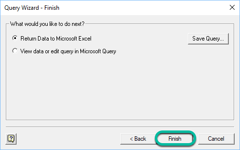

6\. Excel will send a data request to Hive. When data is returned, it will ask you where to import the table. Accept the default location to import the table: current workbook, current worksheet, in cell \$A\$1 - click **OK**.

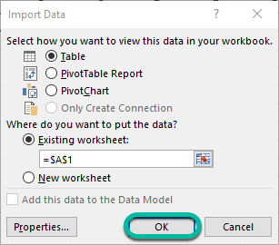

We have successfully imported table **avg_mileage** into Excel. Now we are ready to do some visualization.

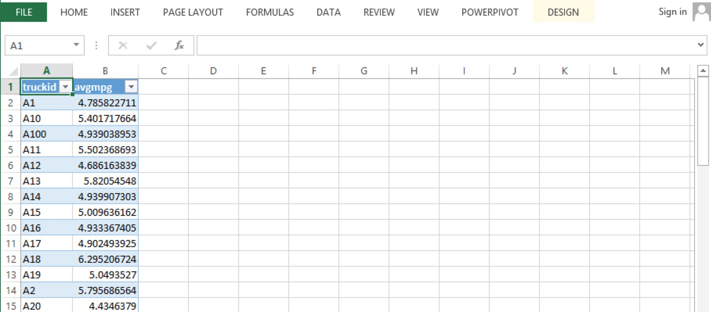

## Visualize Data with Microsoft Excel

We will use Power View to visulaize our data.

1\. click on 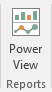. You created this icon as part of the Power View prerequisite. The default is to create Power View sheet, click **OK**.

2\. We will create a column chart to visually describe the average miles per gallon for each truck. Select **DESIGN** > **Column Chart** > **Stacked Column**. You will need to stretch the chart by dragging the lower right of the chart to the full pane. You can control the amount of data you see by filtering on **avgmpg** and/or **truckid**.

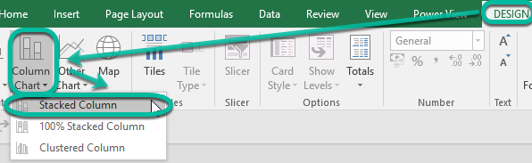

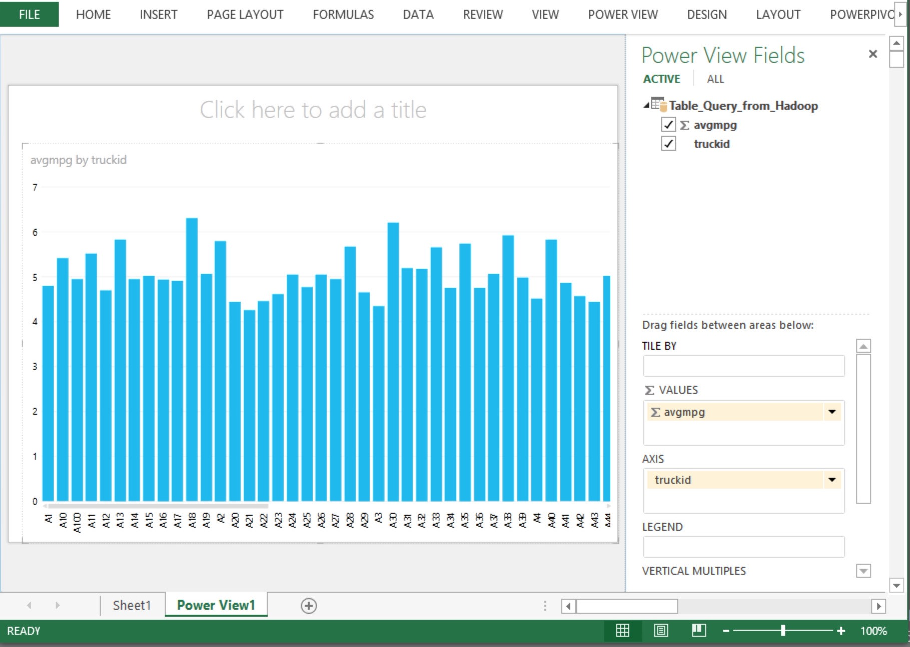

Moving on to our next visual...

We'll be using data from table **geolocation**. We created this table in the _Hive - Data ETL_ section. We will create a geographical map describing the location of each truck. We'll use the following query to gather **driverid**, **city**, and **state** from the table.

~~~sql
SELECT driverid, city, state FROM geolocation;
~~~

1\. Select **Data** > **New Query** > **From Other Sources** > **From ODBC**

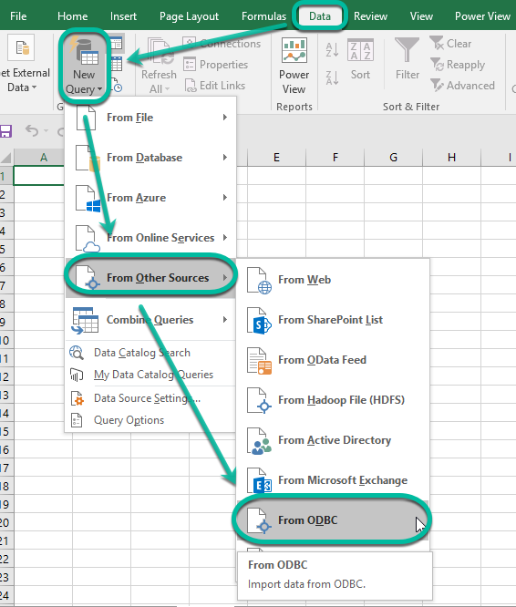

2\. Fill out _From ODBC_ form as follows:
-   **Data source name (DSN)**: _\<data source name you created\>_
-   Under _Advanced options_, **SQL statement (optional)**, type: ```SELECT driverid, city, state FROM geolocation;```
-   press **OK**

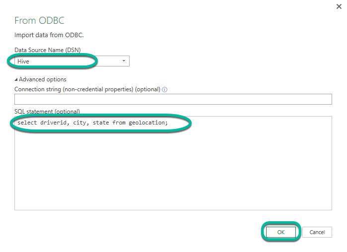

3\. Excel will display a sample set of the query results. Click **Load** to create a new sheet and import the data.

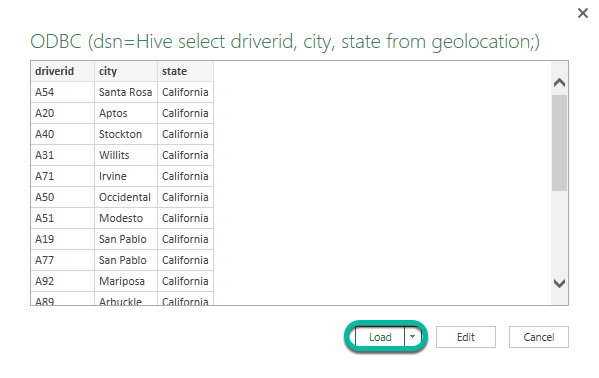

4\. click on . You created this icon as part of the Power View prerequisite. The default is to create Power View sheet, click **OK**.

5\. We will create a map to visually describe the location of each truck. Select **DESIGN** > **Map**. You will need to stretch the chart by dragging the lower right of the chart to the full pane.

> Make sure you have network connectivity because Power View uses Bing to do geocoding which translates city and state columns into map coordinates.

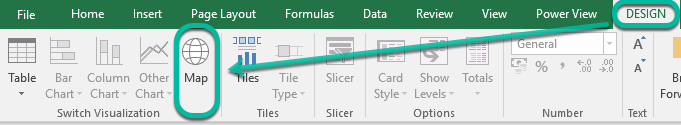

-   Uncheck **driverid**. We only want to see **city** and **state**.

The finished map looks like this.

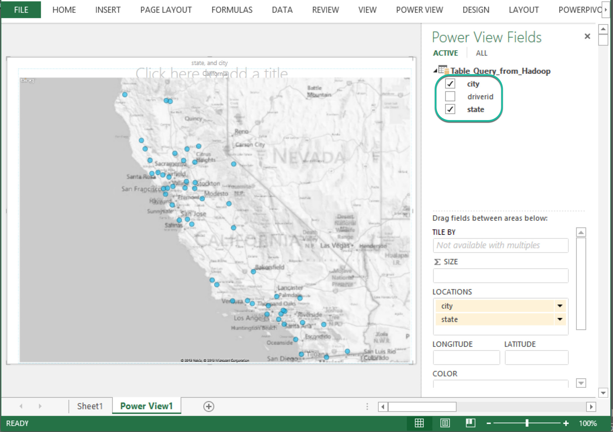

## Summary

Congratulations! You are able to visualize your data using Microsoft Excel.

This tutorial has shown how Hortonworks Data Platform (HDP) can store and visualize geolocation data with Microsoft Excel. There are many other Business Intelligent (BI) tools available you can use.

You can further explorer other visualization, such as plotting risk factor or miles per gallon as bar charts.

## Further Reading
As a Hadoop practitioner you can choose three basic personas to build upon your skill:

-   [Developer](https://hortonworks.com/tutorials/?filters=developer)
-   [Administrator](https://hortonworks.com/tutorials/?filters=administrator)
-   [Data Scientist](https://hortonworks.com/tutorials/?filters=data-scientist-analyst)

**Case Studies**

Learn more about Hadoop through these case studies:

-   [Data Warehouse Architecture](https://hortonworks.com/solutions/edw-optimization/)
-   [Industry Solutions](https://hortonworks.com/solutions/)
-   [The Definitive Guide by O`Reilly](http://hadoopbook.com/)
-   [Hadoop for Dummies](http://www.wiley.com/WileyCDA/WileyTitle/productCd-1118607554.html)
