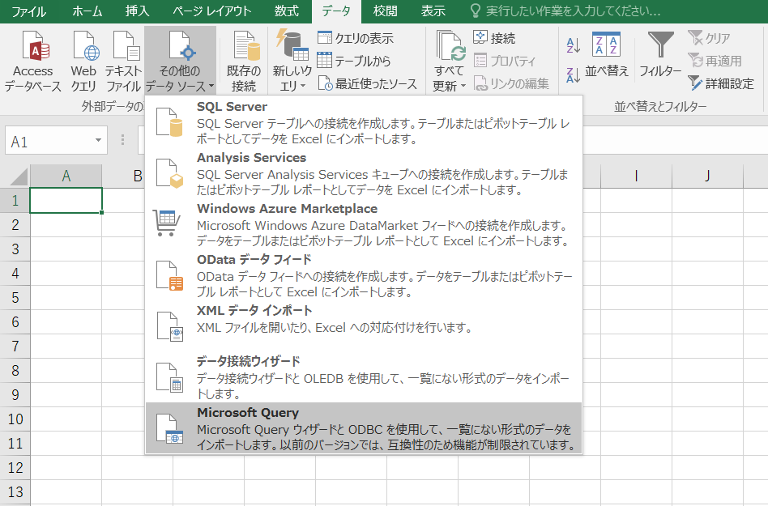

# Lab 6：Excelでデータレポーティングをしよう

## はじめに

このチュートリアルでは，ExcelとPower Viewが必要です．ですが，類似ツールを利用して取り組むのは自由です．このセクションでは，Microsoft Excel Professional Plus 2013を利用して，データにアクセスします．また，ODBC接続を利用します．

## 前提条件

このチュートリアルは，Hortonworks Sandboxを利用して，HDPに入門するための一連のチュートリアルの一部です．このチュートリアルを進める前に，以下の条件を満たしていることを確認してください．

- Hortonworks Sandbox
- Lab 1：センサデータをHDFSに読み込ませよう
- Lab 2：Hiveでデータ操作をしよう
- Lab 3：Pigでリスクファクタを算出しよう / Lab 4：Spackでリスクファクタを算出しよう
- [Hortonworks ODBC Driver](http://hortonworks.com/downloads/#addons)をインストールおよび設定済み
- このチュートリアルを完了するのに1時間ほど掛かります．

## 概要

-   [Step 6.1: Microsoft Excelでデータにアクセスする](#step6.1)
-   [Step 6.2: Microsoft Excelでデータを視覚化する](#step6.2)
-   [まとめ](#summary)
-   [参考文献](#further-reading)

## Step 6.1:  Microsoft Excelでデータにアクセスする <a id="step6.1"></a>

Hive ODBC DriverはHortonworksアドオンページにあります．Windows ODBC Driverのセットアップは，以下の手順に従ってください．ODBC接続マネージャを開き，設定した接続で開きます．以下の画像のようになるはずです．

**For Windows Users：**

1. 新規の空白のブックを開いてください. そして，**データ > その他のデータ ソース > Microsoft Query**を選択してください．
	
	

2. そしてデータソースの選択のポップアップで，インストールしたHortonworks ODBCデータソースを選択し，**OK**をクリックします．

	Hortonworks ODBC Driverを利用するとExcelおよびODBCをサポートするその他のBI（Business Intelligence）アプリケーションでHortonworksデータにアクセスできます．
	
	

	avg_mileageテーブルをインポートします．

3. 全てデフォルトを選択して，完了ボタンを押すまでクリックします．完了ボタンをクリックすると，ExcelはデータをHadoopに要求します．これにはしばらく時間が掛かります．データが返ってくると，ワークシートにデータを配置するように要求されます．このようにセルの`$A%1`に配置します．

	

4. データが配置されると，avg_mileageテーブルがスプレットシートにインポートされます．

	

## Step 6.2: Microsoft Excelでデータを視覚化する <a id="step6.2"></a>

1. ここでPower Viewレポートを挿入します．Power Viewレポートが無い場合は，この[リンク](https://support.office.com/en-us/article/Turn-on-Power-View-in-Excel-2016-for-Windows-f8fc21a6-08fc-407a-8a91-643fa848729a)を辿ってPower Viewレポートを設定してください．これにより，ワークブック内に新しいタブが作成され，Power Viewページにデータが挿入されます．

	

2. 上部のデザインタブを選択して，縦棒グラフをクリックし，ドロップダウンメニューで積み重ね列を選択します．これで棒グラフが生成されます．グラフの右下を掴んで画面一杯に広げます．フィルタタブを閉じるとグラフが拡大して表示されます．

	

3. チュートリアルを終了するには，Geolocationテーブルに報告されたイベントのマップを作成します．クエリを作成し，データのマップを随時作成する方法を説明します．

4. マップについては，位置情報とデータポイントが必要です．Geolocationテーブルを見ると，それぞれのイベントの位置に簡単にプロットできます．このテーブルには，driverid，city，stateカラムが必要です．select文でこれらの列を抽出できるので，クエリエディタからクエリを作成しましょう．

5. Geolocationカラムのサブセットのクエリです．

	```sql
	select driverid, city, state from geolocation;
	```

	

6. クエリを実行すると，結果が表示されます．より複雑なクエリでは，正しい結果が得られるまでクエリを変更できます．今回の結果はこのように見えるでしょう．

	

7. 今回はうまい具合に結果が見えるので，結果をテーブルに取り込みましょう．CTAS（Create Table Select As）の一部として，select文を利用します．テーブルイベントを呼び出すと，クエリは次のようになります．

	**Create table avg_mileage from existing trucks_mileage data**

	```sql
	CREATE TABLE events
	STORED AS ORC
	AS
	SELECT driverid, city, state FROM geolocation;
	```
	
	

8. クエリを実行できたらテーブルイベントが作成されます．以前のように，Excelでテーブルを空のワークシートにインポートすることができます．インポートされたデータは次のようになります．

	

9. これで，ExcelワークブックにPower Viewタブを挿入できます．マップを取得するには，上部のデザインタブを選択し，メニューバーのマップボタンを選択します．

	

10. Bingを利用してPower Viewでジオコーディングを行い，都市および州の列をマップ座標に変換するため，ネットワークが接続されていることを確認してください．イベントが発生した場所だけ見たい場合は，driveridのチェックを外してください．完成したマップは以下のようになります．

	

## まとめ <a id="summary"></a>
Hortonworks Data Platform（HDP）がGeolocationデータをどのように保存および分析できるかを紹介しました．さらに独自のクエリを構築するためのいくつかの手法を紹介しました．リスクファクタと1ガロンあたりのマイルを棒グラフとして簡単にプロットすることができます．地図作成の基礎を学んだので，次は特定のイベント形式だけをプロットしましょう．学ん手法を利用すれば，データを抽出してExcelで可視化するのはとても簡単なことです．

おめでとうございます！HadoopとHDPに関するチュートリアルを終えました．今度はMap Reduce，YARN，HDFS，Hive，Pig，SparkなどのHadoopとその関連エコシステムの基本について理解を深めるといいでしょう．

## 参考文献 <a id="further-reading"></a>
Hadoopを使い始める人は，スキルを磨くために3つの道を選択することができます．

-   Hadoop Developer- [Click Here!](https://hortonworks.com/tutorials/#tuts-developers)
-   Hadoop Administrator-[Click Here!](https://hortonworks.com/tutorials/#tuts-admins)
-   Data Scientist- [Click Here!](https://hortonworks.com/tutorials/#tuts-analysts)

**事例紹介**

これらの事例紹介を通じて，Hadoopについて詳しく学びましょう．

-   Analytics- [New types of data and new opportunities](https://hortonworks.com/solutions/advanced-analytic-apps/)
-   Data Architecture Optimization: [Reduce cost by moving data and processing to Hadoop](https://hortonworks.com/solutions/data-architecture-optimization/)
-   Industry specific: [Examples of Hadoop across Industries](https://hortonworks.com/industry/)
-   [The Definitive Guide by O`Reilly](http://hadoopbook.com/)
-   [Hadoop for Dummies](http://www.wiley.com/WileyCDA/WileyTitle/productCd-1118607554.html)
