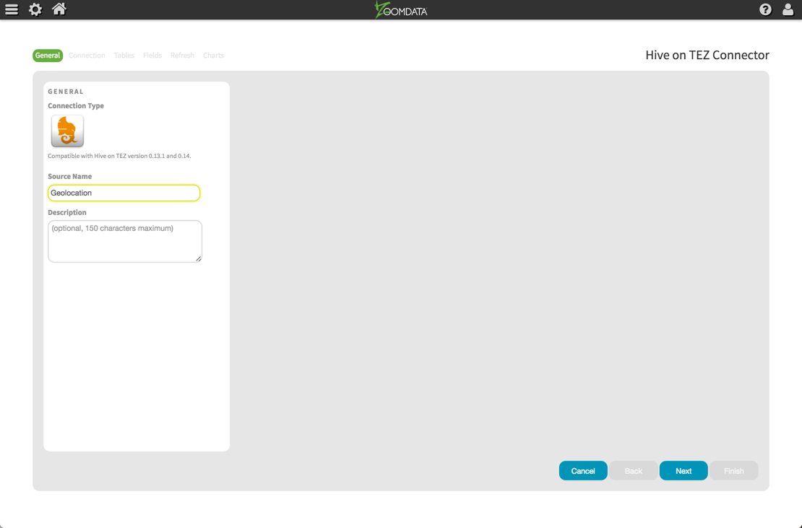
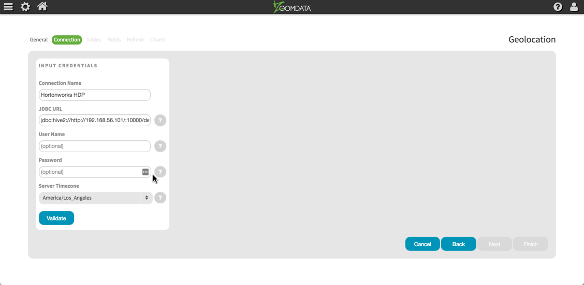
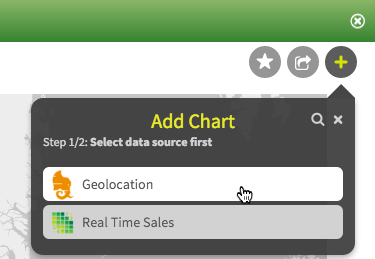
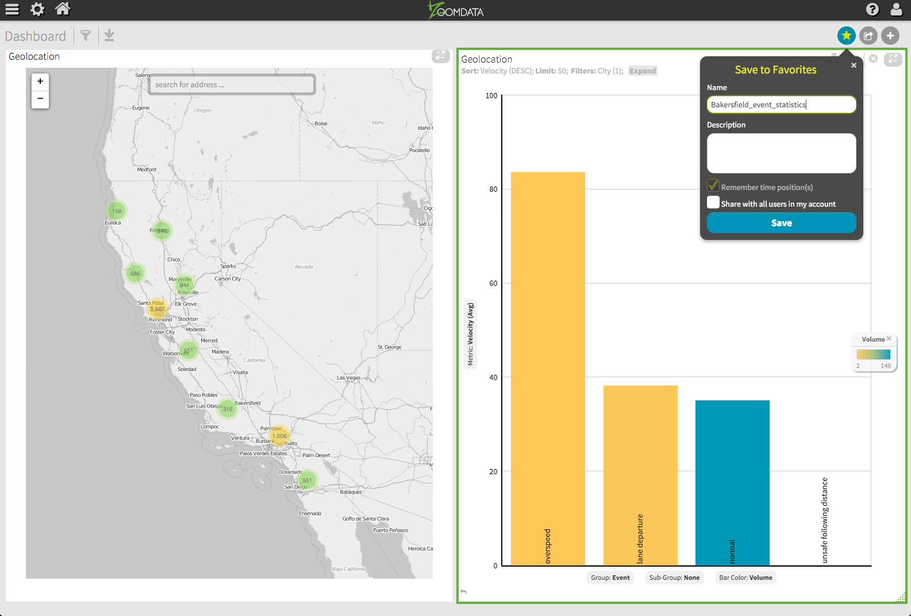

# Hadoop Tutorial – Getting Started with HDP

## Report Data with Zoomdata

## Introduction

In this tutorial, we will get Zoomdata running using Docker, configure Zoomdata
settings and access refined data.

## Prerequisites

-   Hortonworks Sandbox
-   [Learning the Ropes of the Hortonworks Sandbox](https://hortonworks.com/tutorial/learning-the-ropes-of-the-hortonworks-sandbox/)
-   Lab 1: Load sensor data into HDFS
-   Lab 2: Data Manipulation with Apache Hive
-   Lab 3: Use Pig to compute Driver Risk Factor/ Lab 4: Use Spark to compute Driver Risk Factor

## Outline

-   [Step 7.1: Install Zoomdata via Docker](#install-zoomdata)
-   [Step 7.2: Configure Zoomdata](#configure-zoomdata)
-   [Step 7.3: Access the Refined Data with Zoomdata](#step-73-access-the-refined-data-with-zoomdata)
-   [Find IP Address of Your Sandbox (Optonal)](#find-ip-address-of-your-sandbox-optonal)
-   [Summary](#summary-lab7)
-   [Further Reading](#further-reading-lab7)

## Step 7.1: Install Zoomdata via Docker 

Please install Docker and Zoomdata on your system using the guides linked below.
Summarized the steps from the links below to help you navigate through them as you
install Docker and Zoomdata. You should still go to the links:

-   [Install and Configure Docker](https://docs.docker.com/installation/)
    -   Install Docker Engine page appears, choose your appropriate OS
    -   (Example steps done in Mac) Select Getting Started with Docker for Machine
    -   Select **Get Docker for Mac(stable)**
    -   Go through steps 1 and 2 to install and verify Docker installed successfully

-   [Install Zoomdata via Docker](http://docs.zoomdata.com/docker-install)
    -   Docker Image Installation appears
    -   View prerequisites
    -   Navigate to installation processing
    -   Run the 1st and 2nd instructions to install and setup Zoomdata
    -   If on Mac or Linux, navigate to `http://localhost/zoomdata`

## Step 7.2: Configure Zoomdata 

In this section, we will enable the Hive on Tez connector in Zoomdata.

1\. Navigate to the Zoomdata login page. Log in with username **supervisor** and the password you configured on first start up. If this is your first time accessing the Zoomdata instance, then you will have an opportunity to set this password and the password for the **admin** account.

-   For non-linux systems: `http://_dockerhost_IPaddress_/zoomdata`
-   For Linux systems: `http://localhost/zoomdata`

2\. After login, click on **Advanced** in the upper left side of the page.

3\. In the Key-Value list, change the value to **true** for key **connector-HIVE_ON_TEZ**.

4\. Click the **Save** button at the bottom the screen and logout.

## Step 7.3: Access the Refined Data with Zoomdata

In this section, we will use [Zoomdata](http://www.zoomdata.com/) to access the refined data. We’ll start by setting up a connection from Zoomdata to the HDP sandbox and configuring data sources for each of our tables. Addition product documentation can be found on [support.zoomdata.com: Hive on Tez Data Source Configuration](http://support.zoomdata.com/)

1\. From the Zoomdata login screen, log in with username **admin** and the password you configured on first start up.

-   For non-Linux systems: `http://_dockerhost_IPaddress_/zoomdata`
-   For Linux systems: `http://localhost/zoomdata`

2\. Click on the **Gear** icon at the top left of the page and select **Sources** from the menu

3\. Click on the **Hive on Tez** icon

4\. Specify a **Name** and **Description** (optional) for your data source. For this example, we will name the source **Geolocation**. Click **Next**

5\. On the Connection page, specify the **Connection Name** as **Hortonworks HDP** and **JDBC URL** (sample below). Leave the **User Name** and **Password** fields blank. Click **Validate**. When the connection has completed validation, click **Save** then click **Next**.

~~~
Sample JDBC: `jdbc:hive2://_HDPSanboxhost_IPaddress_:10000/default`
~~~

## Find IP Address of Your Sandbox (Optonal)

> **Note**: To find the IP address of your sandbox, follow the steps below. Then insert IP address into JDBC above.

1\. Change the settings for your VirtualBox that is **hosting Hortonworks Sandbox**:

2\. Vbox settings > Network > Adapter 1 > change "Attached to:" to **Host-only** Adapter > Name **vboxnet0** > Advanced > Adapter Type: **Paravirtualized Network** (virtio-net) > Promiscuous Mode: **Allow All**

3\. You can look up sandbox ip address by typing following on the terminal:

~~~bash
VBoxManage guestproperty get "Hortonworks Sandbox with HDP 2.3.2"
"/VirtualBox/GuestInfo/Net/0/V4/IP"
~~~

4\. Replace `"Hortonworks Sandbox with HDP 2.3.2"` with the the name of your Sandbox.

5\. Start the Sandbox. You wont be able to access login page using the default http://localhost:8888. Instead use the ip address you obtained in the above step to go to welcome page. Eg: http://192.168.99.101:8888

**Return to Zoomdata Connection Page**

Let's come back to the **connection** page on zoomdata and enter our **credentials** now that we know our **sandbox ip address**. Your input credentials should look similar to the following screen:

6\. On the **Tables** page, select the **Geolocation** table from list on the left side and click **Next**.

7\. On the **Fields** page, do not make any changes and click **Next**.

8\. On the Visualizations page, scroll to and select the **Map:Markers** visualization. Set the **Latitude** and **Longitude** drop downs to fields of the _same name_ and click **Finish** at the bottom of the screen.

9\. Once returned to the Sources page, click on the link at the top for **See Charts**.

10\. Scroll down the page and select the icon labeled **Map:Markers**

11\. On open, the **Map:Markers** visualization will read the geolocation data from your HDP Sandbox and render the points on the map.

12\. Click on the **yellow point** over California to drill into that area. Further drill down is possible by clicking on any point on the map. Use the minus control in the upper left corner to zoom back out.

13\. From here, we can create a simple dashboard by adding another visualization. To do this, click the **Plus** icon at the upper right corner of the graph. Select the **Geolocation** data source and then select a graph style (**Bars:Vertical** is used in this example)

14\. Once the new visualization has completed rendering, we can adjust the graph’s grouping by clicking on the **Sub-Group:Event** label on the X axis, and we'll change it to **none**.

15\. For **Group:State** label, let's select **city** from the group list.

16\. Further adjustment can be made by clicking on the **Metric:Volume** label and selecting Velocity, then clicking **Sum** and selecting **Avg** to show average Velocity by City

17\. To further drill into the graph, single-click one of the bars to open the Zoomdata horseshoe menu, click **ZOOM**, and select **Event** as the new grouping for the graph.

17\. Your graph should now display **Event** statistics for the selected **City**. You can undo changes to a graph at anytime by using the back arrow at the bottom left corner of the selected graph. In our case, the graph below shows event statistics for Bakersfield.

18\. To save your dashboard, click the star icon in the upper right corner, rename the dashboard, and click save at the bottom of the menu.

19\. Your saved dashboard is now available on the Zoomdata **Home** screen and listed under **Favorites** in the ‘Hamburger’ menu (upper left corner, next to the ‘Gear’ icon)

## Summary 

We've shown how the Hortonworks Data Platform (HDP) can store and analyze geolocation data. We’ve also reviewed some basic techniques for connecting, visualizing, and navigating the HDP data using Zoomdata.

Congratulations on completing our HDP tutorial labs!

## Further Reading 

-   More advanced Zoomdata tutorials and product guides are available in the [Zoomdata Support Portal](http://docs.zoomdata.com/zoomdata-docs-portal).
-   To obtain product pricing, schedule a demo, or request general information, visit the [Zoomdata Contact](http://www.zoomdata.com/contact) page.
