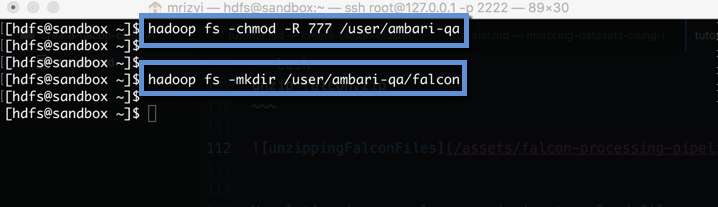
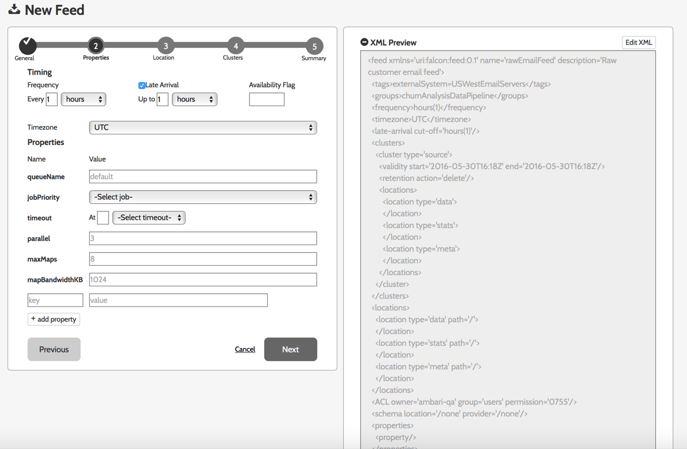
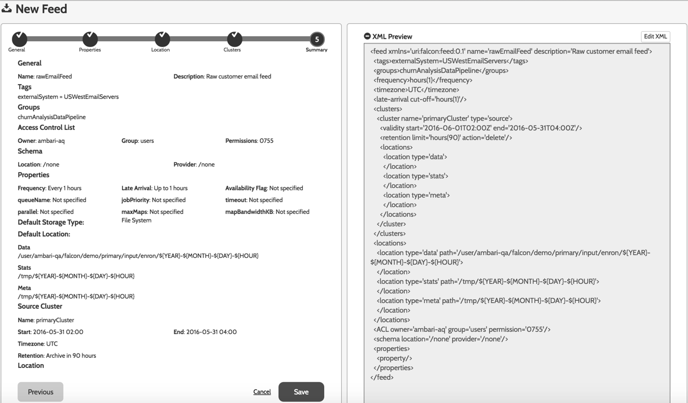
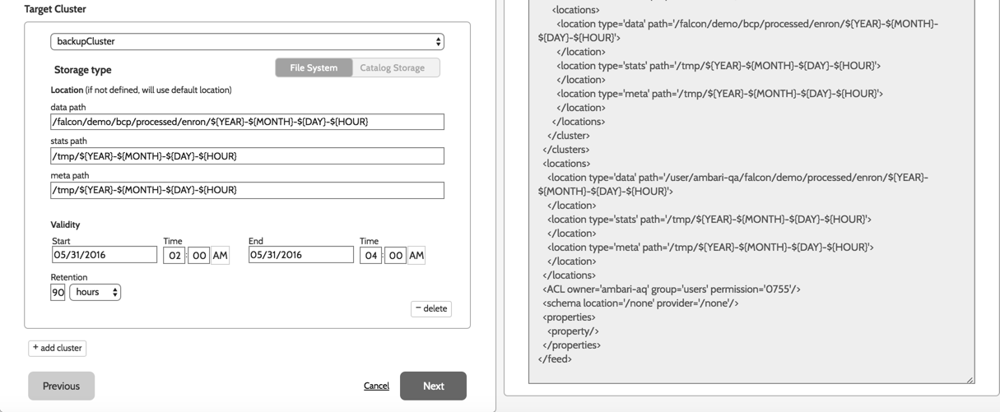
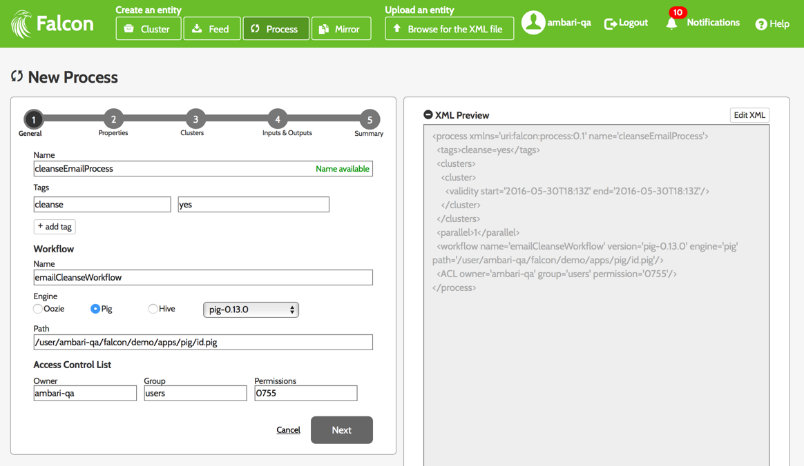

# Define and Process Data Pipelines in Hadoop With Apache Falcon

## Introduction

Apache Falcon is a framework to simplify data pipeline processing and management on Hadoop clusters.

It makes it much simpler to onboard new workflows/pipelines, with support for late data handling and retry policies. It allows you to easily define relationships between various data and processing elements and integrate with metastore/catalog such as Apache Hive/HCatalog. Finally it also lets you capture lineage information for feeds and processes. In this tutorial we are going to walkthrough the process of:

-   Defining the feeds and processes
-   Defining and executing a data pipeline to ingest, process and persist data continuously

## Prerequisites

- [Download Hortonworks Sandbox](https://hortonworks.com/products/hortonworks-sandbox/#install)
- Complete the [Learning the Ropes of the Hortonworks Sandbox](https://hortonworks.com/hadoop-tutorial/learning-the-ropes-of-the-hortonworks-sandbox/) tutorial, you will need it for logging into ambari as an administrator user.
- Complete the [Creating Falcon Cluster tutorial](https://hortonworks.com/hadoop-tutorial/create-falcon-cluster/) to start the falcon service, prepare HDFS directories for Falcon cluster and to create Falcon cluster entities.

Once you have downloaded the Hortonworks sandbox and run the VM, navigate to the Ambari interface on port `8080` of the host IP address of your Sandbox VM. Login with the username of `admin` and password that you set for the Ambari admin user as part of the `Learning the Ropes of the Hortonworks Sandbox` tutorial:

## Outline
- [Scenario](#scenario)
- [Starting Falcon](#starting-falcon)
- [Download and stage the dataset](#download-and-stage-the-dataset)
- [Define the rawEmailFeed entity using Wizard](#define-the-rawEmailFeed-entity-wizard)
- [Define the rawEmailFeed entity using XML](#define-the-rawEmailFeed-entity-XML)
- [Define the rawEmailIngestProcess entity using Wizard](#define-the-rawEmailIngestProcess-entity-wizard)
- [Define the rawEmailIngestProcess entity using XML](#define-the-rawEmailIngestProcess-entity-XML)
- [Define the cleansedEmailFeed using Wizard](#define-the-cleansedEmailFeed-wizard)
- [Define the cleansedEmailFeed using XML](#define-the-cleansedEmailFeed-XML)
- [Define the cleanseEmailProcess using Wizard](#define-the-cleansedEmailProcess-wizard)
- [Define the cleanseEmailProcess using XML](#define-the-cleansedEmailProcess-XML)
- [Run the feeds](#run-the-feeds)
- [Run the processes](#run-the-processes)
- [Input and Output of the pipeline](#input-and-output-of-the-pipeline)
- [Summary](#summary)

For this tutorial, we will utilize the virtualbox environment. Therefore, VMware and Azure Sandbox users your instructions may be slightly different.

## Scenario 

In this tutorial, we will walk through a scenario where email data lands hourly on a cluster. In our example:

*   This cluster is the primary cluster located in the Oregon data center.
*   Data arrives from all the West Coast production servers. The input data feeds are often late for up to 4 hrs.

The goal is to clean the raw data to remove sensitive information like credit card numbers and make it available to our marketing data science team for customer churn analysis.

To simulate this scenario, we have a Pig script grabbing the freely available Enron Corpus emails from the internet and feeding it into the pipeline.

## Starting Falcon 

By default, Falcon is not started on the sandbox, but you should have started the service while completing the `Creating a Falcon Cluster` tutorial. Do the following to verify that the Falcon service is started, or to start it if it was disabled.

In the Ambari UI,  click on the Falcon icon in the left hand pane.

Then click on the Service Actions button on the top right.

Then, if the service is disabled, click on `Start`.

Once Falcon starts, Ambari should clearly indicate as below that the service has started:

## Download and stage the dataset 

Now let’s stage the dataset you will use for this tutorial. Although we perform many of these file operations below using the command line, you can also do the same with the `HDFS Files  View` in Ambari.

> Tip: You can copy and paste the commands from this tutorial.

First, enter the shell with your preferred shell client. For this tutorial, we will SSH into Hortonworks Sandbox with the command:

~~~bash
ssh root@127.0.0.1 -p 2222;
~~~

The default password is `hadoop`.

Then login as user `hdfs`:

~~~bash
su - hdfs
~~~

Then download the file falcon.zip with the following command:

~~~bash
wget http://hortonassets.s3.amazonaws.com/tutorial/falcon/falcon.zip
~~~

and then unzip with the command:

~~~bash
unzip falcon.zip
~~~

Now let’s give ourselves permission to upload files:

~~~bash
hadoop fs -chmod -R 777 /user/ambari-qa
~~~

Then let’s create a folder `falcon` under `ambari-qa` with the command:

~~~bash
hadoop fs -mkdir /user/ambari-qa/falcon
~~~

Now let’s upload the decompressed folder with the command

~~~bash
hadoop fs -copyFromLocal demo /user/ambari-qa/falcon/
~~~

## Define the rawEmailFeed entity using Wizard 

To create a feed entity click on the `Feed` button on the top of the main page on the Falcon Web UI.

**NOTE : If you want to create it from XML, skip this section, and move on to the next one.**

Then enter the definition for the feed by giving the feed a unique name and a description.  For this tutorial we will use

~~~
rawEmailFeed
~~~

and

~~~
Raw customer email feed.
~~~

Let’s also enter a tag key and value, so we can easily locate this Feed later:

~~~
externalSystem=USWestEmailServers
~~~

Feeds can be further categorised by identifying them with one or more groups.  In this demo, we will group all the Feeds together by defining the group:

~~~
churnAnalysisDataPipeline
~~~

We then set the ownership information for the Feed:

~~~
Owner:  ambari-qa
Group:  users
Permissions: 755
~~~

For the Schema Location and Provider, enter “/none”, then click Next.

On the Properties page, specify to run the job hourly by specifying the frequency as 1 hour, check Late Arrival Checkbox and specify the value as 1 hour. Change the timezone to UTC and click `Next`.

Enter the path of our data set on the Locations page:

~~~
/user/ambari-qa/falcon/demo/primary/input/enron/${YEAR}-${MONTH}-${DAY}-${HOUR}
~~~

We will set the stats and meta paths to /tmp/${YEAR}-${MONTH}-${DAY}-${HOUR} for now. Click `Next`.

On the Clusters page select the cluster you created, then enter today’s date and the current time for the validity start time, and enter an hour or two later for the end time.  The validity time specifies the period during which the feed will run.  For many feeds, validity time will be set to the time the feed is scheduled to go into production and the end time will be set into the far future.  Because we are running this tutorial on the Sandbox, we want to limit the time the process will run to conserve resources.

**DO NOT forget to provide the validity time in the timezone you have selected.**

Specify the retention period of 90 hours, then click `Next`.

Save the feed.

## Define the rawEmailFeed entity using XML 

Then click on the `Edit` button over XML Preview area on the right hand side of the screen and replace the XML content with the XML document below:

~~~
<?xml version="1.0" encoding="UTF-8" standalone="yes"?>
<feed name="rawEmailFeed" description="Raw customer email feed" xmlns="uri:falcon:feed:0.1">
    <tags>externalSystem=USWestEmailServers</tags>
    <groups>churnAnalysisDataPipeline</groups>
    <frequency>hours(1)</frequency>
    <timezone>UTC</timezone>
    <late-arrival cut-off="hours(1)"/>
    <clusters>
        <cluster name="primaryCluster" type="source">
            <validity start="2016-06-05T05:00Z" end="2016-06-05T06:00Z"/>
            <retention limit="hours(90)" action="delete"/>
        </cluster>
    </clusters>
    <locations>
        <location type="data" path="/user/ambari-qa/falcon/demo/primary/input/enron/${YEAR}-${MONTH}-${DAY}-${HOUR}"/>
        <location type="stats" path="/tmp/${YEAR}-${MONTH}-${DAY}-${HOUR}"/>
        <location type="meta" path="/tmp/${YEAR}-${MONTH}-${DAY}-${HOUR}"/>
    </locations>
    <ACL owner="ambari-qa" group="users" permission="0755"/>
    <schema location="/none" provider="/none"/>
</feed>
~~~

**NOTE : DO NOT copy the validity start and end time. Change it as per your time.**

Click `Finish` on the top of the XML Preview area.

Falcon UI should have automatically parsed out the values from the XML and populated in the right fields. Once you have verified that these are the correct values, save the feed.

## Define the rawEmailIngestProcess entity using Wizard 

Now lets define the `rawEmailIngestProcess`.

To create a process entity click on the `Process` button on the top of the main page on the Falcon Web UI.

**NOTE : If you want to create it from XML, skip this section, and move on to the next one.**

Use the information below to create the process:

This job will run on the primaryCluster. Use the information below to create the process:

~~~
process name rawEmailIngestProcess
Tags email
With the value: testemail
~~~

And assign the workflow the name:

~~~
emailIngestWorkflow
~~~

Select Oozie as the execution engine and provide the following path:

~~~
/user/ambari-qa/falcon/demo/apps/ingest/fs
~~~
Accept the default values for the Access Control List and click Next.

On the Properties page, select the time zone, and set the frequency to 1 hour. Set the number of parallel processes to 1. This prevents a new instance from starting prior to the previous one completing. Specify the order as first-in, first-out (FIFO).
Select the exp-backoff retry policy, then set the attempts to 3 and the delay to 3 minutes. Click `Next`.

On the Clusters page, select primaryCluster again. As you did previously, modify the validity to a time slice which is in the very near future; set the validity to start now and end in an hour or two. Click `Next`.

**Note : Time should be specified as per the timezone selected.**

On the Inputs & Outputs page, ignore the Inputs section. For the output, enter a name and select the `rawEmailFeed` we created in the previous step and specify now(0,0) for the instance.

`now(hours,minutes)`: now refer to the instance start time. Hours and minutes given are in reference with the start time of instance.  For example now(-2,40) corresponds to feed instance at -2 hr and +40 minutes i.e. feed instance 80 mins before the instance start time. now(0,0) corresponds to feed instance at current time.

Lets save the process.

## Define the rawEmailIngestProcess entity using XML 

Click on the `Edit` button over XML Preview area on the right hand side of the screen and replace the XML content with the XML document below:

~~~
<?xml version="1.0" encoding="UTF-8" standalone="yes"?>
<process name="rawEmailIngestProcess" xmlns="uri:falcon:process:0.1">
    <tags>email=testemail</tags>
    <clusters>
        <cluster name="primaryCluster">
            <validity start="2016-06-05T05:00Z" end="2016-06-05T06:00Z"/>
        </cluster>
    </clusters>
    <parallel>1</parallel>
    <order>FIFO</order>
    <frequency>hours(1)</frequency>
    <timezone>UTC</timezone>
    <outputs>
        <output name="output" feed="rawEmailFeed" instance="now(0,0)"/>
    </outputs>
    <workflow name="emailIngestWorkflow" version="4.0.1" engine="oozie" path="/user/ambari-qa/falcon/demo/apps/ingest/fs"/>
    <retry policy="exp-backoff" delay="minutes(3)" attempts="3"/>
    <ACL owner="ambari-qa" group="users" permission="0755"/>
</process>
~~~

**NOTE : DO NOT copy the validity start and end time. Change it as per your time..**

Click `Finish` on the top of the XML Preview area.

Verify all the values and click `Next`.

Save the process.

## Define the cleansedEmailFeed using Wizard 

As the name suggests, the raw feeds which you have created earlier get cleansed in the Process and the feed which comes out from that Process is the cleansed feed. So, to create a cleansed feed entity click on the `Feed` button on the top of the main page on the Falcon Web UI.

**NOTE : If you want to create it from XML, skip this section, and move on to the next one.**

Use the following information to create the feed:

~~~
name cleansedEmailFeed
description Cleansed customer emails
tag cleanse with value cleaned
Group churnAnalysisDataPipeline
~~~

We then set the ownership information for the Feed:

~~~
Owner:  ambari-qa
Group:  users
Permissions: 755
~~~

For the Schema Location and Provider, enter “/none”, then click `Next`.

On the Properties page, specify to run the job hourly by specifying the frequency as 1 hour, check Late Arrival Checkbox and specify the value as 4 hours. Change the timezone to UTC, accept the default values and click `Next`.

Set the default storage location to

~~~
/user/ambari-qa/falcon/demo/processed/enron/${YEAR}-${MONTH}-${DAY}-${HOUR}
~~~

Keep stats path and meta path as /tmp/${YEAR}-${MONTH}-${DAY}-${HOUR}.
Click `Next`.

On the Clusters page,select source cluster as a primary cluster ensure you modify the validity to a time slice which is in the very near future. Provide time in current UTC. Specify the path for the data as:

~~~
/user/ambari-qa/falcon/demo/primary/processed/enron/${YEAR}-${MONTH}-${DAY}-${HOUR}
~~~

And enter /tmp/${YEAR}-${MONTH}-${DAY}-${HOUR} for the stats and meta data locations.
Keep the retention period as 90 hours.

Set the target cluster as backupCluster and again set the validity start for the current time and end time to an hour or two from now
And specify the data path for the target to

~~~
/falcon/demo/bcp/processed/enron/${YEAR}-${MONTH}-${DAY}-${HOUR}
~~~

Set the statistics and meta data locations to /tmp/${YEAR}-${MONTH}-${DAY}-${HOUR}
Enter the retention period as 90 hours for target cluster as well.
Click `Next`.

Verify all the entries you have filled out and then click `Save`.

## Define the cleansedEmailFeed using XML 

Click on the `Edit` button over XML Preview area on the right hand side of the screen and replace the XML content with the XML document below:

~~~
<?xml version="1.0" encoding="UTF-8" standalone="yes"?>
<feed name="cleansedEmailFeed" description="Cleansed customer emails" xmlns="uri:falcon:feed:0.1">
    <tags>cleanse=cleaned</tags>
    <groups>churnAnalysisDataPipeline</groups>
    <frequency>hours(1)</frequency>
    <timezone>UTC</timezone>
    <late-arrival cut-off="hours(4)"/>
    <clusters>
        <cluster name="primaryCluster" type="source">
            <validity start="2016-06-05T05:00Z" end="2016-06-05T06:00Z"/>
            <retention limit="hours(90)" action="delete"/>
            <locations>
                <location type="data" path="/user/ambari-qa/falcon/demo/primary/processed/enron/${YEAR}-${MONTH}-${DAY}-${HOUR}"/>
                <location type="stats" path="/tmp/${YEAR}-${MONTH}-${DAY}-${HOUR}"/>
                <location type="meta" path="/tmp/${YEAR}-${MONTH}-${DAY}-${HOUR}"/>
            </locations>
        </cluster>
        <cluster name="backupCluster" type="target">
            <validity start="2016-06-05T05:00Z" end="2016-06-05T06:00Z"/>
            <retention limit="hours(90)" action="delete"/>
            <locations>
                <location type="data" path="/falcon/demo/bcp/processed/enron/${YEAR}-${MONTH}-${DAY}-${HOUR}"/>
                <location type="stats" path="/tmp/${YEAR}-${MONTH}-${DAY}-${HOUR}"/>
                <location type="meta" path="/tmp/${YEAR}-${MONTH}-${DAY}-${HOUR}"/>
            </locations>
        </cluster>
    </clusters>
    <locations>
        <location type="data" path="/user/ambari-qa/falcon/demo/processed/enron/${YEAR}-${MONTH}-${DAY}-${HOUR}"/>
        <location type="stats" path="/tmp/${YEAR}-${MONTH}-${DAY}-${HOUR}"/>
        <location type="meta" path="/tmp/${YEAR}-${MONTH}-${DAY}-${HOUR}"/>
    </locations>
    <ACL owner="ambari-qa" group="users" permission="0755"/>
    <schema location="/none" provider="/none"/>
</feed>
~~~

**NOTE : DO NOT copy the validity start and end time. Change it as per your time.**

Click `Finish` on the top of the XML Preview area. Save the feed.

## Define the cleanseEmailProcess using Wizard 

Now lets define the `cleanseEmailProcess`.
Again, to create a process entity click on the `Process` button on the top of the main page on the Falcon Web UI.

**NOTE : If you want to create it from XML, skip this section, and move on to the next one.**

Create this process with the following information

~~~
process name cleanseEmailProcess
~~~

Tag cleanse with the value yes

Then assign the workflow the name:

~~~
emailCleanseWorkflow
~~~

Select Pig as the execution engine and provide the following path:

~~~
/user/ambari-qa/falcon/demo/apps/pig/id.pig
~~~

Accept the default values for Access Control List and click `Next`.

For the properties, set the number of parallel processes to 1, this prevents a new instance from starting prior to the previous one completing.
Specify the order as first-in, First-out (FIFO)
And the Frequency to 1 hour.
Select the exp-backoff retry policy, then set the attempts to 3 and the delay to 3 minutes. Click `Next`.

On the Clusters page ensure you modify the validity to a time slice which is in the very near future and then click `Next`.

**NOTE : Time should be specified as per the timezone selected.**

Select the Input and Output Feeds as shown below and click Next.
Select rawEmailFeed as an input feed and cleansedEmailFeed as an output feed.

Verify all the values you have entered and then click `Save`.

## Define the cleanseEmailProcess using XML 

Click on the `Edit` button over XML Preview area on the right hand side of the screen and replace the XML content with the XML document below:

~~~
<?xml version="1.0" encoding="UTF-8" standalone="yes"?>
<process name="cleanseEmailProcess" xmlns="uri:falcon:process:0.1">
    <tags>cleanse=yes</tags>
    <clusters>
        <cluster name="primaryCluster">
            <validity start="2016-06-05T05:00Z" end="2016-06-05T06:00Z"/>
        </cluster>
    </clusters>
    <parallel>1</parallel>
    <order>FIFO</order>
    <frequency>hours(1)</frequency>
    <timezone>UTC</timezone>
    <inputs>
        <input name="input" feed="rawEmailFeed" start="now(0,0)" end="now(0,0)"/>
    </inputs>
    <outputs>
        <output name="output" feed="cleansedEmailFeed" instance="now(0,0)"/>
    </outputs>
    <workflow name="emailCleanseWorkflow" version="pig-0.13.0" engine="pig" path="/user/ambari-qa/falcon/demo/apps/pig/id.pig"/>
    <retry policy="exp-backoff" delay="minutes(3)" attempts="3"/>
    <ACL owner="ambari-qa" group="users" permission="0755"/>
</process>
~~~

**NOTE : DO NOT copy the validity start and end time. Change it as per your time.**

Click `Finish` on the top of the XML Preview area, verify all the values and save the process.

## Run the feeds 

From the Falcon Web UI home page search for the Feeds we created

Select the rawEmailFeed by clicking on the checkbox

Then click on the Schedule button on the top of the search results

Next run the `cleansedEmailFeed` in the same way

## Run the processes 

From the Falcon Web UI home page search for the Process we created

Select the `cleanseEmailProcess` by clicking on the checkbox

Then click on the Schedule button on the top of the search results

Next run the `rawEmailIngestProcess` in the same way

If you visit the Oozie process page, you can seen the processes running

## Input and Output of the pipeline 

Now that the feeds and processes are running, we can check the dataset being ingressed and the dataset egressed on HDFS.

Here is the data being ingressed

and here is the data being egressed from the pipeline

## Summary 

In this tutorial we walked through a scenario to clean the raw data to remove sensitive information like credit card numbers and make it available to our marketing data science team for customer churn analysis by defining a data pipeline with Apache Falcon. You may suspend the running feeds or processes if no longer required.
