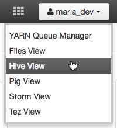
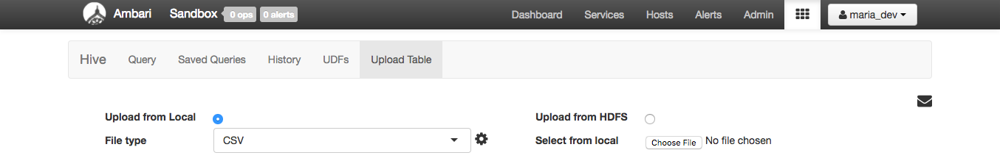
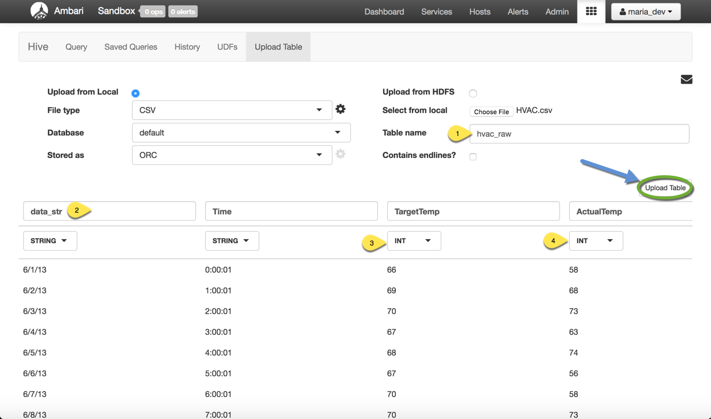
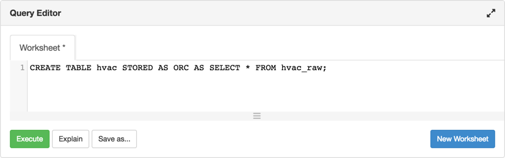
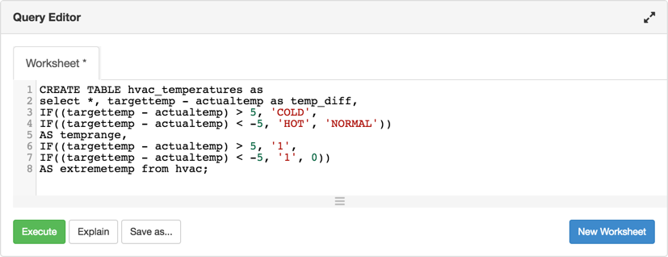
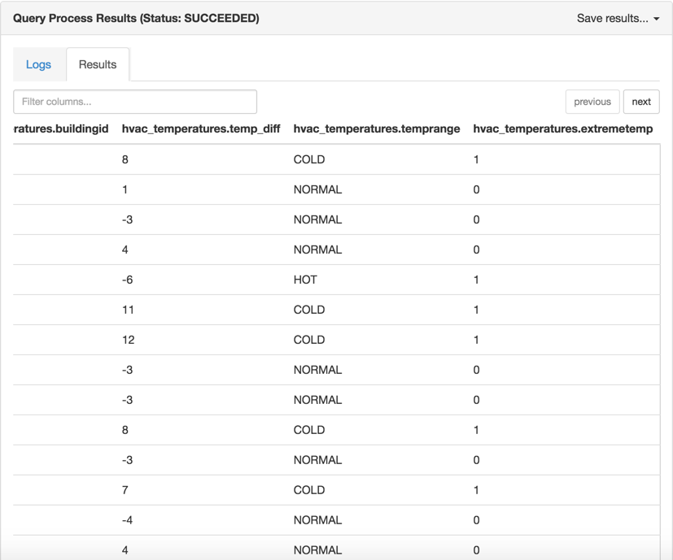
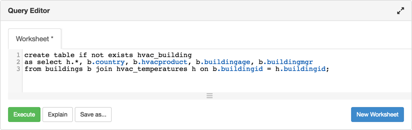
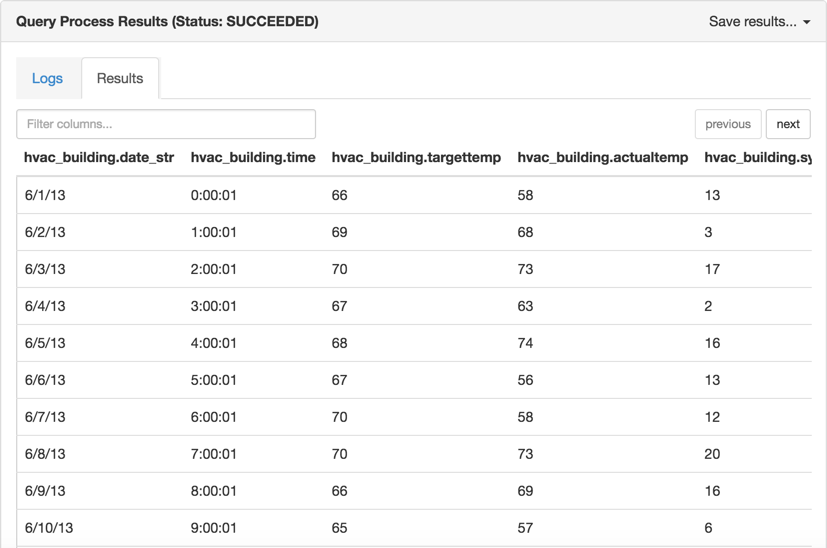

# Analyze HVAC Machine and Sensor Data

## Lab 1 - Upload and Refine Data with Hive

## Introduction

You will learn to refine HVAC data into a useful format. You will gain a practical experience with creating Hive tables that run on ORC files for fast and efficient data processing. You will gain insight to writing Hive scripts that enrich our data to reveal to us when temperature is at a cold, normal or hot state. Additionally, you will learn to write Hive queries on the data to determine which particular buildings are associated with these temperature states.

## Prerequisites

Read through **Analyze Machine and Sensor Data Introduction**

**Download and Extract the Sensor Data Files**

1\. Download the sample sensor data contained in a compressed (.zip) folder here:
    -   [SensorFiles.zip](http://s3.amazonaws.com/hw-sandbox/tutorial14/SensorFiles.zip)

2\. Save the `SensorFiles.zip` file to your computer, then extract the files. You should see a SensorFiles folder that contains the following files:

-   `HVAC.csv` – contains the targeted building temperatures, along with the actual (measured) building temperatures. The building temperature data was obtained using Apache Flume. Flume can be usedas a log aggregator, collecting log data from many diverse sources and moving it to a centralized data store. In this case, Flume was used to capture the sensor log data, which we can now load into the Hadoop Distributed File System (HFDS).  For more details on Flume, refer to Tutorial 13: Refining and Visualizing Sentiment Data
-   `building.csv` – contains the "building" database table. Apache Sqoop can be used to transfer this type of data from a structured database into HFDS.

## Outline

-   [Step 1: Upload HVAC Data To Hive Table](#upload-hvac-data-table)
-   [Step 2: Create hvac and buildings ORC Hive Tables](#create-hvac-buildings-orc)
-   [Step 3: Enrich Sensor Data Via Hive Scripts](#enrich-sensor-data-hive)
-   [Summary](#summary-lab1)
-   [Further Reading](#further-reading-lab1)

## Step 1: Upload HVAC Data To Hive Table 

1\. Login to Ambari login at [`http://localhost:8080`](http://localhost:8080)
-   username: `maria_dev`
-   password `maria_dev`

2\. Use the dropdown menu in the top right corner to access the Hive view:

Navigate to the **Upload Table** tab, upload the two csv files contained within `SensorFiles.zip`

When uploading the two tables we’ll need to change a few things.

For `HVAC.csv`

1.  Change the table name to `hvac_raw`
2.  Change the name of the `Date` column to `date_str`
3.  If `TargetTemp’s` type is `STRING`, change it to `INT`
4.  If `ActualTemp’s` type is `STRING`, change it to `INT`

As the table uploads, you’ll notice a progress window appear.

For `buildings.csv`

1\. Change the table name to `building_raw`

We have both tables loaded in, we want to get better performance in Hive, so we're going to create new tables that utilize the highly efficient [**ORC** file format](https://hortonworks.com/blog/apache-orc-launches-as-a-top-level-project/). This will allow for faster queries when our datasets are much much larger.

## Step 2: Create HVAC and Buildings ORC Hive Tables 

1\. Create a new table `hvac` that is stored as an ORC file.

~~~
CREATE TABLE hvac STORED AS ORC AS SELECT * FROM hvac_raw;
~~~

2\. Use a similar Hive query to create the `buildings` table.

~~~
CREATE TABLE buildings STORED AS ORC AS SELECT * FROM building_raw;
~~~

## Step 3: Enrich Sensor Data Via Hive Scripts 

We will use two Hive scripts to refine the sensor data. The knowledge we seek to acquire from this data:

-   Reduce heating and cooling expenses.
-   Keep indoor temperatures in a comfortable range between 65-70 degrees.
-   Identify which HVAC products are reliable, and replace unreliable equipment with those models.

We will identify whether the actual temperature was more than five degrees different from the target temperature with a Hive script.

1\. Create a new worksheet in the Hive view and paste the following Hive query into the editor:

~~~
CREATE TABLE hvac_temperatures as
select *, targettemp - actualtemp as temp_diff,
IF((targettemp - actualtemp) > 5, 'COLD',
IF((targettemp - actualtemp) < -5, 'HOT', 'NORMAL'))
AS temprange,
IF((targettemp - actualtemp) > 5, '1',
IF((targettemp - actualtemp) < -5, '1', 0))
AS extremetemp from hvac;
~~~

What's this query does?

-   Creates a new table `hvac_temperatures` and copies data from the `hvac` table

2\. Use **Execute** to create the new table.

-   On the Query Results page, use the slider to scroll to the right. You will notice that two new attributes appear in the `hvac_temperatures` table.

What are the two new attributes?

-   temprange and extremetemp

The data in the **temprange** column indicates whether the actual temperature was:

-   **NORMAL** **–** within 5 degrees of the target temperature.
-   **COLD** **–** more than five degrees colder than the target temperature.
-   **HOT** **–** more than 5 degrees warmer than the target temperature.

If the temperature is outside of the normal range, `extremetemp` is assigned a value of 1; otherwise its value is 0.

3\. Let's combine the **hvac** and **hvac_temperatures** data sets.

Create a new worksheet in the hive view and use the following query to create a new table `hvac_building` that contains data from the `hvac_temperatures` table and the `buildings` table.

~~~
create table if not exists hvac_building
as select h.*, b.country, b.hvacproduct, b.buildingage, b.buildingmgr
from buildings b join hvac_temperatures h on b.buildingid = h.buildingid;
~~~

Which tables is **hvac_building’s** data coming from?

-   **hvac_temperature** and **buildings**

Use **Execute** to run the query:

After you've successfully executed the query, use the database explorer to load a sample of the data from the new `hvac_building` table.

The aggregated data shows us the buildings that are associated with a certain **temprange**.

## Summary 

We've successfully refined the data into a useful format. We learned to create Hive tables that run on ORC files for fast and efficient data processing. We learned to write Hive scripts to enrich our data to reveal to us when temperature is at a cold, normal or hot state. Additionally, we used the data to bring us insight into which particular buildings are associated with these temperature states. Our next step is to use different reporting tools to analyze the results.

## Further Reading 

-   [How can I upload ORC files to Hive?](https://community.hortonworks.com/questions/47594/how-can-i-upload-ocr-files-to-hive.html)
-   [Optimizing Hive queries for ORC formatted tables](https://community.hortonworks.com/articles/68631/optimizing-hive-queries-for-orc-formatted-tables.html)
