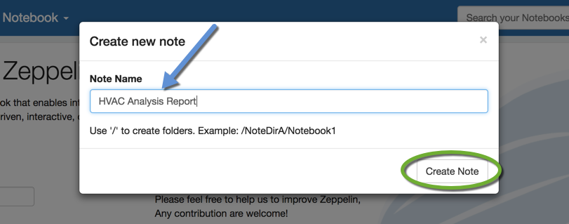
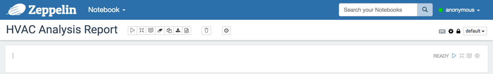
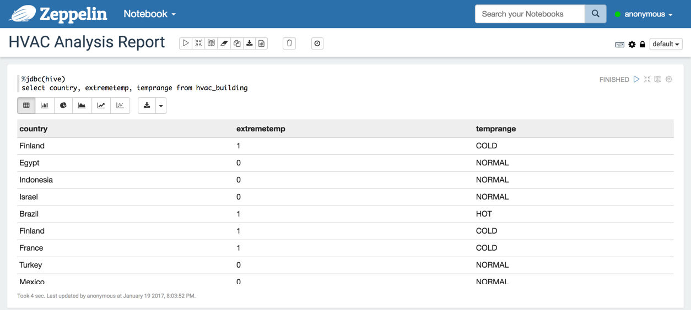
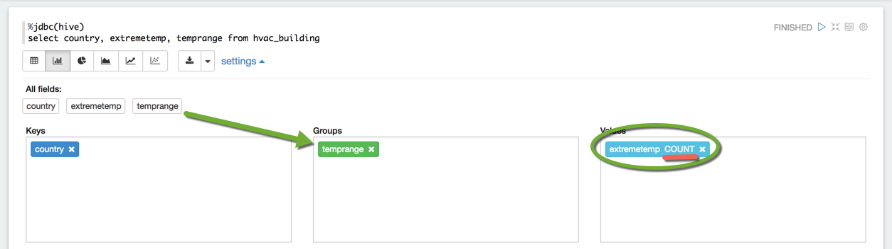
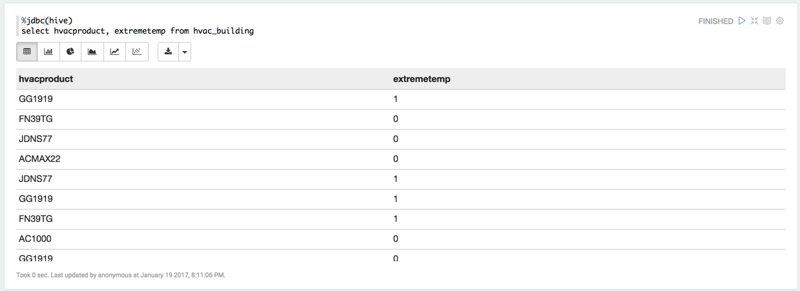
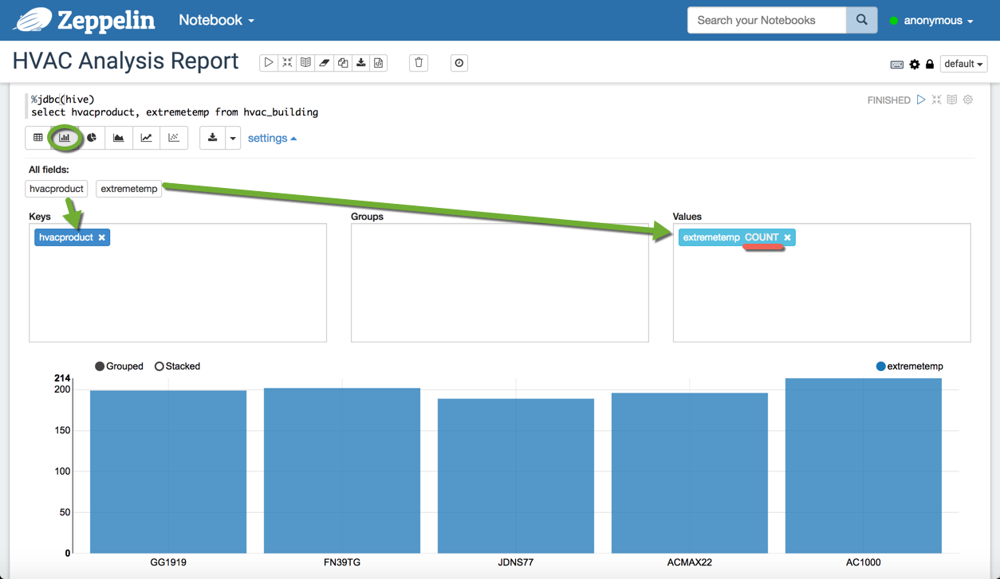

# Analyze HVAC Machine and Sensor Data

## Lab 2 - Visualize HVAC Data Via Zeppelin

## Introduction

You will learn to gain more insights on your data by visualizing certain key attributes using Apache Zeppelin. You will to learn to visualize a graph that shows the countries that have the most extreme temperature and the amount of **NORMAL** events there are compared to **HOT** and **COLD**. You will also learn to see which HVAC units result in the most `extremetemp` readings.

## Prerequisites

-   Lab 1 - Upload and Refine Data with Hive

## Outline

-   [Apache Zeppelin](#apache-zeppelin-lab2)
-   [Step 1: Visualize Temperature Ranges of Countries](#visualize-temp-ranges-countries)
-   [Step 2: Determine Which Buildings Need HVAC Upgrades](#dtrm-buildings-hvac-upgrades)
-   [Summary](#summary-lab2)
-   [Further Reading](#further-reading-lab2)

## Apache Zeppelin 

Apache Zeppelin is data reporting tool on Hadoop. Zeppelin integrates with Hadoop by using tools called interpreters. It has direct connections to Apache Spark and Hive in your cluster and allows you to create visualizations and analyze your data on the fly.
Apache Zeppelin gives you the power to connect right to your Hadoop cluster to quickly obtain results from the data inside of Hadoop without having to export data to any other sources.

It’s also important to note that Zeppelin contains several interpreters that can be utilized to obtain data in a variety of ways.
One of the default interpreters included with Zeppelin is for Apache Spark. With the popularity of Apache Spark rising, you can simply write Spark scripts to execute directly on Apache Zeppelin to obtain results from your data in a matter of seconds.

## Step 1: Visualize Temperature Ranges of Countries 

1\. Access Zeppelin at [localhost:9995](http://localhost:9995/)

From here we’re going to need to create a new Zeppelin Notebook. Notebooks in Zeppelin is how we differentiate reports from one another.

2\. Hover over **Notebook**. Use the dropdown menu and **Create a new note**.

3\. Name the note **HVAC Analysis Report** and then **Create Note**.

We will use the Hive interpreter to run Hive queries and visualize the results in Zeppelin.

4\. To access the Hive interpreter for this note, we must insert `%jdbc(hive)` at the top of the note. Everything afterwards will be interpreted as a Hive query.

5\. Type the following query into the note, then run it by clicking the **Run** arrow or by using the shortcut **Shift+Enter**.

~~~
%jdbc(hive)

select country, extremetemp, temprange from hvac_building
~~~

Now that the query is run, let’s visualize the data with a chart.

6\. Select the bar graph chart button located just under the query.

7\. Click **settings** to open up more advanced settings for creating the chart.

8\. Here you will experiment with different values and columns to customize data that is illustrated in your visualization.

-   Arrange the fields according to the following image.
-   Drag the field `temprange` into the **groups** box.
-   Click **SUM** on `extremetemp` and change it to **COUNT**.
-   Make sure that `country` is the only field under **Keys**.

You've just customized your chart’s settings to portray the countries and their temperature from cold, normal to hot using Apache Zeppelin.

-   From the chart above we can see which countries have the most extreme temperature and how many **NORMAL** events there are compared to **HOT** and **COLD**.

## Step 2: Determine Which Buildings Need HVAC Upgrades 

Is it possible to figure out which buildings might need HVAC upgrades, and which do not? Let’s determine that answer in the steps ahead...

-   Let's try creating one more note to visualize which types of HVAC systems result in the least amount of `extremetemp` readings.

9\. Paste the following query into the blank Zeppelin note following the chart we made previously.

~~~
%jdbc(hive)

select hvacproduct, extremetemp from hvac_building
~~~

10\. Use **Shift+Enter** to run the note.

11\. Arrange the fields according to the following image so we can recreate the chart below.

-   Make sure that `hvacproduct` is in the **Keys** box.
-   Make sure that `extremetemp` is in the **Values** box and that it is set to **COUNT**.

-   Now we can see which HVAC units result in the most `extremetemp` readings. Thus we can make a more informed decision when purchasing new HVAC systems.

## Summary 

We’ve successfully gained more insights on our data by visualizing certain key attributes using Apache Zeppelin. We learned to visualize a graph that shows the countries that have the most extreme temperature and the amount of **NORMAL** events there are compared to **HOT** and **COLD**. We learned to see which HVAC units result in the most `extremetemp` readings.

## Further Reading 

-   [How to create Map Visualization in Apache Zeppelin](https://community.hortonworks.com/questions/78430/how-to-create-map-visualization-in-apache-zeppelin.html)
-   [Using Angular within Apache Zeppelin to create custom visualizations](https://community.hortonworks.com/articles/75834/using-angular-within-apache-zeppelin-to-create-cus.html)
