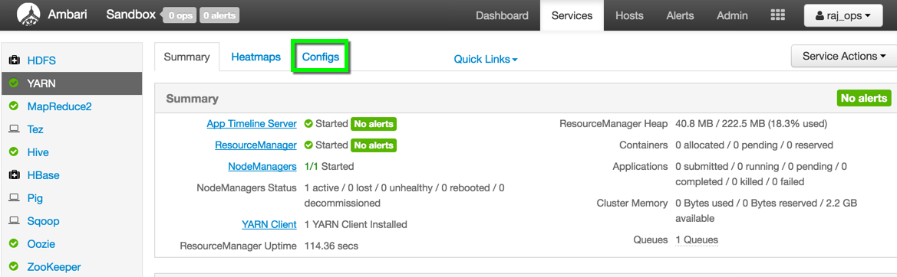
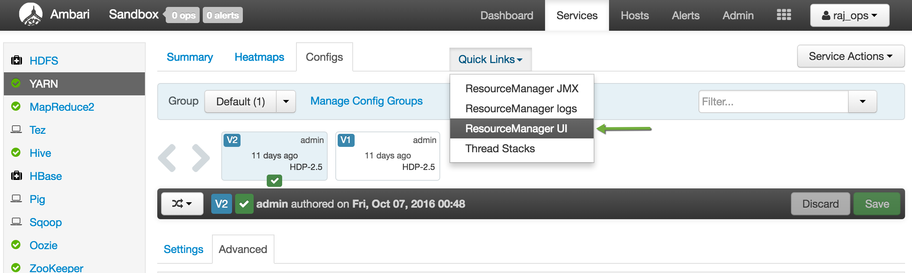
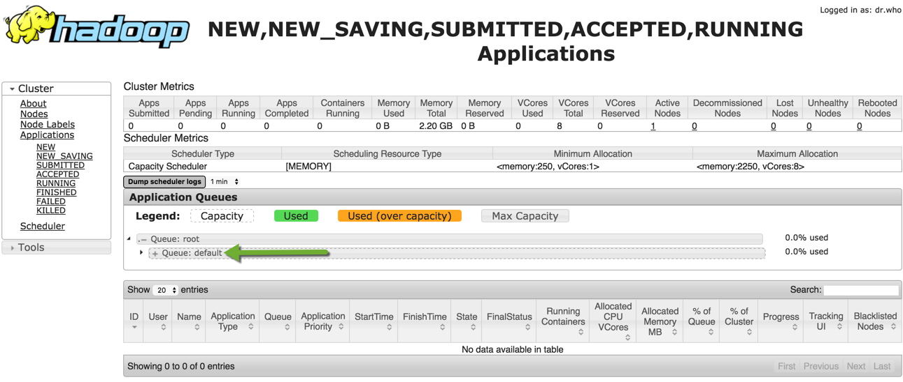
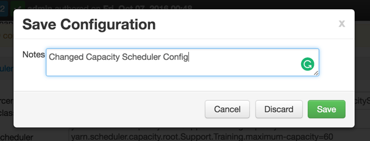
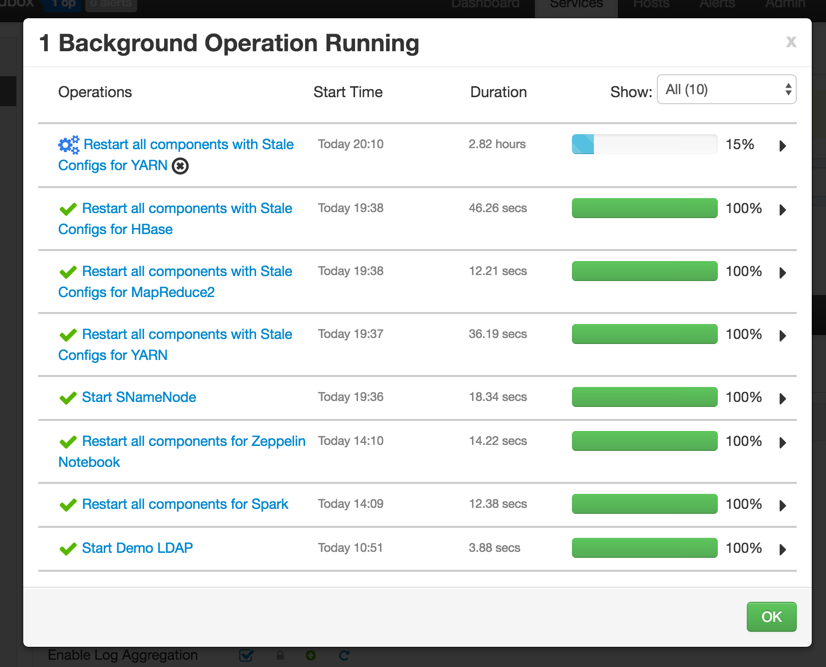
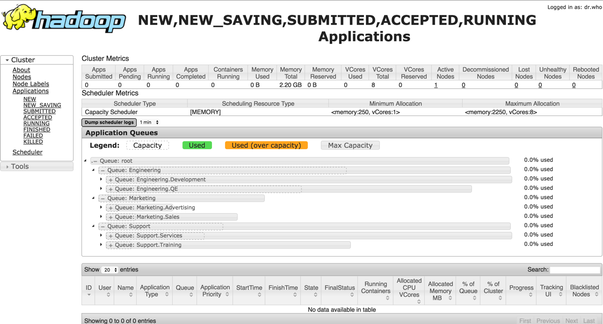
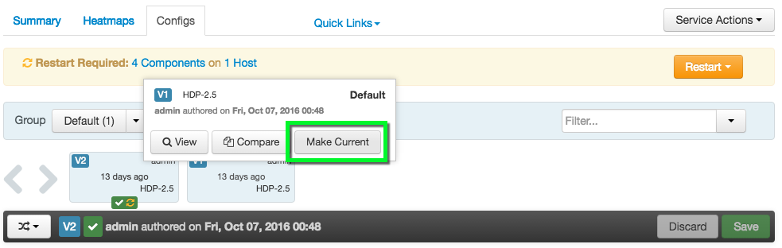

# Configuring Yarn Capacity Scheduler with Apache Ambari

## Introduction

In this tutorial we are going to explore how we can configure YARN Capacity Scheduler from Ambari.

YARN's Capacity Scheduler is designed to run Hadoop applications in a shared, multi-tenant cluster while maximizing the throughput and the utilization of the cluster.

Traditionally each organization has it own private set of compute resources that have sufficient capacity to meet the organization's SLA. This generally leads to poor average utilization. Also there is heavy overhead of managing multiple independent clusters.

Sharing clusters between organizations allows economies of scale . However, organizations are concerned about sharing a cluster in the fear of not getting enough available resources that are critical to meet their SLAs.
The Capacity Scheduler is designed to allow sharing a large cluster while giving each organization capacity guarantees. There is an added benefit that an organization can access any excess capacity not being used by others. This provides elasticity for the organizations in a cost-effective manner.

Sharing clusters across organizations necessitates strong support for multi-tenancy since each organization must be guaranteed capacity and safeguards to ensure the shared cluster is impervious to single rogue application or user or sets thereof. The Capacity Scheduler provides a stringent set of limits to ensure that a single application or user or queue cannot consume disproportionate amount of resources in the cluster. Also, the Capacity Scheduler provides limits on initialized/pending applications from a single user and queue to ensure fairness and stability of the cluster.

The primary abstraction provided by the Capacity Scheduler is the concept of queues. These queues are typically set up by administrators to reflect the economics of the shared cluster.

To provide further control and predictability on sharing of resources, the Capacity Scheduler supports hierarchical queues to ensure resources are shared among the sub-queues of an organization before other queues are allowed to use free resources, thereby providing affinity for sharing free resources among applications of a given organization.

## Prerequisites

- [Download Hortonworks 2.5 Sandbox](https://hortonworks.com/downloads/#sandbox)
- Complete the [Learning the Ropes of the Hortonworks Sandbox tutorial,](https://hortonworks.com/hadoop-tutorial/learning-the-ropes-of-the-hortonworks-sandbox/) you will need it for logging into Ambari.

## Outline

-   [Configuring the Capacity Scheduler](#configure-scheduler)
-   [Rollback the Configuration Version](#rollback-version)
-   [Summary](#summary)
-   [Further Reading](#further-reading)

## Configuring the Capacity Scheduler 

After you spin up the Hortonworks Sandbox, login to Ambari. The user credentials are **raj_ops/raj_ops**.

After you Login, you will see the Dashboard. This is an unified view of the state of your Sandbox.

You can drill into specific service dashboard and configuration.
Let’s dive into YARN dashboard by selecting **Yarn** from the left-side bar or the drop down menu.

We will start updating the configuration for Yarn Capacity Scheduling policies. Click on `Configs` tab.

Next, click on `Advanced` and scroll down to the **Scheduler** section of the page. The default capacity scheduling policy just has one queue which is **default**.

Let check out the scheduling policy visually. Scroll up to the top of the page and click on `Quick Links`. Then select `ResourceManager UI` from the dropdown.

Click on `Scheduler` and you can see below we just have the **default** policy.

Let’s change the capacity scheduling policy to where we have separate queues and policies for Engineering, Marketing and Support departments:

~~~
yarn.scheduler.capacity.maximum-am-resource-percent=0.2
yarn.scheduler.capacity.maximum-applications=10000
yarn.scheduler.capacity.node-locality-delay=40
yarn.scheduler.capacity.root.Engineering.Development.acl_administer_jobs=*
yarn.scheduler.capacity.root.Engineering.Development.acl_administer_queue=*
yarn.scheduler.capacity.root.Engineering.Development.acl_submit_applications=*
yarn.scheduler.capacity.root.Engineering.Development.capacity=20
yarn.scheduler.capacity.root.Engineering.Development.minimumaximum-capacity=100
yarn.scheduler.capacity.root.Engineering.Development.state=RUNNING
yarn.scheduler.capacity.root.Engineering.Development.user-limit-factor=1
yarn.scheduler.capacity.root.Engineering.QE.acl_administer_jobs=*
yarn.scheduler.capacity.root.Engineering.QE.acl_administer_queue=*
yarn.scheduler.capacity.root.Engineering.QE.acl_submit_applications=*
yarn.scheduler.capacity.root.Engineering.QE.capacity=80
yarn.scheduler.capacity.root.Engineering.QE.maximum-capacity=90
yarn.scheduler.capacity.root.Engineering.QE.state=RUNNING
yarn.scheduler.capacity.root.Engineering.QE.user-limit-factor=1
yarn.scheduler.capacity.root.Engineering.acl_administer_jobs=*
yarn.scheduler.capacity.root.Engineering.acl_administer_queue=*
yarn.scheduler.capacity.root.Engineering.acl_submit_applications=*
yarn.scheduler.capacity.root.Engineering.capacity=60
yarn.scheduler.capacity.root.Engineering.maximum-capacity=100
yarn.scheduler.capacity.root.Engineering.queues=Development,QE
yarn.scheduler.capacity.root.Engineering.state=RUNNING
yarn.scheduler.capacity.root.Engineering.user-limit-factor=1
yarn.scheduler.capacity.root.Marketing.Advertising.acl_administer_jobs=*
yarn.scheduler.capacity.root.Marketing.Advertising.acl_administer_queue=*
yarn.scheduler.capacity.root.Marketing.Advertising.acl_submit_applications=*
yarn.scheduler.capacity.root.Marketing.Advertising.capacity=30
yarn.scheduler.capacity.root.Marketing.Advertising.maximum-capacity=40
yarn.scheduler.capacity.root.Marketing.Advertising.state=STOPPED
yarn.scheduler.capacity.root.Marketing.Advertising.user-limit-factor=1
yarn.scheduler.capacity.root.Marketing.Sales.acl_administer_jobs=*
yarn.scheduler.capacity.root.Marketing.Sales.acl_administer_queue=*
yarn.scheduler.capacity.root.Marketing.Sales.acl_submit_applications=*
yarn.scheduler.capacity.root.Marketing.Sales.capacity=70
yarn.scheduler.capacity.root.Marketing.Sales.maximum-capacity=80
yarn.scheduler.capacity.root.Marketing.Sales.minimum-user-limit-percent=20
yarn.scheduler.capacity.root.Marketing.Sales.state=RUNNING
yarn.scheduler.capacity.root.Marketing.Sales.user-limit-factor=1
yarn.scheduler.capacity.root.Marketing.acl_administer_jobs=*
yarn.scheduler.capacity.root.Marketing.acl_submit_applications=*
yarn.scheduler.capacity.root.Marketing.capacity=10
yarn.scheduler.capacity.root.Marketing.maximum-capacity=40
yarn.scheduler.capacity.root.Marketing.queues=Sales,Advertising
yarn.scheduler.capacity.root.Marketing.state=RUNNING
yarn.scheduler.capacity.root.Marketing.user-limit-factor=1
yarn.scheduler.capacity.root.Support.Services.acl_administer_jobs=*
yarn.scheduler.capacity.root.Support.Services.acl_administer_queue=*
yarn.scheduler.capacity.root.Support.Services.acl_submit_applications=*
yarn.scheduler.capacity.root.Support.Services.capacity=80
yarn.scheduler.capacity.root.Support.Services.maximum-capacity=100
yarn.scheduler.capacity.root.Support.Services.minimum-user-limit-percent=20
yarn.scheduler.capacity.root.Support.Services.state=RUNNING
yarn.scheduler.capacity.root.Support.Services.user-limit-factor=1
yarn.scheduler.capacity.root.Support.Training.acl_administer_jobs=*
yarn.scheduler.capacity.root.Support.Training.acl_administer_queue=*
yarn.scheduler.capacity.root.Support.Training.acl_submit_applications=*
yarn.scheduler.capacity.root.Support.Training.capacity=20
yarn.scheduler.capacity.root.Support.Training.maximum-capacity=60
yarn.scheduler.capacity.root.Support.Training.state=RUNNING
yarn.scheduler.capacity.root.Support.Training.user-limit-factor=1
yarn.scheduler.capacity.root.Support.acl_administer_jobs=*
yarn.scheduler.capacity.root.Support.acl_administer_queue=*
yarn.scheduler.capacity.root.Support.acl_submit_applications=*
yarn.scheduler.capacity.root.Support.capacity=30
yarn.scheduler.capacity.root.Support.maximum-capacity=100
yarn.scheduler.capacity.root.Support.queues=Training,Services
yarn.scheduler.capacity.root.Support.state=RUNNING
yarn.scheduler.capacity.root.Support.user-limit-factor=1
yarn.scheduler.capacity.root.acl_administer_queue=*
yarn.scheduler.capacity.root.capacity=100
yarn.scheduler.capacity.root.queues=Support,Marketing,Engineering
yarn.scheduler.capacity.root.unfunded.capacity=50
~~~

Copy and paste the above policy in the `Capacity Scheduler` textbox from Ambari:

Click `Save` and confirm on the dialog box:

At this point, the configuration is saved but we still need to restart the affected components by the configuration change as indicated in the orange band below:

Also note that there is now a new version of the configuration as indicated by the green `Current` label. Let’s restart the daemons by clicking `Restart All`.

Wait for the restart to complete:

and then go back to the Resource Manager UI  and refresh the page. Voila! There’s our new policy:

Now restart other services from Ambari which need a restart.

## Rollback the Configuration Version 

You can also rollback to the previous set of configurations.  Just hover on the previous version and click `Make Current`.

## Summary 

So in this tutorial, you learned how to configure different queues and allotment of resources to those queues. Hope this brief tour of using YARN's Capacity Scheduler gave you some ideas on how to achieve better utilization of Hadoop clusters.

## Further Reading

Check out some Hortonworks Community Connection articles to explore more about Capacity Scheduler:

1. [Yarn Queues - No Capacity Scheduler View](https://community.hortonworks.com/articles/4864/yarn-queues-no-capacity-scheduler-view.html)
2. [Control User Access to Capacity Scheduler Queues](https://community.hortonworks.com/articles/3229/capacity-scheduler-users-can-submit-to-any-queue.html)
