# Cross Component Lineage with Apache Atlas across Apache Sqoop, Hive, Kafka & Storm

## Introduction

Hortonworks introduced [Apache Atlas](https://hortonworks.com/blog/apache-atlas-project-proposed-for-hadoop-governance/) as part of the [Data Governance Initiative](https://hortonworks.com/press-releases/hortonworks-establishes-data-governance-initiative/), and has continued to deliver on the vision for open source solution for centralized metadata store, data classification, data lifecycle management and centralized security.
Atlas is now offering, as a tech preview, cross component lineage functionality, delivering a complete view of data movement across a number of analytic engines such as Apache Storm, Kafka, Falcon and Hive.
This tutorial walks through the steps for creating data in Apache Hive through Apache Sqoop and using Apache Kafka with Apache Storm.

## Prerequisites

- [Download Hortonworks 2.5 Sandbox](https://hortonworks.com/downloads/#sandbox)
- Complete the [Learning the Ropes of the Hortonworks Sandbox tutorial,](https://hortonworks.com/hadoop-tutorial/learning-the-ropes-of-the-hortonworks-sandbox/) you will need it for logging into Ambari.

## Outline

-   [1: Configure Hive to work with Atlas](#configure-hive-with-atlas)
-   [2: Start Kafka, Storm, HBase, Ambari Infra and Atlas](#start-services)
-   [3: Sqoop-Hive Lineage](#sqoop-hive-lineage)
-   [4: Kafka – Storm Lineage](#kafka-storm-lineage)
-   [Summary](#summary)
-   [Further Reading](#further-reading)

## 1: Configure Hive to work with Atlas 

Started by logging into Ambari as **raj_ops** user. User name - **raj_ops** and password - **raj_ops**.

### 1.1: View the Services Page

From the Dashboard page of Ambari, click on `Hive` from the list of installed services.
Then click on `Configs` tab and search `atlas.hook.hive.synchronous` in the filter text box.

This property takes a boolean value and specifies whether to run the Atlas-Hive hook synchronously or not. By default, it is false, change it to `true` so that you can capture the lineage for hive operations. Click `Save` after you make the change.

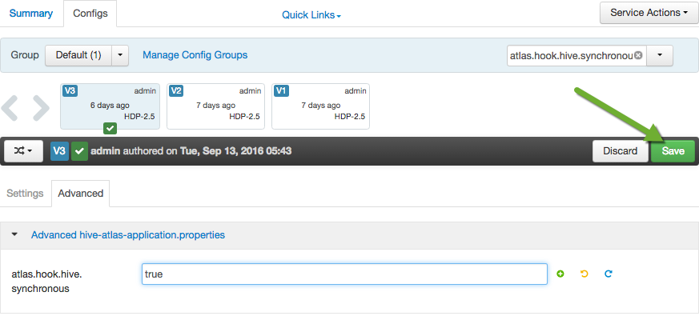

Write **Atlas-hive hook enabled** in the prompt and then proceed with saving the change. You have to Restart Hive now. Click on `Restart` and then `Restart All Affected`.

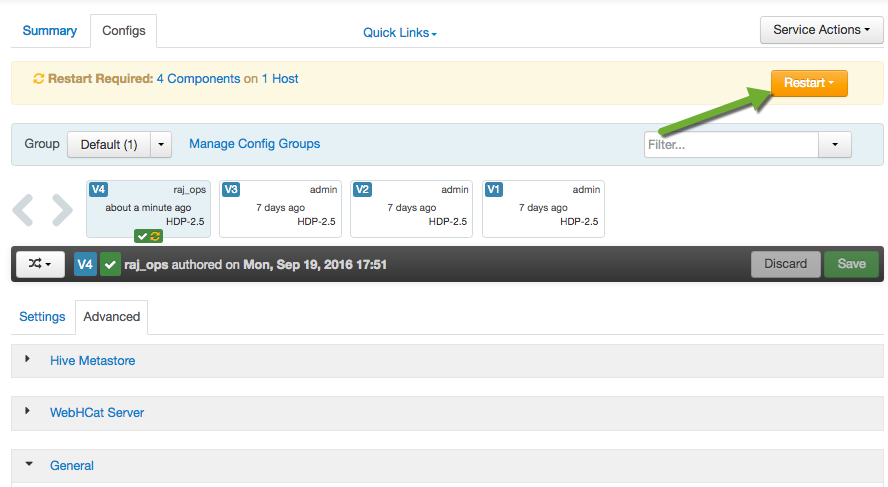

## 2: Start Kafka, Storm, HBase, Ambari Infra and Atlas 

From the Dashboard page of Ambari, click on `Kafka` from the list of installed services.

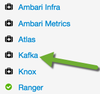

### 2.1: Start Kafka Service

From the Kafka page, click on `Service Actions -> Start`

Check the `Maintenance Mode` box and click on `Confirm Start`:

Wait for Kafka to start (It may take a few minutes to turn green)

In the same way you started Kafka above, start other required services (in order):
1. Storm
2. HBase
3. Ambari Infra
4. Atlas

### 2.2: Stop Services

Stop some services like **Spark, Oozie, Flume and Zeppelin** which are not required in this tutorial. Turn On the **Maintenance mode** also.
Your Ambari dashboard page should look like this:

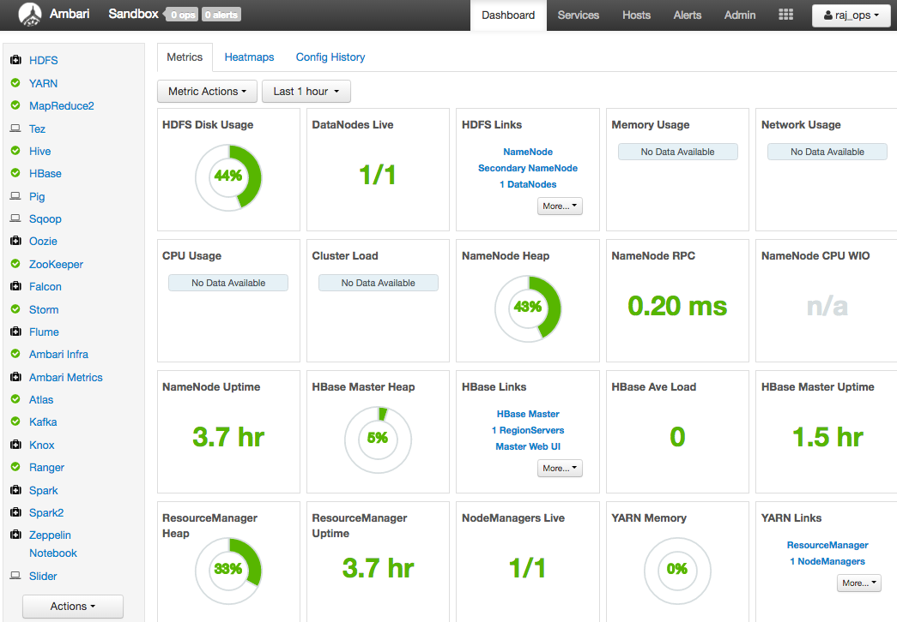

## 3: Sqoop-Hive Lineage 

We need a script for creating a MySQL table, then importing the table using Sqoop into Hive.

### 3.1: Log into the Sandbox.

First do ssh into the terminal by the user **root**. The first time password for root user is `hadoop` :

~~~
ssh root@127.0.0.1 -p 2222
~~~

### 3.2: Download & extract the demo script

Run the following command to get to the scripts for the tutorial.

~~~
mkdir crosscomponent_demo
cd crosscomponent_demo
wget https://raw.githubusercontent.com/hortonworks/data-tutorials/master/tutorials/hdp/hdp-2.5/cross-component-lineage-with-apache-atlas-across-apache-sqoop-hive-kafka-storm/assets/crosscomponent_scripts.zip
unzip crosscomponent_scripts.zip
cd crosscomponent_scripts/sqoop-demo
~~~

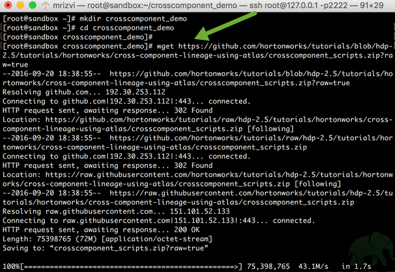

### 3.3: Create a mysql table

Run the below command in your terminal to login into mysql shell, create a table called **test_table_sqoop1** and then insert two records:

~~~
cat 001-setup-mysql.sql | mysql -u root -p
~~~

> NOTE: default password for mysql root user is hadoop. Enter it then press enter when prompted for password

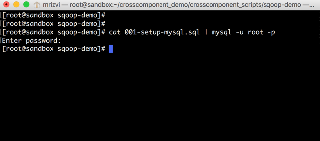

### 3.4: Run the SQOOP Job

Run the below command in your terminal. It is a **sqoop import** command to transfer the data from mysql table **test_table_sqoop1** to the hive table **test_hive_table1**. The hive table do not have to be pre-created, it would be created on fly.

~~~
sh 002-run-sqoop-import.sh
~~~

> NOTE: default password for mysql root user is hadoop. Enter it then press enter when prompted for password

Here is the screenshot of results you would see in the screen when you run the above script.

It will run the map-reduce job and at the end, you can see your new Hive table created:

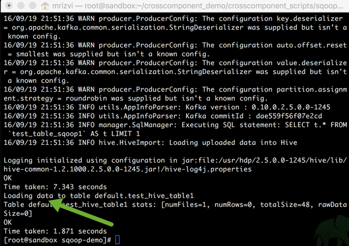

### 3.5: Create CTAS sql command

CTAS stands for **create table as select**. We would create one more table in Hive from the table imported by the sqoop job above. The second table name is **cur_hive_table1** and we will create the table using beeline shell:
Run the below command in your terminal

~~~
cat 003-ctas-hive.sql | beeline -u "jdbc:hive2://localhost:10000/default" -n hive -p hive -d org.apache.hive.jdbc.HiveDriver
~~~

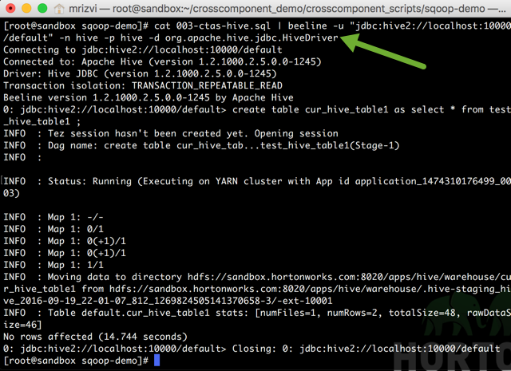

### 3.6: View ATLAS UI for the lineage

Click on http://127.0.0.1:21000. Credentials are:

User name - **holger_gov**
Password - **holger_gov**

Click on `Search` tab and type **cur_hive_table1**

You will see the lineage like given below. You can hover at each one of them to see the operations performed:

## 4: Kafka – Storm Lineage 

The following steps will show the lineage of data between Kafka topic **my-topic-01** to Storm topology **storm-demo-topology-01**, which stores the output in the HDFS folder (/user/storm/storm-hdfs-test).

### 4.1: Create a Kafka topic to be used in the demo

Run the following commands to create a new Kafka topic **my-topic-01**

~~~
cd ../storm-demo
sh 001-create_topic.sh
~~~

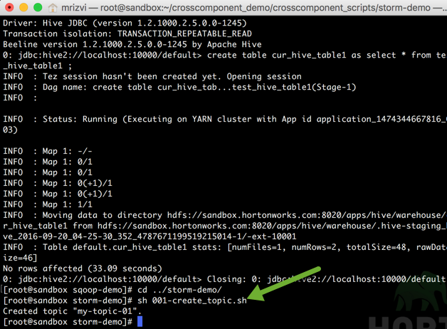

### 4.2: Create a HDFS folder for output

Run the following command to create a new HDFS directory under /user/storm

~~~
sh 002-create-hdfs-outdir.sh
~~~

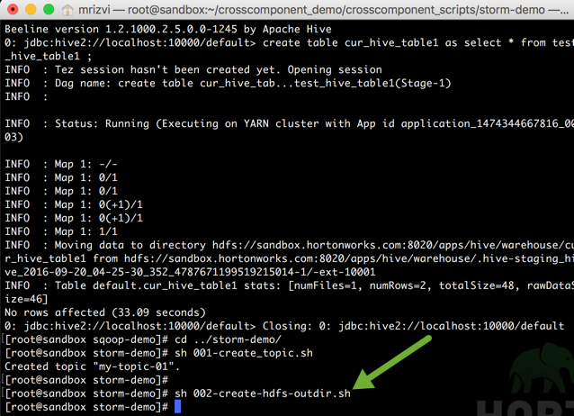

### 4.3: Download STORM job jar file (optional)

Source is available at https://github.com/yhemanth/storm-samples.
Run the following command:

~~~
sh 003-download-storm-sample.sh
~~~

As the jar files is already downloaded in the vm, you would see the below information:

~~~
Storm Jar file is already download in /root/crosscomponent_demo/crosscomponent_scripts/storm-demo/lib folder
You can view the source for this at https://github.com/yhemanth/storm-samples
~~~

### 4.4: Run the Storm Job

Run the following command:

~~~
sh 004-run-storm-job.sh
~~~

### 4.5: View ATLAS UI for the lineage

Go to the Atlas UI http://localhost:21000/. Search for: **kafka_topic** this time and Click on: `my-topic-01`

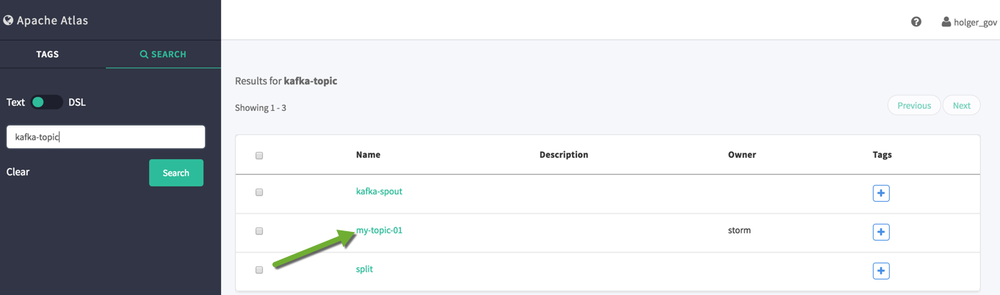

Scroll down and you will see a lineage of all the operations from Kafka to Storm.

## Summary 

**Apache Atlas** is the only governance solution for Hadoop that has native hooks within multiple Hadoop components and delivers lineage across these components. With the new preview release, Atlas now supports lineage across data movement in Apache Sqoop, Hive, Kafka, Storm and in Falcon.

## Further Reading

Please go through following Hortonworks Community articles to know more about Apache Atlas:

1. [Understanding Taxonomy in Apache Atlas](https://community.hortonworks.com/articles/58932/understanding-taxonomy-in-apache-atlas.html)
2. [Hive Data Lineage using Apache Atlas](https://community.hortonworks.com/content/kbentry/58885/hive-data-lineage-using-apache-atlas.html)
