# Hadoop Tutorial – Getting Started with HDP

## Lab 2: Hive - Data ETL

## Introduction

In this tutorial, you will be introduced to Apache(TM) Hive. In the earlier section, we covered how to load data into HDFS. So now you have **geolocation** and **trucks** files stored in HDFS as csv files. In order to use this data in Hive, we will guide you on how to create a table and how to move data into a Hive warehouse, from where it can be queried. We will analyze this data using SQL queries in Hive User Views and store it as ORC. We will also walk through Apache Tez and how a DAG is created when you specify Tez as execution engine for Hive. Let's start..!!

## Prerequisites

The tutorial is a part of a series of hands on tutorials to get you started on HDP using the Hortonworks sandbox. Please ensure you complete the prerequisites before proceeding with this tutorial.

-   [Learning the Ropes of the Hortonworks Sandbox](https://hortonworks.com/hadoop-tutorial/learning-the-ropes-of-the-hortonworks-sandbox/)
-   Hortonworks Sandbox
-   Lab 1: Load sensor data into HDFS
-   Allow yourself around **one hour** to complete this tutorial.

## Outline

-   [Apache Hive Basics](#hive-basics)
-   [Step 2.1: Become Familiar with Ambari Hive View](#use-ambari-hive-user-views)
-   [Step 2.2: Define a Hive Table](#define-a-hive-table)
-   [Step 2.3: Explore Hive Settings on Ambari Dashboard](#explore-hive-settings)
-   [Step 2.4: Analyze the Trucks Data](#analyze-truck-data)
-   [Step 2.5: Define Table Schema](#define-table-schema)
-   [Summary](#summary-lab2)
-   [Further Reading](#further-reading)

## Apache Hive Basics 

Apache Hive provides  SQL interface to query data stored in various databases and files systems that integrate with Hadoop.  Hive enables analysts familiar with SQL to run queries on large volumes of data.  Hive has three main functions: data summarization, query and analysis. Hive provides tools that enable easy data extraction, transformation and loading (ETL).

## Step 2.1: Become Familiar with Ambari Hive View 

Apache Hive presents a relational view of data in HDFS. Hive can represent data in a tabular format managed by Hive or just stored in HDFS irrespective in the file  format their data is stored in.  Hive can query data from RCFile format, text files, ORC, JSON, parquet,  sequence files and many of other formats in a tabular view.   Through the use of SQL you can view your data as a table and create queries like you would in an RDBMS.

To make it easy to interact with Hive we use a tool in the Hortonworks Sandbox called the Ambari Hive View.   [Ambari Hive View](https://docs.hortonworks.com/HDPDocuments/Ambari-2.4.0.1/bk_ambari-views/content/section_using_hive_view.html) provides an interactive interface to Hive.   We can create, edit, save and run queries, and have Hive evaluate them for us using a series of MapReduce jobs or Tez jobs.

Let’s now open the Ambari Hive View and get introduced to the environment. Go to the 9 square Ambari User View icon and select Hive View:

The Ambari Hive View looks like the following:

Now let’s take a closer look at the SQL editing capabilities in the Hive View:

1.  There are _five tabs_ to interact with SQL:
    -   **Query**: This is the interface shown above and the primary interface to write, edit and execute new SQL statements
    -   **Saved Queries**: You can save your favorite queries and quickly have access to them to rerun or edit.
    -   **History**: This allows you to look at past queries or currently running queries to view, edit and rerun.  It also allows you to see all SQL queries you have authority to view.  For example, if you are an operator and an analyst needs help with a query, then the Hadoop operator can use the History feature to see the query that was sent from the reporting tool.
    -   **UDFs**:  Allows you to define UDF interfaces and associated classes so you can access them from the SQL editor.
    -   **Upload Table**: Allows you to upload your hive query tables to your preferred database and appears instantly in the Query Editor for execution.
2.  **Database Explorer:**  The Database Explorer helps you navigate your database objects.  You can either search for a database object in the Search tables dialog box, or you can navigate through Database -> Table -> Columns in the navigation pane.
3.  **Query Editor:** The principal pane to write and edit SQL statements. This editor includes content assist via **CTRL + Space** to help you build queries. Content assist helps you with SQL syntax and table objects.
4.  Once you have created your SQL statement you have 4 options:
    -   **Execute**: This runs the SQL statement.
    -   **Explain**: This provides you a visual plan, from the Hive optimizer, of how the SQL statement will be executed.
    -   **Save as**:  Allows you to persist your queries into your list of saved queries.
    -   **Kill Session**: Terminates the SQL statement.
5.  When the query is executed you can see the Logs or the actual query results.
    -   **Logs Tab:** When the query is executed you can see the logs associated with the query execution.  If your query fails this is a good place to get additional information for troubleshooting.
    -    **Results Tab**: You can view results in sets of 50 by default.
6.  There are five sliding views on the right hand side with the following capabilities, which are in context of the tab you are in:
    -   **Query**: This is the default operation,which allows you to write and edit SQL.
    -   **Settings**:  This allows you to set properties globally or associated with an individual query.
    -   **Data Visualization**: Allows you to visualize your numeric data through different charts.
    -   **Visual Explain**: This will generate an explain for the query.  This will also show the progress of the query.
    -   **TEZ**: If you use TEZ as the query execution engine then you can view the DAG associated with the query.  This integrates the TEZ User View so you can check for correctness and helps with performance tuning by visualizing the TEZ jobs associated with a SQL query.
    -   **Notifications**: This is how to get feedback on query execution.

Take a few minutes to explore the various Hive View features.

### 2.1.1 Set hive.execution.engine as Tez

A feature we will configure before we run our hive queries is to set the hive execution engine as Tez. You can try map reduce if you like. We will use Tez in this tutorial.

1.  Click on the gear in the sidebar referred to as number 6 in the interface above.
2.  Click on the dropdown menu, choose hive.execution.engine and set the value as tez. Now we are ready to run our queries for this tutorial.

## Step 2.2: Define a Hive Table 

Now that you are familiar with the Hive View, let’s create and load tables for the geolocation and trucks data. In this section we will learn how to use the Ambari Hive View to create two tables: geolocation and trucking using the Hive View Upload Table tab.  The Upload Table tab provides the following key options: choose input file type, storage options (i.e. Apache ORC) and set first row as header.   Here is a visual representation of the table and load creation process accomplished in the next few steps.:

### 2.2.1 Create and load Trucks table For Staging Initial Load

Navigate and select the Upload Table of the Ambari Hive View.  Then select the `Upload from HDFS` radio button, enter the HDFS path `/user/maria_dev/data/trucks.csv` and click the `Preview` button:

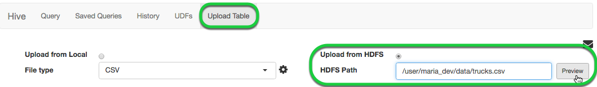

You should see a similar dialog:
Note that the first row contains the names of the columns.

Fortunately the `Upload Table` tab has a feature to specify the first row as a header for the column names.   Press the Gear Button next to the `File type` pull down menu, shown above, to file type customization window. Then check the checkbox for the `Is first row header?`  and hit the close button.

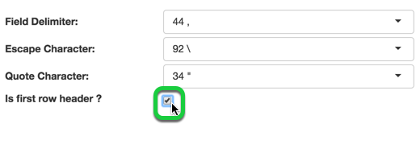

You should now see a similar dialog box with the names of the header columns as the names of the columns:

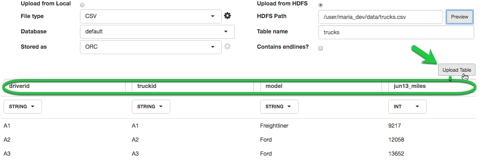

Once you have finished setting all the various properties select the `Upload Table` button to start the create and load table process.

Before reviewing what is happening behind the covers in the Upload Progress let’s learn learn more about Hive File Formats.

### 2.2.2: Define an ORC Table in Hive Create table using Apache ORC file format

[Apache ORC](https://orc.apache.org/) is a fast columnar storage file format for Hadoop workloads.

The Optimized Row Columnar ([new Apache ORC project](https://hortonworks.com/blog/apache-orc-launches-as-a-top-level-project/)) file format provides a highly efficient way to store Hive data. It was designed to overcome limitations of the other Hive file formats. Using ORC files improves performance when Hive is reading, writing, and processing data.

To use the ORC format, specify ORC as the file format when creating the table. Here is an example::

~~~
CREATE TABLE … **STORED AS ORC**
CREATE TABLE trucks STORED AS ORC AS SELECT * FROM trucks_temp_table;
~~~

Similar style create statements are used with the temporary tables used in the `Upload Tables` tab.

### 2.2.3: Review Upload Table Progress Steps

Initially the `trucks.csv` table is created and loaded into a temporary table.  The temporary table is used to create and load data in ORC format using syntax explained in previous step.  Once the data is loaded into final table the temporary tables are deleted.

> NOTE: The temporary table names are random set of characters and not the names in the illustration above.

You can review the SQL statements issued by selecting the History tab and clicking on the **4 Internal Job** that were executed as a result of using the `Upload Table` tab.

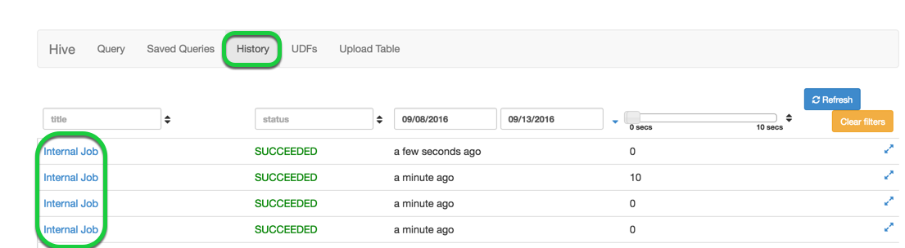

### 2.2.4 Create and Load Geolocation Table

Repeat the steps above with the `geolocation.csv` file to create and load the geolocation table using the ORC file format.

### 2.2.5 Hive Create Table Statement

Let’s review some aspects of the **CREATE TABLE** statements generated and issued above.  If you have an SQL background this statement should seem very familiar except for the last 3 lines after the columns definition:

-   The **ROW FORMAT** clause specifies each row is terminated by the new line character.
-   The **FIELDS TERMINATED** BY clause specifies that the fields associated with the table (in our case, the two csv files) are to be delimited by a comma.
-   The **STORED AS** clause specifies that the table will be stored in the TEXTFILE format.

> NOTE: For details on these clauses consult the [Apache Hive Language Manual](https://cwiki.apache.org/confluence/display/Hive/LanguageManual+DDL).

### 2.2.6 Verify New Tables Exist

To verify the tables were defined successfully, click the **refresh** icon in the Database Explorer. Under Databases, click default database to expand the list of table and the new tables should appear:

### 2.2.7 Sample Data from the trucks table

Click on the **Load sample data** icon to generate and execute a select SQL statement to query the table for a 100 rows.

-   You can have multiple SQL statements within each editor worksheet, but each statement needs to be separated by a semicolon **“;”**.
-   If you have multiple statements within a worksheet but you only want to run one of them just highlight the statement you want to run and then click the Execute button.

**A few additional commands to explore tables:**

-   `show tables;` - List the tables created in the database by looking up the list of tables from the metadata stored in HCatalogdescribe
-   `describe {table_name};` - Provides a list of columns for a particular table

~~~
   describe geolocation;
~~~

-   `show create table {table_name};` - Provides the DDL to recreate a table

~~~
   show create table geolocation;
~~~

-   `describe formatted {table_name};` - Explore additional metadata about the table.  For example you can verify geolocation is an ORC Table, execute the following query:

~~~
   describe formatted geolocation;
~~~

Scroll down to the bottom of the Results tab and you will see a section labeled Storage Information. The output should look like:

By default, when you create a table in Hive, a directory with the same name gets created in the `/apps/hive/warehouse` folder in HDFS.  Using the Ambari Files View, navigate to the /apps/hive/warehouse folder. You should see both a `geolocation` and `trucks` directory:

> NOTE: The definition of a Hive table and its associated metadata (i.e., the directory the data is stored in, the file format, what Hive properties are set, etc.) are stored in the Hive metastore, which on the Sandbox is a MySQL database.

### 2.2.8 Rename Query Editor Worksheet

Notice the tab of your new Worksheet is labeled **trucks sample data**. Double-click on the worksheet tab to rename the label to "sample truck data".  Now save this worksheet by clicking the button.

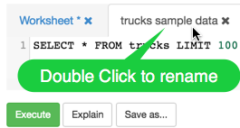

### 2.2.9 Beeline - Command Shell

If you want to try running some of these commands from the the command line you can use the Beeline Shell.  Beeline uses a JDBC connection to connect to HiveServer2. Follow the following steps from your shell in the box (or putty if using Windows):

1\.  Connect to Sandbox VM

~~~
    ssh maria_dev@127.0.0.1 -p 2222
~~~

-   When prompted, use password "maria_dev"

2\. Connect to Beeline

~~~
beeline -u jdbc:hive2://localhost:10000 -n maria_dev
~~~

3\. Enter Beeline commands like:

~~~
!help
!tables
!describe trucks
select count(*) from trucks;
~~~

4\. Exit the Beeline shell:

~~~
!quit
~~~

What did you notice about performance after running hive queries from shell?

-   Queries using the shell run faster because hive runs the query directory in hadoop whereas in Ambari Hive View, the query must be accepted by a rest server before it can submitted to hadoop.
-   You can get more information on the [Beeline from the Hive Wiki](https://cwiki.apache.org/confluence/display/Hive/HiveServer2+Clients#HiveServer2Clients-Beeline–CommandLineShell).
-   Beeline is based on [SQLLine](http://sqlline.sourceforge.net/).

## Step 2.3: Explore Hive Settings on Ambari Dashboard 

### 2.3.1 Open Ambari Dashboard in New Tab

Click on the Dashboard tab to start exploring the Ambari Dashboard.

### 2.3.2 Become Familiar with Hive Settings

Go to the **Hive page** then select the **Configs tab** then click on **Settings tab**:

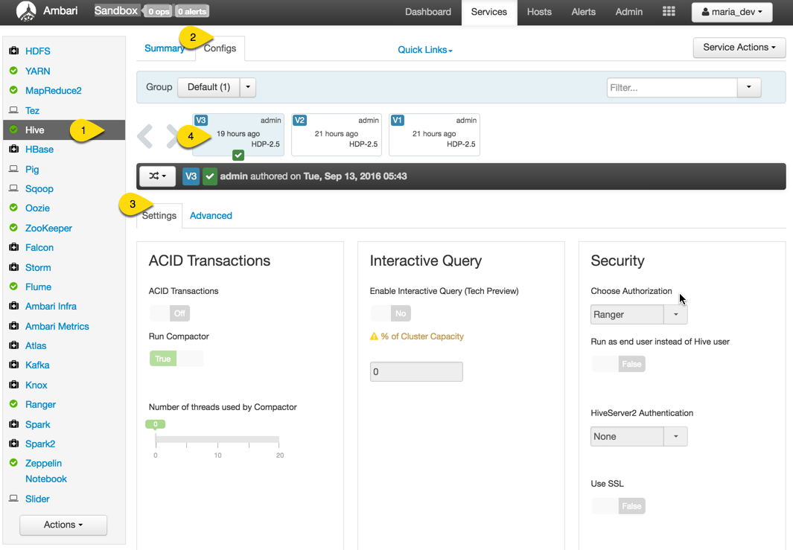

Once you click on the Hive page you should see a page similar to above:

1.  **Hive** Page
2.  Hive **Configs** Tab
3.  Hive **Settings** Tab
4.  Version **History** of Configuration

Scroll down to the **Optimization Settings**:

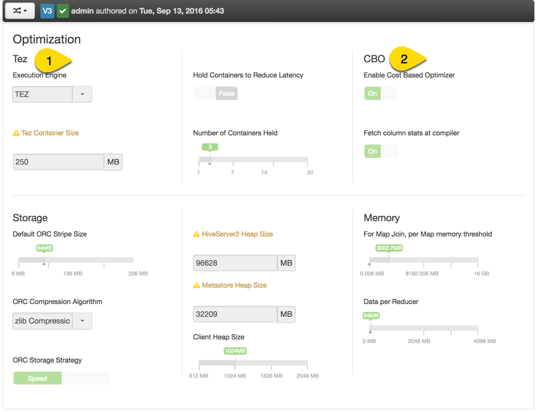

In the above screenshot we can see:

1.  **Tez** is set as the optimization engine
2.  **Cost Based Optimizer** (CBO) is turned on

This shows the **HDP 2.5 Ambari Smart Configurations**, which simplifies setting configurations

-   Hadoop is configured by a **collection of XML files**.
-   In early versions of Hadoop, operators would need to do **XML editing** to **change settings**.  There was no default versioning.
-   Early Ambari interfaces made it **easier to change values** by showing the settings page with **dialog boxes** for the various settings and allowing you to edit them.  However, you needed to know what needed to go into the field and understand the range of values.
-   Now with Smart Configurations you can **toggle binary features** and use the slider bars with settings that have ranges.

By default the key configurations are displayed on the first page.  If the setting you are looking for is not on this page you can find additional settings in the **Advanced** tab:

For example, if we wanted to **improve SQL performance**, we can use the new **Hive vectorization features**. These settings can be found and enabled by following these steps:

1.  Click on the **Advanced** tab and scroll to find the **property**
2.  Or, start typing in the property into the property search field and then this would filter the setting you scroll for.

As you can see from the green circle above, the `Enable Vectorization and Map Vectorization` is turned on already.

Some **key resources** to **learn more about vectorization** and some of the **key settings in Hive tuning:**

-   Apache Hive docs on [Vectorized Query Execution](https://cwiki.apache.org/confluence/display/Hive/Vectorized+Query+Execution)
-   [HDP Docs Vectorization docs](https://docs.hortonworks.com/HDPDocuments/HDP2/HDP-2.0.9.0/bk_dataintegration/content/ch_using-hive-1a.html)
-   [Hive Blogs](https://hortonworks.com/blog/category/hive/)
-   [5 Ways to Make Your Hive Queries Run Faster](https://hortonworks.com/blog/5-ways-make-hive-queries-run-faster/)
-   [Interactive Query for Hadoop with Apache Hive on Apache Tez](https://hortonworks.com/hadoop-tutorial/supercharging-interactive-queries-hive-tez/)
-   [Evaluating Hive with Tez as a Fast Query Engine](https://hortonworks.com/blog/evaluating-hive-with-tez-as-a-fast-query-engine/)

## Step 2.4: Analyze the Trucks Data 

Next we will be using Hive, Pig and Zeppelin to analyze derived data from the geolocation and trucks tables.  The business objective is to better understand the risk the company is under from fatigue of drivers, over-used trucks, and the impact of various trucking events on risk.   In order to accomplish this, we will apply a series of transformations to the source data, mostly though SQL, and use Pig or Spark to calculate risk.   In the last lab on Data Visualization, we will be using _Zeppelin_ to **generate a series of charts to better understand risk**.

Let’s get started with the first transformation.   We want to **calculate the miles per gallon for each truck**. We will start with our _truck data table_.  We need to _sum up all the miles and gas columns on a per truck basis_. Hive has a series of functions that can be used to reformat a table. The keyword [LATERAL VIEW](https://cwiki.apache.org/confluence/display/Hive/LanguageManual+LateralView) is how we invoke things. The **stack function** allows us to _restructure the data into 3 columns_ labeled rdate, gas and mile (ex: 'june13', june13_miles, june13_gas) that make up a maximum of 54 rows. We pick truckid, driverid, rdate, miles, gas from our original table and add a calculated column for mpg (miles/gas).  And then we will **calculate average mileage**.

### 2.4.1 Create Table truck_mileage From Existing Trucking Data

Using the Ambari Hive User View, execute the following query:

~~~
CREATE TABLE truck_mileage STORED AS ORC AS SELECT truckid, driverid, rdate, miles, gas, miles / gas mpg FROM trucks LATERAL VIEW stack(54, 'jun13',jun13_miles,jun13_gas,'may13',may13_miles,may13_gas,'apr13',apr13_miles,apr13_gas,'mar13',mar13_miles,mar13_gas,'feb13',feb13_miles,feb13_gas,'jan13',jan13_miles,jan13_gas,'dec12',dec12_miles,dec12_gas,'nov12',nov12_miles,nov12_gas,'oct12',oct12_miles,oct12_gas,'sep12',sep12_miles,sep12_gas,'aug12',aug12_miles,aug12_gas,'jul12',jul12_miles,jul12_gas,'jun12',jun12_miles,jun12_gas,'may12',may12_miles,may12_gas,'apr12',apr12_miles,apr12_gas,'mar12',mar12_miles,mar12_gas,'feb12',feb12_miles,feb12_gas,'jan12',jan12_miles,jan12_gas,'dec11',dec11_miles,dec11_gas,'nov11',nov11_miles,nov11_gas,'oct11',oct11_miles,oct11_gas,'sep11',sep11_miles,sep11_gas,'aug11',aug11_miles,aug11_gas,'jul11',jul11_miles,jul11_gas,'jun11',jun11_miles,jun11_gas,'may11',may11_miles,may11_gas,'apr11',apr11_miles,apr11_gas,'mar11',mar11_miles,mar11_gas,'feb11',feb11_miles,feb11_gas,'jan11',jan11_miles,jan11_gas,'dec10',dec10_miles,dec10_gas,'nov10',nov10_miles,nov10_gas,'oct10',oct10_miles,oct10_gas,'sep10',sep10_miles,sep10_gas,'aug10',aug10_miles,aug10_gas,'jul10',jul10_miles,jul10_gas,'jun10',jun10_miles,jun10_gas,'may10',may10_miles,may10_gas,'apr10',apr10_miles,apr10_gas,'mar10',mar10_miles,mar10_gas,'feb10',feb10_miles,feb10_gas,'jan10',jan10_miles,jan10_gas,'dec09',dec09_miles,dec09_gas,'nov09',nov09_miles,nov09_gas,'oct09',oct09_miles,oct09_gas,'sep09',sep09_miles,sep09_gas,'aug09',aug09_miles,aug09_gas,'jul09',jul09_miles,jul09_gas,'jun09',jun09_miles,jun09_gas,'may09',may09_miles,may09_gas,'apr09',apr09_miles,apr09_gas,'mar09',mar09_miles,mar09_gas,'feb09',feb09_miles,feb09_gas,'jan09',jan09_miles,jan09_gas ) dummyalias AS rdate, miles, gas;
~~~

### 2.4.2 Explore a sampling of the data in the truck_mileage table

To view the data generated by the script, click **Load Sample Data** icon in the Database Explorer next to truck_mileage. After clicking the next button once, you should see a table that _lists each trip made by a truck and driver_:

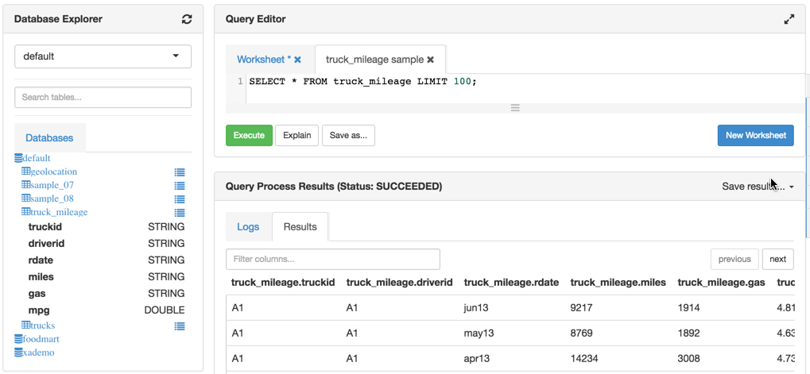

### 2.4.3 Use the Content Assist to build a query

1\.  Create a new **SQL Worksheet**.

2\.  Start typing in the **SELECT SQL command**, but only enter the first two letters:

~~~
SE
~~~

3\.  Press **Ctrl+space** to view the following content assist pop-up dialog window:

> NOTE: Notice content assist shows you some options that start with an “SE”. These shortcuts will be great for when you write a lot of custom query code.

4\. Type in the following query, using **Ctrl+space** throughout your typing so that you can get an idea of what content assist can do and how it works:

~~~
SELECT truckid, avg(mpg) avgmpg FROM truck_mileage GROUP BY truckid;
~~~

5\.  Click the “**Save as …**” button to save the query as “**average mpg**”:

6\.  Notice your query now shows up in the list of “**Saved Queries**”, which is one of the tabs at the top of the Hive User View.

7\.  Execute the “**average mpg**” query and view its results.

### 2.4.4 Explore Explain Features of the Hive Query Editor

1\. Now let's **explore the various explain features** to better _understand the execution of a query_: Text Explain, Visual Explain and Tez Explain. Click on the **Explain** button:

2\. You shall receive similar image as below. The following output displays the flow of the resulting Tez job:

3\. To see the Visual Explain, click on the **Visual Explain icon** on the right tabs. This is a much more readable summary of the explain plan:

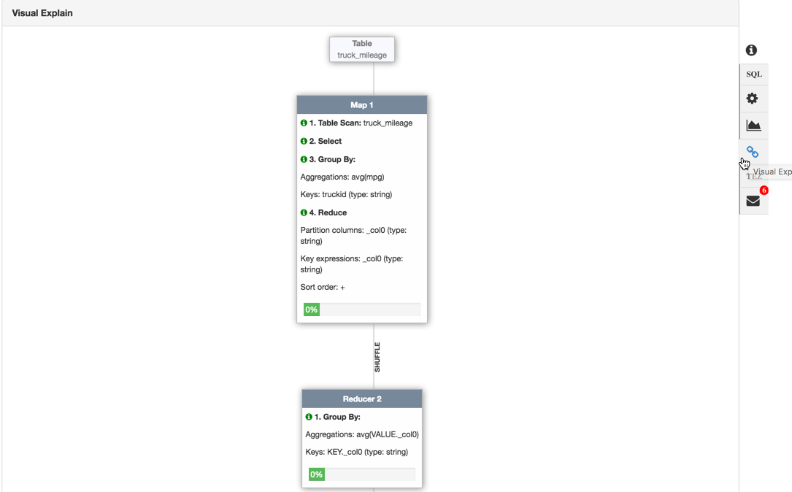

### 2.4.5 Explore TEZ

1\. If you click on **TEZ View** from Ambari Views at the top, you can see _DAG details_ associated with the previous hive and pig jobs.

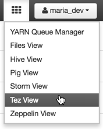

2\. Select the first DAG as it represents the last job that was executed.

3\. There are seven tabs at the top left please take a few minutes to explore the various tabs and then click on the **Graphical View** tab and hover over one of the nodes with your cursor to get more details on the processing in that node.

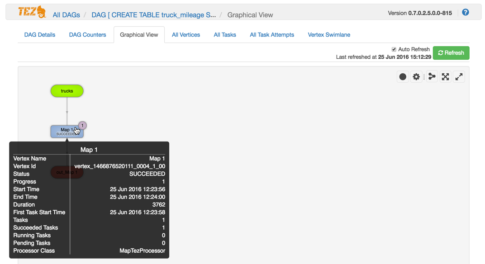

4\. Let's also view **Vertex Swimlane**. This feature helps with troubleshooting of TEZ jobs. As you will see in the image there is a graph for Map 1 and Reduce 2. These graphs are timelines for when events happened. Hover over red or blue line to view a event tooltip.

Basic Terminology:

-   **Bubble** represents an event
-   **Vertex** represents the solid line, timeline of events

For map1, the tooltip shows that the events vertex started and vertex initialize occur simultaneously:

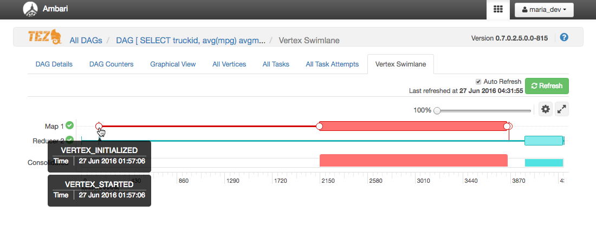

For Reducer 2, the tooltip shows that the events vertex started and initialize share 1 second difference on execution time.

Vertex Initialize

Vertex started

When you look at the tasks started for and finished (thick line) for Map1 compared to Reducer2 in the graph, what do you notice?

-   Map1 starts and completes before Reducer2.

5\. Go back to the Hive View and save the query by clicking the **Save as ...** button.

### 2.4.6 Create Table truck avg_mileage From Existing trucks_mileage Data

> Note: Verify that the `hive.execution.engine` is under `tez`.

**Persist these results into a table**, this is a fairly common pattern in Hive and it is called [Create Table As Select](https://cwiki.apache.org/confluence/display/Hive/LanguageManual+DDL#LanguageManualDDL-CreateTableAsSelect(CTAS)) (CTAS ).  Paste the following script into a new Worksheet, then click the **Execute** button:

~~~
CREATE TABLE avg_mileage
STORED AS ORC
AS
SELECT truckid, avg(mpg) avgmpg
FROM truck_mileage
GROUP BY truckid;
~~~

### 2.4.7 Load Sample Data of avg_mileage

To view the data generated by the script, click **Load sample data** icon in the Database Explorer next to avg_mileage. You see our table is now a list of average miles per gallon for each truck.

## Step 2.5: Define Table Schema 

Now we have refined the truck data to get the average mpg for each truck (**avg_mileage table**). The next task is to **compute the risk factor** for each driver which is the _total miles driven/abnormal events_. We can get the event information from the geolocation table.

If we look at the truck_mileage table, we have the driverid and the number of miles for each trip. To get the total miles for each driver, we can group those records by driverid and then sum the miles.

### 2.5.1 Create Table DriverMileage from Existing truck_mileage Data

We will start by creating a table named driver_mileage that is created from a query of the columns we want from truck_mileage. The following query groups the records by driverid and sums the miles in the select statement. Execute the query below in a new Worksheet:

~~~
CREATE TABLE DriverMileage
STORED AS ORC
AS
SELECT driverid, sum(miles) totmiles
FROM truck_mileage
GROUP BY driverid;
~~~

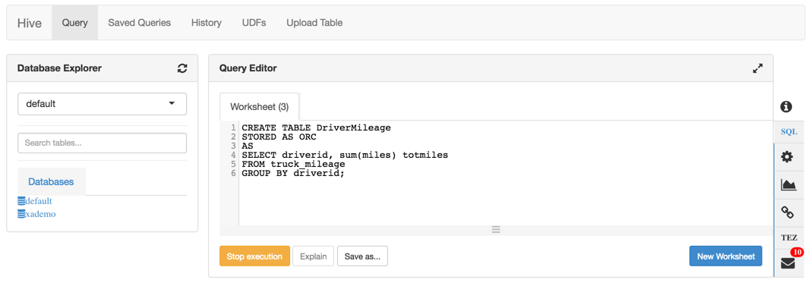

> Note: This table is essential for both Pig Latin and Spark jobs.

### 2.5.2 View Data Generated by Query

To view data, click the **Load sample data** icon in the Database Explorer next to drivermileage. The results should look like:

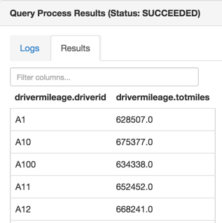

### 2.5.3 Explore Hive Data Visualization

This tool enables us to transform our hive data into a visualization that makes data easier to understand. Let's explore the Hive data explorer to see a variety of different data visualizations. We'll use these examples to build a custom
visualization, which will show the user

1\. Issue a query by (1)clicking on the geolocation Load sample data icon and then (2) select the Hive View visualization tab

2\. Click on Data Explorer tab and quickly explore the distribution of the data from the query.

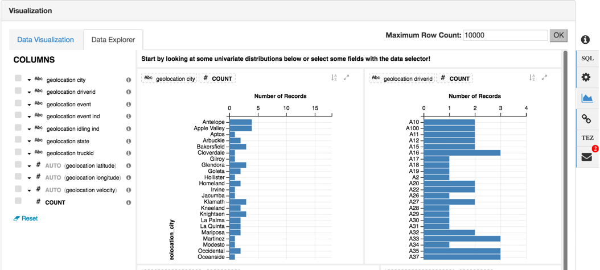

3\. You can also explore some custom Data Visualizations by clicking the tab and then dragging 2 columns into the Positional fields.  Note that you can not save these graphs.  Explore the following [HCC article](https://community.hortonworks.com/articles/2947/new-visualization-feature-in-hive-view.html) for more info.

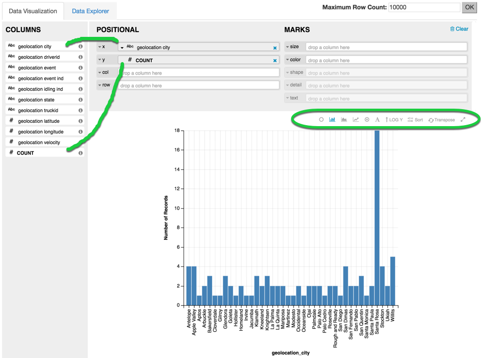

## Summary 

Congratulations! Let’s summarize some Hive commands we learned to process, filter and manipulate the geolocation and trucks data.
We now can create Hive tables with **CREATE TABLE** and load data into them using the **LOAD DATA INPATH** command. Additionally, we learned how to change the file format of the tables to ORC, so hive is more efficient at reading, writing and processing this data. We learned to grab parameters from our existing table using **SELECT {column_name…} FROM {table_name}** to create a new filtered table.

## Further Reading

Augment your hive foundation with the following resources:

-   [Apache Hive](https://hortonworks.com/hadoop/hive/)
-   [Hive LLAP enables sub second SQL on Hadoop](https://hortonworks.com/blog/llap-enables-sub-second-sql-hadoop/)
-   [Programming Hive](http://www.amazon.com/Programming-Hive-Edward-Capriolo/dp/1449319335/ref=sr_1_3?ie=UTF8&qid=1456009871&sr=8-3&keywords=apache+hive)
-   [Hive Language Manual](https://cwiki.apache.org/confluence/display/Hive/LanguageManual+DDL)
-   [HDP DEVELOPER: APACHE PIG AND HIVE](https://hortonworks.com/training/class/hadoop-2-data-analysis-pig-hive/)
