# HBase Reporitng with Apache Phoenix via ODBC

## Introduction

**Apache HBase** is a NoSQL database in the Hadoop eco-system. Many business intelligence tool and data analytic tools lack the ability to work with HBase data directly. **Apache Phoenix** enables you to interact with HBase using SQL. In **HDP 2.5**, we have introduced support for **ODBC drivers**. With this, you can connect any ODBC applications to HBase via Apache Phoenix. This enables you to use familiar business intelligence tools to run analysis on big datasets.  This tutorial is designed to help you learn how to use business intelligence tool such as Tableau to create data visualization using data in Apache Phoenix. This tutorial goes over the details on how to setup an end to end workflow.

### What you’ll learn from this tutorial

1. How to launch a Hortonworks Hadoop sandbox (optional)
2. How to create a table and load data into Apache Phoenix
3. How to setup the Hortonworks ODBC connector
4. How to run bigdata analytics using Tableau/Excel using data in Phoenix

## Prerequisites

- A deployment of HBase & Phoenix In this tutorial, I’ll be using Hortonworks Sandbox, alternatively, you can:
  - Use Microsoft HDInsight
  - Use Amazon EMR

This tutorial will not cover setup for HDInsight or Amazon EMR.

- Tableau installation on Windows

- ODBC driver for your platform

  - [Windows (32-bit)](http://public-repo-1.hortonworks.com/HDP/phoenix-odbc/1.0.0.1000/windows/HortonworksPhoenixODBC32.msi)
  - [Windows (64-bit)](http://public-repo-1.hortonworks.com/HDP/phoenix-odbc/1.0.0.1000/windows/HortonworksPhoenixODBC64.msi)
  - [Linux (32-bit)](http://public-repo-1.hortonworks.com/HDP/phoenix-odbc/1.0.0.1000/linux/HortonworksPhoenixODBC-32bit-1.0.0.1000-1.rpm)
  - [Linux (64-bit)](http://public-repo-1.hortonworks.com/HDP/phoenix-odbc/1.0.0.1000/linux/HortonworksPhoenixODBC-64bit-1.0.0.1000-1.rpm)

## Outline

-   [Getting and launching the HDP sandbox](#getting-and-launching-the-hdp-sandbox)
-   [Setting up HBase/Phoenix/Phoenix Query Server](#setting-up-hbasephoenixphoenix-query-server)
-   [Running Phoenix Query Server](#running-phoenix-query-server)
-   [Setting up port forwarding in VirtualBox](#setting-up-port-forwarding-in-virtualbox)
-   [Verify you can access Phoenix Query Server](#verify-you-can-access-phoenix-query-server)
-   [Getting data in](#getting-data-in)
-   [Find your Phoenix client tools](#find-your-phoenix-client-tools)
-   [Drop all tables (Optional)](#drop-all-tables-optional)
-   [Create table and load data](#create-table-and-load-data)
-   [Getting data out - Windows](#getting-data-out---windows)
-   [Getting data out - Windows - Tableau](#getting-data-out---windows---tableau)
-   [Important: Configuration file for Phoenix Query Server](#important-configuration-file-for-phoenix-query-server)

## Getting and launching the HDP sandbox

You can get the latest version of VirtualBox here: [https://www.virtualbox.org/wiki/Downloads](https://www.virtualbox.org/wiki/Downloads)

After installing VirtualBox, you can download the sandbox image from here:
[https://hortonworks.com/downloads/#sandbox](https://hortonworks.com/downloads/#sandbox)

Start VirtualBox, select `File->Import Appliance`

### Setting up admin password for sandbox

Once the sandbox is up and running, the first thing you want to do is to setup an admin password.
If you are using ssh (or putty), connect to localhost,  port **2222** with account **root**:

~~~
$>ssh root@localhost -p 2222
~~~

The sandbox also comes with it’s own shell: [http://127.0.0.1:4200/](http://127.0.0.1:4200/)

Login with username **root** and password **hadoop**. You’ll be asked to change your password upon first login. This is the password for ssh and logging into the OS. It is NOT the password for Ambari UI access.

Once you are logged into the shell, run the following command to reset Ambari’s admin password.

~~~
$>ambari-admin-password-reset
~~~

## Setting up HBase/Phoenix/Phoenix Query Server

In this section, you’ll learn how to setup HBase, Phoenix and Phoenix Query Server (PQS) using Ambari dashboard.

Go to [http://127.0.0.1:8080/](http://127.0.0.1:8080/) , login with username **raj_ops** and the password **raj_ops**

Find **HBase** on the left side, click on `Configs` tab. At the bottom of the page, you can find **Phoenix SQL**, toggle the button to `Enabled` position. This step enables the support of Phoenix SQL queries, but doesn’t run the Query server itself. **Running Phoenix Query Server** is a step below.

Click on `Save` button to save the configuration:

Accept the dependent configuration changes. Click on `Proceed anyways` if you are being warned about security config. Those are only required if you want to test a secured setup, which is out of scope for this tutorial.

Next, you’ll be prompted to restart the server, select `Restart All Affected`

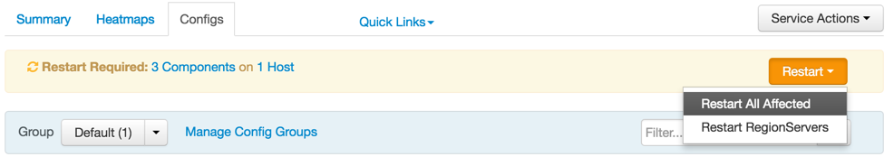

Now, in the `Summary` tab, you should see both HBase Master and RegionServers to be healthy.

If they are **Stopped** or showing red, click on `Restart all` to ensure all HBase services are running.

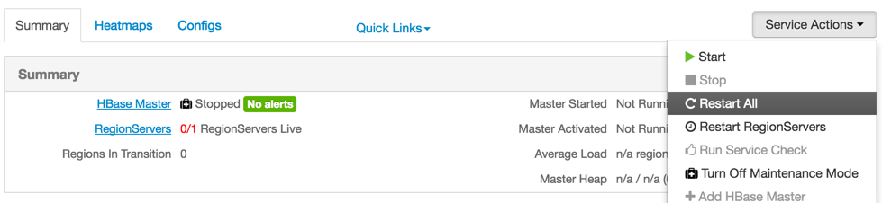

It is possible that your HBase instance is stuck in Maintenance Mode. To disable this, click on `Turn Off Maintenance Mode` after restart has completed.

## Running Phoenix Query Server

By default, the sandbox doesn’t have the Query Server turned on. To enable this, go to **Hosts**, select the sandbox host and click on `Add` and select `Phoenix Query Server`:

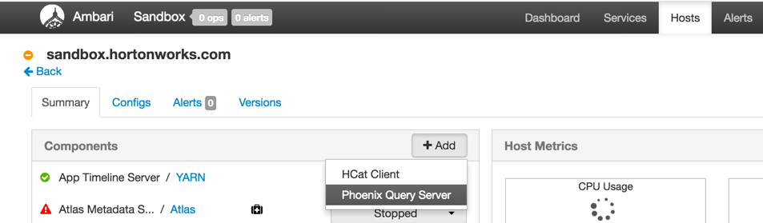

Once installed, scroll down in the host page and find **Phoenix Query Server** to start the service.

## Setting up port forwarding in VirtualBox

Phoenix Query Server listens on port **8765** by default. Thus we need to setup port forwarding to make sure we can connect to this port from the VM host.
Right click on the Hortonworks Sandbox, pick `Settings`

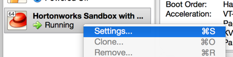

Go to Network, pick on `Port Forwarding`

Add rule by click on the green `+` sign icon on the top right of the panel.

The rule should have name, protocol=TCP, Host IP=127.0.0.1 and both Host Port and Guest Port on 8765.

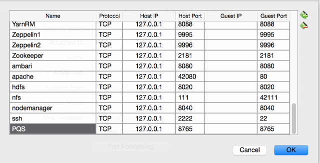

## Verify you can access Phoenix Query Server

Go to [http://localhost:8765/](http://localhost:8765/), you should see the following page:

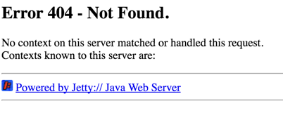

Don’t be alarmed, PQS doesn’t provide a nice welcome page, but it does function.

We are all done with setup, now onto the fun parts!

## Getting data in

In this part, we’ll create the basic table schemas in Phoenix and load data into them.

If you are using ssh (or putty), connect to localhost,  port 2222 with account root:

~~~
$>ssh root@localhost -p 2222
~~~

The sandbox also comes with it’s own shell: [http://127.0.0.1:4200/](http://127.0.0.1:4200/)
Use the OS password you’ve set up earlier. If you have not set it up, use default password **hadoop**.

Once logged in the sandbox, run:

~~~
git clone https://github.com/2bethere/tableau-odbc-phoenix-tutorial ~/tableau-odbc-phoenix-tutorial/
~~~

To clone the tutorial repository. There are 2 folders in this repo. Data folder contains csv files with actual data, sql folder contains all the scripts.

We have 5 tables in total:
1. Customer
2. Store
3. Product
4. Fact table: Inventory
5. Fact table: Sales

We’ll be using **CORP** schema in this tutorial. Thus all tables will have name such as **CORP.STORE** or **CORP.PRODUCT** etc.

## Find your Phoenix client tools

~~~
cd /usr/hdp/current/phoenix-client/bin
~~~

In this directory, you should see sqlline.py or psql.py.

## Drop all tables (Optional)

If this the second time you are running or you want to reset, you can run this command to drop all tables.

~~~
$>./sqlline.py ~/tableau-odbc-phoenix-tutorial/sql/drop_tables.sql
~~~

## Create table and load data

We’ll be using psql.py, which facilitates table creation and bulkload of data.

~~~
$>./psql.py -t CORP.CUSTOMER ~/tableau-odbc-phoenix-tutorial/sql/table_customer.sql ~/tableau-odbc-phoenix-tutorial/data/customer_out.csv
~~~

This command creates CORP.CUSTOMER table and loads data into the table.

This command works like this:

~~~
psql.py -t TABLE_NAME create_table.sql data.csv
~~~

-t specifies the table we want to load into. In this case, CORP.CUSTOMER. Second part is the sql script used to create the table.
Third part is the data to be loaded.

> NOTE: psql uses Excel dialect csv files (i.e. numbers cannot be quoted)

To finish this process, do the same for the 4 other tables:

~~~
$>./psql.py -t CORP.STORE ~/tableau-odbc-phoenix-tutorial/sql/table_store.sql ~/tableau-odbc-phoenix-tutorial/data/store_out.csv
~~~

~~~
$>./psql.py -t CORP.PRODUCT ~/tableau-odbc-phoenix-tutorial/sql/table_product.sql ~/tableau-odbc-phoenix-tutorial/data/product_out.csv
~~~

~~~
$>./psql.py -t CORP.FACT_INVENTORY ~/tableau-odbc-phoenix-tutorial/sql/table_fact_inventory.sql ~/tableau-odbc-phoenix-tutorial/data/inventory_fact_1998_out.csv
~~~

~~~
$>./psql.py -t CORP.FACT_SALES ~/tableau-odbc-phoenix-tutorial/sql/table_fact_sales.sql ~/tableau-odbc-phoenix-tutorial/data/sales_fact_1998_out.csv
~~~

## Getting data out - Windows

In this step, we’ll setup a connection to the Phoenix Query Server using the ODBC driver on Windows.

Windows
32-bit: [http://public-repo-1.hortonworks.com/HDP/phoenix-odbc/1.0.0.1000/windows/HortonworksPhoenixODBC32.msi](http://public-repo-1.hortonworks.com/HDP/phoenix-odbc/1.0.0.1000/windows/HortonworksPhoenixODBC32.msi)

64-bit: [http://public-repo-1.hortonworks.com/HDP/phoenix-odbc/1.0.0.1000/windows/HortonworksPhoenixODBC64.msi](http://public-repo-1.hortonworks.com/HDP/phoenix-odbc/1.0.0.1000/windows/HortonworksPhoenixODBC64.msi)

After downloading, the driver, follow the instruction to install the driver.

Next, in control panel, open ODBC Data Sources Administration(64-bit). Alternatively, go to Start, search for **ODBC** and pick the 64-bit version of the tool:

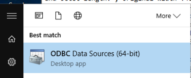

Pick `User DSN`->`Add`

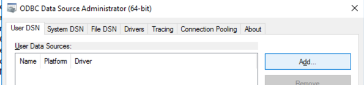

User DSN means only you have access to this data source, System DSN means anyone else on this computer can use this data source.
Pick `Hortonworks Phoenix ODBC Driver` in next screen:

In the next screen, input the following information:

~~~
Host: localhost
Port: 8765
~~~

> NOTE: This is assuming you are on a Windows machine and the VM is also running on the same machine, you will use localhost as the host name. However, if the VM is on a remote machine, you’ll need to use the remote machine’s IP or hostname in the Host field.

Next, click on `Test…`, if all goes well, you should see the following screen:

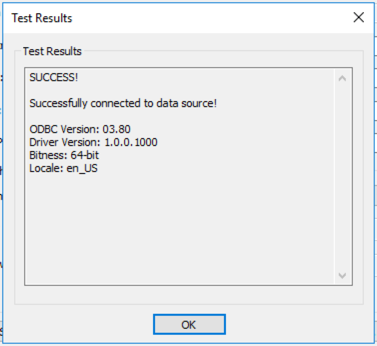

If you run into error, please leave a comment below and I’ll try to help you out.

One common error is when the VM is not reachable from the Windows machine. Try to access http://your.windows.machine:8765 in the web browser to see if you can reach the machine hosting PQS.

## Getting data out - Windows - Tableau

Our goal is to generate a map that shows what % of goods sold in Washington state are using recyclable packaging.

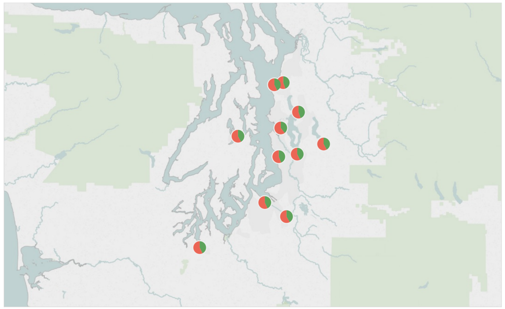

## Important: Configuration file for Phoenix Query Server

Download “Hortonworks Phoenix ODBC Driver.tdc” from this location:
[https://github.com/2bethere/tableau-odbc-phoenix-tutorial/tree/master/tdc](https://github.com/2bethere/tableau-odbc-phoenix-tutorial/tree/master/tdc)

Place the file into:
Current User\Documents\My Tableau Repository\Datasources

This file informs Tableau how to communicate with Phoenix Query Server. Tableau will scan this directory recursively to load all tdc files.

Open Tableau, select **“Connect”->”More Servers…”->”Other Databases (ODBC)”**

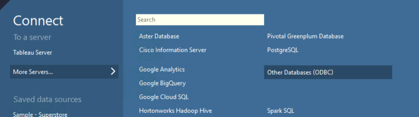

Pick the DSN you’ve just created and hit `Connect`

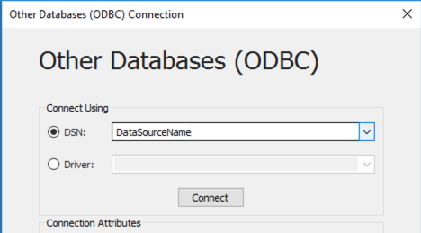

After you hit Connect, the OK button will be enabled. Hit `OK` to continue.

In the next window, you’ll be prompted to setup a data source in Tableau. Click on the `Search` icon to load all the schema from Phoenix database and then pick `CORP`

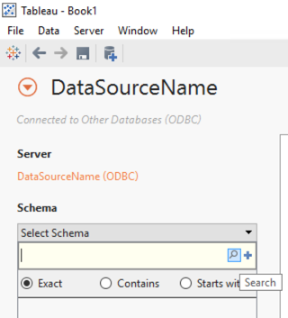

Click on the `Search` icon again to load all the tables associated with the schema. You should see a screen looks like below:

Now, let’s build out a data model to visualize all those data.
Drag and drop the following tables in order:

1. FACT_SALES
2. CUSTOMER
3. PRODUCT
4. STORE
The order helps Tableau build auto joins.

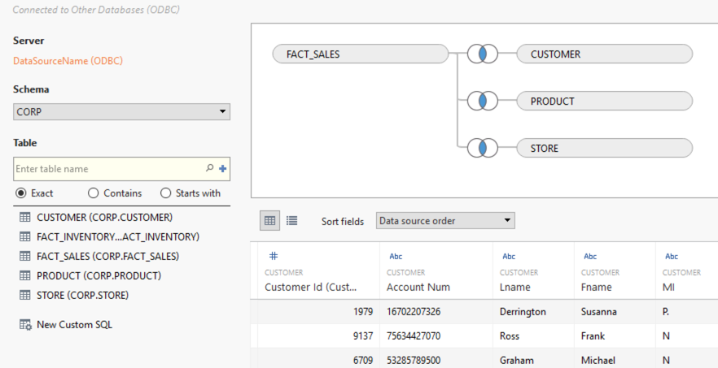

Select `Go to Worksheet` or `Sheet 1` to switch over to analysis mode

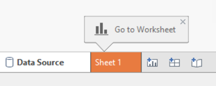

Find **Store-City** under the data panel on the left

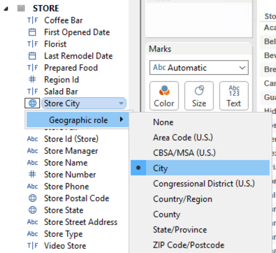

Click on the little icon and change the Store City’s geo role to City.

Under `Measure`, drag `Store Sales` into the column.

Next, drag `Recyclable Package` into column shelf and `City` into row shelf
Now you should see a page similar to the one below:

Click on the map tile in `Show me` panel

You’ll see the final map for entire US.
Let’s narrow it down to WA, drag `Store state` under **Store** into filter and select `WA` from the list.

To get better visualization, you can adjust the marks panel. For example, if the pie chart doesn’t show up automatically, pick `Pie` from the marks and adjust the color scheme.

