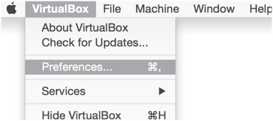
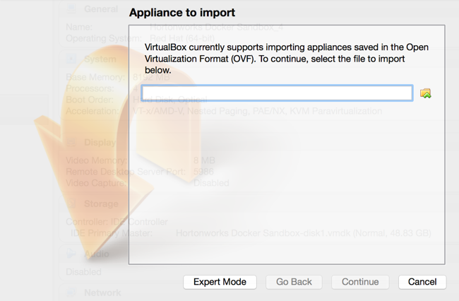
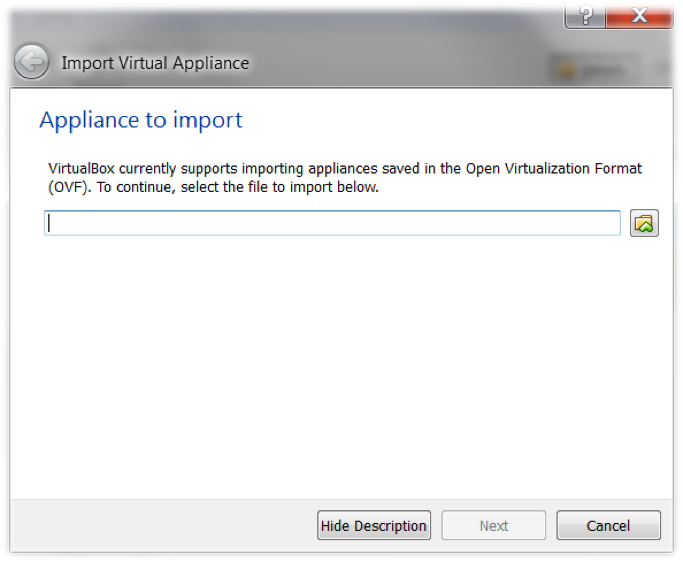
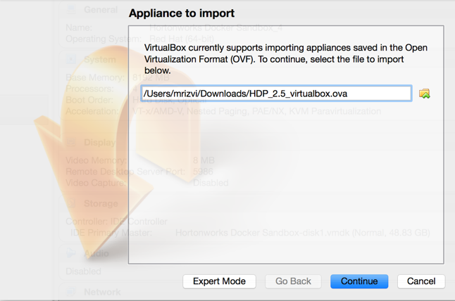
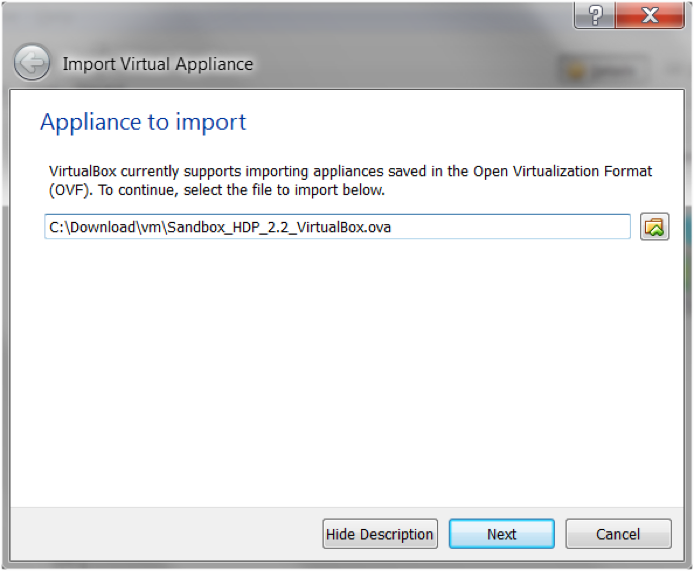
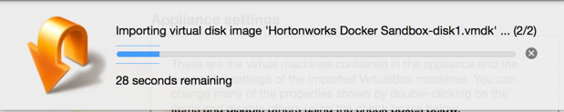

# Hortonworks Sandbox Guide

## Import Hortonworks Sandbox on Virtual Box

## Introduction

The Hortonworks Sandbox is delivered as a virtual appliance.  The virtual appliance (indicated by an .ovf or .ova extension in the filename) runs in the context of a virtual machine (VM), a piece of software that appears to be an application to the underlying (host) operating system (OS), but that looks like a bare machine, including CPU, storage, network adapters, and so forth, to the operating system and applications that run on it.

To use the Hortonworks Sandbox, one of the supported virtual machine applications needs to installed on your host machine:

-   VirtualBox
-   VMware Fusion
-   Hyper-V

This document describes importing the Hortonworks Sandbox virtual appliance into VirtualBox.

## Prerequisites

To use the Hortonworks Sandbox with VirtualBox the following requirements need to be met:

**Oracle VirtualBox Installed**

-   Version 4.2 or later
-   You can download VirtualBox here: https://www.virtualbox.org/wiki/Downloads

**Host Operating System**

Host operating system refers to the operating system of your computer.  The following [link](https://www.virtualbox.org/manual/ch01.html#hostossupport) gives an exhaustive list of operating systems supported to run VirtualBox.

**Hardware** (The newer the hardware the better):

-   **CPU** - A 64-bit machine with a multi-core CPU that supports virtualization.  Please look into your operating system’s documentation to verify if you are running a 64 bit OS.  Below are references for Mac OS X and Windows.
    -   [Windows article](http://windows.microsoft.com/en-us/windows7/32-bit-and-64-bit-windows-frequently-asked-questions)
    -   [Mac OS X](https://support.apple.com/en-us/HT3696)
-   **BIOS** - Has been enabled for virtualization support.  Please contact your specific computer vendor to determine how to enable/verify this feature in your machine’s BIOS.
-   **RAM** - At least 8 GB of RAM (The more, the better)
If you wish to enable services such as Ambari, HBase, Storm, Kafka, or Spark please ensure you have at least 10 Gb of physical RAM in order to run the VM using 8 GB.

More information for hardware requirements for VirtualBox can be found [here](https://www.virtualbox.org/wiki/End-user_documentation).
-   **Browsers**
    -   Chrome 25+
    -   IE 9+ (Sandbox will not run on IE 10)
    -   Safari 6+

**Hortonworks Sandbox virtual appliance for VirtualBox**

Download the correct virtual appliance file for your environment from [here](https://hortonworks.com/products/hortonworks-sandbox/#install). The file extension for a virtual appliance for VirtualBox should be .ova

## Procedure

The steps provided describe how to import the Hortonworks Sandbox virtual appliance into VirtualBox.  The screenshots displayed are taken from Mac OS X and Windows 7 machine running the VirtualBox 4.3.x software.

1\. Open the **Oracle VM VirtualBox Manager**

You can do so by double clicking the icon: 

On a Mac OS X machine, by default the application is installed within the Applications folder, hence the icon to launch the application can be found there.
On a Windows machine, the executable (.exe) file is typically found in _c:\Program Files\Oracle\VirtualBox\VBoxManage.exe_

The **Oracle VM VirtualBox Manager** window opens.

_Mac OS X_:

_Windows 7_

2\. 	Open the **Preferences** dialog window.

_Mac OS X_:  Select **VirtualBox->Preferences…** from the menu bar while the Oracle VM VirtualBox Manager application is in focus.

_Windows 7_:

Select **File->Preferences…** within the Oracle VM VirtualBox Manager

3\. 	Uncheck **Auto-Capture Keyboard** within the Preferences dialog window.

_Mac OS X_: Select the **Input** icon button from the top of the window first to get to the window containing the **Auto-Capture Keyboard** checkbox.

_Windows 7_:  Select the Input icon button from the left hand pane of the window first to get to the following window.

Click the **OK** button once done.  This will close the Preferences window.

4\. 	Open the **Import Appliance** window.

_Mac OS X_:  Select **File->Import Appliance…** from the menu bar while the Oracle VM VirtualBox Manager application is in focus.

_Windows 7_:
Select **File->Import Appliance…** within the Oracle VM VirtualBox Manager

The **Appliance to Import** dialog window will then display allowing to select the virtual appliance to import.

_Mac OS X_:

_Windows 7_: A separate dialog window is put in front of the **VM VirtualBox Manager** window

5\. 	Click on the **folder** icon that will open a file dialog window.  Select the virtual appliance file that you downloaded as a prerequisite.  After selecting the file click the **Open** button.

> NOTE:  The name of the file you have downloaded depends on the version of the Hortonworks Sandbox you have chosen to download.

_Mac OS X_:

_Windows 7_:
On Windows after you select the virtual appliance file, you are brought back to this window.

After clicking on Next, the Appliance Settings are displayed.

6\. 	Modify Appliance Settings as needed.

Within the Appliance Settings section you may wish to allocate more RAM to the virtual appliance.  Setting 8GB of RAM to the Hortonworks Sandbox virtual appliance will improve the performance.  Make sure you have enough physical RAM on the host machine to make this change. To make the change, click on the specific value to modify and make your edits.  Once finished configuring, click **Import**.

_Mac OS X_:

_Windows_:

Progress of the Import
_Mac OS X_:

_Windows_:

7\. 	Once the import finishes, you are brought to the main Oracle VM VirtualBox Manager screen.  From the left hand pane, select the appliance you just imported and click the green **Start** arrow.

_Mac OS X_:

_Windows_:

A console window opens and displaying the boot up information.
Once the virtual machine fully boots up, the console displays the login instructions.

8\. 	Use one of the supported browsers mentioned in the prerequisites section of this document within your host machine.  Enter the URL displayed in the console.  By default it should be http://127.0.0.1:8888.

That’s it. Read over the information and links to get started in exploring HDP with the Hortonworks Sandbox!
