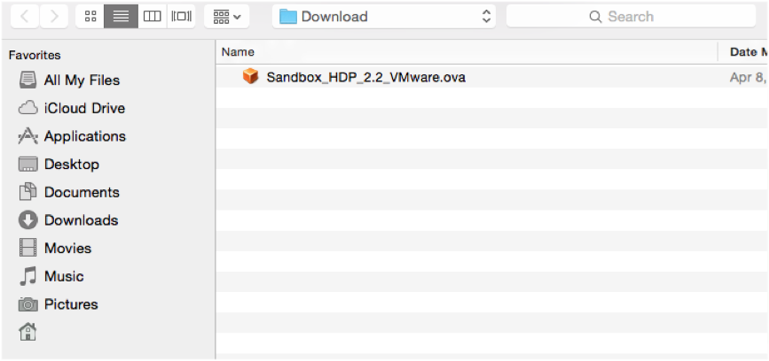
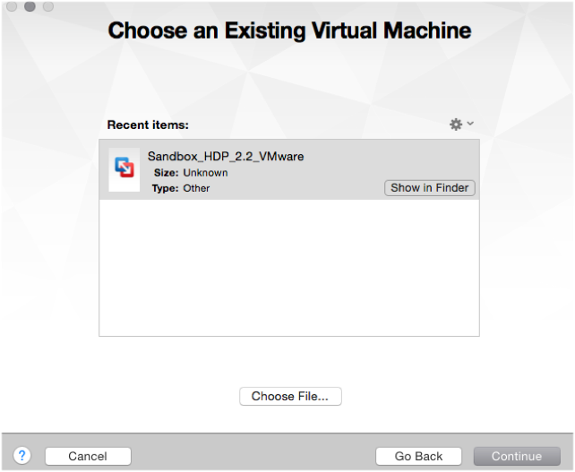
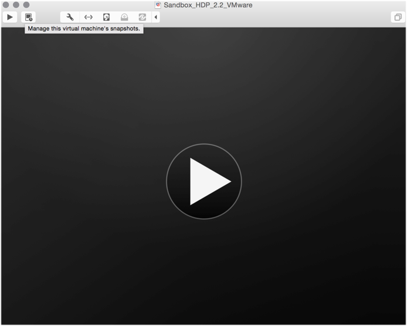

# Hortonworks Sandbox Guide

## Hortonworks Sandbox with VMware Fusion

## Introduction

The Hortonworks Sandbox is delivered as a virtual appliance.  The virtual appliance (indicated by an .ovf or .ova extension in the filename) runs in the context of a virtual machine (VM), a piece of software that appears to be an application to the underlying (host) operating system (OS), but that looks like a bare machine, including CPU, storage, network adapters, and so forth, to the operating system and applications that run on it.

To use the Hortonworks Sandbox, one of the supported virtual machine applications needs to installed on your host machine:

-   VirtualBox
-   VMware Fusion

This document describes importing the Hortonworks Sandbox virtual appliance into VMware.

## Prerequisites

To use the Hortonworks Sandbox with VMware Fusion the following requirements need to be met:

**VMware Fusion Installed**

Version 5 or later (Version 7 recommended). You can download VMware Fusion [link here:](https://my.vmware.com/web/vmware/info/slug/desktop_end_user_computing/vmware_fusion/7_0#product_downloads)

**Host Operating System**

Host operating system refers to the operating system of your computer.  The following [link](https://www.vmware.com/support/fusion/faq/requirements) gives an exhaustive list of operating systems supported to run VMware Fusion.

**Hardware** (The newer the hardware the better):

1\. A 64-bit machine with a multi-core CPU that supports virtualization. Please look into your operating system’s documentation to verify if you are running a 64 bit OS.
_Mac OS X_:
https://support.apple.com/en-us/HT3696

2\. **BIOS** - Has been enabled for virtualization support.  Please contact your specific computer vendor to determine how to enable/verify this feature in your machine’s BIOS.

3\. **RAM** - At least 8 GB of RAM for the VM (The more, the better)
If you wish to enable services such as Ambari, HBase, Storm, Kafka, or Spark please ensure you have at least 10 Gb of physical RAM in order to run the VM using 8 GB.

More information for hardware requirements for VMware can be found [here](https://www.vmware.com/support/fusion/faq/requirements).

4\. **Browsers**

1.  Chrome 25+,
2.  IE 9+ (Sandbox will not run on IE 10)
3.  Safari 6+

NOTE: Please allow popup-blockers

**Hortonworks Sandbox virtual appliance for VMware Fusion**

Download the correct virtual appliance file for your environment from https://hortonworks.com/products/hortonworks-sandbox/#install
The file extension for a virtual appliance for VMware Fusion should be .ova

## Procedure
The steps provided describe how to import the Hortonworks Sandbox virtual appliance into VMware Fusion.  The screenshots displayed are taken from Mac OS X machine running the VMware Fusion 7.1.1 software.

> NOTE:  The instructions provided is for a VMware Fusion application that currently does not have any existing virtual machines imported.

1\.	Open the **VMware Fusion** application.
You can do so by double clicking the icon:

On a Mac OS X machine, by default the application is installed within the Applications folder, hence the icon to launch the application can be found there.

2\.	The **VMware Fusion** window opens and prompts

> NOTE:  If you currently have existing VM’s installed you should get a different prompt from the above screenshot.

3\.	Select the “Import an existing virtual machine” and click the **Continue** button.

4\.	The file browser dialog opens.  Select the virtual appliance file and click **Open**.

> NOTE:  The name of the file you have downloaded depends on the version of the Hortonworks Sandbox you have chosen to download.  The above picture is referencing Sandbox HDP version 2.2

5\.	After clicking open, you will be brought back to this screen showing the file you have chosen highlighted.  Click **Continue**.

6\.	After clicking continue, a drop down window sheet displays.

Here you can choose to save the virtual machine with a different name.  If you have no preference in renaming, you can just leave the default name and click save.  You will the get the importing progress dialog:

7\.	Once finished, the following screen is displayed:

Click the **Finish** button.

8\.	The next window is the console of the virtual machine, click on the **Play** icon within the console.

9\. Eventually you will see the screen below indicating Hortonworks Sandbox is fully booted and displays login instructions.

> NOTE: Because what is being displayed is a conceptually separate machine, control of the mouse and the keyboard must be passed back and forth between the host and the VM. This is particularly useful when the VM has a GUI.  If you accidently let the console “capture” your mouse or keyboard, you can release them back to the host machine by pressing the Ctrl and Command keys. A reminder appears in the upper right corner of the console window if you forget.

10\. Use one of the supported browsers mentioned in the prerequisites section of this document within your host machine.  Enter the URL displayed on the console which brings you to the Splash page.  That’s it. Read over the information and links to get started in exploring HDP with the Hortonworks Sandbox!

