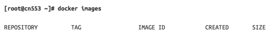
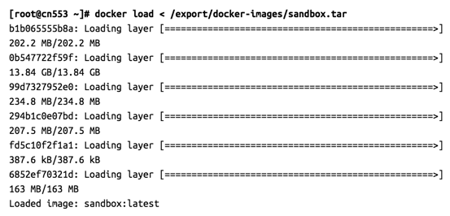
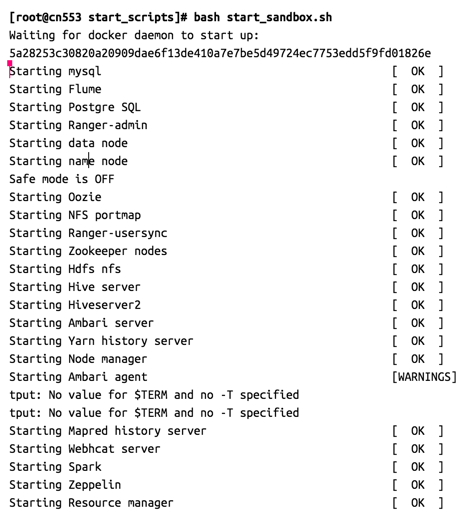
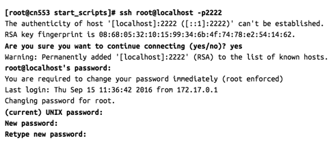

# Hortonworks Sandbox Guide

## Introduction

The **Hortonworks Sandbox** can now be imported as a docker image on those systems that support docker. It works on a virtualization layer on top of your existing hardware and allocates resources from the existing pool offered by the physical machine but without the extra overhead typically associated with virtual machines.

## Prerequisites

To use Hortonworks Sandbox with Docker the following requirements need to be met:

### Docker Daemon Installed:

1.  Docker version 1.12.1 or newer
2.  You can find install instructions [here](https://docs.docker.com/engine/installation/).

### Host Operating System:

The docker version of the Hortonworks Sandbox was developed on a native linux platform and thus it’s easiest to launch it on a **Linux Distro**. The following tutorial will be Linux centered and will work on any popular distro that has a functional bash shell.

Information on launching the sandbox on Windows/ Mac OS-boxes without bash will be summarily provided at the end of the tutorials.

Host operating system refers to the operating system of your computer. You can find the list of supported operating systems [here](https://docs.docker.com/).

### Hardware ( The newer the hardware the better )

1\. At least 8GB of RAM available on your machine for launching the application.
2\. At least 15GB free for the initial image,  30+ GB recommended.

### Browsers:

1\. Chrome 25+
2\. IE 9+ (Sandbox will not run on IE 10)
3\. Safari 6+

### Hortonworks Sandbox virtual appliance for Sandbox:

Download the Docker [here](https://hortonworks.com/products/hortonworks-sandbox/#install). The file extension for docker should be .gz.  Once you download the file, uncompress it.  The file extension will then be a .tar file.

## Procedure

The steps provided describe how to import the Hortonworks Sandbox Docker image. The screenshots displayed are taken from a **Centos7** Linux machine running **Docker 1.12.1**:

1\. Ensure that docker daemon is running. On linux you can check this with the following command:



If docker daemon is running on your machine and you have no other images imported this is what the successful output of the command will look like.

2\. Load the Hortonworks Sandbox Docker image with the following command:



To check that the image was successfully imported try running the docker images command again.


3\. Download and run the start sandbox script

You can download the [start script here](assets/start_sandbox.sh)

Save it to your computer and execute it, you can ignore the $TERM warnings:



You can now connect to the sandbox tutorials page at http://localhost:8888


## Run notes for Mac users:

1\. Ensure the Docker daemon is running.  You can verify by typing:

```
$ docker images
```

You should see something similar to this:

```
$ docker images
REPOSITORY          TAG                 IMAGE ID            CREATED             SIZE
```

If your Docker daemon is not running, you may see the following:

```
$ docker images
Error response from daemon: Bad response from Docker engine
```

2\. Before loading the Docker image, you need to uncompress it:

```
$ gunzip HDP_2.5_docker.tar.gz
```

3\. Load the Hortonworks sandbox image into Docker:

```
$ docker load < HDP_2.5_docker.tar
```

You should see something similar to this:

```
$ docker load < HDP_2.5_docker.tar
b1b065555b8a: Loading layer [==================================================>] 202.2 MB/202.2 MB
0b547722f59f: Loading layer [==================================================>] 13.84 GB/13.84 GB
99d7327952e0: Loading layer [==================================================>] 234.8 MB/234.8 MB
294b1c0e07bd: Loading layer [==================================================>] 207.5 MB/207.5 MB
fd5c10f2f1a1: Loading layer [==================================================>] 387.6 kB/387.6 kB
6852ef70321d: Loading layer [==================================================>]   163 MB/163 MB
517f170bbf7f: Loading layer [==================================================>] 20.98 MB/20.98 MB
665edb80fc91: Loading layer [==================================================>] 337.4 kB/337.4 kB
Loaded image: sandbox:latest
```

4\. Verify the image was successfully imported:

```
$ docker images
```

You should see something similar to this:

```
$ docker images
REPOSITORY          TAG                 IMAGE ID            CREATED             SIZE
sandbox             latest              fc813bdc4bdd        3 days ago          14.57 GB
```

5\. Start the container:
The first time you start the container, you need to create it via the run command.  The run command both creates and starts the container.

```
$ docker run -v hadoop:/hadoop --name sandbox --hostname "sandbox.hortonworks.com" --privileged -d \
-p 6080:6080 \
-p 9090:9090 \
-p 9000:9000 \
-p 8000:8000 \
-p 8020:8020 \
-p 42111:42111 \
-p 10500:10500 \
-p 16030:16030 \
-p 8042:8042 \
-p 8040:8040 \
-p 2100:2100 \
-p 4200:4200 \
-p 4040:4040 \
-p 8050:8050 \
-p 9996:9996 \
-p 9995:9995 \
-p 8080:8080 \
-p 8088:8088 \
-p 8886:8886 \
-p 8889:8889 \
-p 8443:8443 \
-p 8744:8744 \
-p 8888:8888 \
-p 8188:8188 \
-p 8983:8983 \
-p 1000:1000 \
-p 1100:1100 \
-p 11000:11000 \
-p 10001:10001 \
-p 15000:15000 \
-p 10000:10000 \
-p 8993:8993 \
-p 1988:1988 \
-p 5007:5007 \
-p 50070:50070 \
-p 19888:19888 \
-p 16010:16010 \
-p 50111:50111 \
-p 50075:50075 \
-p 50095:50095 \
-p 18080:18080 \
-p 60000:60000 \
-p 8090:8090 \
-p 8091:8091 \
-p 8005:8005 \
-p 8086:8086 \
-p 8082:8082 \
-p 60080:60080 \
-p 8765:8765 \
-p 5011:5011 \
-p 6001:6001 \
-p 6003:6003 \
-p 6008:6008 \
-p 1220:1220 \
-p 21000:21000 \
-p 6188:6188 \
-p 61888:61888 \
-p 2222:22 \
sandbox /usr/sbin/sshd -D
```

Once the container is created and running, Docker will display a CONTAINER ID for the container.  You should see something similar to this:

```
fe57fe79f795905daa50191f92ad1f589c91043a30f7153899213a0cadaa5631
```

For all future container starts, you only need to run the docker start command:

```
$ docker start sandbox
```

Notice that `sandbox` is the name of the container in the run command used above.

6\. Verify the container is running:

```
$ docker ps
```

You should see something similar to this:

```
$ docker ps
CONTAINER ID        IMAGE               COMMAND               CREATED             STATUS              PORTS             NAMES

85d7ec7201d8        sandbox             "/usr/sbin/sshd -D"   31 seconds ago      Up 27 seconds       0.0.0.0:1000->1000/tcp, 0.0.0.0:1100->1100/tcp, 0.0.0.0:1220->1220/tcp, 0.0.0.0:1988->1988/tcp, 0.0.0.0:2100->2100/tcp, 0.0.0.0:4040->4040/tcp, 0.0.0.0:4200->4200/tcp, 0.0.0.0:5007->5007/tcp, 0.0.0.0:5011->5011/tcp, 0.0.0.0:6001->6001/tcp, 0.0.0.0:6003->6003/tcp, 0.0.0.0:6008->6008/tcp, 0.0.0.0:6080->6080/tcp, 0.0.0.0:6188->6188/tcp, 0.0.0.0:8000->8000/tcp, 0.0.0.0:8005->8005/tcp, 0.0.0.0:8020->8020/tcp, 0.0.0.0:8040->8040/tcp, 0.0.0.0:8042->8042/tcp, 0.0.0.0:8050->8050/tcp, 0.0.0.0:8080->8080/tcp, 0.0.0.0:8082->8082/tcp, 0.0.0.0:8086->8086/tcp, 0.0.0.0:8088->8088/tcp, 0.0.0.0:8090-8091->8090-8091/tcp, 0.0.0.0:8188->8188/tcp, 0.0.0.0:8443->8443/tcp, 0.0.0.0:8744->8744/tcp, 0.0.0.0:8765->8765/tcp, 0.0.0.0:8886->8886/tcp, 0.0.0.0:8888-8889->8888-8889/tcp, 0.0.0.0:8983->8983/tcp, 0.0.0.0:8993->8993/tcp, 0.0.0.0:9000->9000/tcp, 0.0.0.0:9090->9090/tcp, 0.0.0.0:9995-9996->9995-9996/tcp, 0.0.0.0:10000-10001->10000-10001/tcp, 0.0.0.0:10500->10500/tcp, 0.0.0.0:11000->11000/tcp, 0.0.0.0:15000->15000/tcp, 0.0.0.0:16010->16010/tcp, 0.0.0.0:16030->16030/tcp, 0.0.0.0:18080->18080/tcp, 0.0.0.0:19888->19888/tcp, 0.0.0.0:21000->21000/tcp, 0.0.0.0:42111->42111/tcp, 0.0.0.0:50070->50070/tcp, 0.0.0.0:50075->50075/tcp, 0.0.0.0:50095->50095/tcp, 0.0.0.0:50111->50111/tcp, 0.0.0.0:60000->60000/tcp, 0.0.0.0:60080->60080/tcp, 0.0.0.0:61888->61888/tcp, 0.0.0.0:2222->22/tcp   sandbox
```

Notice the CONTAINER ID is the shortened version of the ID displayed when you ran the run command.


7\. To stop the container
Once the container is running, you stop it using the following command:

```
$ docker stop sandbox
```

8\. To connect to the container
You connect to the container via ssh using the following command:

```
$ ssh -p 2222 root@localhost
```

The first time you log into the container, you will be prompted to change the root password.  The root password for the container is `hadoop`.

9\. Start sandbox services
The Ambari and HDP services do not start automatically when you start the Docker container.  You need to start the processes with a script.

```
$ ssh -p 2222 root@localhost
$ /etc/init.d/startup_script start
```

You should see something similar to this (you can ignore any warnings):

```
# /etc/init.d/startup_script start
Starting tutorials...                                      [  Ok  ]
Starting startup_script...
Starting HDP ...
Starting mysql                                            [  OK  ]
Starting Flume                                            [  OK  ]
Starting Postgre SQL                                      [  OK  ]
Starting Ranger-admin                                     [  OK  ]
Starting name node                                        [  OK  ]
Starting Ranger-usersync                                  [  OK  ]
Starting data node                                        [  OK  ]
Starting Zookeeper nodes                                  [  OK  ]
Starting Oozie                                            [  OK  ]
Starting Ambari server                                    [  OK  ]
Starting NFS portmap                                      [  OK  ]
Starting Hdfs nfs                                         [  OK  ]
Starting Hive server                                      [  OK  ]
Starting Hiveserver2                                      [  OK  ]
Starting Ambari agent                                     [  OK  ]
Starting Node manager                                     [  OK  ]
Starting Yarn history server                              [  OK  ]
Starting Resource manager                                 [  OK  ]
Starting Webhcat server                                   [  OK  ]
Starting Spark                                            [  OK  ]
Starting Mapred history server                            [  OK  ]
Starting Zeppelin                                         [  OK  ]
Safe mode is OFF
Starting sandbox...
./startup_script: line 97: /proc/sys/kernel/hung_task_timeout_secs: No such file or directory
Starting shellinaboxd:                                     [  OK  ]
```

10\. You can now connect to your machine at http://localhost:8888

## Run notes for non-linux/mac users:

In order to launch the sandbox in a non-linux environment, proceed to import the sandbox.tar image as instructed by the version of docker you are using.

You then need to spawn a container with the --privileged flag from the image making sure to forward the following ports: 6080 , 9090 , 9000 , 8000 , 8020 , 42111 , 10500 , 16030 , 8042 , 8040 , 2100 , 4200 , 4040 , 8050 , 9996 , 9995 , 8080 , 8088 , 8886 , 8889 , 8443 , 8744 , 8888 , 8188 , 8983 , 1000 , 1100 , 11000 , 10001 , 15000 , 10000 , 8993 , 1988 , 5007 , 50070 , 19888 , 16010 , 50111 , 50075 , 50095 , 18080 , 60000 , 8090 , 8091 , 8005 , 8086 , 8082 , 60080 , 8765 , 5011 , 6001 , 6003 , 6008 , 1220 , 21000 , 6188 , 22

Once this is achieved, use the ssh port you forwarded to to login into the sandbox. It will prompt you for a password change, continue to change it ( the in-place password is `hadoop` ):



Once this is achieved, run the startup script and ignore any warnings:


You can now connect to your machine at http://localhost:8888
