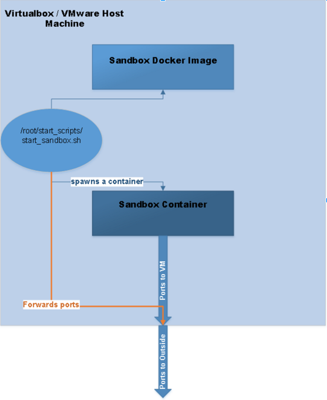
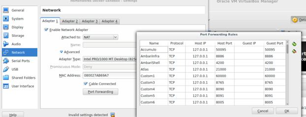
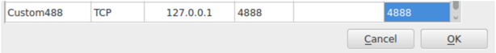

# Hortonworks Sandbox Guide

## Opening Docker Ports in Hortonworks Sandbox

## Introduction

As of HDP 2.5, the Hortonworks Sandbox comes in docker form as to make it more easily distributable across multiple environments and it is offered as a native docker image as well as a Virtualbox / Vmware download for easy deploy on most standard local setups.

While introducing docker into the mix has made the sandbox more portable, it has also introduced a new layer of complexity which is apparent when working with port forwardings.

In order to explain the port forwardings it’s first a good idea to understand a top level view of what’s happening. Have a look at the picture below which explains how data is forwarded from the sandbox to the outside world:

At a glance, the first thing to notice is that there are 2 sets of port forwardings being applied marked on the picture with the two large blue arrows.
The first ( marked with orange ) is responsible for forwarding information from the container to the virtual machine, while the second is responsible for forwarding ports to the outside world from the virtual machine.

## Procedure

### 1. Forwarding ports from the docker container the virtual machine

**Important**:

Docker containers have their metadata( such as port forwardings ) saved alongside their state, thus making it impossible to assign new forwardings on-the-fly. This means that containers need to be removed and respawned if new forwardings are required.

In the case of the Hortonworks Sandbox this implies by default losing all previous work done on the container unless actions are taken. Let’s assume you have done work on your sandbox instance but want to add port forwardings without losing your data.

The first thing we need to do is to stop the docker sandbox container and save our work:

**Note**:

There is a known bug where the shellinabox service hangs when told to shut down from outside the container, so for safety we will be stopping it manually.

**Steps**:

1.1\. Login into your sandbox container via port 2222 or point your browser to port 4200 of the sandbox.
Stop shellinabox

~~~
[root@sandbox ~]# /etc/init.d/shellinaboxd stop
Stopping shellinaboxd:
~~~

1.2\. Logout from the sandbox container

1.3\. Login to the Docker VM host ( port 2122 on virtualbox, 22 on vmware )

1.4\. Stop the sandbox container:

~~~
[root@sandbox ~]# docker stop sandbox
sandbox
~~~

1.5\. Commit the changes you’ve made in the container to the docker image:

~~~
[root@sandbox ~]# docker commit sandbox sandbox
Sha256:671010ad961f83db70c7541f4b7df317c13474bcfb37a5f69e24a061c28d8c79
~~~

1.6\. Great! Now we have all the changes we made in the docker container saved on the docker image, it is now safe for us to remove the docker container:

~~~
[root@sandbox ~]# docker rm sandbox
sandbox
~~~

1.7\. Let’s have a look at how to forward ports from the docker container to the virtual machines first; as you can see the port forwarding is handled by the /root/start_scripts/start_sandbox.sh script and as such this is where we want to add our ports. Open the file for edit and find the below mentioned code:

~~~
-p 6080:6080 \
~~~

The “-p” flag is what is responsible for the port forwardings. All we need to do here is add another line similar to the one above after it with the port we want forwarded and where we want forwarded to. For example, if we were looking to forward port 4888, we would add after:

~~~
-p 4888:4888 \
~~~

1.8\. Save and close the file, then run the /root/start_scripts/start_sandbox.sh script. This script reattaches the container Sandbox with your new port added in the list. and Our new port will be visible if we run a “docker ps” command:

### 2. Forwarding ports from the VM to the outside world

2.1\. **VMWare**:

For vmware all port forwardings are done automatically to the 172.x.x.x IP so there’s nothing else you need to do!

2.2\. **Virtualbox**:

For virtualbox the ports need to be added in manually. Open the virtualbox interface:

Click the `Settings` button and go to the `Network` tab, click `Advanced` and `Port Forwarding`:

Click the + button on the top right of the dialogue box and add in the new rule, similar to how the other lines look:

Click OK and you’re done!
