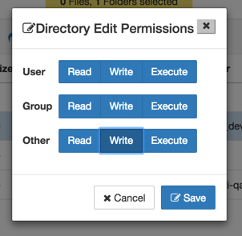
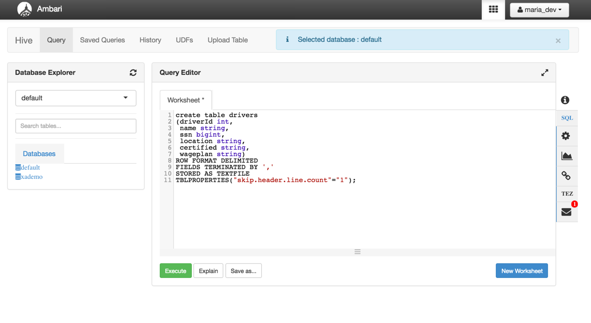
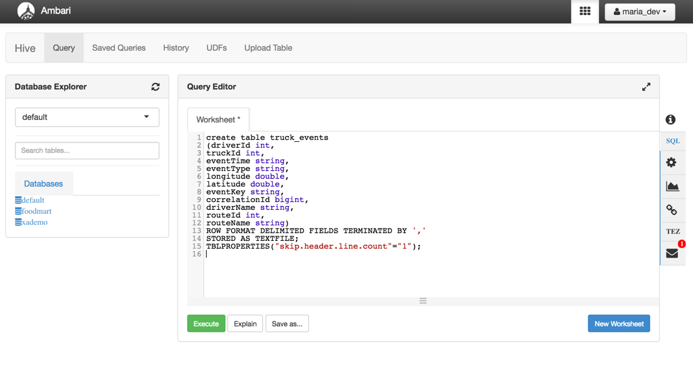
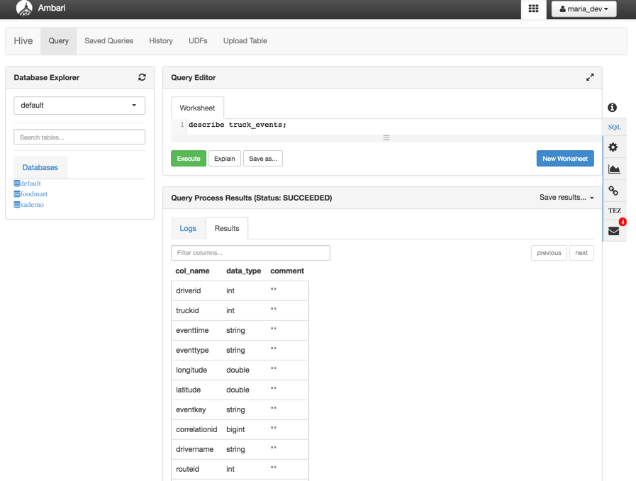
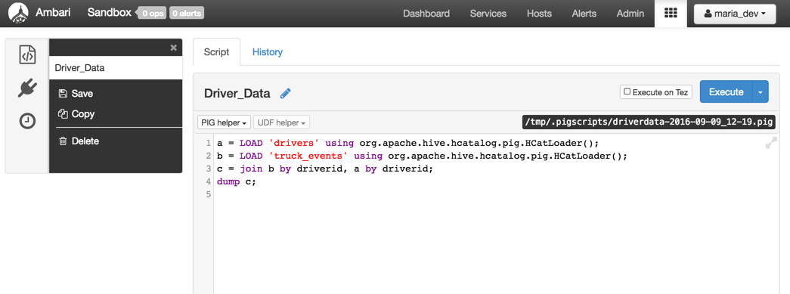
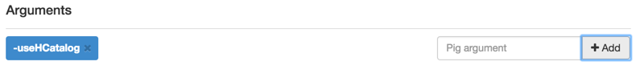
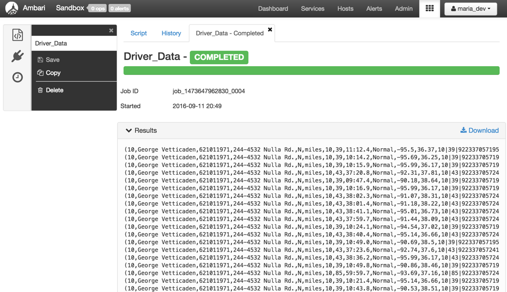

# How to use HCatalog, Pig & Hive Commands

## Introduction

In this tutorial, we will learn to use Hive and Pig along with other tools to process, analyze and filter large datasets.

## Prerequisites

-  [Apache HCatalog Video (running time: about 9 minutes)](http://www.youtube.com/watch?v=_dVlNu4lqpE)
-  Downloaded and Installed latest [Hortonworks Sandbox](https://hortonworks.com/downloads/#sandbox)
-  [Learning the Ropes of the Hortonworks Sandbox](https://hortonworks.com/hadoop-tutorial/learning-the-ropes-of-the-hortonworks-sandbox/)
-  Allow yourself around one hour to complete this tutorial

## Outline
- [Step 1: Download Example Data](#download-example-data)
- [Step 2: Upload the data files Into HDFS](#upload-data-files)
- [Step 3: Create tables for the Data With Hive and HCatalog](#create-tables-data-hive-hcatalog)
- [Step 4: Explore Hive Queries to View and Structure that Table Data](#explore-hive-queries-view-structure-data)
- [Step 5: Explore Pig Latin Data Transformation](#explore-pig-latin-data-transformation)
- [Further Reading](#further-reading)

## Step 1: Download Example Data 

Download the `driver data` file from [here](assets/driver_data.zip).
Once you have the file you will need to unzip the file into a directory. We will be uploading two csv files - `drivers.csv` and `truck_event_text_partition.csv`.

## Step 2: Upload the data files Into HDFS 

Start by using the `HDFS Files view` from the views drop down menu in Ambari:

Navigate to the folder `/tmp` and create a new folder called `data`.

Then use the menus to upload the `drivers.csv` file and `truck_event_text_partition.csv` file.

After uploading both files head back to the data folder we created. Click on data row and select `Permissions`. Make sure all boxes are checked blue.

## Step 3: Create tables for the Data With Hive and HCatalog 

HCatalog has been merged with Hive project. This means that your Hive queries will utilize HCatalog when using commands like create table and drop table.
We are now going to utilize the `Hive view` to create tables with our data. Use the same drop down menu that you used to select the HDFS Files view, and instead click `Hive View`.

You will view a page like this:

We’re now going to create a table from our CSV using a Hive query. Copy and paste the following query and click `Execute` to run the command and create the table.

~~~
create table drivers
(driverId int,
 name string,
 ssn bigint,
 location string,
 certified string,
 wageplan string)
ROW FORMAT DELIMITED
FIELDS TERMINATED BY ','
STORED AS TEXTFILE
TBLPROPERTIES("skip.header.line.count"="1");
~~~

You’ll now need to `load` the data file into the table. Use the following command to do so.

~~~
LOAD DATA INPATH '/tmp/data/drivers.csv' OVERWRITE INTO TABLE drivers;
~~~

You will see a new table `drivers` has been created and has all of the data contained within it. Click on the box next to the drivers table in `Database Explorer` to view the data.

Repeat above steps for the second data set `truck_event_text_partition.csv` using the following queries to create the `truck_events` table.

~~~
create table truck_events
(driverId int,
truckId int,
eventTime string,
eventType string,
longitude double,
latitude double,
eventKey string,
correlationId bigint,
driverName string,
routeId int,
routeName string)
ROW FORMAT DELIMITED FIELDS TERMINATED BY ','
STORED AS TEXTFILE
TBLPROPERTIES("skip.header.line.count"="1");
~~~

Load the data by running the following command:

~~~
LOAD DATA INPATH '/tmp/data/truck_event_text_partition.csv' OVERWRITE INTO TABLE truck_events;
~~~

You should now have two different tables inside the database explorer:

You can view the data by clicking on the box next to the table truck_events.

## Step 4: Explore Hive Queries to View and Structure that Table Data 

In the previous sections you:

-   Uploaded your data file into HDFS
-   Used the Ambari Hive view to create tables

Apache Hive™ provides a data warehouse function to the Hadoop cluster. Through the use of HiveQL you can view your data as a table and create queries just as you would in a database.

To make it easy to interact with Hive, you can we can use Ambari's built in views to run queries on this data.

In the latest versions of the Hortonworks sandbox we can [execute our Hive queries using Tez](https://hortonworks.com/blog/evaluating-hive-with-tez-as-a-fast-query-engine/), a fast execution engine. It improves on MapReduce in many areas and allows us near-realtime querying on our datasets in Hive.

Notice the query window and **Execute**. Type your queries in the Query window. When you are done with a query, click the `Execute`.

To see tables that Hive knows about, in Query Editor type the query:

~~~
show tables
~~~

and click on `Execute`.

Notice the tables that you previously created are in the list **(“drivers” and “truck_events”)**. You can see the columns in the table by executing:

~~~
describe truck_events;
~~~

You can make a join with other tables in Hive the same way you do with other database queries. Let’s make a join between `drivers` and `truck_events` tables.

Enter the following into the query editor:

~~~
select a.driverId,a.driverName,a.eventType,b.certified
from truck_events a join drivers b ON (a.driverId = b.driverId);
~~~

This job is more complex so it might take longer than previous queries. You can watch the job running in the log. When the job completes, you can see the results.

## Step 5: Explore Pig Latin Data Transformation 

In this tutorial, you will create and execute a `Pig script`. To access the Pig interface, use the dropdown menu for views in Ambari. Select `Pig View`.

A special feature of the interface is the Pig helper. The Pig helper provides templates for the statements, functions, I/O statements, HCatLoader() and Python user defined functions. Another feature is the Pig arguments which provides pre-formatted command line arguments used during execution. You will see a page like this:

Click `New Script` and create a name for it.

In this section, you will load the data from the table that is stored in HCatalog/Hive. Then you will make a join between two data sets on the `driverId` field in the same way that you did in the Hive section.

### 5.1 Prepare to load the data

The data is already in HDFS through HCatalog. HCatalog stores schema and location information, so we can use the HCatLoader() function within the Pig script to read data from HCatalog-managed tables. In Pig, you now
only need to give the table a name or alias so that Pig can process the
table.

Follow this procedure to load the data using HCatLoader:

-   Use the right-hand pane to start adding your code at Line 1
-   Open the Pig helper drop-down menu at the bottom of the screen to
    give you a template for the line.

Choose **PIG helper -> HCatalog -> LOAD...**template. This action
pastes the Load template into the script area.

**IMPORTANT**! Note that the statement should be `org.apache.hive.hcatalog.pig.HCatLoader();`. Note the addition of the **hive** component.

-   The entry **%TABLE%** is highlighted in red. Type the name of the
    table ('**batting_data**') in place of **%TABLE%**(single quotes
    are required).
-   Remember to add the "a = " before the template. This saves the
    results into "a".
-   Make sure the statement ends with a semi-colon (;)

Repeat this sequence for "truck_events" and add " b = "

The completed lines of code will be:

~~~
a = LOAD 'drivers' using org.apache.hive.hcatalog.pig.HCatLoader();
b = LOAD 'truck_events' using org.apache.hive.hcatalog.pig.HCatLoader();
~~~

It is important to note that at this point, we have merely defined the aliases for our tables to hold the data (alias “a” for drivers and alias “b” for truck_events). Data is not loaded or transformed until we execute an operational command such as `DUMP` or `STORE`

### 5.2 Join both the tables on driverId

Next, you will use the `JOIN` operator to join both tables on the `driverid`. You will create a new data set using the Pig Join function that will match the driverid field and include all of the data from both tables.
Complete these steps:

-   Choose **PIG helper->Data processing functions->JOIN template**
-   Replace %VAR% with "a". Repeat this step on the same line for "b".
-   Again, add the trailing semi-colon to the code.

So, the final code will be:

~~~
a = LOAD 'drivers' using org.apache.hive.hcatalog.pig.HCatLoader();
b = LOAD 'truck_events' using org.apache.hive.hcatalog.pig.HCatLoader();
c = join b by driverid, a by driverid;
~~~

Now you have joined all the records in both of the tables on driverid.

### 5.3 Execute the script and generate output

To complete the Join operation, use the `DUMP` command to execute the results. This will show all of the records that have a common driverid. The data from both tables will be merged into one row. Complete this steps:

-   Add the last line with **PIG helper->I/O->DUMP** template and
    replace %VAR% with "c".

The full script should be:

~~~
a = LOAD 'drivers' using org.apache.hive.hcatalog.pig.HCatLoader();
b = LOAD 'truck_events' using org.apache.hive.hcatalog.pig.HCatLoader();
c = join b by driverid, a by driverid;
dump c;
~~~

### 5.4 Save the script and execute it

First you need to add the `-useHCatalog` (Case Sensitive) argument using the box box in the bottom right hand corner

At the top of the screen, make sure the box "Execute on Tez" is checked. Then click `Execute` to run the script. This action creates one or more Tez jobs.

Below the `Execute` is a progress bar that shows the job's status. The progress bar can be blue (indicating job is in process), red (job has a problem), or green (job is complete).

When the job completes, you will see the results show up in one of the dropdown menus. The result is that each line that starts with an open parenthesis “(” has data from both tables for driverid.

Click the `Logs` drop down menu if you want to see what happened when your script ran, including any error messages. (You might need to scroll down to view the entire log.)

Congratulations! You have successfully completed HCatalog, Basic Pig &
Hive Commands.

## Further Reading

-   [HDFS Tutorials](https://hortonworks.com/hadoop/hdfs/#tutorials)
-   [HDFS and Apache Hadoop](https://hortonworks.com/hadoop/hdfs/)
-   [HDFS Architecture Guide](https://hadoop.apache.org/docs/r1.2.1/hdfs_design.html)
-   [Hive vs. HCatalog](https://hortonworks.com/blog/hivehcatalog-data-geeks-big-data-glue/)
-   [Hive Tutorials](https://hortonworks.com/hadoop/hive/#tutorials)
-   [Apache Hive and Hadoop](https://hortonworks.com/hadoop/hive/)
-   [Getting Started with Hive](https://cwiki.apache.org/confluence/display/Hive/GettingStarted)
-   [Pig Tutorials](https://hortonworks.com/hadoop/pig/#tutorials)
-   [Getting Started with Pig](http://pig.apache.org/#Getting+Started)
