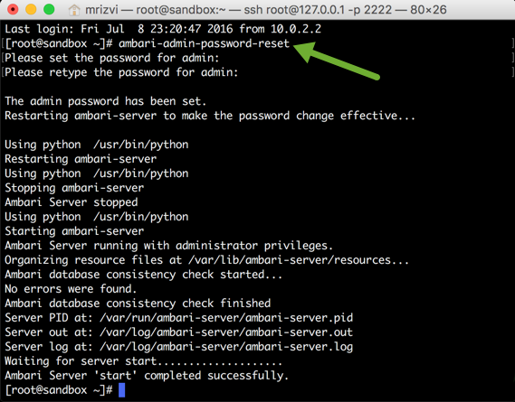
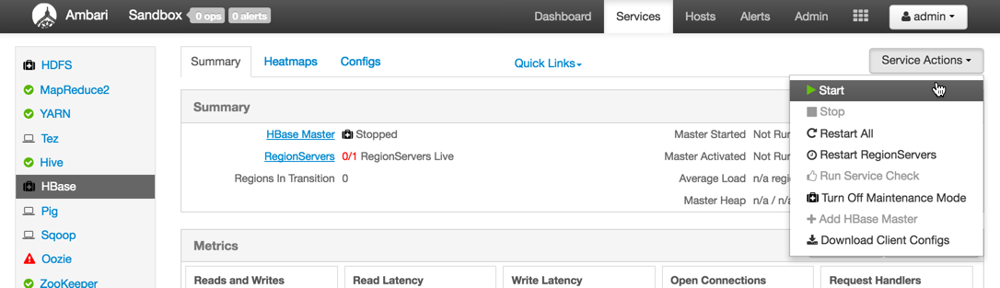
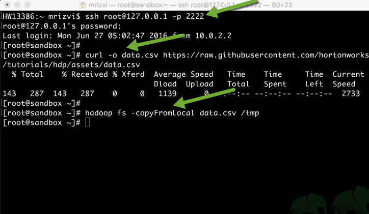
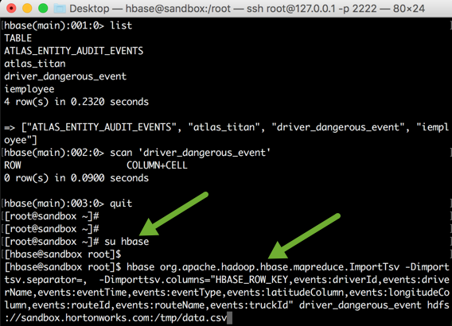
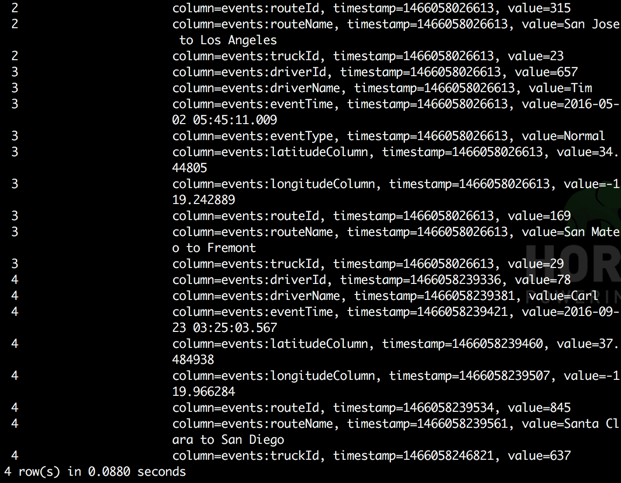
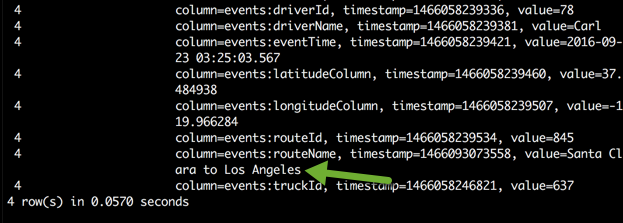
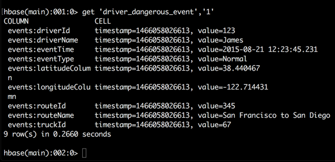

# Introduction to Apache HBase Concepts, Apache Phoenix and New Backup & Restore Utility in HBase

## Lab 1: Introducing Apache HBase Concepts

## Introduction

HBase is a distributed column-oriented database built on top of the Hadoop file system. It is an open-source project and is horizontally scalable. HBase is a data model that is similar to Google’s big table designed to provide quick random access to huge amounts of unstructured data. It leverages the fault tolerance provided by the Hadoop File System (HDFS).

The components of HBase data model consist of tables, rows, column families, columns, cells and versions. Tables are like logical collection of rows stored in separate partitions. A row is one instance of data in a table and is identified by a  rowkey. Data in a row are grouped together as Column Families. Each Column Family has one or more Columns and these Columns in a family are stored together. Column Families form the basic unit of physical storage, hence it’s important that proper care be taken when designing Column Families in table. A Column is identified by a Column Qualifier that consists of the Column Family name concatenated with the Column name using a colon. A Cell stores data and is essentially a unique combination of rowkey, Column Family and the Column (Column Qualifier). The data stored in a cell is versioned and versions of data are identified by the timestamp.

For more information, refer HBase documentation [here](https://hortonworks.com/apache/hbase/).

In this tutorial, we are going to walk you through some basic HBase shell commands, how to use Apache Phoenix which enables OLTP and operational analytics in Hadoop by combining the power of standard SQL and JDBC APIs and the flexibility of late-bound, schema-on-read capabilities from the NoSQL world by leveraging HBase as its backing store.

## Prerequisites

-   [Download Hortonworks 2.5 Sandbox](https://hortonworks.com/downloads/#sandbox)
-   Complete the [Learning the Ropes of the Hortonworks Sandbox tutorial,](https://hortonworks.com/hadoop-tutorial/learning-the-ropes-of-the-hortonworks-sandbox/) you will need it for logging into Ambari as an administrator user.

## Outline

-   [1. Start HBase](#start-hbase)
    -   [1.1 View the HBase Services page](#view-hbase-service)
    -   [1.2 Start HBase Service](#start-hbase-service)
-   [2. Enter HBase Shell](#enter-hbase-shell)
-   [3. Data Definition Language Commands in HBase](#ddl-hbase)
    -   [3.1 Create](#create)
    -   [3.2 List](#list)
-   [4. Data Manipulation Commands in HBase](#dml-hbase)
    -   [4.1 Scan](#scan)
    -   [4.2 Put](#put)
    -   [4.3 Get](#get)
-   [Summary](#summary)
-   [Appendix](#appendix)

## 1. Start HBase 

### 1.1 View the HBase Services page 

In order to start/stop HBase service, you must log into Ambari as an administrator. The default account (maria_dev) will not allow you to do this. Please follow these step to setup password for admin account.
First SSH into the Hortonworks Sandbox with the command:

~~~
$>ssh root@127.0.0.1 -p 2222
~~~

If do do not have ssh client, you can also access the shell via `http://localhost:4200/`
Now run the following command to reset the password for user `admin`:

~~~
$>ambari-admin-password-reset
~~~

Now navigate to Ambari on 127.0.0.1:8080 on the browser and give your credentials

From the Dashboard page of Ambari, click on `HBase` from the list of installed services.

### 1.2 Start HBase Service 

From the HBase page, click on Service Actions -> `Start`

Check the box and click on Confirm Start:

Check the box to turn off the Maintenance Mode as it suppresses alerts, warnings and status change indicators generated for the object.
Wait for HBase to start (It may take a few minutes to turn green)

## 2. Enter HBase Shell 

HBase comes with an interactive shell from where you can communicate with HBase components and perform operations on them.

First SSH into the Hortonworks Sandbox with the command:

Switch the user to hbase.

~~~
$>su hbase
~~~

Type `hbase shell` and you will see the following screen:

To exit the interactive shell, type `exit` or use `<ctrl+c>`. But wait, it is time to explore more features of the shell.

## 3. Data Definition Language Commands in HBase 

These are the commands that operate on tables in HBase.

### 3.1 Create 

The syntax to create a table in HBase is `create '<table_name>','<column_family_name>'`. Let’s create a table called '**driver_dangerous_event'** with a column family of name **events**. Run the following command:

~~~
hbase> create 'driver_dangerous_event','events'
~~~

### 3.2 List 

Let’s check the table we’ve just created, type the following command in the HBase shell

~~~
hbase> list
~~~

## 4. Data Manipulation Commands in HBase 

Let’s import some data into the table. We’ll use a sample dataset that tracks driving record of a logistics company.

Open a new terminal and ssh into the Sandbox. Download the data.csv file and let’s copy the file in HDFS,

~~~
$>ssh root@127.0.0.1 -p 2222

$>curl -o ~/data.csv https://raw.githubusercontent.com/hortonworks/data-tutorials/d0468e45ad38b7405570e250a39cf998def5af0f/tutorials/hdp/hdp-2.5/introduction-to-apache-hbase-concepts-apache-phoenix-and-new-backup-restore-utility-in-hbase/assets/data.csv

$>hadoop fs -copyFromLocal ~/data.csv /tmp
~~~

Now execute the `LoadTsv` from hbase user statement as following:

~~~
$>su hbase

$>hbase org.apache.hadoop.hbase.mapreduce.ImportTsv -Dimporttsv.separator=,  -Dimporttsv.columns="HBASE_ROW_KEY,events:driverId,events:driverName,events:eventTime,events:eventType,events:latitudeColumn,events:longitudeColumn,events:routeId,events:routeName,events:truckId" driver_dangerous_event hdfs://sandbox.hortonworks.com:/tmp/data.csv
~~~

Now let’s check whether the data got imported in the table `driver_dangerous_events` or not. Go back to the `hbase shell`.

### 4.1 Scan 

The scan command is used to view the data in the HBase table. Type the following command:
`scan 'driver_dangerous_event'`

You will see all the data present in the table with row keys and the different values for different columns in a column family.

### 4.2 Put 

Using put command, you can insert rows in a HBase table. The syntax of put command is as follows:
`put '<table_name>','row1','<column_family:column_name>','value'`

Copy following lines to put the data in the table.

~~~
put 'driver_dangerous_event','4','events:driverId','78'
put 'driver_dangerous_event','4','events:driverName','Carl'
put 'driver_dangerous_event','4','events:eventTime','2016-09-23 03:25:03.567'
put 'driver_dangerous_event','4','events:eventType','Normal'
put 'driver_dangerous_event','4','events:latitudeColumn','37.484938'
put 'driver_dangerous_event','4','events:longitudeColumn','-119.966284'
put 'driver_dangerous_event','4','events:routeId','845'
put 'driver_dangerous_event','4','events:routeName','Santa Clara to San Diego'
put 'driver_dangerous_event','4','events:truckId','637'
~~~

Now let’s view a data from scan command.

~~~
hbase>scan 'driver_dangerous_event'
~~~

You can also update an existing cell value using the `put` command. The syntax for replacing is same as inserting a new value.

So let’s update a route name value of row key 4, from `'Santa Clara to San Diego'` to `'Santa Clara to Los Angeles'`. Type the following command in HBase shell:

~~~
hbase>put 'driver_dangerous_event','4','events:routeName','Santa Clara to Los Angeles'
~~~

Now scan the table to see the updated data:

~~~
hbase>scan 'driver_dangerous_event'
~~~

### 4.3 Get 

It is used to read the data from HBase table. It gives a single row of data at a time. Syntax for get command is:
`get '<table_name>','<row_number>'`

Try typing `get 'driver_dangerous_event','1'` in the shell. You will see the all the column families (in our case, there is only 1 column family) along with all the columns in the row.

You can also read a specific column from get command. The syntax is as follows:
`get 'table_name', 'row_number', {COLUMN ⇒ 'column_family:column-name '}`

Type the following statement to get the details from the row 1 and the driverName of column family events.

~~~
hbase>get 'driver_dangerous_event','1',{COLUMN => 'events:driverName'}
~~~

If you want to view the data from two columns, just add it to the {COLUMN =>...} section. Run the following command to get the details from row key 1 and the driverName and routeId of column family events:

~~~
hbase>get 'driver_dangerous_event','1',{COLUMNS => ['events:driverName','events:routeId']}
~~~

## Summary 

In this tutorial, we learned about the basic concepts of Apache HBase and different types of data definition and data manipulation commands that are available in HBase shell. Check out the lab 2 of this tutorial where we are going to learn how to use Apache Phoenix with Apache HBase.

## Appendix 

**ImportTsv Utility in HBase:**

ImportTsv is a utility that will load data in TSV or CSV format into a specified HBase table. The column names of the TSV data must be specified using the -Dimporttsv.columns option. This option takes the form of comma-separated column names, where each column name is either a simple column family, or a columnfamily:qualifier. The special column name HBASE_ROW_KEY is used to designate that this column should be used as the row key for each imported record. You must specify exactly one column to be the row key, and you must specify a column name for every column that exists in the input data. In our case, events is a column family and driverId, driverName,etc are columns.

Next argument is the table name where you want the data to be imported
Third argument specifies the input directory of CSV data.
