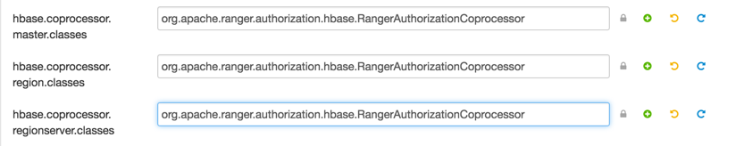
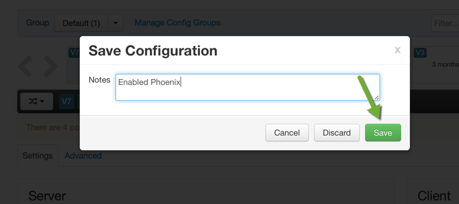
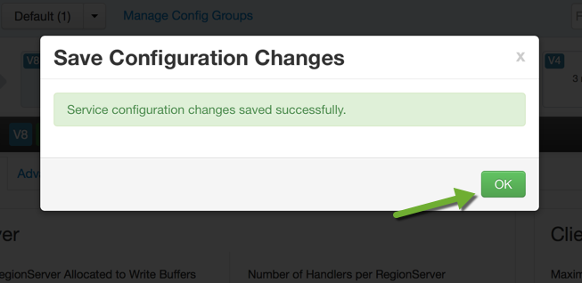
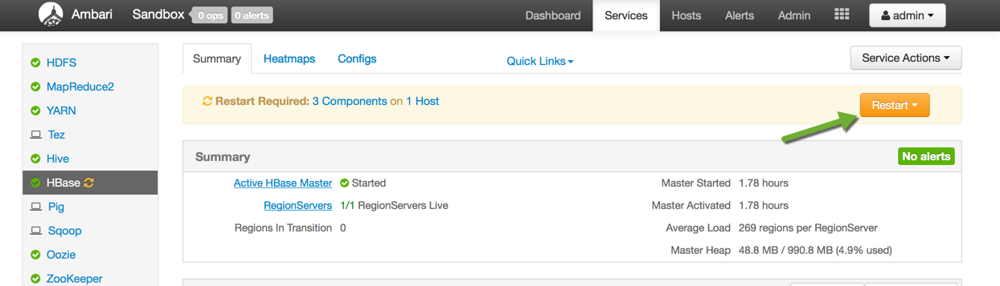
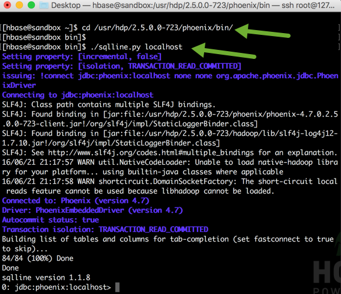
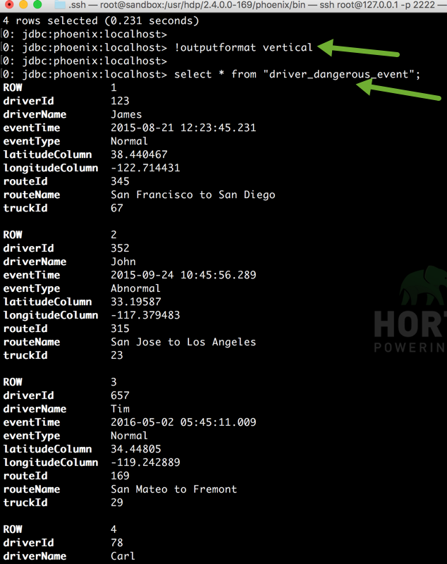
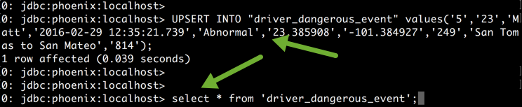
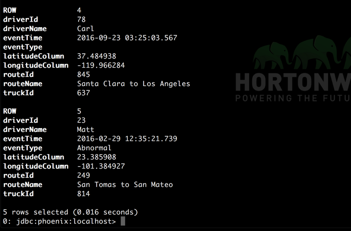

# Introduction to Apache HBase Concepts, Apache Phoenix and New Backup & Restore Utility in HBase

## Lab 2: Introducing Apache Phoenix Concepts

## Introduction

Apache Phoenix is a SQL abstraction layer for interacting with HBase.  Phoenix translates SQL to native HBase API calls.  Phoenix provide JDBC/ODBC and Python drivers.

For more information about Phoenix capabilities, see the [Apache Phoenix website](https://phoenix.apache.org/).

## Prerequisites

-   [Download Hortonworks 2.5 Sandbox](https://hortonworks.com/downloads/#sandbox)
-   Complete the [Learning the Ropes of the Hortonworks Sandbox tutorial,](https://hortonworks.com/hadoop-tutorial/learning-the-ropes-of-the-hortonworks-sandbox/) you will need it for logging into Ambari as an administrator user.
-   Lab 1: Introducing Apache HBase Concepts

## Outline

-   [1. Enable Phoenix by Ambari](#enable-phoenix)
-   [2. Launch Phoenix Shell](#launch-phoenix-shell)
-   [3. Create Phoenix Table on existing HBase table](#create-phoenix-table)
-   [4. Inserting Data via Phoenix](#inserting-data)
-   [5. Setting up SQuirrel and Phoenix Integration](#squirrel-phoenix-setup)
-   [Summary](#summary)
-   [Further Reading](#further-reading)

## 1. Enable Phoenix by Ambari

There is no separate installation required for Phoenix. You can enable Phoenix with Ambari:

1\. Go to Ambari and select Services tab > HBase > Configs tab.

2\. Scroll down to the Phoenix SQL settings.

3\. Click the `Enable Phoenix` slider button.

4\. You have to change 3 more properties. Click on `Advanced Tab` and then scroll down to open `Advanced hbase-site` section. Add `org.apache.ranger.authorization.hbase.RangerAuthorizationCoprocessor` in following three properties:

~~~
hbase.coprocessor.master.classes
hbase.coprocessor.region.classes
hbase.coprocessor.regionserver.classes
~~~

5\. Scroll up and click `Save` to get your config change reflected.

A pop up will come to write about the change that you are making. Type **Enabled Phoenix** in it and click `Save`.

After pressing `Save`, you will get a popup like this:

6\. Restart HBase service.

## 2. Launch Phoenix Shell 

To connect to Phoenix, you need to specify the zookeeper quorum and in the sandbox, it is localhost. To launch it, execute the following commands:

~~~
$>cd /usr/hdp/current/phoenix-client/bin

$>./sqlline.py localhost
~~~

Your Phoenix shell will look like this:

## 3. Create Phoenix Table on existing HBase table 

You can create a Phoenix table/view on a pre-existing HBase table. There is no need to move the data to Phoenix or convert it. Apache Phoenix supports table creation and versioned incremental alterations through DDL commands. The table metadata is stored in an HBase table and versioned. You can either create a READ-WRITE table or a READ only view with a condition that the binary representation of the row key and key values must match that of the Phoenix data types. The only addition made to the HBase table is Phoenix coprocessors used for query processing. A table can be created with the same name.

> **NOTE**: The DDL used to create the table is case sensitive and if HBase table name is in lowercase, you have to put the name in between double quotes. In HBase, you don’t model the possible KeyValues or the structure of the row key. This is the information you specify in Phoenix and beyond the table and column family.

Create a Phoenix table from existing HBase table by writing a code like this:

~~~
create table "driver_dangerous_event" ("row" VARCHAR primary key,"events"."driverId" VARCHAR,"events"."driverName" VARCHAR,
"events"."eventTime" VARCHAR,"events"."eventType" VARCHAR,"events"."latitudeColumn" VARCHAR,
"events"."longitudeColumn" VARCHAR,"events"."routeId" VARCHAR,"events"."routeName" VARCHAR,
"events"."truckId" VARCHAR);
~~~

You can view the HBase table data from this Phoenix table.

~~~
select * from "driver_dangerous_event";
~~~

If you want to change the view from horizontal to vertical, type the following command in the shell and then try to view the data again:

~~~
!outputformat vertical

select * from "driver_dangerous_event";
~~~

If you do not like this view, you can change it back to horizontal view by running the following command:

~~~
!outputformat horizontal
~~~

So with all existing HBase tables, you can query them with SQL now. You can point your Business Intelligence tools and Reporting Tools and other tools which work with SQL and query HBase as if it was another SQL database with the help of Phoenix.

## 4. Inserting Data via Phoenix 

You can insert the data using `UPSERT` command. It inserts if not present and updates otherwise the value in the table. The list of columns is optional and if not present, the values will map to the column in the order they are declared in the schema. Copy the `UPSERT` statement given below and then view the newly added row.

~~~
UPSERT INTO "driver_dangerous_event" values('5','23','Matt','2016-02-29 12:35:21.739','Abnormal','23.385908','-101.384927','249','San Tomas to San Mateo','814');

select * from "driver_dangerous_event";
~~~

You will see a newly added row:

## 5. Setting up SQuirrel and Phoenix Integration 

**SQuirreL SQL Client** is a graphical Java program that will allow you to view the structure of a JDBC compliant database, browse the data in tables, issue SQL commands etc. If you want to use a graphical user interface for Phoenix, you might give SQuirrel a try.

Go to this [article](https://community.hortonworks.com/content/kbentry/44350/setting-up-squirrel-and-phoenix-integration.html) on Hortonworks Community Connection to set up the SQuirrel client work with Phoenix.

## Summary 

Congratulations! Lets summarize what we learned in this tutorial. We went through the introduction of Apache Phoenix and how to use it with Apache HBase. We also learned how to integrate Phoenix with SQuirrel. Go through Lab 3 of this tutorial where we are discussing another SQL tool Apache Hive and how to integrate that with Apache HBase.

## Further Reading

-   [Create Phoenix Schema](https://community.hortonworks.com/articles/89464/create-phoenix-schemas-in-hdp-25.html)
