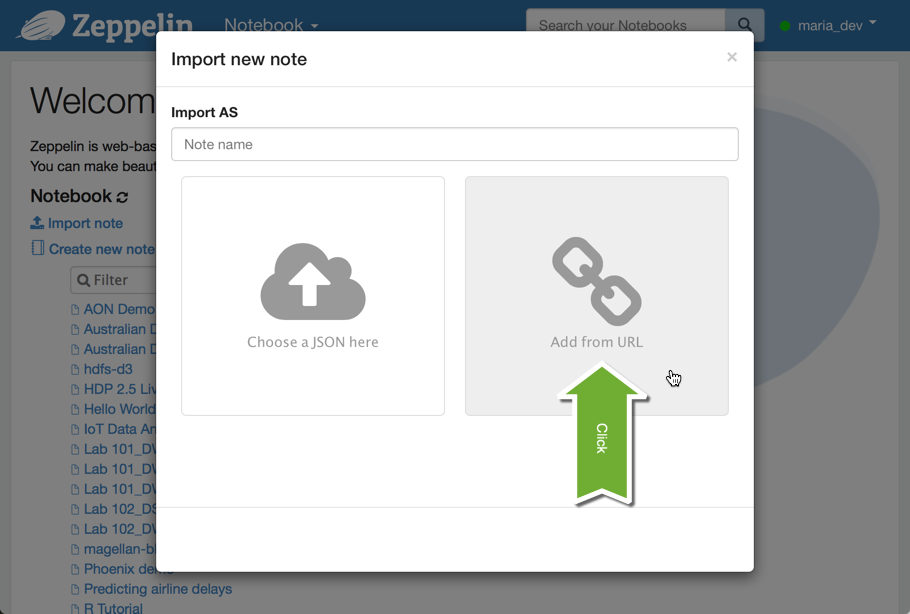

# Learning Spark with Zeppelin

## Introduction
In this tutorial, we will introduce the basic concepts of Apache Spark DataFrames in a hands-on lab.

We will also introduce the necessary steps to get up and running with Apache Zeppelin on a Hortonworks Data Platform (HDP) Sandbox.

## Prerequisites

-   Download and Install [HDP Hortonworks Sandbox](https://hortonworks.com/products/hortonworks-sandbox/#install)
-   Or deploy the [HDP Sandbox in the Azure Cloud](https://hortonworks.com/hadoop-tutorial/deploying-hortonworks-sandbox-on-microsoft-azure/) (FREE for the first month)
-   Additional resource to get you started: [Learning the Ropes of the Hortonworks Sandbox](https://hortonworks.com/hadoop-tutorial/learning-the-ropes-of-the-hortonworks-sandbox/)

> Note: If you're attending a Crash Course or a Meetup, the instructor may have additional information on how to get a HDP Sandbox installed.

## Outline

-   [Concepts](#concepts)
-   [Setup](#setup)
-   [Further Reading](#further-reading)

## Concepts

The core concepts of Spark DataFrames will be introduced in the lab itself. Here, we will focus on launching Zeppelin, importing and then starting the lab.

## Setup

**1. Start your Sandbox**

First, start your Sandbox Virtual Machine (VM) in either a local VirtualBox/VMware (or Azure cloud) environment and note your VM IP address.

We will refer to your VM IP address as `<HOST IP>` throughout this tutorial.

If you need help finding your `<HOST IP>` checkout [Learning the Ropes](https://hortonworks.com/hadoop-tutorial/learning-the-ropes-of-the-hortonworks-sandbox/#learn-host-address-environment).

**2. Launch Zeppelin**

Now that your Sandbox is running, open a web browser and go to: `http://<HOST IP>:9995`

Where `<HOST IP>` is the IP address of your Sandbox machine.

For example, the default address for **VirtualBox** is [http://127.0.0.1:9995](http://127.0.0.1:9995)

**3. Import Lab**

The name of the lab you will be running today is *Lab 101_DW: Hands-on Intro to Spark with Scala*.

By now you should see the main Zeppelin screen with a list of notebooks that you can explore later.

Right now, let's import today's lab.

Click Import

Next, click "Add from URL" button.

Finally, copy and paste the following url: [https://raw.githubusercontent.com/hortonworks-gallery/zeppelin-notebooks/hdp-2.5/2BSVWUZEW/note.json](https://raw.githubusercontent.com/hortonworks-gallery/zeppelin-notebooks/hdp-2.5/2BSVWUZEW/note.json)

and click "Import Note"

Voila! Now you should have your "Lab 101_DW: ..." listed in the main Zeppelin directory.

Click on the lab to get started and follow the step-by-step instructions in the notebook to complete the lab.

## Further Reading

Once you're done with the lab, make sure to checkout other Zeppelin Labs and [Spark Tutorials](https://hortonworks.com/hadoop/spark/#tutorials).
