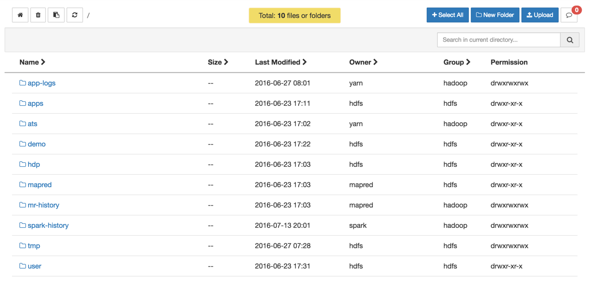
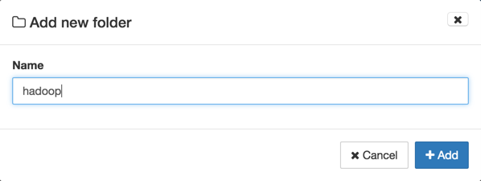
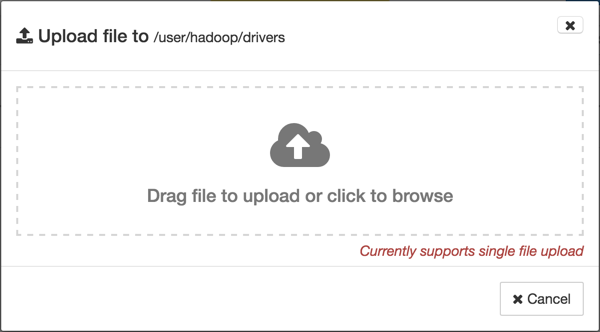
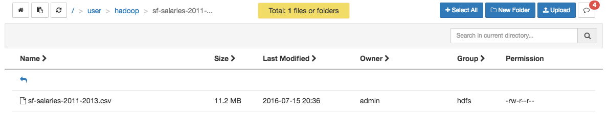
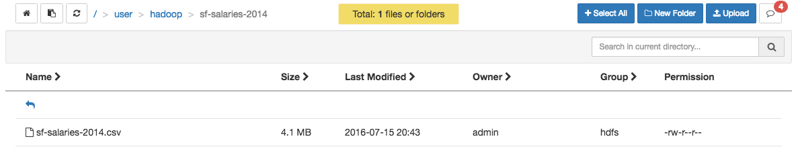
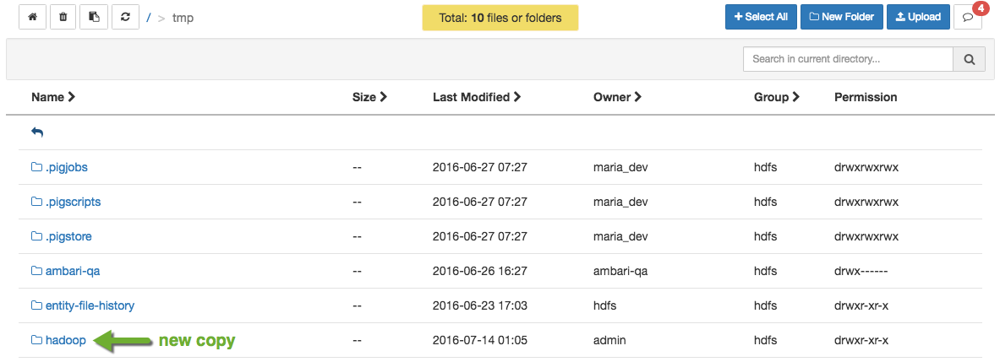

# Manage Files on HDFS via Cli/Ambari Files View

## Tutorial 2: Manage Files on HDFS with Ambari Files View

## Introduction

In the previous tutorial, we learned to manage files on the Hadoop Distributed File System (HDFS) with the command line. Now we will use Ambari Files View to perform many of the file management operations on HDFS that we learned with CLI, but through the web-based interface.

## Prerequisites

-   Downloaded and Installed latest [Hortonworks Sandbox](https://hortonworks.com/products/hortonworks-sandbox/#install)
-   If you're planning to deploy your sandbox on Azure, refer to this tutorial: [Deploying the Sandbox on Azure](https://hortonworks.com/hadoop-tutorial/deploying-hortonworks-sandbox-on-microsoft-azure/)
-   [Learning the Ropes of the Hortonworks Sandbox](https://hortonworks.com/hadoop-tutorial/learning-the-ropes-of-the-hortonworks-sandbox/)
-   Allow yourself around **1 hour** to complete this tutorial.

### Download San Francisco Salary Related Datasets

We will download **sf-salaries-2011-2013.csv** and **sf-salaries-2014.csv** data onto our local filesystems of our computer. The commands are tailored for mac and linux users.

Open a terminal on your local machine, copy and paste the commands to download the **sf-salaries-2011-2013.csv** and **sf-salaries-2014.csv** files. We will use them while we learn file management operations.

~~~
cd ~/Downloads
# download sf-salaries-2011-2013
wget
https://raw.githubusercontent.com/hortonworks/data-tutorials/893ba0221e2c76c91e9e2baa030323a42abcdf09/tutorials/hdp/hdp-2.5/manage-files-on-hdfs-via-cli-ambari-files-view/assets/sf-salary-datasets/sf-salaries-2011-2013.csv
# download sf-salaries-2014
wget
https://raw.githubusercontent.com/hortonworks/data-tutorials/893ba0221e2c76c91e9e2baa030323a42abcdf09/tutorials/hdp/hdp-2.5/manage-files-on-hdfs-via-cli-ambari-files-view/assets/sf-salary-datasets/sf-salaries-2014.csv
mkdir sf-salary-datasets
mv sf-salaries-2011-2013.csv sf-salaries-2014.csv sf-salary-datasets/
~~~

## Outline
-   [Step 1: Create a Directory in HDFS, Upload a file and List Contents](#create-a-directory-in-hdfs-upload-a-file-and-list-contents)
-   [Step 2: Find Out Space Utilization in a HDFS Directory](#find-out-space-utilization-in-a-hdfs-directory)
-   [Step 3: Download File From HDFS to Local Machine(Mac, Windows, Linux)](#download-files-hdfs-to-local-file-system)
-   [Step 4: Explore Two Advanced Features](#explore-two-advanced-features)
-   [Summary](#summary)
-   [Further Reading](#further-reading)

## Step 1: Create a Directory in HDFS, Upload a file and List Contents 

### Create Directory Tree in User

1\. Login to Ambari Interface at `127.0.0.1:8080`. Use the following login credentials in **Table 1**.

**Table 1**: Ambari Login credentials

| Username | Password |
|:---:|:---:|
| admin | **setup process |

> **Ambari password setup process**, refer to step [2.2 Setup Ambari Admin Password Manually](https://hortonworks.com/hadoop-tutorial/learning-the-ropes-of-the-hortonworks-sandbox/#setup-ambari-admin-password) of Learning the Ropes of the Hortonworks Sandbox.

2\. Now that we have admin privileges, we can manage files on HDFS using Files View. Hover over the Ambari Selector Icon , enter the Files
View web-interface.

The Files View Interface will appear with the following default folders.

3\. We will create 4 folders using the Files View web-interface. All _three folders_: **sf-salaries-2011-2013, sf-salaries and sf-salaries-2014** will reside in the **hadoop** folder, which resides in **user**. Navigate into the **user** folder. Click the **new folder** button , an add new folder window appears and name the folder `hadoop`. Press **enter** or **Add**

4\. Navigate into the **hadoop** folder. Create the _three folders_: **sf-salaries-2011-2013, sf-salaries and sf-salaries-2014** following the process stated in the previous instruction.

### Upload Local Machine Files to HDFS

We will upload two files from our local machine: **sf-salaries-2011-2013.csv** and **sf-salaries-2014.csv** to appropriate HDFS directories.

1\. Navigate through the path `/user/hadoop/sf-salaries-2011-2013` or if you're already in **hadoop**, enter the **sf-salaries-2011-2013** folder. Click the upload button  to transfer **sf-salaries-2011-2013.csv** into HDFS.

An Upload file window appears:

2\. Click on the cloud with an arrow. A window with files from your local machine appears, find **sf-salaries-2011-2013.csv** in the **Downloads/sf-salary-datasets** folder, select it and then press **open** button.

3\. In Files View, navigate to the **hadoop** folder and enter the **sf-salaries-2014** folder. Repeat the upload file process to upload **sf-salaries-2014.csv**.

### View and Examine Directory Contents

Each time we open a directory, the Files View automatically lists the contents. Earlier we started in the **user** directory.

1\. Let's navigate back to the **user** directory to examine the details given by the contents. Reference the image below while you read the Directory Contents Overview.

**/** Directory Contents Overview of Columns

*  **Name** are the files/folders
*  **Size** contains bytes for the Contents
*  **Last Modified** includes the date/time the content was created or Modified
*  **Owner** is who owns that contents
*  **Group** is who can make changes to the files/folders
*  **Permissions** establishes who can read, write and execute data

## Step 2: Find Out Space Utilization in a HDFS Directory 

In the command line when the directories and files are listed with the `hadoop fs -du /user/hadoop/`, the size of the directory and file is shown. In Files View, we must navigate to the file to see the size, we are not able to see the **size** of the directory even if it contains files.

Let's view the size of **sf-salaries-2011-2013.csv** file. Navigate through `/user/hadoop/sf-salaries-2011-2013`. How much space has the file utilized? Files View shows **11.2 MB** for **sf-salaries-2011-2013.csv**.

## Step 3: Download File From HDFS to Local Machine(Mac, Windows, Linux) 

Files View enables users to download files and folders to their local machine with ease.

Let's download the **sf-salaries-2011-2013.csv** file to our computer. Click on the file's row, the row's color becomes blue, a group of file operations will appear, select the Download button. The default directory the file downloads to is our **Download** folder on our local machine.

## Step 4: Explore Two Advanced Features 

### Concatenate Files

File Concatenation merges two files together. If we concatenate **sf-salaries-2011-2013.csv** with **sf-salaries-2014.csv**, the data from **sf-salaries-2014.csv** will be appended to the end of **sf-salaries-2011-2013.csv**. A typical use case for a user to use this feature is when they have similar large datasets that they want to merge together. The manual process to combine large datasets is inconvenient, so file concatenation was created to do the operation instantly.

1\. Before we merge the csv files, we must place them in the same folder. Click on **sf-salaries-2011-2013.csv** row, it will highlight in blue, then press copy and in the copy window appears, select the **sf-salaries-2014** folder and press **Copy** to copy the csv file to it.

2\. We will merge two large files together by selecting them both and performing concatenate operation. Navigate to the **sf-salaries-2014** folder. Select **sf-salaries-2011-2013.csv**, hold shift and click on **sf-salaries-2014.csv**. Click the concatenate button. The files will be downloaded into the **Download** folder on your local machine.

3\. By default, Files View saves the merged files as a txt file, we can open the file and save it as a csv file. Then open the csv file and you will notice that all the salaries from 2014 are appended to the salaries from 2011-2013.

### Copy Files or Directories recursively

Copy file or directories recursively means all the directory's files and subdirectories to the bottom of the directory tree are copied. For instance, we will copy the **hadoop** directory and all of its contents to a new location within our hadoop cluster. In production, the copy operation is used to copy large datasets within the hadoop cluster or between 2 or more clusters.

1\. Navigate to the **user** directory. Click on the row of the **hadoop** directory. Select the Copy button .

2\. The **Copy to** window will appear. Select the **tmp** folder, the row will turn blue. If you select the folder icon, the contents of **tmp** become visible. Make sure the row is highlighted blue to do the copy. Click the blue **Copy** button to copy the **hadoop** folder recursively to this new location.

3\. A new copy of the **hadoop** folder and all of its contents can be found in the **tmp** folder. Navigate to **tmp** for verification. Check that all of the **hadoop** folder's contents copied successfully.

## Summary

Congratulations! We just learned to use the Files View to manage our **sf-salaries-2011-2013.csv** and **sf-salaries-2014.csv** dataset files in HDFS. We learned to create, upload and list the the contents in our directories. We also acquired the skills to download files from HDFS to our local file system and explored a few advanced features of HDFS file management.

## Further Reading

-   [HDFS Overview](https://hortonworks.com/apache/hdfs/)
