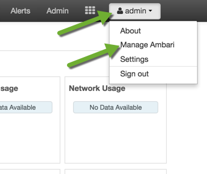
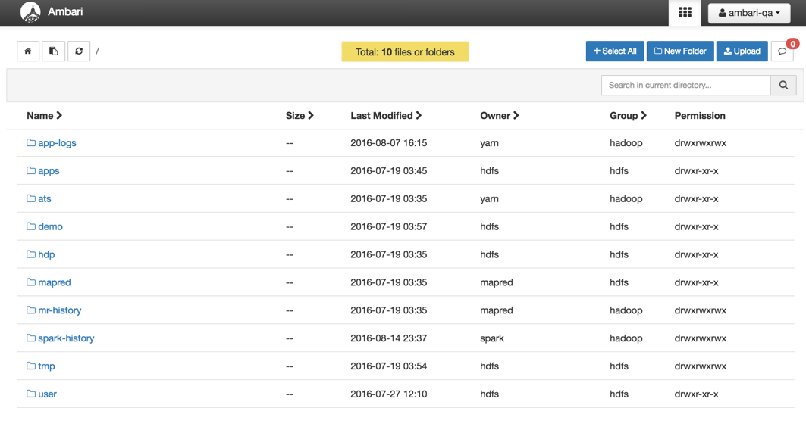
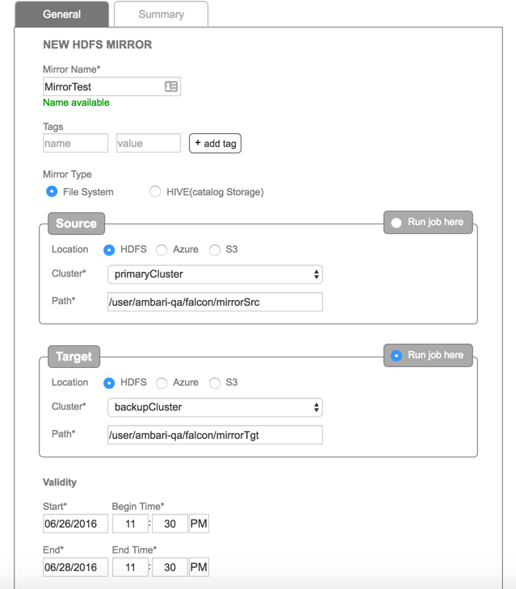
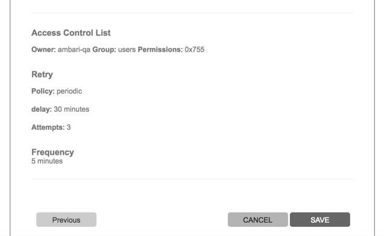
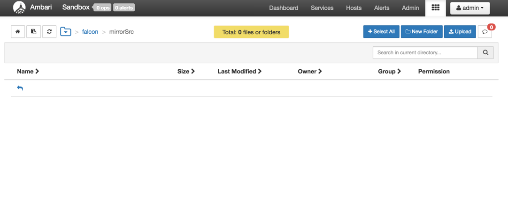
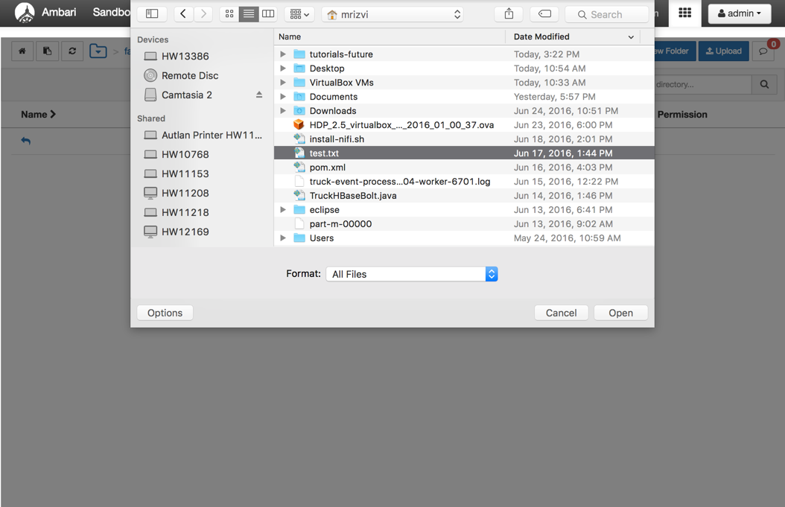
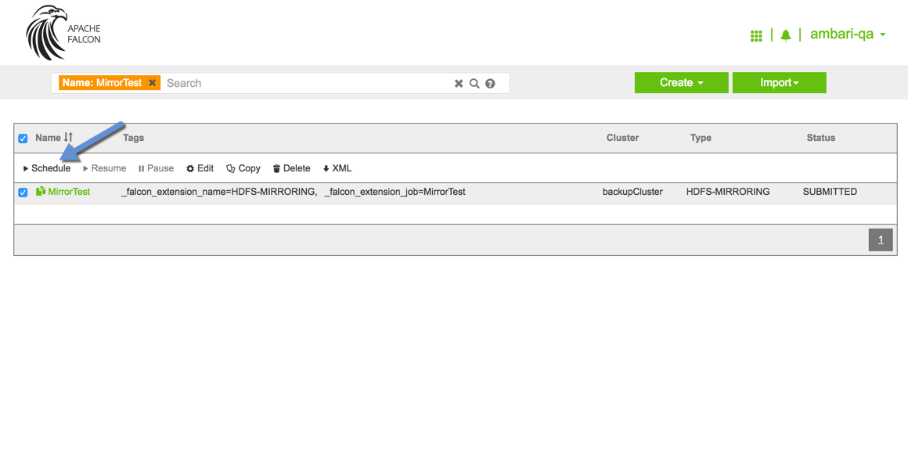
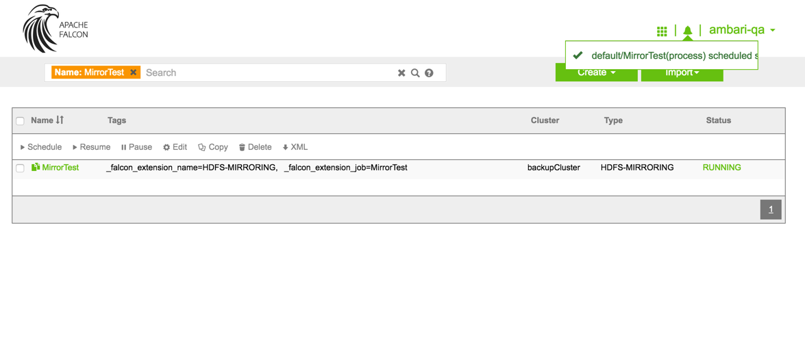
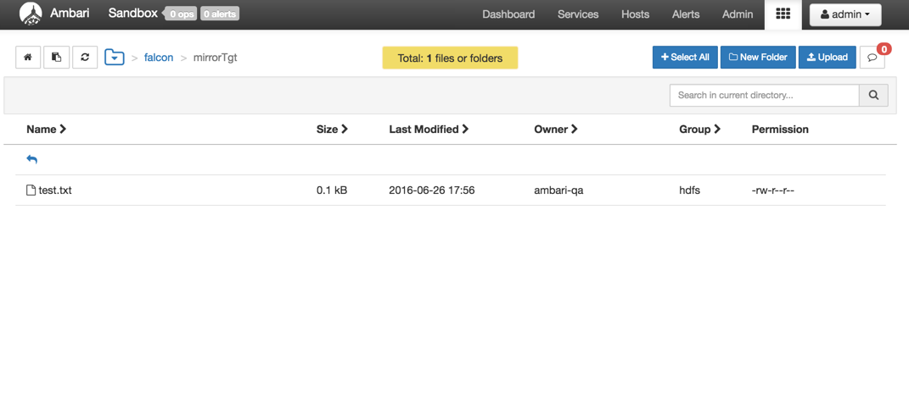

# Mirroring Datasets Between Hadoop Clusters with Apache Falcon

## Introduction

Apache Falcon is a framework to simplify data pipeline processing and management on Hadoop clusters.

It provides data management services such as retention, replications across clusters, archival etc. It makes it much simpler to onboard new workflows/pipelines, with support for late data handling and retry policies. It allows you to easily define relationship between various data and processing elements and integrate with metastore/catalog such as Hive/HCatalog. Finally it also lets you capture lineage information for feeds and processes.

In this tutorial we are going walk the process of mirroring the datasets between Hadoop clusters.

## Prerequisites

- [Download Hortonworks Sandbox 2.5](https://hortonworks.com/downloads/#sandbox)
- Complete the [Learning the Ropes of the Hortonworks Sandbox tutorial,](https://hortonworks.com/hadoop-tutorial/learning-the-ropes-of-the-hortonworks-sandbox/) you will need it for logging into Ambari as an administrator user.
- Complete the [Leveraging Apache Falcon with Your Hadoop Clusters](https://hortonworks.com/hadoop-tutorial/mirroring-datasets-between-hadoop-clusters-with-apache-falcon/) tutorial to start the falcon service, prepare HDFS directories for Falcon cluster and to create Falcon cluster entities.

## Outline
- [1. Create ambari-qa user](#create-ambari-qa-user)
- [2. Preparing HDFS Directories](#preparing-hdfs-directories)
- [3. Setting up the Mirroring Job](#setting-up-mirroring-job)
- [4. Running the Job](#running-job)
- [Summary](#summary)

## 1. Create ambari-qa user 

After creating cluster entities, let us go back to Ambari as `admin` user. Click on admin menu drop down and then `Manage Ambari`:

Click the blue `Users` button in the bottom box as given below:

Click the `Create Local User` button at the top of the page. Enter `ambari-qa` as the user name and then set the password for it. Enter it again for confirmation and `Save` the user.

You can see the newly added `ambari-qa` user. Click on it to assign it a group so that it can access Ambari views.
Write `“views”` and select it in `Local Group Membership`  box and then click on `tick` mark to add an `ambari-qa` user in the `“views”` group.

Now logout of Ambari from the `admin` user and login to Ambari as `ambari-qa` user.

## 2. Preparing HDFS Directories 

Select the Files View and you can view the following default folders:

Navigate to `/user/ambari-qa` and create a new directory `falcon`
Click on the row of `falcon` directory and then click on `Permissions` button:

Add `Write` permission for both Group and Others and then click `Save`.

Now create the directories `mirrorSrc` and `mirrorTgt` under `/user/ambari-qa/falcon` as the source and target of the mirroring job we are about to create.

<!---
After creating cluster entities, let’s go back to the SSH terminal, switch the user to `root` and then to `ambari-qa`:

~~~
hadoop fs -mkdir /user/ambari-qa/falcon
hadoop fs -mkdir /user/ambari-qa/falcon/mirrorSrc
hadoop fs -mkdir /user/ambari-qa/falcon/mirrorTgt
~~~

Now we need to set permissions to allow access. You must be logged in as the owner of the directory `/user/ambari-qa/falcon/`

~~~bash
hadoop fs -chmod -R 777 /user/ambari-qa/falcon
~~~

-->

## 3. Setting up the Mirroring Job 

To create the mirroring job, go back to the Falcon UI on your browser and click on the `Create` drop down.

Click `Mirror` from the drop down menu, you will see a page like this:

Provide a name of your choice. The name must be unique to the system. We named the Mirror Job `MirrorTest`.

Ensure the File System mirror type is selected, then select the appropriate Source and Target and type in the appropriate paths. In our case the source cluster is `primaryCluster` and that HDFS path on the cluster is `/user/ambari-qa/falcon/mirrorSrc`.

The target cluster is `backupCluster` and that HDFS path on the cluster is `/user/ambari-qa/falcon/mirrorTgt`.
Also set the validity of the job to your current time, so that when you attempt to run the job in a few minutes, the job is still within the validity period. Keep default values in Advanced Options and then Click `Next`.

Verify the summary information, then click `Save`:

## 4. Running the Job 

Before we can run the job, we need some data to test on HDFS.
<!---Let’s give us permission to upload some data using the HDFS View in Ambari.

~~~
su - root

su hdfs

hadoop fs -chmod -R 775 /user/ambari-qa
~~~

Open Ambari from your browser at port 8080.
Then launch the HDFS view from the top right hand corner.
-->
Keep login as ambari-qa and from the view on the Ambari console navigate to the directory `/user/ambari-qa/falcon/mirrorSrc`.

Click `Upload` button and upload any file you want to use.

Once uploaded the file should appear in the directory.

Now navigate to the Falcon UI and search for the job we created. The name of the Mirror job we had created was `MirrorTest`.

Select the `MirrorTest` job by clicking the checkbox and then click on `Schedule`.

The state of the job should change from `SUBMITTED` to `RUNNING`.

After a few minutes, use the HDFS View in the Ambari console to check the `/user/ambari-qa/falcon/mirrorTgt` directory and you should see that  your data is mirrored.

## Summary 

In this tutorial we walked through the process of mirroring the datasets between two cluster entities.
