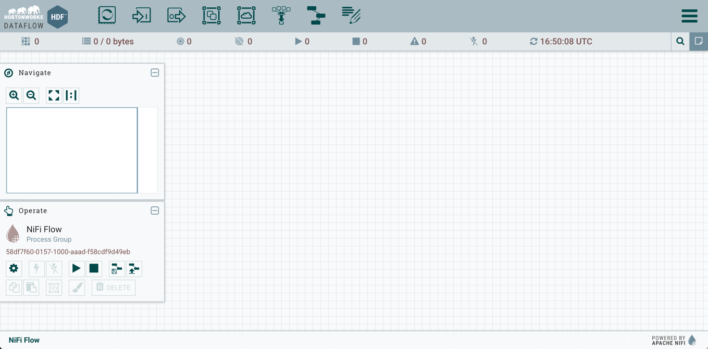
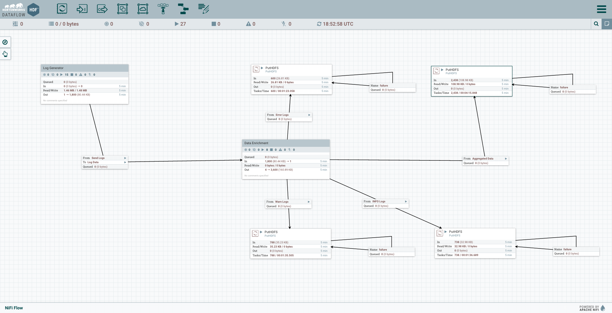

# Refine and Visualize Server Log Data

## Introduction

Security breaches happen. And when they do, your server logs may be your best line of defense. Hadoop takes server-log analysis to the next level by speeding and improving security forensics and providing a low cost platform to show compliance.

In this demo, we demonstrate how an enterprise security breach analysis and response might be performed.

### In this tutorial, learn how to:

*   Stream server logs into Hadoop with [Hortonworks Dataflow](https://hortonworks.com/hdf/) powered by **Apache NiFi**
*   Use [Hive](https://hortonworks.com/hadoop/hive) to build a relational view of the data
*   Use Elastic Search for high-level visualization
*   Use [Oozie](https://hortonworks.com/hadoop/oozie) to automatically update a firewall
*   Visualize the data with [Apache Zeppelin](https://hortonworks.com/hadoop/zeppelin)

### Overview

-   Understand Server Log Data, Become familiar with Server Log Data Use Cases, Hortonworks DataFlow and Apache NiFi
-   Download and configure the script which will generate our server log data
-   Install, configure, and start Hortonworks DataFlow
-   Generate the server log data.
-   Import the server log data into Excel.
-   Visualize the server log data using Excel Power View and Apache Zeppelin.

This Hadoop tutorial can be performed with the [Hortonworks Sandbox](https://hortonworks.com/products/sandbox) – a single-node Hadoop cluster running in a virtual machine. Download to run this and other tutorials in the series. The tutorial presented here is for Sandbox HDP 2.5.

## Prerequisites

-   Hortonworks Sandbox (installed and running)
-   Hortonworks DataFlow - [Download here](https://hortonworks.com/downloads/#dataflow)
-   If you'd like to use Tableau to explore the data, please see this HOWTO on the Hortonworks website: [HOWTO: Connect Tableau to the Hortonworks Sandbox](https://hortonworks.com/kb/how-to-connect-tableau-to-hortonworks-sandbox/)
-   Server log tutorial files (included in this tutorial)

## Outline
-   [Concepts](#concepts)
-   [Step 1 - Configure and Install Hortonworks DataFlow](#step-1-configure-and-install-hortonworks-dataflow)
-   [Step 2 - Import the Flow](#import-flow)
-   [Step 3 - Generate the Server Log Data](#generate-server-log-ata)
-   [Step 4 - Visualize Server Log Data with Apache Zeppelin](#visualize-log-data-zeppelin)
-   [Summary](#summary-server-logs)
-   [Further Reading](#further-reading)

## Concepts

### Server Log Data

Server logs are computer-generated log files that capture network and server operations data. They are useful for managing network operations, especially for security and regulatory compliance.

### Potential Uses of Server Log Data

IT organizations use server log analysis to answer questions about:

*   **Security** – For example, if we suspect a security breach, how can we use server log data to identify and repair the vulnerability?
*   **Compliance** – Large organizations are bound by regulations such as HIPAA and Sarbanes-Oxley. How can IT administrators prepare for system audits?

In this tutorial, we will focus on a network security use case. Specifically, we will look at how Apache Hadoop can help the administrator of a large enterprise network diagnose and respond to a distributed denial-of-service attack.

### What Is Hortonworks Dataflow and Apache NiFi?

**Apache NiFi** is a secure integrated platform for real time data collection, simple event processing, transport and delivery from source to storage. It is useful for moving distributed data to and from your Hadoop cluster. NiFi has lots of distributed processing capability to help reduce processing cost and get real-time insights from many different data sources across many large systems and can help aggregate that data into a single, or many different places.

**NiFi** lets users get the most value from their data. Specifically NiFi allows users to:

- Stream data from multiple source
- Collect high volumes of data in real time
- Guarantee delivery of data
- Scale horizontally across many machines

**How NiFi Works**. NiFi's high-level architecture is focused on delivering a streamlined interface that is easy to use and easy to set up. There is a little bit of terminology that are an integral part to understanding how NiFi works.

- **Processor**: Processors in NiFi are what makes the data move. Processors can help generate data, run commands, move data, convert data, and many many more. NiFi's architecture and feature set is designed to be extended these processors. They are at the very core of NiFi's functionality.
- **Processing Group**: When data flows get very complex, it can be very useful to group different parts together which perform certain functions. NiFi abstracts this concept and calls them processing groups.
- **FlowFile**: A FlowFile in NiFi represents just a single piece of data. It is made of different parts. **Attributes** and **Contents**. Attributes help give the data context which are made of key-value pairs. Typically there are 3 attributes which are present on all FlowFiles: **uuid**, **filename**, and **path**
- **Connections** and **Relationships**: NiFi allows users to simply drag and drop connections between processors which controls how the data will flow. Each connection will be assigned to different types of relationships for the FlowFiles (such as successful processing, or a failure to process)

A FlowFile can originate from a processor in NiFi. Processors can also receive the flowfiles and transmit them to many other processors. These processors can then drop the data in the flowfile into various places depending on the function of the processor.

**Notes:**

- In this tutorial, the Hortonworks Sandbox is installed on an Oracle VirtualBox virtual machine (VM).
- Install the ODBC driver that matches the version of Excel you are using (32-bit or 64-bit).
- In this tutorial, we will use the Power View feature in Excel 2013 to visualize the server log data. Power View is currently only available in Microsoft Office Professional Plus and Microsoft Office 365 Professional Plus.
- We're going to install Hortonworks DataFlow (HDF) on the Sandbox, so you'll need to download the latest HDF release

## Step 1 – Configure and Install Hortonworks DataFlow

### 1.1 - Install NiFi 

NiFi will be installed into the Ambari Stack of the Hortonworks Sandbox VirtualBox image because it
will be used to activate server log simulator and transport data to HDFS.

1\. If you do not have NiFi installed on your sandbox, refer to [Step 2: Download and Install NiFi on Hortonworks Sandbox (Option 1)](https://hortonworks.com/hadoop-tutorial/learning-ropes-apache-nifi/#download-nifi-sandbox) from Tutorial 0: Download, Install, and Start NiFi of
Learning the Ropes of Apache NiFi for step-by-step instructions.

### 1.2 - Start NiFi 

1\. To activate the NiFi service, refer to [Step 4: Start NiFi on Sandbox](https://hortonworks.com/hadoop-tutorial/learning-ropes-apache-nifi/#start-nifi-sandbox) from Tutorial 0: Download, Install, and Start NiFi of
Learning the Ropes of Apache NiFi for step-by-step instructions.

Once you enter the NiFi HTML Interface at [http://localhost:9090/nifi](http://localhost:9090/nifi), you should see a canvas as below:

## Step 2 - Import the Flow 

We're going to import a pre-made data flow from a template which you can [**download ServerLogGeneratorSecurity.xml**](assets/templates/ServerLogGeneratorSecurity.xml).

Use the NiFi interface to upload the flow, and then drag it onto your workspace.

Once you've uploaded the template into NiFi you can instantiate it by dragging the template icon  onto the screen. It will ask you to select your template's name and the flow will appear as in the image below.

## Step 3 - Generate the Server Log Data 

Now that you've imported the data flow and everything it set up, simply click the **Run** at the top of the screen. (Make sure you haven't selected a specific processor, or  else only one of the processors will start)

If you receive an error message stating "LzoCodec not found" and "LzopCodec not found" similar to the image below,

Login to Ambari Dashboard at [http://localhost:8080](http://localhost:8080) as raj_ops user. The login credentials are **raj_ops/raj_ops**. Once inside Ambari, click **HDFS** in the left hand sidebar, then click on the **Configs** tab. Scroll down the page, next to Settings tab, click on the **Advanced** tab to open the Advanced configs. Navigate to **Advanced core-site** file, we will need to change property value for the **io.compression.codecs** setting.

when you find the **LzoCodec** and **LzopCodec**, which are values within the **io.compression.codecs** property, the line will look as below:

~~~
org.apache.hadoop.io.compress.GzipCodec,org.apache.hadoop.io.compress.DefaultCodec,org.apache.hadoop.io.compress.SnappyCodec,com.hadoop.compression.lzo.LzoCodec,com.hadoop.compression.lzo.LzopCodec
~~~

Remove **com.hadoop.compression.lzo.LzoCodec** and **com.hadoop.compression.lzo.LzopCodec** from the config values.

You should see the updated content in the **io.compression.codecs** value field as below:

~~~
org.apache.hadoop.io.compress.GzipCodec,org.apache.hadoop.io.compress.DefaultCodec,org.apache.hadoop.io.compress.SnappyCodec
~~~

Save the configuration change. Ambari will notify us that we need to restart HDFS, scroll to the top of HDFS Configs page, you should see a **Orange Restart** button, select **Restart All Affected**.

Now that we are done setting configuration changes, navigate back to the dataflow at [http://localhost:9090/nifi](http://localhost:9090/nifi) Now that we made the change, let's rerun the DataFlow, those errors should be resolved.

Now that everything is running we can check in the places where we see the data being deposited in HDFS. Since we will be checking if the NiFi DataFlow performs as expected, log out of raj_ops user, then login to Ambari as maria_dev user. Login to the Ambari Dashboard at [http://localhost:8080](http://localhost:8080). Login credentials are **maria_dev/maria_dev**.

### 3.1 Verify NiFi Populates HDFS with Data Files

Open up the **Files View**, and then navigate to `/tmp/server-logs/`. Files should start appearing a few seconds after you start the flow. You can click on them to view the content.

*   Next we will create an Hive table from the log file.

### 3.2 Format the Data with Hive

Open the Ambari UI and head to the views dropdown list. Select **Hive** and then paste the following query.

~~~sql
CREATE TABLE FIREWALL_LOGS(
  time STRING,
  ip STRING,
  country STRING,
  status INT
)
CLUSTERED BY (time) into 25 buckets
STORED AS ORC
TBLPROPERTIES("transactional"="true")
FIELDS TERMINATED BY '|'
LOCATION '/tmp/server-logs';
~~~

We will define an ORC Table in Hive Create table using Apache ORC file format.

~~~sql
CREATE TABLE FIREWALL AS STORED AS ORC SELECT * FROM FIREWALL_LOGS;
~~~

**Note** if the query doesn't run successfully due to a permissions error you then might need to update the permission on the directory. Run the following commands over SSH on the Sandbox

~~~bash
sudo -u hdfs hadoop fs -chmod -R 777 /tmp
~~~

When the table has been created you should now be able to query the data table for data using a query like

~~~bash
SELECT time, ip, country, cast(status as BOOLEAN) FROM firewall_logs LIMIT 100;
~~~

> Note: In the table above, 1 is for true, 0 is for false.

## Step 4 - Visualize Server Log Data with Apache Zeppelin 

Why is Data Visualization important?
Helps you analyze network data and determine effective responses to network issues.

<!---
First, make sure that the Apache Zeppelin service is started in Ambari. Then use the **Views Dropdown Menu** and select the **Zeppelin View**.
--->

Go to browser and type `sandbox.hortonworks.com:9995` to open Zeppelin UI

You should be greeted by the following screen where you can choose to view notes, or create a new one.

### 4.1 Import notebook NiFiServerLogs (Option 1)

You can choose to **Import note** from this tutorial. Click on **Import note**, an **Import new note** window will appear, select **Add from URL**. The window will transition to a new window that has two fields: **Import AS** and **URL**. Copy & Paste the following URL into the **URL** field:

~~~
https://raw.githubusercontent.com/hortonworks/data-tutorials/cf9f67737c3f1677b595673fc685670b44d9890f/tutorials/hdp/hdp-2.5/refine-and-visualize-server-log-data/assets/NiFiServerLogs.json
~~~

Then click the **Import note** button.

### 4.2 Create notebook NiFiServerLogs (Option 2)

If you prefer to go through the steps to create the notebook, follow the steps below. Click on the **Create new note** in the Zeppelin Welcome page. Enter **NiFiServerLogs** as the notebook name and create the notebook. Click on the new notebook you created in the list of notebooks to open the **NiFiServerLogs** notebook. Our notebook will have 3 sections in which we will analyze data for denial-of-service attack:

- review network traffic by country
- zoom in one particular country
- generate list of attacking IP addresses

### Find Network Traffic Per Country

Let’s filter the data in our hive table, so it only shows **country** and **status**. Copy & Paste the query into Zeppelin:

~~~sql
%jdbc(hive)
SELECT country, cast(status as BOOLEAN) FROM firewall_logs
~~~

We were able to generate a table in zeppelin that shows us country associated with whether the network connection status was a success or not. Let’s visualize this table as a Bar Graph, select the option that looks like a Bar Graph. Now let’s setup the Advanced settings: **Keys**, **Groups**, **Values**. You should have two fields: country and success. Drag the country field into the **Keys** box, then do the same operation for the **status** field. To sum up the **status** values for true and false,  drag another status field into the **Values**. Now the countries will have true or false association and when you hover over a piece of the bar graph, you should see the sum value for status: false or true.

Legend:
Blue represents successful, authorized network connections
Light Blue represents connections from unauthorized sources

### Zoom into One Particular Country

Let’s assume the recent denial-of-service attacks originated in INDIA. Let’s further filter the data by selecting the country with value IND. Copy & Paste the query into the second text space available:

~~~sql
%jdbc(hive)
SELECT country, cast(status as BOOLEAN) FROM firewall_logs WHERE country = ‘IND’
~~~

Let’s make an assumption that the recent denial-service attacks originate in INDIA, we will use Zeppelin’s data visualization feature to zoom in on the status errors or unauthorized network connections for INDIA. Under the query, there are 6 visualization choices, we will choose 2 leftmost choice, a bar graph.

Remember we want to know the total for unauthorized network connections, so drag the success square into the **Values** box. Since there are multiple values for success, “true” or “false”, let’s drag another success box into the groups box. The key that is associated with both types of values for success is “IND”, so drag the country square into the **Keys** box. Refer to the image as below:

Legend:
Blue represents successful, authorized network connections
Light Blue represents connections from unauthorized sources

### Generate List of Attacking IP Addresses

Let's generate a record of unauthorized IP addresses. We will need to query the table with the parameters time, ip, country, success. Copy & Paste the following query into Zeppelin:

Run the following query:

~~~sql
%jdbc(hive)
SELECT time, ip, country, cast(status as BOOLEAN) FROM firewall_logs WHERE status = '0'
~~~

Generates List of IP Address Attacks Per Country. The ‘0’ signifies connections from unauthorized sources. Therefore, we can update the network firewall to deny requests from those attacking IP addresses

Let’s visualize the IP Address Attacks in a Pie Chart.

Drag country into the **Keys** box and move **ip** field into the **values** box. Make sure that you selected the count option for the **ip**.

Our visualization counts the number of unauthorized IP Addresses per country.
As you can see each piece of the pie represents a country and when you hover over one slice, you can see the total count for unauthorized IP addresses.

## Summary 

We’ve shown how the Hortonworks Data Platform can help system administrators capture, store, and analyze server log data. With real-time access to massive amounts of data on the Hortonworks Data Platform, we were able to block unauthorized access, restore VPN access to authorized users.

With log data flowing continuously into the Hortonworks Data Platform “data lake,” we can protect the company network from similar attacks in the future. The data can be refreshed frequently and accessed to respond to security threats, or to prepare for compliance audits.

## Further Reading
- [Collecting Logs with Apache NiFi](http://bryanbende.com/development/2015/05/17/collecting-logs-with-apache-nifi)
- [Hive LanguageManual Select](https://cwiki.apache.org/confluence/display/Hive/LanguageManual+Select)
- [Zeppelin Overview Video](https://www.youtube.com/watch?v=_PQbVH_aO5E&feature=youtu.be)
- [Manage Server Log Data with HDP Video](https://www.youtube.com/embed/BPC_mClNSXk?feature=oembed)
