# Refine and Visualize Server Log Data

## Introduction

In the previous lab, you learned how to use Nifi, Hive and Zeppelin to analyze server logs. In this lab, you will explore Apache Spark to analyze the server logs. Using Spark, we can enhance the power of the log data which come from web servers, files and even user generated data.

### In this tutorial, learn how to:

* Stream server logs and and preparation of data into Hadoop with Hortonworks Dataflow powered by Apache NiFi
* Use [PySpark](https://spark.apache.org/docs/1.6.2/api/python/pyspark.sql.html) to clean the data
* Visualize the data with [Apache Zeppelin](https://hortonworks.com/hadoop/zeppelin)
* Tableau to visualize the geolocation in the world map

## Prerequisites

- Hortonworks Sandbox (installed and running)
- Hortonworks DataFlow - [Download here](https://hortonworks.com/downloads/#dataflow)
- If you'd like to use Tableau to explore the data, download a [free trial version](http://www.tableau.com/products/trial)
- Server log tutorial files (included in this tutorial)
- [Lab 1](https://hortonworks.com/hadoop-tutorial/how-to-refine-and-visualize-server-log-data/) of this tutorial

## Outline

- [Dataset](#dataset)
- [Step 1 – Configure and Install Hortonworks DataFlow](#install-hdf)
- [Step 2 - Download Input Data](#download-data)
- [Step 3 - Import the Worklow](#import-flow)
- [Step 4 - Run the Workflow](#run-flow)
- [Step 5 - Verify NiFi Output Data in HDFS](#nifi-output-data)
- [Step 6 - Turn OFF Maintenance Mode and Open Zeppelin UI](#turn-off)
- [Step 7 - Logs Analysis using Spark with Zeppelin](#visualize-log-data-zeppelin)
- [Summary](#summary)
- [Further Reading](#further-reading)

## Dataset 

[Download the dataset here](assets/logsample.txt).

The dataset which we are going to use in this lab is of NASA-HTTP. It has HTTP requests to the NASA Kennedy Space Center WWW server in Florida.
The logs are an ASCII file with one line per request, with the following columns:

1. **host** making the request. A hostname when possible, otherwise the Internet address if the name could not be looked up.
2. **timestamp** in the format "DAY MON DD HH:MM:SS YYYY", where **DAY** is the day of the week, **MON** is the name of the       month, **DD** is the day of the month, **HH:MM:SS** is the time of day using a 24-hour clock, and **YYYY** is the year. The timezone is -0400.
3. **request** given in quotes.
4. **HTTP reply code**.
5. **bytes in the reply**.

## Step 1 – Configure and Install Hortonworks DataFlow 

### 1.1 - Install NiFi

NiFi needs to be installed into the Ambari Stack of the Hortonworks Sandbox VirtualBox image because it will be used to activate server log simulator and transport data to HDFS.
If you do not have NiFi installed on your sandbox, refer to [Step 2: Download and Install NiFi on Hortonworks Sandbox (Option 1)](https://hortonworks.com/hadoop-tutorial/learning-ropes-apache-nifi/#download-nifi-sandbox) from Tutorial 0: Download, Install, and Start NiFi of Analyze Traffic Patterns using Apache Nifi for step-by-step instructions.

### 1.2 – Start NiFi

To activate the NiFi service, refer to [Step 4: Start NiFi on Sandbox](https://hortonworks.com/hadoop-tutorial/learning-ropes-apache-nifi/#start-nifi-sandbox) from Tutorial 0: Download, Install, and Start NiFi of Analyze Traffic Patterns using Apache Nifi for step-by-step instructions.
Once you enter the NiFi HTML Interface at [http://sandbox.hortonworks.com:9090/nifi](http://sandbox.hortonworks.com:9090/nifi), you should see a canvas as below:

## Step 2 - Download Input Data 

First you’re going to need to login to your Sandbox via SSH. If you’re using Virtualbox you can log in with the command:

~~~
ssh root@127.0.0.1 -p 2222
~~~

The first time password to log in is: **hadoop**

Now we have to create a directory from where Nifi would pick up the data. There will be two different directories, one is for sample input dataset and other is for **GeoLite** dataset that Nifi would use to provide Geolocation attributes.

~~~
mkdir -p /tmp/nifi/input
mkdir /tmp/nifi/GeoFile
chmod 777 -R /tmp/nifi
~~~

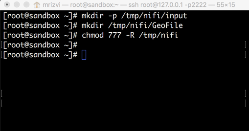

Download files using wget utility:

~~~
cd /tmp/nifi/input
wget https://raw.githubusercontent.com/hortonworks/data-tutorials/cf9f67737c3f1677b595673fc685670b44d9890f/tutorials/hdp/hdp-2.5/refine-and-visualize-server-log-data/assets/logsample.txt
~~~

~~~
cd /tmp/nifi/GeoFile
wget https://raw.githubusercontent.com/hortonworks/data-tutorials/cf9f67737c3f1677b595673fc685670b44d9890f/tutorials/hdp/hdp-2.5/refine-and-visualize-server-log-data/assets/GeoLite2-City.mmdb
~~~

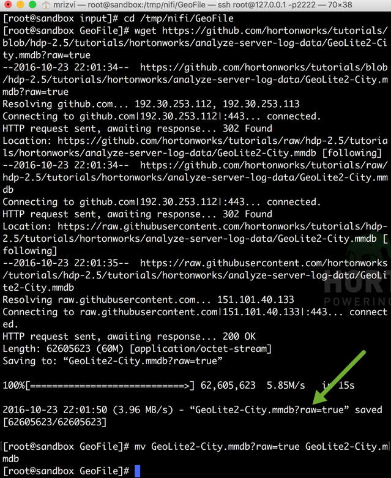

## Step 3 - Import the Workflow 

We’re going to import a data flow from a template which you can download [WebServerLogs.xml](https://raw.githubusercontent.com/hortonworks/data-tutorials/cf9f67737c3f1677b595673fc685670b44d9890f/tutorials/hdp/hdp-2.5/refine-and-visualize-server-log-data/assets/WebServerLogs.xml).
Use the NiFi interface to upload the flow, and then drag it onto your workspace.

Once you’ve uploaded the template into NiFi you can instantiate it by dragging the template icon  onto the screen. It will ask you to select your template’s name and the flow will appear as in the image below.

Let’s us give some time to explain the role of each processor here:

1\. **GetFile Processor** - It creates Flow Files from files in a directory. We specify the input path of the file here.

2\. **SplitText Processor** - It splits a text file into smaller text files limited by maximum number of lines or total size of fragment. In our case, the value of line split count  is 1, that means each split file will have 1 record.

3\. **ExtractText Processor** - It evaluates the regular expression to extract the content of a Flow File and the result will be placed in the attribute which can be utilized in other processors of the workflow. If there is no match it will be sent to the 'unmatched' result which is a simple way of filtering out different logs. The regular expressions that are used to extract different attributes are as follows:

* IP - (\b(?:\d{1,3}\.){3}\d{1,3}\b) - Captures everything which has 4 numbers separated by dots.
	Example - 130.104.51.7

* Time - \[(.*?)\]  - Captures everything between double square brackets.
	Example - 01/Aug/1995:02:56:28 -0400

* Request_Type -  \"(.*?)\" - Captures everything between double quotes
	Example - GET /images/NASA-logosmall.gif HTTP/1.0

* Response_Code - HTTP\/\d\.\d" (\d{3}) - Captures the next 3 digit number after it finds HTTP 1.0 in the text of Flow File.
	Example - 200

4\. **RouteOnAttribute Processor** - It routes flow based on their attributes. Routing flow fioles if IP attribute starts with 1 or 2, Time and Request_Type are not empty.

5\. **GeoEnrichIP Processor** - This processor takes the IP attribute generated in the previous processor and compares it to a geo-database('mmdb'). It adds the Geo information like Latitude, Longitude, City, Country and Isocode to the Flow Files attributes. It generates these attributes and give them names like IP.geo.latitude, IP.ge.longitude, IP.geo.city, IP.geo.country and IP.geo.isocode.

6\. **RouteOnAttribute Processor** - There might be a possibility that GeoEnrichIP Processor is not able to find all geo details for an IP so this processor checks whether the IP.geo.city exists or not. It routes only those Flow Files further which has values for city attribute.

7\. **ReplaceText Processor** - It updates the content of Flow File by evaluating a regular expression against it and replacing the section of the content that matches the Regular Expression with some alternate value. In this case, we are replacing the content with his format -

${IP}|${Time}|${Request_Type}|${Response_Code}|${IP.geo.city}|${IP.geo.country}|${IP.geo.country.isocode}|${IP.geo.latitude}|${IP.geo.longitude}
$ character extracts the value of the attribute and | is being used as a delimiter between these attributes.

8\. **MergeContent Processor** - It merges a group of Flow Files into a single Flow Files. The minimum number of entries to make a single file is 20 in our case. That means, the processor is merging 20 Flow Files into 1.

9\. **UpdateAttribute Processor** - It update the Flow Files’ attributes by using the Attribute Expression Language of NiFi. We are giving each FlowFile a unique name using the timestamp. The expression used here is

logsample-${now():format("HHmmssSSS")}-.txt

10\. **PutHDFS Processor** - It writes Flow File to the HDFS directory. The output HDFS directory used here is **/tmp/nifioutput**.

## Step 4 : Run the Workflow 

Make sure you have removed Lzo and Lzop Codec from the list of compression codecs. Refer [this](https://hortonworks.com/hadoop-tutorial/how-to-refine-and-visualize-server-log-data/#generate-server-log-ata) step to do that.
Now click `SHIFT` and select the entire workflow, then locate `Start` button in the Operate box and click it.

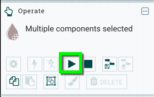

You can see your workflow running.

Keep the workflow running for next **10 minutes** so that we have enough data to ingest into Spark.

## Step 5 : Verify NiFi Output Data in HDFS 

Next, logout from **raj_ops** user from Ambari and re-login to Ambari using user credentials **maria_dev/maria_dev**. Click on 9 square menu and select `Files View`:

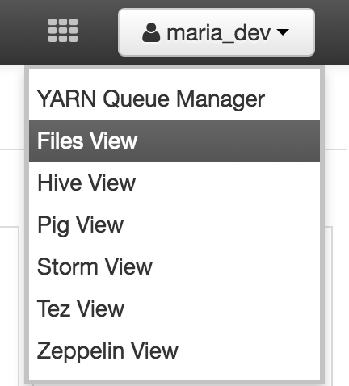

After just 30 seconds, you will start seeing the output files coming to **/tmp/nifioutput** directory, so navigate to that directory. Click on one of the row and then `Open`.

You would see some content like the one given below. You can easily locate its attributes - IP address, Time, Request Type, Response Code, City, Country, Isocode, Latitude and Longitude.

Wait for 10 minutes to store more files like this in the folder. In the meantime, you can re-open Ambari in a new tab and start Spark.

## Step 6 - Turn OFF Maintenance Mode and Open Zeppelin UI 

We will be using Spark version 1.6.2 in this tutorial. Go to **Ambari dashboard**, and follow the steps as mentioned below:

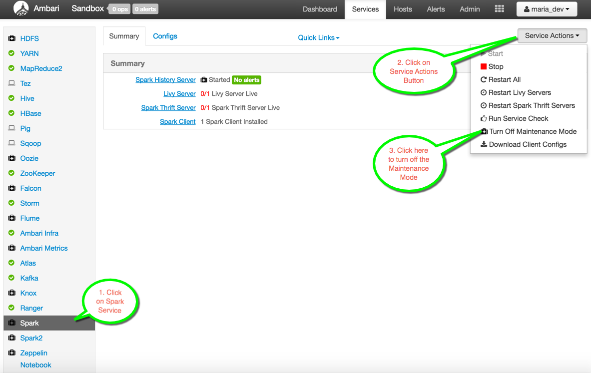

Next, click on `Zeppelin Notebook` and then `Quick Links -> Zeppelin UI` to open the Zeppelin UI on the browser:

You will see a Zeppelin UI with a bunch of already loaded notebooks. Click on `Create New Note` and give the name **Web Server Log Analysis using Spark**:

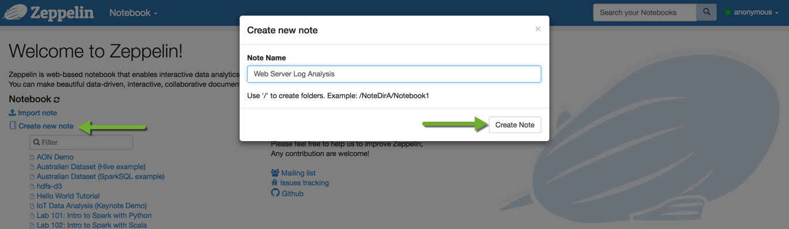

Before moving ahead, **do not forget** to stop the workflow in Nifi. Go back to Nifi UI, select all components and click `Stop` button in the Operate box:

## Step 7 - Logs Analysis using Spark and Zeppelin 

## 7.1 - Loading External Library

As you explore Zeppelin you will probably want to use one or more external libraries.
We are going to use the %dep interpreter to import the library. Copy paste the following set of lines in your Zeppelin notebook:

~~~
%dep
z.reset()
z.load("com.databricks:spark-csv_2.11:1.4.0")
~~~

Then click on `Play` button next to Ready. Alternatively, you can press `Shift+Enter`.

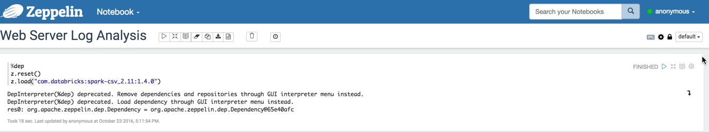

### 7.2 Load the DataFrame from HDFS directory

Next, let us create a dataframe in Spark using PySpark. Using **sqlContext.read.format()** here to load the dataframe from the HDFS directory **/tmp/nifioutput**. show() function shows the content of the dataframe,

~~~
%pyspark
from pyspark.sql.types import StructType, StructField, DoubleType, StringType
schema = StructType([
# Represents a field in a StructType
  StructField("IP",             StringType()),
  StructField("Time",           StringType()),
  StructField("Request_Type",   StringType()),
  StructField("Response_Code",  StringType()),
  StructField("City",           StringType()),
  StructField("Country",        StringType()),
  StructField("Isocode",        StringType()),
  StructField("Latitude",       DoubleType()),
  StructField("Longitude",      DoubleType())
])

logs_df = sqlContext.read\
                    .format("com.databricks.spark.csv")\
                    .schema(schema)\
                    .option("header", "false")\
                    .option("delimiter", "|")\
                    .load("/tmp/nifioutput")
logs_df.show(truncate=False)
~~~

In my case, there are 700 rows in the dataframe. Your count might differ.

### 7.3 Parse the Timestamp

~~~
%pyspark

from pyspark.sql.functions import udf

months = {
  'Jan': 1, 'Feb': 2, 'Mar':3, 'Apr':4, 'May':5, 'Jun':6, 'Jul':7, 'Aug':8,  'Sep': 9, 'Oct':10, 'Nov': 11, 'Dec': 12
}

def parse_timestamp(time):
    """ This function takes a Time string parameter of logs_df dataframe
    Returns a string suitable for passing to CAST('timestamp') in the format YYYY-MM-DD hh:mm:ss
    """
    return "{0:04d}-{1:02d}-{2:02d} {3:02d}:{4:02d}:{5:02d}".format(
      int(time[7:11]),
      months[time[3:6]],
      int(time[0:2]),
      int(time[12:14]),
      int(time[15:17]),
      int(time[18:20])
    )

udf_parse_timestamp = udf(parse_timestamp)

parsed_df = logs_df.select('*',
                udf_parse_timestamp(logs_df['Time'])
                .cast('timestamp')
                .alias('Timestamp')).drop('Time')   # Assigning the Timestamp name to the new column and dropping the old Time column
parsed_df.cache()                                   # Stores the dataframe in cache for the future use
parsed_df.show()                                    # Displays the results
~~~

### 7.4 Data Cleaning in Request_Type Column

Let us try to do some data cleaning in **Request_Type** column of the parsed_df dataframe. Run the following line to find out how Request_type looks like right now:

~~~
%pyspark
parsed_df.select('Request_type').show(truncate=False)
~~~

We will remove GET from the beginning and HTTP/1.0 at the end. Using **regexp_extract** to extract these two groups identified by a java regex, from the Request_Type string column.

~~~
%pyspark
from pyspark.sql.functions import split, regexp_extract
path_df = parsed_df.select('*',regexp_extract('Request_Type', r'^.*\w+\s+([^\s]+)\s+HTTP.*', 1)
                   .alias('Request_Path')).drop('Request_Type')
path_df.cache()                                                        # Cache the dataframe
path_df.show(truncate=False)                                           # Displays the results
~~~

### 7.5 Analysis of Most Frequent Hosts

Next, we want to know which hosts has hit the server most times

~~~
%pyspark
most_frequent_hosts = parsed_df.groupBy("IP").count()           # Groups the dataframe by IP column and then counting
most_frequent_hosts.show()		                                # Displays the results
most_frequent_hosts.registerTempTable("most_frequent_hosts")    # Registering most_frequest_hosts variable as a temporary table
~~~

Let us view the data from the temporary table using the %sql interpreter:

~~~
%sql
SELECT * FROM most_frequent_hosts ORDER BY count DESC LIMIT 20
~~~

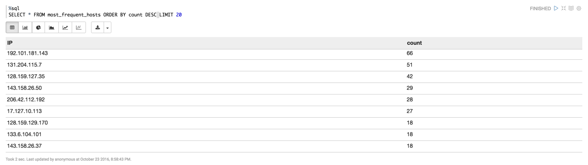

You can also view this data in the form of charts, click the button which shows pie chart. You will see something like this:

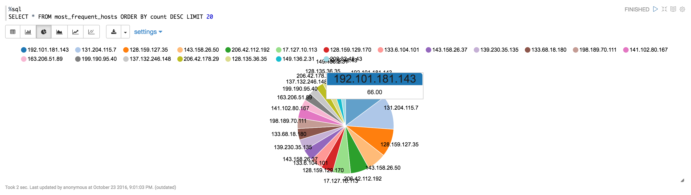

You can hover in the circle to find out actual count of each hosts. Zeppelin provides other charts like bar chart, area chart, scatter chart, etc. as well.

### 7.6 Analysis of Response Code

Next, we want to know which response code has occurred how many times in the dataframe. Further, we also store the result in the temporary table called **status_count**.

~~~
%pyspark
status_count = path_df.groupBy('Response_Code').count()      # Groups the dataframe by Response_Code column and then counting
status_count.show()                                          # Displays the results
status_count.registerTempTable("status_count")               # Registering status_count variable as a temporary table
~~~

Let us view the data from the temporary table:

~~~
%sql
SELECT * FROM status_count ORDER BY Response_Code
~~~

Click the bar chart button:

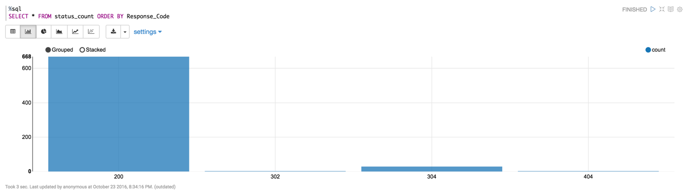

Next, let us analyze only those records where the Response_Code is 200.

~~~
%pyspark
success_logs_df = parsed_df.select('*').filter(path_df['Response_Code'] == 200)       # Creating dataframe where Response Code is 200
success_logs_df.cache()                                                               # Cache the dataframe
success_logs_df.show()                                                                # Displays the results
~~~

So now we have all the records where the Response_Code is 200. We will count the number of successful hits per hour.

~~~
%pyspark
from pyspark.sql.functions import hour
success_logs_by_hours_df = success_logs_df.select(hour('Timestamp').alias('Hour')).groupBy('Hour').count()      # Extracting the Hour
success_logs_by_hours_df.show()                                                                                 # Displays the results
success_logs_by_hours_df.registerTempTable("success_logs_by_hours_df")
~~~

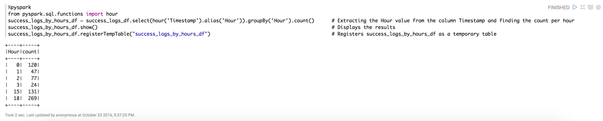

Let us view the same data in the form of table

~~~
%sql
SELECT * FROM success_logs_by_hours_df ORDER BY Hour
~~~

### 7.7 Data Cleansing in Request_Path

Next, let us find out the extension of resource that was requested by the server or given to the server. We have to extract the **extension** from the Request_Path column. As earlier, we will make use of regular expression:

~~~
%pyspark
from pyspark.sql.functions import split, regexp_extract
extension_df = path_df.select(regexp_extract('Request_Path','(\\.[^.]+)$',1).alias('Extension'))
extension_df.show(truncate=False)
~~~

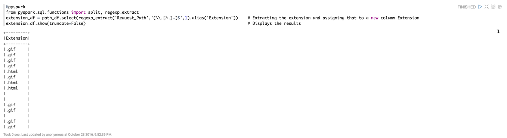

As you can see here, there is a lot of data cleansing required. Let's start with removing the dot from the extension format first. We will use **regexp_replace** to do this operation. It will look for dot character(.) in the records and replace it with the blank character(‘’)

~~~
%pyspark
from pyspark.sql.functions import split, regexp_replace
extension_df = extension_df.select(regexp_replace('Extension','\.','').alias('Extension'))  # Replace the dot character with the blank character
extension_df.show(truncate=False)                                                           # Displays the results
~~~

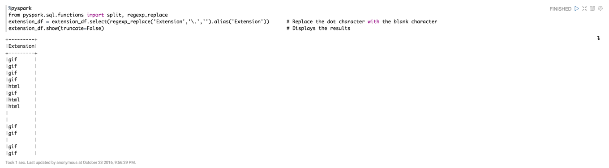

There is still some cleansing required. As you can observe that there are some blank rows, we are going to replace those blank rows with the value **None**.

~~~
%pyspark
from pyspark.sql.functions import *
extension_df = extension_df.replace('','None','Extension').alias('Extension')   # Replaces the blank value with the value 'None' in Extension
extension_df.cache()
extension_df.show(truncate=False)                                               # Shows the results
~~~

### 7.8 Analysis of Type of Extensions

Now since we have the type of extensions available with us, we can find out the number of different extensions available in our data set. We will use the same approach of grouping the column and then counting the records in each group

~~~
%pyspark
from pyspark.sql.functions import *
extension_df_count = extension_df.groupBy('Extension').count()                  # Groups the dataframe by Extension and then count the rows
extension_df_count.show()                                                       # Displays the results
extension_df_count.registerTempTable('extension_df_count')                      # Registers the temporary table
~~~

~~~
%sql
SELECT * FROM extension_df_count ORDER BY count DESC
~~~

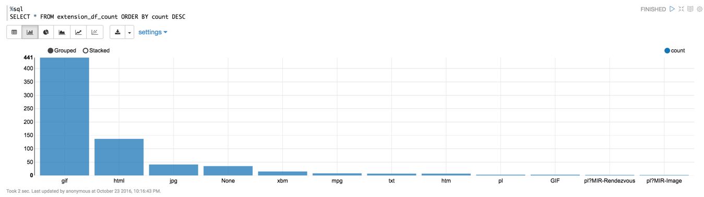

> EXERCISE FOR YOU - If you see clearly, the gif extension is in both uppercase and lowercase. Try to replace either one of them to make the data more accurate.

### 7.9 Analysis of Network Traffic per Location

Let us create a temporary table for the dataframe path_df so that we can visualize from which location, the hits are coming from.

~~~
%pyspark
path_df.registerTempTable("path_df")
~~~

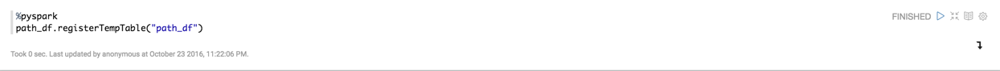

Next, create a **Hive table** from this dataframe so that we can use it for the visualization using external tools like Tableau, Microsoft Excel, etc

Run the following query in the new paragraph of the notebook:

~~~
%sql
CREATE TABLE path_df AS SELECT * FROM path_df
~~~

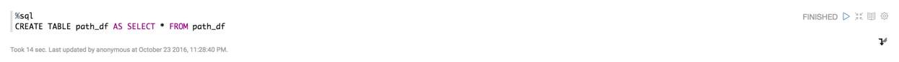

> EXERCISE FOR YOU - Verify whether this table is created in Hive or not.

Next, run the query given below to analyze the network traffic per each country:

~~~
%sql
SELECT country,count(country) AS count from path_df GROUP BY country ORDER BY count
~~~

We can also find out the network traffic for cities within just United States, run the following and switch over to Pie Chart:

~~~
%sql
SELECT city, count(city) AS count from path_df where country='United States' GROUP BY city ORDER BY count
~~~

## Summary 

In this tutorial, we learned how to use Apache Nifi for data preparation and how to convert the raw server logs to the readable form. Next we learned about how Apache Spark can be used for further cleansing of data. We also used Apache Zeppelin interpreters which allows any language/data-processing-backend to be plugged into it. Currently Apache Zeppelin supports many interpreters such as Apache Spark, Python, JDBC, Markdown and Shell. We used pyspark and sql in this tutorial.

## Further Reading 

1. [Regular Expression Wiki](https://en.wikipedia.org/wiki/Regular_expression)
2. [Apache Nifi User Guide](https://docs.hortonworks.com/HDPDocuments/HDF2/HDF-2.0.0/bk_user-guide/content/index.html)
3. [PySpark SQL Module](https://spark.apache.org/docs/1.6.2/api/python/pyspark.sql.html)
4. [Nifi Server Logs Geo-Enrichment and Routing](https://community.hortonworks.com/articles/56559/nifi-log-geoenrichment-and-routing.html)
5. [Spark RDDs vs Dataframes vs SparkSQL](https://community.hortonworks.com/articles/42027/rdd-vs-dataframe-vs-sparksql.html)
6. [Hive on Tez vs PySpark for Web Logs Parsing](https://community.hortonworks.com/articles/52866/hive-on-tez-vs-pyspark-for-weblogs-parsing.html)
