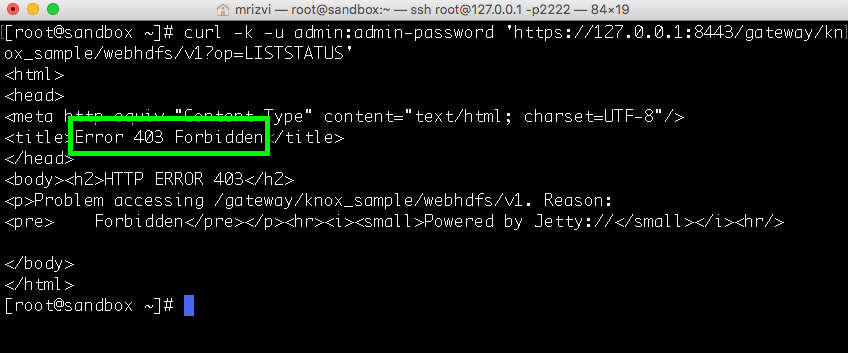
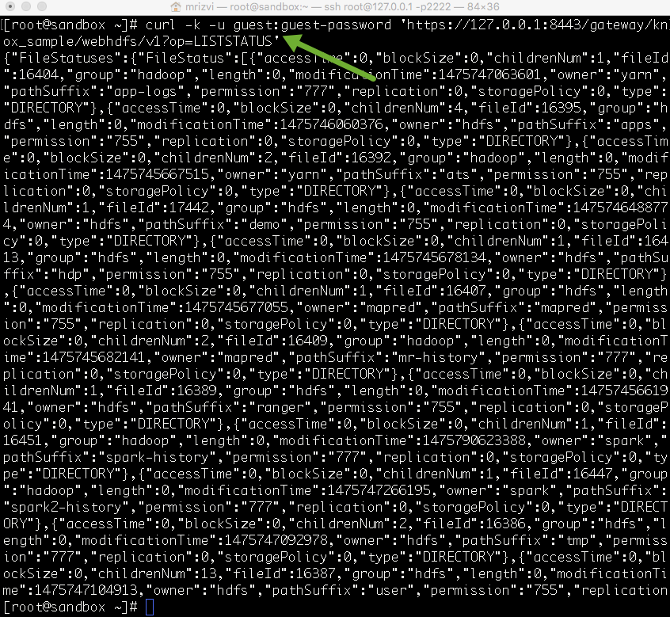
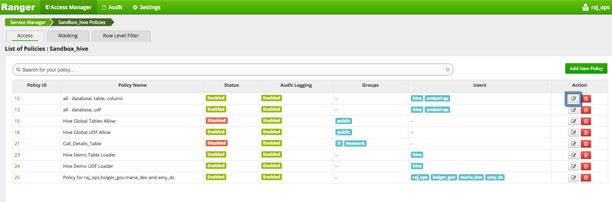
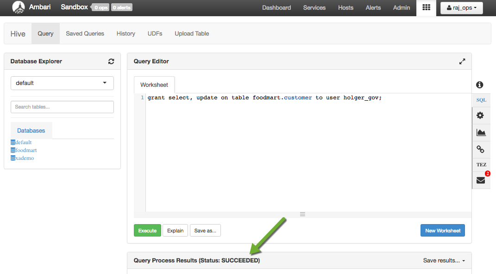
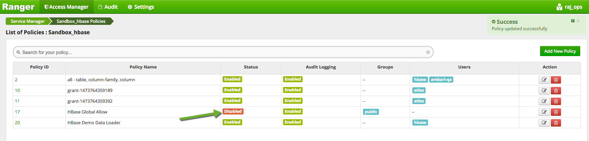
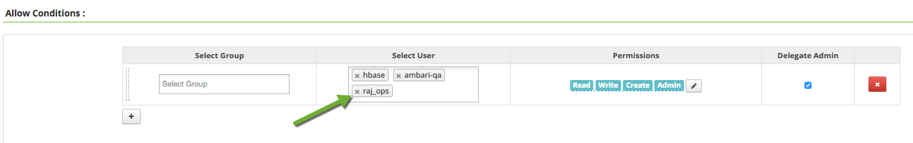
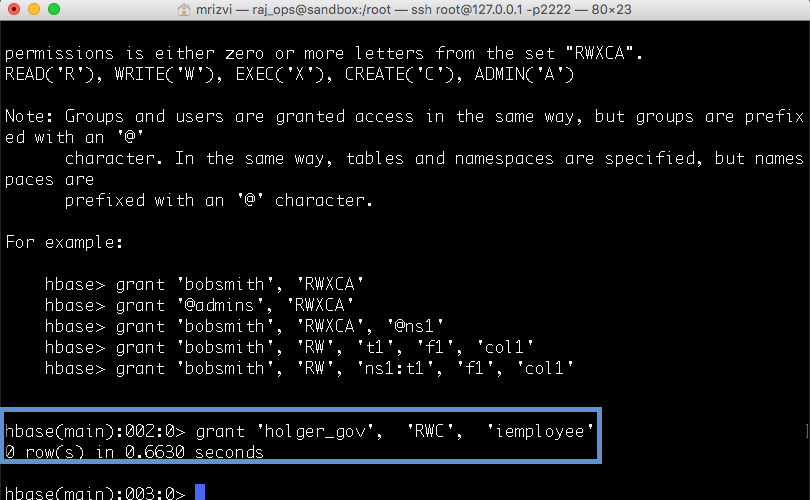
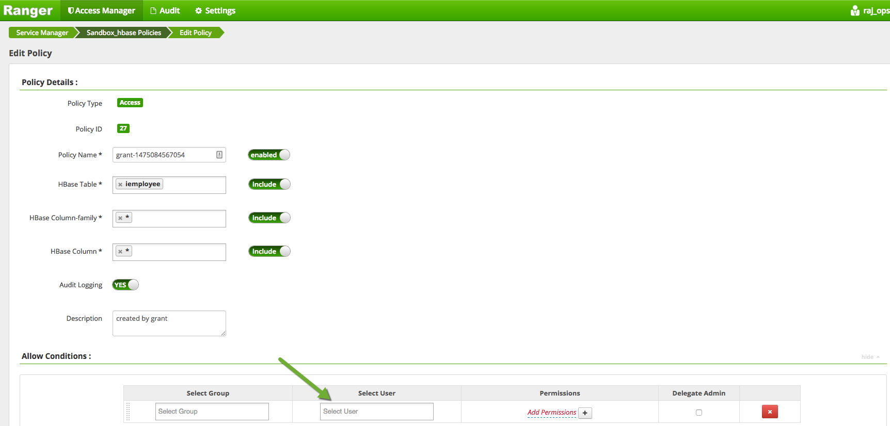
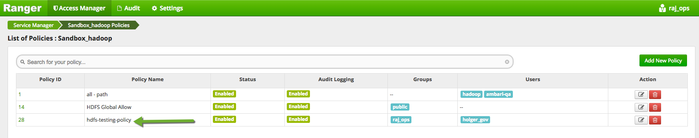
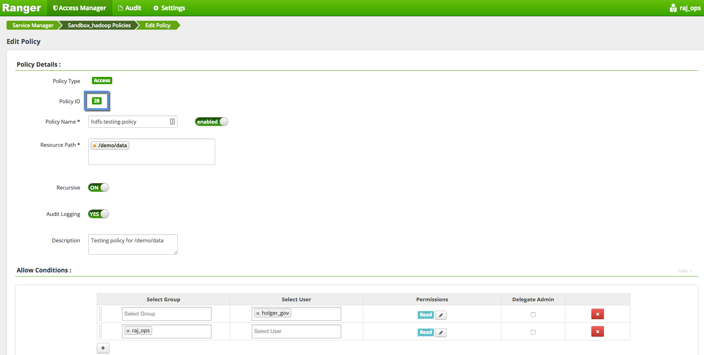

# Securing HDFS, Hive and HBase with Knox and Ranger

## Introduction

**Apache Ranger** delivers a comprehensive approach to security for a Hadoop cluster. It provides a central security policy administration across the core enterprise security requirements of authorization, accounting and data protection.
Apache Ranger already extends baseline features for coordinated enforcement across Hadoop workloads from batch, interactive SQL and real–time in Hadoop.
In this tutorial, we cover using **Apache Knox** and **Apache Ranger** for HDP 2.5 to secure your Hadoop environment. We will walkthrough the following topics:

1. Support for Knox authorization and auditing
2. Command line policies in Hive
3. Command line policies in HBase
4. REST APIs for policy manager

## Prerequisites

-   Download [Hortonworks Sandbox](https://hortonworks.com/products/hortonworks-sandbox/#install)
-   Complete the [Learning the Ropes of the HDP Sandbox](https://hortonworks.com/hadoop-tutorial/learning-the-ropes-of-the-hortonworks-sandbox/) tutorial.

## Outline

-   [Concepts](#concepts)
-   [1: Start Knox, Ambari Infra and Demo LDAP Services](#start-knox-infra)
-   [2: Knox Access Scenarios](#knox-access-scenarios)
-   [3: Hive Grant/Revoke Permission Scenarios](#hive-grant-revoke)
-   [4: HBase Grant/Revoke Permission Scenarios](#hbase-grant-revoke)
-   [5: REST APIs for Policy Administration](#rest-apis)
-   [Summary](#summary)

## Concepts

Ranger is a great tool to secure your data in Hadoop and HDP. It offers a simple centralized way to manage users’ access to data in your cluster. Cluster administrators can easily manage policies for access to files folder, databases, tables, and more! In this tutorial we’ll explore how we can use Ranger to manage access to these types of resources in the Hortonworks Sandbox
In this tutorial we will also utilize Apache Knox which is a REST API gateway for Hadoop services like HDFS and Hive! It allows a user to plug-and-play with already existing LDAP and Microsoft AD infrastructure to manage access to Hadoop services. Not to mention it supports Kerberized clusters as well as utilizes HTTPS protocol for its communications.

## Procedure

First you’re going to need to log in to your Sandbox via SSH. Run the following command:

~~~
ssh root@127.0.0.1 -p 2222
~~~

The first time password to log in is: **hadoop**

## 1: Start Knox, Ambari Infra and Demo LDAP Services 

Open up the **Ambari** user interface by using the URL http://sandbox.hortonworks.com:8080.
Using Virtualbox it might look like http://127.0.0.1:8080. If you’re using Azure make sure to replace 127.0.0.1 with you host machine’s IP address.

Login to Ambari using the following:

Username - **raj_ops**
Password - **raj_ops**

After logging in to Ambari, you will see a list of Services.

Now Select `Knox` from the list of Services on the left-hand side of the page. Then click on `Service Actions` from the top right hand side of the page, and then click on `Start`.

Check the box for Maintenance Mode.

Similarly start **Ambari Infra** to audit all events happening through Ranger. Your Ambari dashboard should look like this:

Next, then go back to the `Service Actions` button on the Knox service and click on `Start Demo LDAP`. This LDAP server is when authenticating users against Knox in the Sandbox because there is no other LDAP server running on the Sandbox.

## 2: Knox Access Scenarios 

Check if Ranger Admin console is running, at [http://127.0.0.1:6080/](http://127.0.0.1:6080/) from your host machine. The username is **raj_ops** and the password is **raj_ops**.

Click on `Sandbox_knox` link under Knox section in the main screen of Ranger Administration Portal

You can review all policies details by a clicking on the policy name.

To start testing Knox policies, we would need to turn off **Global Knox Allow** and **all- topology, service** policies. Edit the global policy using the button on the right hand side and use the first slider to **disable** the policy.

Then, click `Save`. Do the same for another policy - `all topology, service`
Next, locate `Sandbox for Guest` policy on the Ranger Admin console and use the slider to enable the policy.  Click `Save`.

From your terminal, run the following set of commands to access **WebHDFS**:

~~~
touch /usr/hdp/current/knox-server/conf/topologies/knox_sample.xml
curl -k -u admin:admin-password 'https://127.0.0.1:8443/gateway/knox_sample/webhdfs/v1?op=LISTSTATUS'
~~~

Go to `Ranger Policy Manager tool → Audit screen`. Search it via `Service Type - Knox` and check the knox access (denied) being audited.

Now let us try the same CURL command using **guest** user credentials from the terminal.

~~~
curl -k -u guest:guest-password 'https://127.0.0.1:8443/gateway/knox_sample/webhdfs/v1?op=LISTSTATUS'
~~~

The result which should return is a set of JSON data from WebHDFS which lists the status of the files in the root of HDFS:

~~~
{"FileStatuses":{"FileStatus":[{"accessTime":0,"blockSize":0,"childrenNum":1,"fileId":16404,"group":"hadoop","length":0,"modificationTime":1475747063601,"owner":"yarn","pathSuffix":"app-logs","permission":"777","replication":0,"storagePolicy":0,"type":"DIRECTORY"},{"accessTime":0,"blockSize":0,"childrenNum":4,"fileId":16395,"group":"hdfs","length":0,"modificationTime":1475746060376,"owner":"hdfs","pathSuffix":"apps","permission":"755","replication":0,"storagePolicy":0,"type":"DIRECTORY"},{"accessTime":0,"blockSize":0,"childrenNum":2,"fileId":16392,"group":"hadoop","length":0,"modificationTime":1475745667515,"owner":"yarn","pathSuffix":"ats","permission":"755","replication":0,"storagePolicy":0,"type":"DIRECTORY"},{"accessTime":0,"blockSize":0,"childrenNum":1,"fileId":17442,"group":"hdfs","length":0,"modificationTime":1475746488774,"owner":"hdfs","pathSuffix":"demo","permission":"755","replication":0,"storagePolicy":0,"type":"DIRECTORY"},{"accessTime":0,"blockSize":0,"childrenNum":1,"fileId":16413,"group":"hdfs","length":0,"modificationTime":1475745678134,"owner":"hdfs","pathSuffix":"hdp","permission":"755","replication":0,"storagePolicy":0,"type":"DIRECTORY"},{"accessTime":0,"blockSize":0,"childrenNum":1,"fileId":16407,"group":"hdfs","length":0,"modificationTime":1475745677055,"owner":"mapred","pathSuffix":"mapred","permission":"755","replication":0,"storagePolicy":0,"type":"DIRECTORY"},{"accessTime":0,"blockSize":0,"childrenNum":2,"fileId":16409,"group":"hadoop","length":0,"modificationTime":1475745682141,"owner":"mapred","pathSuffix":"mr-history","permission":"777","replication":0,"storagePolicy":0,"type":"DIRECTORY"},{"accessTime":0,"blockSize":0,"childrenNum":1,"fileId":16389,"group":"hdfs","length":0,"modificationTime":1475745661941,"owner":"hdfs","pathSuffix":"ranger","permission":"755","replication":0,"storagePolicy":0,"type":"DIRECTORY"},{"accessTime":0,"blockSize":0,"childrenNum":1,"fileId":16451,"group":"hadoop","length":0,"modificationTime":1475790623388,"owner":"spark","pathSuffix":"spark-history","permission":"777","replication":0,"storagePolicy":0,"type":"DIRECTORY"},{"accessTime":0,"blockSize":0,"childrenNum":1,"fileId":16447,"group":"hadoop","length":0,"modificationTime":1475747266195,"owner":"spark","pathSuffix":"spark2-history","permission":"777","replication":0,"storagePolicy":0,"type":"DIRECTORY"},{"accessTime":0,"blockSize":0,"childrenNum":2,"fileId":16386,"group":"hdfs","length":0,"modificationTime":1475747092978,"owner":"hdfs","pathSuffix":"tmp","permission":"777","replication":0,"storagePolicy":0,"type":"DIRECTORY"},{"accessTime":0,"blockSize":0,"childrenNum":13,"fileId":16387,"group":"hdfs","length":0,"modificationTime":1475747104913,"owner":"hdfs","pathSuffix":"user","permission":"755","replication":0,"storagePolicy":0,"type":"DIRECTORY"}]}}
~~~

We can check the auditing in the `Ranger Policy Manager → Audit screen`. Search it via `Service Type - Knox`.

Ranger plugin for Knox intercepts any request made to Knox and enforces policies which are retrieved from the Ranger Administration Portal.
You can configure the Knox policies in Ranger to restrict to a specific service (WebHDFS, WebHCAT etc) and to a specific user or a group and you can even bind user/group to an ip address.

## 3: Hive Grant/Revoke Permission Scenarios 

Ranger supports the import of **grant/revoke** policies set through command line for Hive. Ranger can store these policies centrally along with policies created in the administration portal and enforce it in Hive using its plugin. Go to `Access Manager=>Resource Based Policies`. Click on `Sandbox_hive`.

You will see all policies in the Hive repository:

Now go inside to `Hive Global Tables Allow` policy and toggle the slider to **disable** it. Click `Save`.

Go back to **Ambari**, click on 9 square menu icon at the top left and then click on `Hive View`:

Type the following query to grant the select and update access to the user holger_gov on  the customer table of foodmart database.

~~~
grant select, update on table foodmart.customer to user holger_gov;
~~~

Click on Green `Execute` button to run the query.
If you correctly disabled the Hive policy which allowed this command you should see the following error:

If you don’t see the error, make sure you’ve disabled the correct Hive policies.
Let’s check the audit log in the `Ranger Administration Portal -> Audit -> Access`

You can see that access was denied for an admin operation for user **raj_ops**.
We can update a policy in Ranger for user raj_ops to be an admin. Go back to `Access Manager -> Resource Based Policies -> Sandbox_hive`. Click on the box next to the policy all database, table, column.

Scroll down and add raj_ops to the list of users in the Allow Conditions. Do not change anything else.

Click `Save`.

Once the policy is saved, go back to Hive view and run the same query again:
~~~
grant select, update on table foodmart.customer to user holger_gov;
~~~

If the command goes through successfully, you will see the policy created/updated in `Ranger Access Manager -> Resource Based Policies -> Sandbox_hive`. It checks if there is an existing relevant policy to update, else it creates a new one.

**What happened here?**

Ranger plugin intercepts GRANT/REVOKE commands in Hive and creates corresponding policies in Admin portal. The plugin then uses these policies for enforcing Hive authorization (Hiveserver2).
Users can run further GRANT commands to update permissions and REVOKE commands to take away permissions.

## 4: HBase Grant/Revoke Permission Scenarios 

Ranger can support import of grant/revoke policies set through command line in HBase. Similar to Hive, Ranger can store these policies as part of the Policy Manager and enforce it in Hbase using its plugin. Go back to Ambari with user credentials **raj_ops/raj_ops**.

If it is switched off go to `Service Actions` button on top right and Start HBase:

Check the box for Maintenance Mode.

Next, click `Confirm Start`. Wait for 30 seconds and your HBase will start running.
As a first step, let us try running a Grant operation using user raj_ops.

Go to `Access Manager -> Resource Based Policies => Sandbox_hbase` to **disable** the public access policy **HBase Global Allow**.

Login into HBase shell as **raj_ops** user

~~~
su raj_ops
hbase shell
~~~

Run a grant command to give “Read”, “Write”, “Create” access to user **holger_gov** in table **iemployee**.

~~~
grant 'holger_gov',  'RWC',  'iemployee'
~~~

You should get a Access Denied as below:

Let us go back to Ranger to give **raj_ops** an admin access so that it can grant permission for **holger_gov**. Click on the box next to the policy `all-table, column family, column`.

Scroll down below and add **raj_ops** to the list of users in Allow Conditions.

Save the policy and rerun the HBase command again in the shell:

~~~
grant 'holger_gov', 'RWC', 'iemployee'
~~~

Check HBase policies in the Ranger Policy Administration portal. You can see a new policy created in **Sandbox_hbase** repository.

Let us also revoke the permission this time. You can revoke the same permissions and the permissions will be removed from Ranger admin. Try this in the same HBase shell

~~~
revoke 'holger_gov', 'iemployee'
~~~

You can check the existing policy and see if it has been changed. Click on the box next to it. You will notice that there is no holger_gov user present for this policy:

**What happened here?**

Ranger plugin intercepts GRANT/REVOKE commands in Hbase and creates corresponding policies in the Admin portal. The plugin then uses these policies for enforcing authorization.
Users can run further GRANT commands to update permissions and REVOKE commands to take away permissions.

## 5: REST APIs for Policy Administration 

Ranger policies administration can be managed through REST APIs. Users can use the APIs to create or update policies, instead of going into the Administration Portal.

### Running REST APIs from Command line

From your local command line shell, run this CURL command. This API will create a policy with the name **hdfs-testing-policy** within the HDFS repository **Sandbox_hadoop**. Exit the hbase shell by typing `quit` and then run the following command:

~~~
curl -i --header "Accept:application/json" -H "Content-Type: application/json" -u admin:admin -X POST http://127.0.0.1:6080/service/public/api/policy -d '{ "policyName":"hdfs-testing-policy","resourceName":"/demo/data","description":"Testing policy for /demo/data","repositoryName":"Sandbox_hadoop","repositoryType":"HDFS","permMapList":[{"userList":["holger_gov"],"permList":["Read"]},{"groupList":["raj_ops"],"permList":["Read"]}],"isEnabled":true,"isRecursive":true,"isAuditEnabled":true,"version":"0.1.0","replacePerm":false}'
~~~

Look closely to above REST API call, you can check all the attributes that are required to create the HDFS policy.

~~~
policyName - hdfs-testing-policy
resourceName - /demo/data
Description - Testing policy for /demo/data
repositoryName - Sandbox_hadoop
userList - holger_gov and its permList - Read
groupList - raj_ops and its permList - Read
isEnabled - true
isAuditEnabled - true
~~~

Now let us check in Ranger whether this policy got added or not. Go to `Access Manager -> Resource Based Policies -> Sandbox_hadoop` and see the new policy named **hdfs-testing-policy**

Click on the policy and check the permissions that has been created

We can use the policy id to retrieve or change the policy. In this case, it is **28**.
Run the below CURL command to get policy details using API:

~~~
curl -i -u admin:admin -X GET http://127.0.0.1:6080/service/public/api/policy/28
~~~

**What happened here?**

We created a policy and retrieved policy details using REST APIs. Users can now manage their policies using API tools or applications integrated with the Ranger REST APIs.
Hopefully, through this whirlwind tour of Ranger, you were introduced to the simplicity and power of Ranger for security administration.

## Summary 

In this tutorial, we got to know the basics about how Knox and Ranger enforce access restrictions on Hive, HBase and HDFS data.
