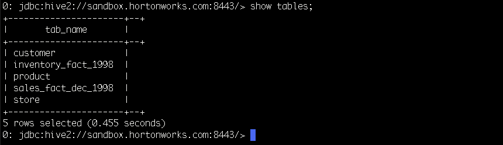

# Securing JDBC and ODBC Clients' Access to HiveServer2 using Apache Knox

## Introduction

[HDP 2.5](https://hortonworks.com/products/data-center/hdp/) ships with Apache Knox 0.6.0. This release of Apache Knox supports WebHDFS, WebHCAT, Oozie, Hive, and HBase REST APIs.

Apache Hive is a popular component used for SQL access to Hadoop, and the Hive Server 2 with Thrift supports JDBC access over HTTP. The following steps show the configuration to enable a JDBC client to talk to Hive Server 2 via Knox **(Beeline > JDBC over HTTPS > Knox > HTTP > Hive Server2)**. The picture describes the scenario that the tutorial covers.

This tutorial focuses on Beeline as the JDBC client; however, a screenshot of Simba ODBC Client configuration for ODBC access is attached at the bottom of the tutorial.

## Prerequisites

- [Download Hortonworks 2.5 Sandbox](https://hortonworks.com/downloads/#sandbox).
- Complete the [Learning the Ropes of the Hortonworks Sandbox tutorial,](https://hortonworks.com/hadoop-tutorial/learning-the-ropes-of-the-hortonworks-sandbox/) you will need it for logging into Ambari.

## Outline

- [1. Start Knox](#start-knox)
- [2. Change Hive Config](#change-hive-config)
- [3. Run Beeline Client](#run-beeline)
- [4. Connect to Hive Server 2](#connect-hive)
- [5. Issue the Query](#issue-query)
- [6. Simba ODBC Client Configuration](#simba-odbc)
- [Summary](#summary)

## 1. Start Knox 

Open up the Ambari user interface by using the URL http://sandbox.hortonworks.com:8080.
Using Virtualbox it might look like http://127.0.0.1:8080. If you’re using Azure make sure to replace 127.0.0.1 with you host machine’s IP address.

Login to Ambari using the following:
Username - **raj_ops**
Password - **raj_ops**

After logging in to Ambari, you will see a list of Services.

Now Select `Knox` from the list of Services on the left-hand side of the page.
Then click on `Service Actions` from the top right hand side of the page click on `Start`.

Check the box for `Maintenance Mode` and click `Confirm Start`.

## 2. Change Hive Config 

Using Ambari, navigate to `Hive > Config`. Type `hive.server2.transport.mode` in the Filter box. Change its value from `binary` to `http`.

Save these Hive settings and restart Hive with Ambari.

## 3. Run Beeline Client 

First you’re going to need to login to your Sandbox via SSH.
If you’re using Virtualbox you can log in with the command:

~~~
ssh root@127.0.0.1 -p 2222
~~~

The first time password to log in is: **hadoop**

In the example here, I am connecting to Knox on [HDP 2.5 Sandbox](https://hortonworks.com/products/sandbox/) which uses a self-signed certificate for SSL. Use the connection string specified to enter into beeline shell.

~~~
beeline
~~~

## 4. Connect to Hive Server 2 

Type the following command in the beeline shell:

~~~
!connect jdbc:hive2://sandbox.hortonworks.com:8443/foodmart;ssl=true;sslTrustStore=/var/lib/knox/data-2.5.0.0-1245/security/keystores/gateway.jks;trustStorePassword=knox?hive.server2.transport.mode=http;hive.server2.thrift.http.path=gateway/default/hive
~~~

Enter username and password that Beeline will send to Knox over HTTPS to authenticate the user. The Knox included with HDP 2.5 Sandbox has the account with the username **guest** and the password **guest-password**. Knox also supports using LDAP/AD for authentication, and once you configure Knox against LDAP, you can use any LDAP user to authenticate instead of guest account used in this example.

Enter username for:

~~~
jdbc:hive2://sandbox.hortonworks.com:8443/foodmart;ssl=true;sslTrustStore=/var/lib/knox/data-2.5.0.0-1245/security/keystores/gateway.jks;trustStorePassword=knox?hive.server2.transport.mode=http;hive.server2.thrift.http.path=gateway/default/hive: guest
~~~

Enter password for:

~~~
jdbc:hive2://sandbox.hortonworks.com:8443/foodmart;ssl=true;sslTrustStore=/var/lib/knox/data-2.5.0.0-1245/security/keystores/gateway.jks;trustStorePassword=knox?hive.server2.transport.mode=http;hive.server2.thrift.http.path=gateway/default/hive: **************
~~~

You should see a message like this:

`Connected to: Apache Hive (version 1.2.1000.2.5.0.0-1245)`

In the Beeline connection string, a trust store for HTTPS connection to Knox is specified. This truststore (and its password) is needed only when Knox is not configured to use a well-known SSL certificate. For example, in an out-of-band access, Knox Gateway uses a Self-Signed certificate for SSL, and that certificate needs to be exported and put into a file that the client can use.
However, in a production environment, Knox should be configured to use a CA authorized SSL certificate, and on the JDBC client, you need not configure a truststore and truststore password.

## 5. Issue the Query 

Then issue any SQL query, and the request will follow the path from **Beeline > JDBC over HTTPS to Knox > over HTTP to Hive Server 2**

For example, the show tables query results in the following output in HDP 2.5 Sandbox:

If you get an error something like this :

Error: org.apache.thrift.transport.TTransportException: org.apache.http.NoHttpResponseException: sandbox.hortonworks.com:8443 failed to respond (state=08S01,code=0)

Go back to Ambari and **Restart Knox**.

## 6. Simba ODBC Client Configuration 

The following screenshot illustrates the ODBC client side configuration needed to get **Simba ODBC > HTTP > Knox > HTTP > Hive Server 2** setup working.

## Summary 

[Apache Knox](https://hortonworks.com/apache/knox-gateway/) provides the ability to secure Hadoop’s REST API centrally. With Apache Knox, the REST/HTTP access to Hadoop benefits from centralized authentication, authorization, audit, identity management integration and SSO. In this blog we covered the configuration and steps needed for JDBC & ODBC clients to connect via Knox to Hive Server 2.
