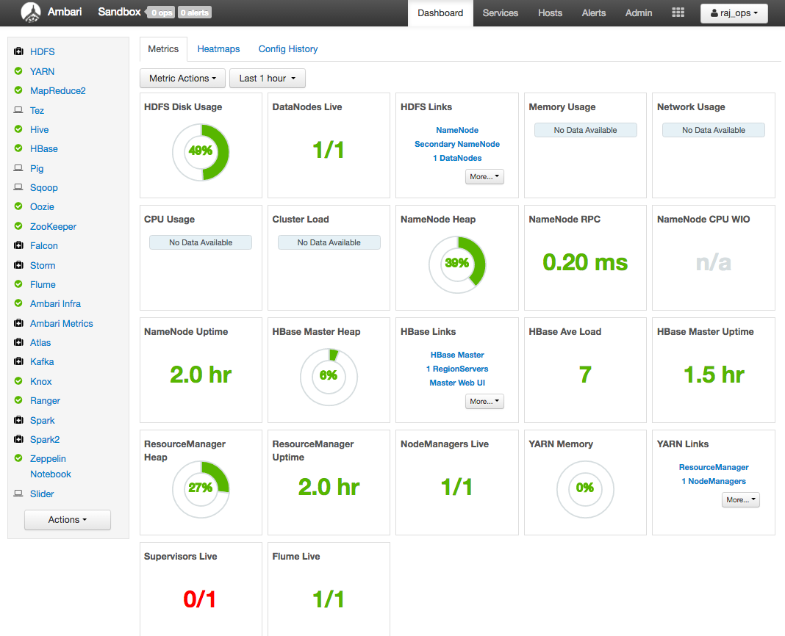
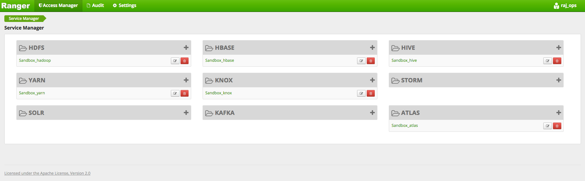
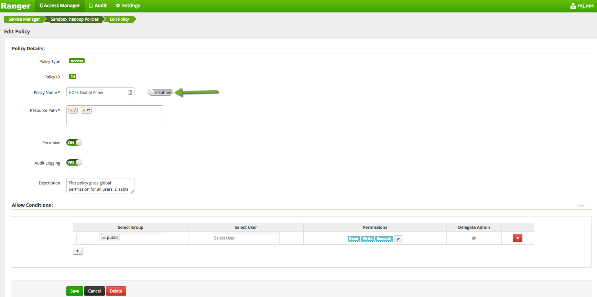
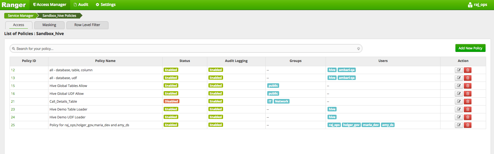
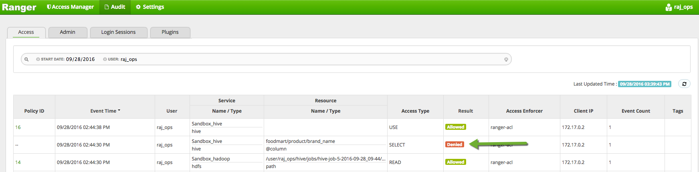
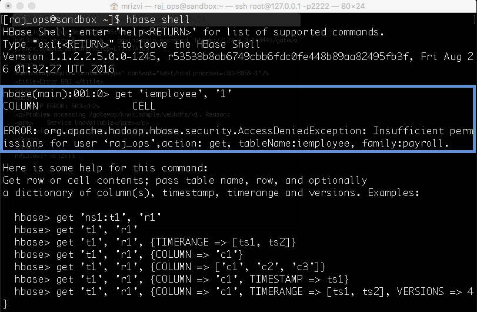

# Securing Your Data Lake Resource & Auditing User Access with HDP Advanced Security

## Lab 1: Securing HDFS, Hive, HBase Data using Apache Ranger

## Introduction

In this tutorial we will explore how you can use policies in Apache Ranger to protect your enterprise data lake and audit access by users to resources on HDFS, Hive and HBase from a centralized Ranger Administration Console.

## Prerequisites

-   Download [Hortonworks Sandbox](https://hortonworks.com/products/hortonworks-sandbox/#install)
-   Complete the [Learning the Ropes of the HDP Sandbox](https://hortonworks.com/hadoop-tutorial/learning-the-ropes-of-the-hortonworks-sandbox/) tutorial.

## Outline

- [1: Start HBase and Ambari Infra Services](#start-hbase-infra)
- [2: Login to Ranger Administration Console](#login-ranger)
- [3: Review Existing HDFS Policies](#review-hdfs-policies)
- [4: Exercise HDFS Access Scenarios](#exercise-hdfs-access)
- [5: Review Hive Policies](#review-hive-policies)
- [6: Exercise Hive Access Scenarios](#exercise-hive-access)
- [7: Review HBase Policies](#review-hbase-policies)
- [8: Exercise HBase Access Scenarios](#exercise-hbase-access)
- [Summary](#summary)

## 1: Start HBase and Ambari Infra Services 

Go to Ambari and login  with user credentials **raj_ops/raj_ops**. If HBase is switched off go to `Service Actions` button on top right and `Start` the service

Check the box for **Maintenance Mode**.

Next, click `Confirm Start`. Wait for 30 seconds and your HBase will start running.
Similarly, start **Ambari Infra** to record all the audits through Ranger. Your **Ambari dashboard** should look like this:

## 2: Login to Ranger Administration Console 

Once the VM is running in VirtualBox, login to the Ranger Administration console at **http://localhost:6080/** from your host machine. The username is **raj_ops** and the password is **raj_ops**.

As soon as you login, you should see list of repositories as shown below:

## 3: Review Existing HDFS Policies 

Please click on `Sandbox_hadoop` link under HDFS section

User can review policy details by a single click on the box right to the policy. Click on the `HDFS Global Allow policy`. Click the slider so it is in **disable** position.

 Then click `Save`.

## 4: Exercise HDFS Access Scenarios 

Login to the Ambari by the following credentials:

Username - **raj_ops**
Password - **raj_ops**

Click on 9 square menu icon and select `Files view:`

 You will see a home page like the one given below. Click on `demo` folder

Next, click on `data`. You will see a message like this:

Click on `details`, that will lead you to the page that shows the permission denied for the user **raj_ops**:

Go back to Ranger and then to the `Audits Tab` and check that its event (denied) being audited. You can filter by searching **Result as Denied**

Now, go back to the **HDFS Global Allow Policy**. Click the switch to enable it and try running the command again

Click `Save`.
Now let us go back to Files view and Navigate back to `/demo/data/`. You will see three folders under data due to enabled HDFS global policy.

Now head back to the Audit tab in Ranger and search by `User: raj_ops`. Here you can see that the request was allowed through

## 5: Review Hive Policies 

Click on `Access Manager=>Resource Based Policies` section on the top menu, then click on `Sandbox_hive` link under HIVE section to view list of Hive Policies:

User can review policy details by a single click on the box right to the policy.
Disable the **Hive Global Tables Allow Policy** :

Also disable the `policy for raj_ops, holger_gov, maria_dev and amy_ds`.
You should see a page like this:

## 6: Exercise Hive Access Scenarios 

Go back to Ambari and click on 9 square menu icon and select `Hive view`:

Run the following query:

~~~
select * from foodmart.product;
~~~

You will come across error message which states that **Permission denied for raj_ops because it does not have a SELECT privilege**.

Next, go back to Ranger and then Audits and see its access (denied) being audited. You can do this the same way that we checked for the raj_ops user. Just search the audit log by user to see.

Re-Enable the **Global Hive Tables Allow** policy and **Policy for raj_ops, holger_gov, maria_dev and amy_ds**.
Go back to **Hive View** and run the same query again:

~~~
select * from foodmart.product;
~~~

This time, the query runs successfully and you can see all data in product table. Go back to Ranger and then Audits to see its access (granted) being audited.

## 7: Review HBase Policies 

Click on `Access Manager=>Resource Based Policies` section on the top menu, then click on the `Sandbox_hbase` to view list of hbase Policies.

User can review policy details by a single click on the box right to the policy. Disable the **HBase Global Allow Policy** in the same manner that we did before.

## 8: Exercise HBase Access Scenarios 

First you’re going to need to log in to your Sandbox via SSH. If you’re using Virtualbox you can log in with the command:

~~~
ssh root@127.0.0.1 -p 2222
~~~

The first time password to log in is: **hadoop**

Login into HBase shell as **raj_ops** user:

~~~
su raj_ops
hbase shell
~~~

Run the hbase shell command to validate access for raj_ops user-id, to see if he can view table data from the iemployee table:

~~~
get 'iemployee', '1'
~~~

Then you should get an Access Denied Exception like:

Let us check the audit log in Ranger too:

Next, enable the **HBase Global Allow Policy**.
After making a change in the policy, go back to HBase shell and run the same query again:

~~~
get 'iemployee','1'
~~~

Now, you can view all the data in **iemployee** table under **rowkey 1**. Go to Ranger to check audit logs:

## Summary 

Hopefully by following this tutorial, you got a taste of the power and ease of securing your key enterprise resources using Apache Ranger.

**Happy Hadooping!!!**
