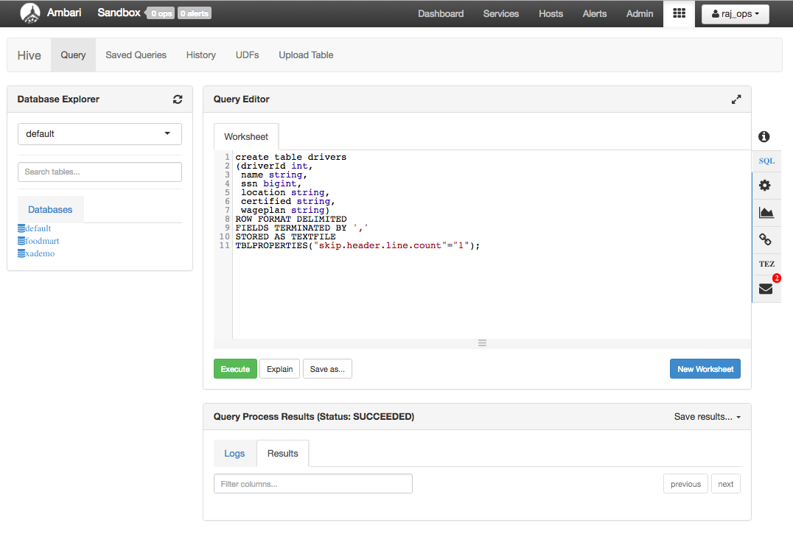
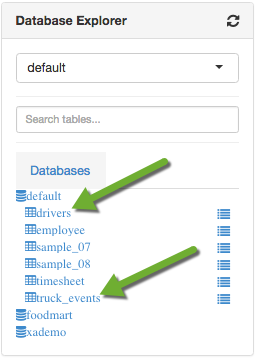
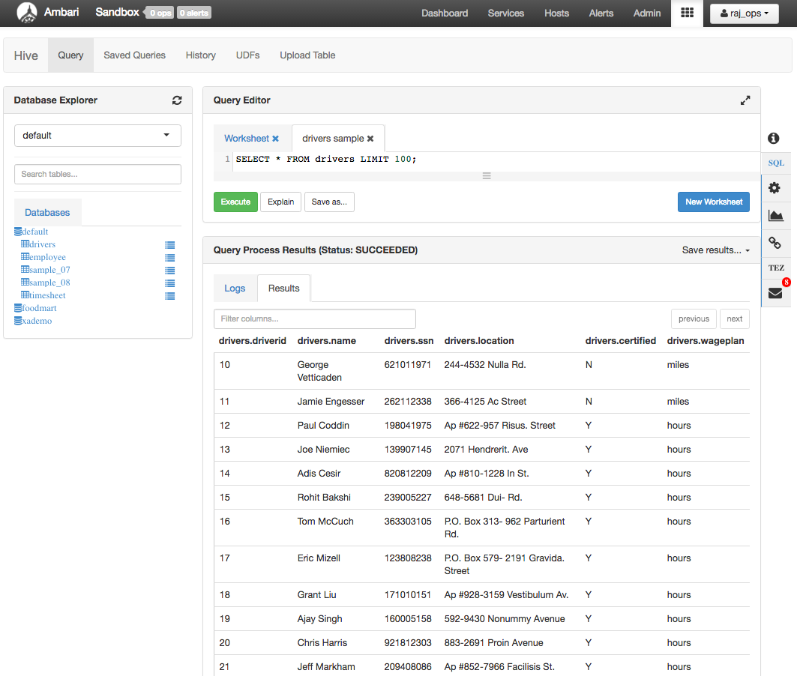
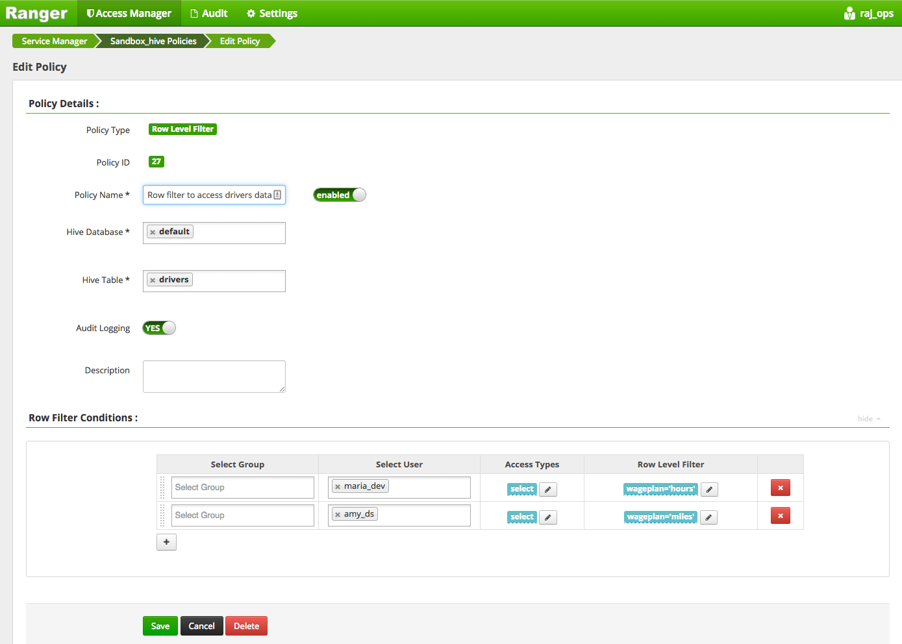
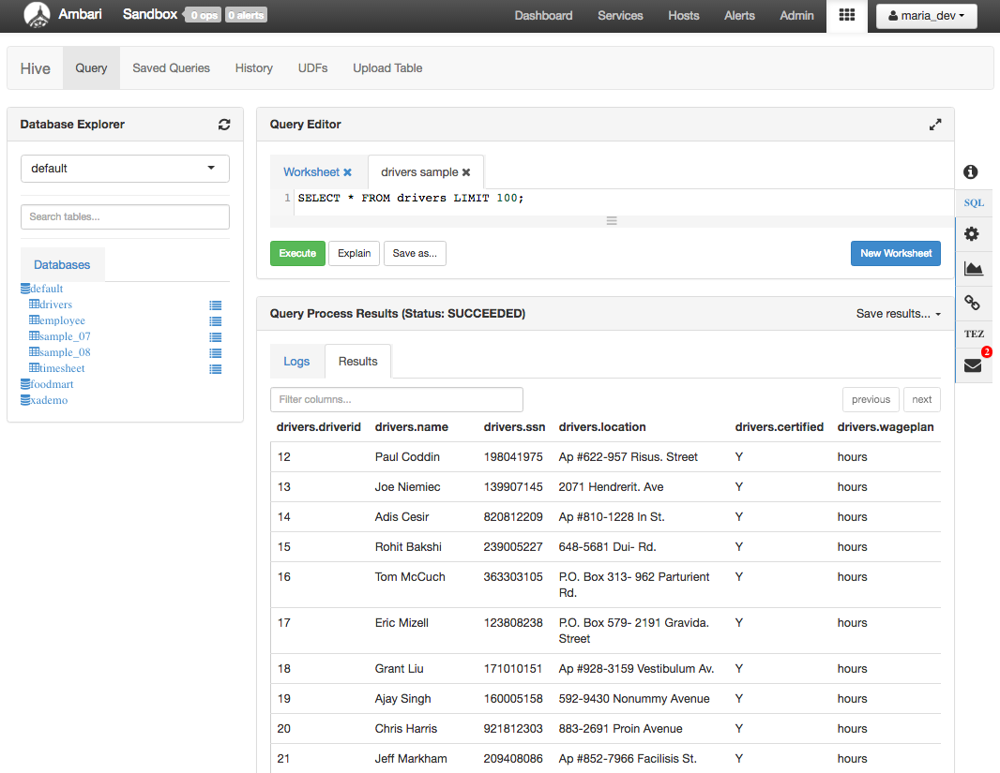
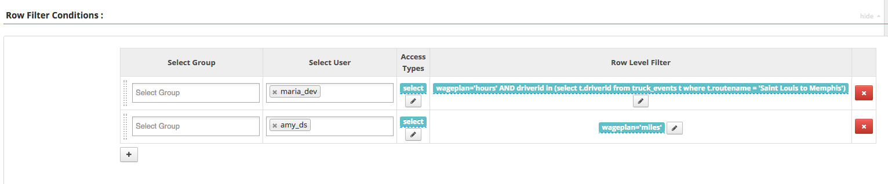
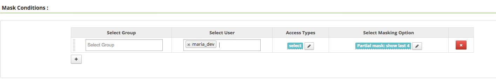
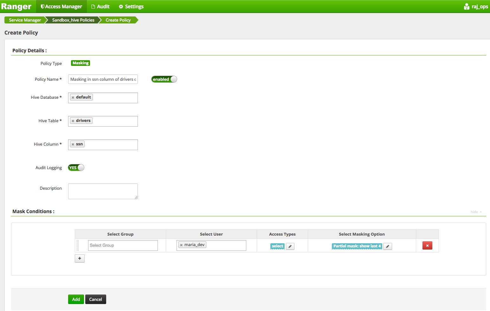
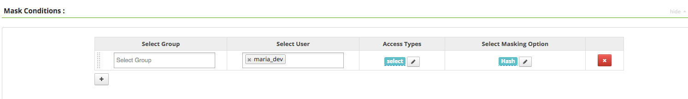
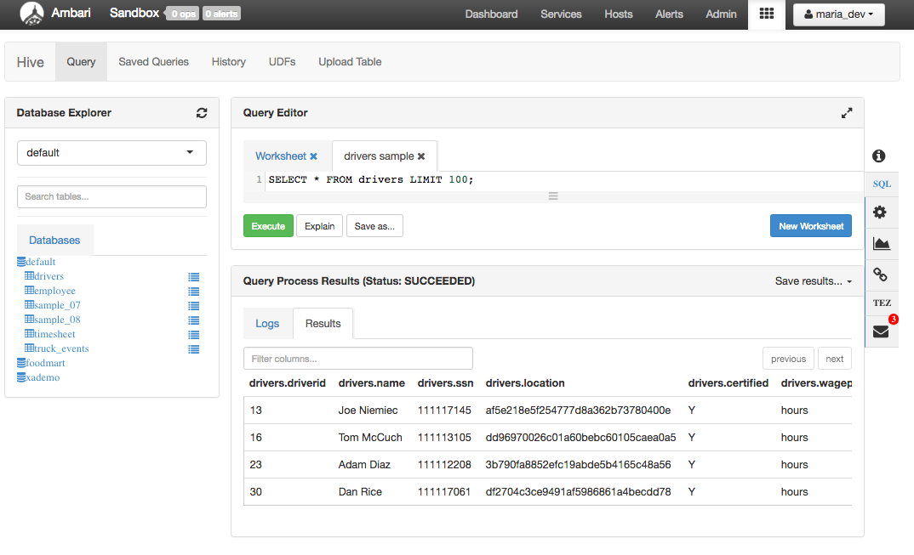

# Securing Your Data Lake Resource & Auditing User Access with HDP Advanced Security

## Introduction

In this lab of the Apache Ranger tutorial, we will use Ranger to set access policies for row level filtering in Apache Hive tables. We will also cover Ranger masking capabilities to protect sensitive data like SSN or salary.

## Prerequisites

*   Download [Hortonworks Sandbox](https://hortonworks.com/products/hortonworks-sandbox/#install)
*   Complete the [Learning the Ropes of the HDP Sandbox](https://hortonworks.com/hadoop-tutorial/learning-the-ropes-of-the-hortonworks-sandbox/) tutorial.
*   Complete the Lab 1 of this tutorial to get used to the Ranger UI and its features.

## Outline

- [1. Download the sample data](#download-sample-data)
- [2. Upload the data files](#upload-data-files)
- [3. Create the tables in Hive](#create-table-hive)
- [4. Row level filtering in Hive](#row-level-filtering)
- [5. Dynamic Column Masking in Hive](#dynamic-column-masking)
- [Summary](#summary)

## 1. Download the sample data 

Download the driver data file from [here](assets/driver_data.zip).
Once you have the file you will need to unzip the file into a directory. We will be uploading two csv files - **drivers.csv** and **truck_event_text_partition.csv**.

## 2. Upload the data files 

Login to the Ambari by the following credentials:
Username - **raj_ops**
Password - **raj_ops**
Click on 9 square menu icon and select Files view:

Navigate to `/user/raj_ops`and click on the `Upload` button to select the files we want to upload into the Hortonworks Sandbox environment.

Click on the `browse` button to open a dialog box. Navigate to where you stored the **drivers.csv** file on your local disk and select drivers.csv and click again upload. Do the same thing for **truck_event_text_partition.csv**. When you are done you will see there are two new files in your directory.

## 3. Create the tables in Hive 

Let’s open the **Hive View** by clicking on the Hive button in the top bar as previously when we selected the HDFS Files view.

Next, run the following query to create the drivers table:

~~~
create table drivers
(driverId int,
 name string,
 ssn bigint,
 location string,
 certified string,
 wageplan string)
ROW FORMAT DELIMITED
FIELDS TERMINATED BY ','
STORED AS TEXTFILE
TBLPROPERTIES("skip.header.line.count"="1");
~~~

Click on green `Execute` button, after few seconds, you will see the **SUCCEEDED** message:

Time to load the data into this newly created table, type:

~~~
LOAD DATA INPATH '/user/raj_ops/drivers.csv' OVERWRITE INTO TABLE drivers;
~~~

And then click `Execute`:

Similarly, let us create the table timesheet and then load the data using following commands:

~~~
create table truck_events
(driverId int,
truckId int,
eventTime string,
eventType string,
longitude double,
latitude double,
eventKey string,
correlationId bigint,
driverName string,
routeId int,
routeName string)
ROW FORMAT DELIMITED FIELDS TERMINATED BY ','
STORED AS TEXTFILE
TBLPROPERTIES("skip.header.line.count"="1");
~~~

Next, load the data:

~~~
LOAD DATA INPATH '/user/raj_ops/truck_event_text_partition.csv' OVERWRITE INTO TABLE truck_events;
~~~

Next, click on Refresh sign next to Database explorer, you will see two new tables created.

Click on the box next to the table name to view the data:

Now that we have the tables ready, let us explore the row level filtering and masking capabilities of Apache ranger.

## 4. Row level filtering in Hive 

By providing row level filtering to Hive tables, Hive data access can be restricted to specific rows based on user role in the organization. **Row-level filter policies** are similar to other Ranger access policies. You can set filters for specific users, groups, and conditions. The filter expression should be a valid **WHERE** clause. Let us start with some use cases of row level filtering.

### 4.1 Restrict access as per different types of wage plan in drivers table

There are only two values for wage plan attribute in drivers table - **miles** and **hours**. We are going to use two users for this use case - **maria_dev** and **amy_ds**. Let us restrict these users to access records based on the wage plan. User maria_dev should only view records corresponding to hours wage plan and amy_ds should view records corresponding to miles wage plan.

Go back to Ranger UI with the user credentials **raj_ops/raj_ops**. Click on `Access Manager=>Resource Based Policies=>Sandbox_hive`. Switch to **Row level Filter** tab.

Click on `Add New Policy` button on the right. Enter the following details:

~~~
Policy Name - Row Filter to access drivers data
Hive Database - default
Hive Table - drivers
~~~

In Row filter Conditions:

~~~
Select Group - Leave it blank
Select User - maria_dev
Access Type - select
Row level filter - wageplan='hours'
~~~

> NOTE - Do not forget to click on tick mark to save the row filter expression.

Next, click on + button to add one more row for **amy_ds** user, enter the following details in the row filter conditions:

~~~
Select Group - Leave it blank
Select User - amy_ds
Access Type - select
Row level filter - wageplan='miles'
~~~

Your Row Filter Conditions table should look like this:

Please verify whether you have put the correct values.

Click `Add`. Next, login to Ambari as **maria_dev** user.

Credentials: **maria_dev/maria_dev**. Go to Hive View and let us try to see the data in drivers table. Click on default database and then the square next to drivers table:

You can clearly see that there are only records where the wage plan is hours. Next, sign out from Ambari and then re-login as amy_ds user.

Credentials: **amy_ds/amy_ds**. Repeat the same operation as above

There are records corresponding to miles wage plan only.

### 4.2 Restrict Access on the drivers table data based on truck_events table data

Let us create one more Row level filter policy which makes sure that maria_dev view records only for those drivers whose **route is from Saint Louis to Memphis**. The information for route name is present in another table **truck_events**.

We have to edit the same policy which we created in the previous use case. Go back to the policy - `Row filter to access drivers data` and edit the first row of **Row Filter Conditions** like this:

~~~
Row level filter expression - wageplan='hours' AND driverid in (select t.driverid from truck_events t where t.routename = 'Saint Louis to Memphis')
~~~

This makes sure that maria_dev only view those records whose wageplan is hours and the route name is 'Saint Louis to Memphis'. Your condition section should look like this:

Click `Add` and go back to Hive View as **maria_dev** user. Run the query to view records in drivers table.

## 5. Dynamic Column Masking in Hive 

**Column masking policy** allows ranger to specify masking condition in hive policy to mask the sensitive data for specific users. A variety of masking types are available, such as show last 4 characters, show first 4 characters, Hash, Nullify, and date masks (show only year). Let us use drivers table data for data masking use cases as well.

### 5.1 Show only last 4 digits of SSN column

Go back to Ranger and click on `Masking` tab:

Click on `Add New Policy` on the right . Enter the following details:

~~~
Policy Name - Masking in ssn column of drivers data
Hive Database - default
Hive Tables - drivers
Hive Column - ssn
~~~

In mask conditions,

~~~
Select Group - Leave blank
Select User - maria_dev
Access Type - select
Select Masking Options - Partial mask: show last 4
~~~

Your mask conditions section should look like this:

And the entire policy should look like:

Click `Add`. Now wait for 20 seconds and go back to Hive view to see the records of driver table.

Ranger replaces the first 5 digits of SSN to value 1 and retained the last 4.

> NOTE: If SSN would have been in a proper format(111-22-3333) it would have given xxx-xx-3333

### 5.2 Convert location column values to hash values

In this use case, we will see how Ranger effectively hashes the values of location column through the masking policy.

Go back to `Masking` tab of Ranger console and click on `Add New Policy` button. Enter the following details:

~~~
Policy Name - Masking in location column of drivers data
Hive Database - default
Hive Tables - drivers
Hive Column - location
~~~

In mask conditions,

~~~
Select Group - Leave blank
Select User - maria_dev
Access Type - select
Select Masking Options - Hash
~~~

Your mask conditions section should look like this:

And the overall policy should look like this:

Click `Add`. Now wait for 20 seconds and go back to Hive view to see the records of driver table.

Please note that the location column values has been hashed by random alphanumeric characters.

Next, let us see the data from the another user **amy_ds**. Sign out from Ambari and re-login as amy_ds. Credentials are **amy_ds/amy_ds**.

There is no masking in either SSN or location location because amy_ds is not a part of the policy so it gets unmasked results.

## Summary 

In this tutorial, we learned how to create row level filter and masking policies in Apache Ranger to restrict access to Hive tables or columns.
