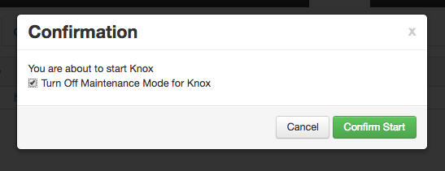
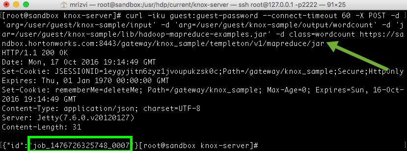
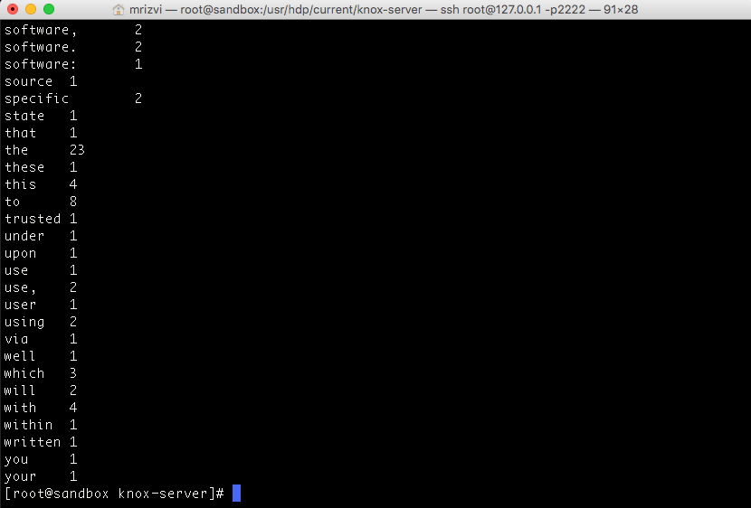

# Securing Your Hadoop Infrastructure with Apache Knox

## Introduction

In this tutorial we will walk through the process of

-   Configuring Apache Knox and LDAP services on HDP Sandbox
-   Run a MapReduce Program using Apache Knox Gateway Server

## Prerequisites

- [Download Hortonworks 2.5 Sandbox](https://hortonworks.com/downloads/#sandbox).
- Complete the [Learning the Ropes of the Hortonworks Sandbox tutorial,](https://hortonworks.com/hadoop-tutorial/learning-the-ropes-of-the-hortonworks-sandbox/) you will need it for logging into Ambari.

## Outline

-   [Concepts](#concepts)
-   [1: Start Knox and DEMO LDAP service](#start-knox)
-   [2: Check the accessibility of WebHDFS](#check-webhdfs)
-   [3: Accessing Hadoop Cluster via Knox](#access-cluster-knox)
-   [4: Run the WordCount Job via Knox](#run-job-knox)
-   [5: Check the Status of the Job](#check-status-job)
-   [6: View the List of HDFS Directories](#view-directories)
-   [7: List the Output Result](#list-output-result)
-   [8: View the Output File](#view-output-file)
-   [Further Reading](#further-reading)

## Concepts

### What is Apache Knox?

The [Apache Knox Gateway](https://hortonworks.com/hadoop/knox) is a system that provides a single point of authentication and access for Apache™ Hadoop® services. It provides the following features:

-   Single REST API Access Point
-   Centralized authentication, authorization and auditing for Hadoop REST/HTTP services
-   LDAP/AD Authentication, Service Authorization and Audit
-   Eliminates SSH edge node risks
-   Hides Network Topology

### Layers of Defense for a Hadoop Cluster

-   Perimeter Level Security – Network Security, Apache Knox (gateway)
-   Authentication : Kerberos
-   Authorization
-   OS Security : encryption of data in network and HDFS

Apache Knox can also access a Hadoop cluster over HTTP or HTTPS

### Current Features of Apache Knox

-  Authenticate : by LDAP or Cloud SSO Provider
-  Provides services for HDFS, HCat, HBase, Oozie, Hive, YARN, and Storm
-  HTTP access for Hive over JDBC support is available (ODBC driver Support- In Future)

## 1: Start Knox and DEMO LDAP service 

Open up the Ambari user interface by using the URL http://sandbox.hortonworks.com:8080.
Using Virtualbox it might look like http://127.0.0.1:8080. If you’re using Azure make sure to replace 127.0.0.1 with you host machine’s IP address.

Login to Ambari using the following:
Username - **raj_ops**
Password - **raj_ops**

After logging in to Ambari, you will see a list of Services.

Now Select `Knox` from the list of Services on the left-hand side of the page.
Then click on `Service Actions` from the top right hand side of the page click on `Start`.

Check the box for `Maintenance Mode` and click `Confirm Start`.

Next, then go back to the `Service Actions` button on the Knox service and click on `Start DemoLDAP`. This LDAP server is when authenticating users against Knox in the Sandbox because there is no other LDAP server running on the Sandbox.

Now that Knox has started we can start trying to route requests through it. For this next section you’re going to need access to a terminal which utilizes the curl command.

Next, log in to your Sandbox via SSH.
If you’re using Virtualbox you can log in with the command:

~~~
ssh root@127.0.0.1 -p 2222
~~~

The first time password to log in is: **hadoop**

## 2: Check the accessibility of WebHDFS 

Let’s check if the Hadoop Cluster is accessible via **WebHDFS**.
Note that this request is directly accessing the WebHDFS API. This means that we are sending our request directly to WebHDFS without any security or encryption.

~~~
touch /usr/hdp/current/knox-server/conf/topologies/knox_sample.xml
curl -iku guest:guest-password -X GET 'http://sandbox.hortonworks.com:50070/webhdfs/v1/?op=LISTSTATUS'
~~~

## 3: Accessing Hadoop Cluster via Knox 

Now let’s check if we can access Hadoop Cluster via Apache Knox services. Using Knox means we can utilize the HTTPS protocol which utilizes SSL to encrypt our requests and makes using it much more secure.

Not only do we get the added benefit of the extra layer of protection with encryption, but we also get to plug in the LDAP server which many organizations already utilize for authentication

~~~
curl -iku guest:guest-password -X GET 'https://sandbox.hortonworks.com:8443/gateway/default/webhdfs/v1/?op=LISTSTATUS'
~~~

This requests routes through the Knox Gateway. Note that here we use the HTTPS protocol meaning our request is completely encrypted. This is great if, for example, you wanted to access Hadoop services via an insecure medium such as the internet.

## 4: Run the WordCount Job via Knox 

Let’s work on an End to end implementation use case using Apache Knox Service. Here we will take a simple example of a mapreduce jar that you might be already familiar with, the WordCount mapreduce program. We will first create the needed directories, upload the datafile into hdfs and also upload the mapreduce jar file into hdfs. Once these steps are done, using Apache Knox service, we will run this jar and process data to produce output result.

**NOTE:** If you get error “{“error”:”User: hcat is not allowed to impersonate guest”}”, do

~~~
usermod -a -G users guest
~~~

Let’s go!

~~~
cd /usr/hdp/current/knox-server
~~~

You could create the directories `knox-sample`, `knox-sample/input`, and `knox-sample/lib` as follows:

~~~
curl -iku guest:guest-password -X put 'https://sandbox.hortonworks.com:8443/gateway/knox_sample/webhdfs/v1/user/guest/knox-sample?op=MKDIRS&permission=777'

curl -iku guest:guest-password -X put 'https://sandbox.hortonworks.com:8443/gateway/knox_sample/webhdfs/v1/user/guest/knox-sample/input?op=MKDIRS&permission=777'

curl -iku guest:guest-password -X put 'https://sandbox.hortonworks.com:8443/gateway/knox_sample/webhdfs/v1/user/guest/knox-sample/lib?op=MKDIRS&permission=777'

curl -iku guest:guest-password -X put 'https://sandbox.hortonworks.com:8443/gateway/knox_sample/webhdfs/v1/user/guest/knox-sample/output?op=MKDIRS&permission=777'

~~~

Note that if you don't get the `HTTP/1.1 200 OK` Return as a result, you may not have started the Knox LDAP server

Let’s upload the data and the mapreduce jar files:

~~~
curl -iku guest:guest-password  -L -T README -X PUT  "https://sandbox.hortonworks.com:8443/gateway/knox_sample/webhdfs/v1/user/guest/knox-sample/input/README?op=CREATE"

curl -iku guest:guest-password  -L -T /usr/hdp/current/hadoop-mapreduce-client/hadoop-mapreduce-examples.jar -X PUT "https://sandbox.hortonworks.com:8443/gateway/knox_sample/webhdfs/v1/user/guest/knox-sample/lib/hadoop-mapreduce-examples.jar?op=CREATE"
~~~

Let’s run the mapreduce program.

~~~
curl -iku guest:guest-password --connect-timeout 60 -X POST -d 'arg=/user/guest/knox-sample/input' -d 'arg=/user/guest/knox-sample/output/wordcount' -d 'jar=/user/guest/knox-sample/lib/hadoop-mapreduce-examples.jar' -d class=wordcount https://sandbox.hortonworks.com:8443/gateway/knox_sample/templeton/v1/mapreduce/jar
~~~

When you run the mapreduce execution step, you will see the following result. Please note down the Job Id. You will use it for checking status for this Job Id in the next step.

## 5: Check the Status of the Job 

You can check the status of your above Job Id as follows:

~~~
curl -iku guest:guest-password 'https://sandbox.hortonworks.com:8443/gateway/knox_sample/templeton/v1/jobs/job_1476726325748_0007'
~~~

Remember to **replace everything after `jobs/` with your job id**.

## 6: View the List of HDFS Directories 

Let’s look at the list of directories in /knox-sample parent directory in hdfs.

~~~
curl -iku guest:guest-password -X GET 'https://sandbox.hortonworks.com:8443/gateway/knox_sample/webhdfs/v1/user/guest/knox-sample?op=LISTSTATUS'
~~~

These are the directories which we created earlier.

## 7: List the Output Result 

Let’s look at the output result file.

~~~
curl -iku guest:guest-password -X GET 'https://sandbox.hortonworks.com:8443/gateway/knox_sample/webhdfs/v1/user/guest/knox-sample/output/wordcount?op=LISTSTATUS'
~~~

It should look something like below:

## 8: View the Output File 

Let’s look at the output result.

~~~
curl -iku guest:guest-password -L -X GET 'https://sandbox.hortonworks.com:8443/gateway/knox_sample/webhdfs/v1/user/guest/knox-sample/output/wordcount/part-r-00000?op=OPEN'
~~~

You just ran a mapreduce program on Hadoop through the Apache Knox Gateway!

Remember, **Knox** is a great way to remotely access API’s form your Hadoop cluster securely. You can add many different core Hadoop services to it, and you can even create your own services which you can route through the Gateway. This can keep your cluster safe and secure. Not to mention that there is great LDAP integration for organizations as well.

## Further Reading 

- [Knox on Hortonworks Community Connection](https://community.hortonworks.com/search.html?f=&type=question&redirect=search%2Fsearch&sort=relevance&q=knox)
- [Apache Knox Site](http://knox.apache.org)
- [How to set up Apache Knox](http://kminder.github.io/knox/2015/11/18/setting-up-knox.html)
- [Adding a Service to Knox](http://kminder.github.io/knox/2015/11/16/adding-a-service-to-knox.html)
- [Using Knox with Microsoft Active Directory](http://kminder.github.io/knox/2015/11/18/knox-with-activedirectory.html)
