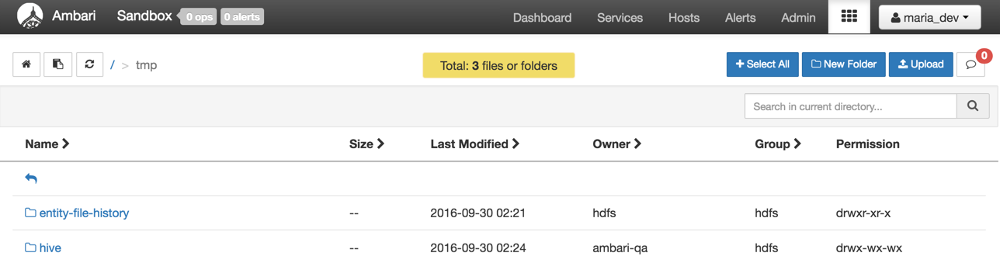
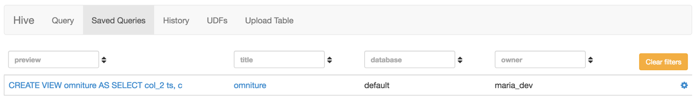

# Visualize Website Clickstream Data

## Lab 1: Perform Web Log Analytics with Hive

## Introduction

This tutorial describes how to ingest clickstream data into HDFS, then use HCatalog to create tables and perform queries on those tables with Hive to analyze the web logs from that data. By the end of the tutorial, we will have a better understanding of how to perform web log analysis on clickstream data, so we can better understand the habits of our customers.

## Prerequisites

-   Hortonworks Sandbox 2.5 (installed and running)

## Outline

-   [Clickstream Data](#clickstream-data)
-   [Potential Uses of Clickstream Data](#uses-clickstream-data)
-   [Step 1: Download the Sample Data](#download-data)
-   [Step 2: Upload the Data Files into the Sandbox](#upload-data-files-sandbox)
-   [Step 3: Create Hive Tables](#create-hive-tables)
-   [Step 4: Load data into new tables](#load-data-to-tables)
-   [Step 5: View and Refine the Data in the Sandbox](#view-refine-data)
-   [Summary](#summary-lab1)
-   [Further Reading](#further-reading-lab1)

## Clickstream Data 

Clickstream data is an information trail a user leaves behind while visiting a website. It is typically captured in semi-structured website log files.

These website log files contain data elements such as a date and time stamp, the visitor’s IP address, the destination URLs of the pages visited, and a user ID that uniquely identifies the website visitor.

## Potential Uses of Clickstream Data 

One of the original uses of Hadoop at Yahoo was to store and process their massive volume of clickstream data. Now enterprises of all types can use Hadoop and the Hortonworks Data Platform (HDP) to refine and analyze clickstream data. They can then answer business questions such as:

-   What is the most efficient path for a site visitor to research a product, and then buy it?
-   What products do visitors tend to buy together, and what are they most likely to buy in the future?
-   Where should I spend resources on fixing or enhancing the user experience on my website?

In this tutorial, we will focus on the “path optimization” use case. Specifically: how can we improve our website to reduce bounce rates and improve conversion?

## Step 1: Download the Sample Data 

A set of sample data contained in a compressed (.zip) folder can be downloaded here:

[RefineDemoData.zip](https://s3.amazonaws.com/hw-sandbox/tutorial8/RefineDemoData.zip)

Save the sample data .zip file to your computer, then extract the files and unzip `Omniture.0.tsv.gz`, `user.tsv.gz` and `products.tsv.gz`.

**Note**: The extracted data files should have a .tsv file extension at the end.

## Step 2: Upload the Data Files into the Sandbox 

First Log in to the Ambari interface at [http://localhost:8080](http://localhost:8080). You can log in with the username `maria_dev` and the password `maria_dev`

Select the `Files view` from the `vies menu`  at the top. The HDFS Files view enables users to view Hortonworks Data Platform(HDP) file store. The HDP file system is separate from the local file system.

We navigate to `/tmp`, create a **maria** folder

click on the row of `maria` and select **Permissions**:

Now we check the `Write buttons` and press save.

Verify that the permissions look now like this:

Now, we navigate to `/tmp/maria`, click on upload and browse the `Omniture.0.tsv`.

Repeat this procedure for `users.tsv` and `products.tsv`.

## Step 3: Create Hive Tables 

Let's open the `Hive View` by clicking on the Hive button from the `views menu` .

Let's create the tables: **users**, **products** and **omniture**.

### 3.1 Create users Table

~~~sql
create table users (swid STRING, birth_dt STRING, gender_cd CHAR(1))
ROW FORMAT DELIMITED
FIELDS TERMINATED by '\t'
stored as textfile
tblproperties ("skip.header.line.count"="1");
~~~

### 3.2 Create products Table

~~~sql
create table products (url STRING, category STRING)
ROW FORMAT DELIMITED
FIELDS TERMINATED by '\t'
stored as textfile
tblproperties ("skip.header.line.count"="1");
~~~

### 3.3 Create omniturelogs Table

~~~sql
create table omniturelogs (col_1 STRING,col_2 STRING,col_3 STRING,col_4 STRING,col_5 STRING,col_6 STRING,col_7 STRING,col_8 STRING,col_9 STRING,col_10 STRING,col_11 STRING,col_12 STRING,col_13 STRING,col_14 STRING,col_15 STRING,col_16 STRING,col_17 STRING,col_18 STRING,col_19 STRING,col_20 STRING,col_21 STRING,col_22 STRING,col_23 STRING,col_24 STRING,col_25 STRING,col_26 STRING,col_27 STRING,col_28 STRING,col_29 STRING,col_30 STRING,col_31 STRING,col_32 STRING,col_33 STRING,col_34 STRING,col_35 STRING,col_36 STRING,col_37 STRING,col_38 STRING,col_39 STRING,col_40 STRING,col_41 STRING,col_42 STRING,col_43 STRING,col_44 STRING,col_45 STRING,col_46 STRING,col_47 STRING,col_48 STRING,col_49 STRING,col_50 STRING,col_51 STRING,col_52 STRING,col_53 STRING)
ROW FORMAT DELIMITED
FIELDS TERMINATED by '\t'
stored as textfile
tblproperties ("skip.header.line.count"="1");
~~~

## Step 4: Load data into new tables 

Let's execute the following queries to load the data into the tables.

~~~sql
LOAD DATA INPATH '/tmp/maria/products.tsv' OVERWRITE INTO TABLE products;
LOAD DATA INPATH '/tmp/maria/users.tsv' OVERWRITE INTO TABLE users;
LOAD DATA INPATH '/tmp/maria/Omniture.0.tsv' OVERWRITE INTO TABLE omniturelogs;
~~~

### 4.1 Verify data loaded correctly

To check if the data was loaded, click on the **load sample data** icon  next to the table name. It executes a sample query.

> Note: repeat the procedure to verify that the dataset was loaded into the products and omniturelogs tables.

## Step 5: View and Refine the Data in the Sandbox 

In the previous section, we created sandbox tables from uploaded data files. Now let’s take a closer look at that data.

Here’s a summary of the data we’re working with:

Switch to your local machine, navigate to the location of the datasets before sending them to HDP, then open omniturelogs in the text editor or spreadsheet of your choice:

**omniturelogs** – website logs containing information such as URL, timestamp, IP address, geocoded IP, and session ID.

**users** – CRM user data listing SWIDs (Software User IDs) along with date of birth and gender.

**products** – CMS data that maps product categories to website URLs.

Now let’s use a Hive script to generate an “omniture” view that contains a subset of the data in the Omniture log table.

~~~sql
CREATE VIEW omniture AS
SELECT col_2 ts, col_8 ip, col_13 url, col_14 swid, col_50 city, col_51 country, col_53 state
FROM omniturelogs
~~~

Click **Save as...**. On the “Saving item” pop-up, type “omniture” in the box, then click OK.

You can see your saved query now by clicking on the "Save Queries" button at the top.

Click **Execute** to run the script.

To view the data generated by the saved script, click on the icon next to the view's name at the Database Explorer.
The query results will appear, and you can see that the results include the data from the omniturelogs table that were specified in the query.

Finally, we’ll create a script that **joins** the omniture website log data to the CRM data (registered users) and CMS data (products). Click Query Editor, then paste the following text in the Query box:

~~~sql
create table webloganalytics as
select to_date(o.ts) logdate, o.url, o.ip, o.city, upper(o.state) state,
o.country, p.category, CAST(datediff( from_unixtime( unix_timestamp() ),
from_unixtime( unix_timestamp(u.birth_dt, 'dd-MMM-yy'))) / 365  AS INT) age, u.gender_cd
from omniture o
inner join products p
on o.url = p.url
left outer join users u
on o.swid = concat('{', u.swid , '}')
~~~

Save this script as “webloganalytics” and execute the script.

Let's view the data generated by the script with the procedure we learned in the previous steps.

Now that you have loaded data into the Hortonworks Platform, you can use Business Intelligence (BI) applications or Data Science Notebooks such as Microsoft Excel or Apache Zeppelin to access and analyze the data.

## Summary 

Congratulations! We uploaded similar datasets for users, products and omniturelogs into HDFS. We then used Hive view to create Hive scripts that create tables and load them with datasets. We then learned to perform ETL operations on the datasets, such as joining our datasets and then further filtering down the data we wanted for our use case of webloganalytics pertaining to when, how and by whom our web server was visited. Thus, we were able to extract the following attributes: logdate, url, ip, city, state, country, category, age and gender into a new table about our customers, so we can better understand them.

## Further Reading 

-   Explore Apache Hive in [Retail Analytics Demo](https://community.hortonworks.com/repos/51932/retail-analytics-demo.html) along with other components from the HDP stack.
-   [SQL to HQL Cheat Sheet](https://hortonworks.com/wp-content/uploads/2013/05/hql_cheat_sheet.pdf)
-   [Hive in the Blog](https://hortonworks.com/apache/hive/#blog)
-   [Hive Webinars & Presentations](https://hortonworks.com/apache/hive/#webinars)
