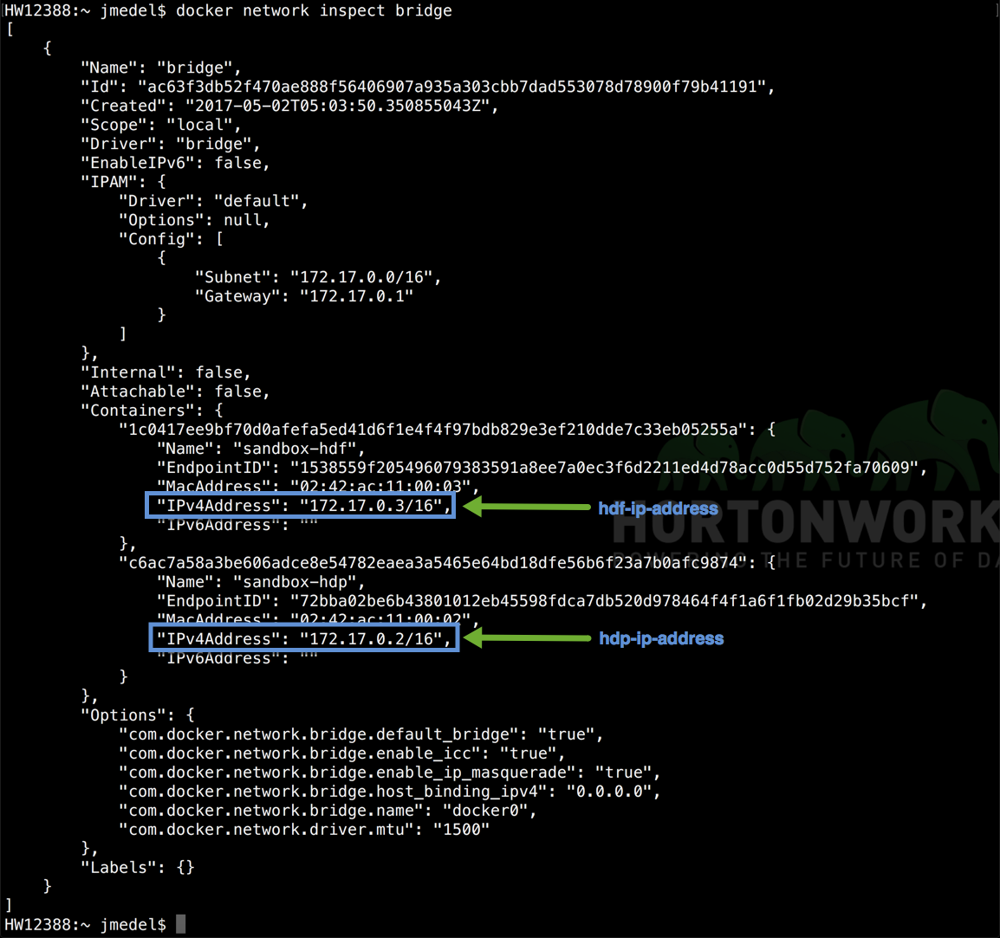
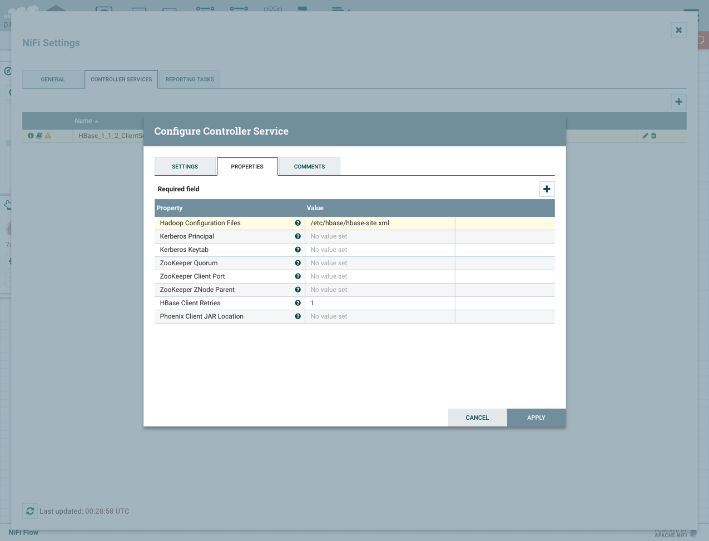
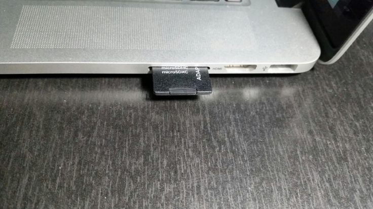
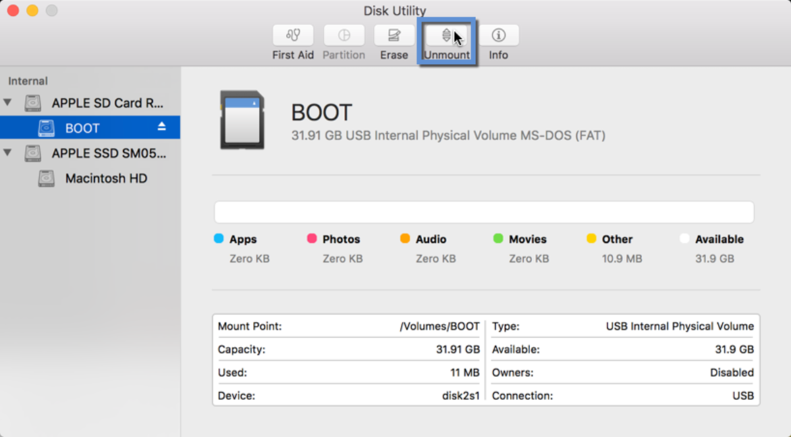
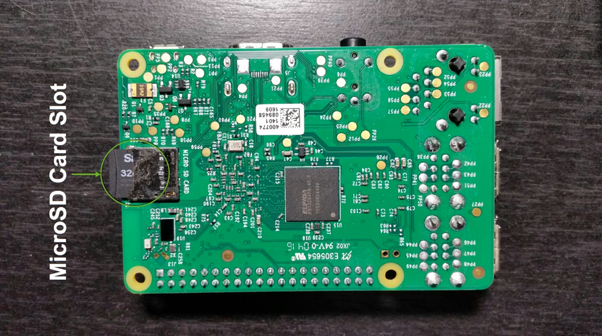

# Deploy IoT Weather Station

## Introduction

You'll make an IoT Weather Station with a Raspberry Pi and Sense HAT. Additionally, you'll add on data analytics to this IoT Weather Station Platform with Connected Data Architecture communication between the MiNiFi, HDF Sandbox and HDP Sandbox.

## Prerequisites

- Downloaded and Installed Latest HDF and HDP Sandboxes on Local Machine
- Downloaded and Installed Latest Raspbian OS onto Raspberry Pi
    - If you need help installing Raspbian OS onto the Raspberry Pi, refer to Appendix A.
- Downloaded and Installed Docker Engine on Local Machine
- Downloaded the latest [MiNiFi Toolkit](https://nifi.apache.org/minifi/download.html) onto your local machine
- Read Analyze IoT Weather Station Data via Connected Data Architecture Intro

## Outline

### Steps for Embedding MiNiFi on IoT Device(Raspberry Pi)
-   Step 1: Connect Sense HAT to Raspberry Pi
-   Step 2: SSH into the Raspberry Pi
-   Step 3: Install MiNiFi Java Agent onto Raspberry Pi
    - 3.1: Install OS Dependencies
    
### Steps for Deploying MiNiFi, HDF, HDP Connected Data Architecture
-   Step 4: Start HDF Sandbox
    - 4.1: Configure NiFi to Receive Data
    - 4.2: Restart NiFi
    - 4.3: Add GeoLite2 database
-   Step 5: Start HDP Sandbox
    - 5.1 Disable Oozie, Flume
    - 5.2 Start HBase
-   Step 6: Connect HDF and HDP
    - 6.1: Update hosts file for HDF and HDP CentOS
    - 6.2: Create HBaseClient Service in HDF NiFi
-   Summary
-   Further Reading
-   Appendix A: Install Raspbian OS onto Raspberry Pi
-   Appendix B: Verify Communication between HDF and HDP Sandboxes

There are two phases you will go through in deploying IoT Weather Station Data Analytics, which include embedding MiNiFi onto the Raspberry Pi and deploying Connected Data Architecture between MiNiFi, HDF Sandbox and HDP Sandbox.

## Embedding MiNiFi on Raspberry Pi

### Step 1: Connect Sense HAT to Raspberry Pi

1\. Connect the Sense HAT's 40 female pins to the Raspberry Pi's 40 male pins.

### Step 2: SSH into the Raspberry Pi

If you haven't installed Raspbian on your device, refer to **Appendx A**.

1\. Open your terminal, clone the **Raspberry Pi Finder** Open Source Program provided by Adafruit Inc:

~~~bash
wget https://github.com/adafruit/Adafruit-Pi-Finder/releases/download/3.0.0/PiFinder-3.0.0-osx-x64.zip
unzip PiFinder-*-osx-*.zip
~~~

2\. Open Raspberry Pi Finder and **Click Find My Pi!**:

3\. Results include the IP address of your Raspberry Pi:

4\. SSH into the Pi from your laptop using the ip address you just collect with the following command:

~~~bash
#definition
ssh pi@<pi-ip-addr> -p 22
~~~

> Note: <pi-ip-addr> will be different for each Raspberry Pi.

Example of the ssh command used to ssh into a raspberry pi:

~~~bash
#example
ssh pi@192.168.2.2 -p 22
~~~

> Note: You'll be asked for the password, enter `raspberry`.

After successfully SSHing into the Raspberry Pi, your console will look similar:

### 2.1 Install the Sense HAT Software

1\. Download and install the Sense HAT Software.

~~~bash
sudo apt-get update
sudo apt-get install sense-hat
sudo pip3 install pillow
~~~

Now you have the software needed to program the Sense HAT, you will utilize it in the next tutorial.

### Step 3: Install MiNiFi Java Agent onto Raspberry Pi

1\. In Raspbian's OS terminal, download Java 8 and JDK1.8 using the following command:

~~~bash
sudo apt-get update && sudo apt-get install oracle-java8-jdk
~~~

> Note: the install will take approximately 10 minutes depending on Raspbian OS resources being used.

1\. Download MiNiFi Java Agent from [apache website downloads](https://www.apache.org/dyn/closer.lua?path=/nifi/minifi/0.1.0/minifi-0.1.0-bin.tar.gz) using the following command:

~~~bash
wget http://public-repo-1.hortonworks.com/HDF/2.1.2.0/minifi-1.0.2.1.2.0-10-bin.tar.gz
~~~

2\. Unpack the MiNiFi project using the following command:

~~~bash
tar -zxvf minifi-*-bin.tar.gz
~~~

A MiNiFi Agent is embedded onto the Raspberry Pi.

## Deploying MiNiFi, HDF and HDP Connected Data Architecture

### Step 4: Start HDF Sandbox

For starting HDF Sandbox, there are two options listed below. **Option1** is for users who have not downloaded or installed HDF Sandbox in the Docker Engine. **Option 2** is for users who have installed and deployed an HDF Sandbox Docker Container.

### Option1: For User Who Haven't Deployed HDF Sandbox Container

If you have't downloaded the Docker HDF Sandbox, download it here: [HDF Sandbox Docker](https://hortonworks.com/downloads)

1\. Run the command to load the docker sandbox image into the docker engine:

~~~bash
docker load < {name-of-your-hdf-sandbox-docker-image}
~~~

Example of the above docker load command:

~~~bash
docker load < HDF_2.1.2_docker_image_04_05_2017_13_12_03.tar.gz
~~~

You'll need the script to deploy an HDF Sandbox Container off of the HDF Sandbox Docker image, Download start HDF Sandbox script here: [start_sandbox-hdf.sh](assets/auto_scripts/start_sandbox-hdf.sh)

1\. run the start_sandbox-hdf.sh script below:

~~~bash
./start_sandboxh-hdf.sh
~~~

Your Docker HDF Sandbox will deploy as a Container and Start up too. You are now ready to go to **substep 4.1**

### Option 2: For User Who Has Deployed HDF Sandbox Container

1\. Turn on your HDF Sandbox using the script:

~~~bash
wget https://raw.githubusercontent.com/james94/data-tutorials/master/tutorials/hdf/hdf-2.1/analyze-traffic-pattern-with-apache-nifi/assets/auto_scripts/docker-scripts/docker_sandbox_hdf.sh
./docker_sandbox_hdf.sh
~~~

Your Docker HDF Sandbox Container will Start up soon.

### 4.1: Configure NiFi to Receive Data

2\. Login to Ambari at:

~~~bash
localhost:9080
~~~

The user/password is `admin/admin`

3\. Head to Advanced NiFi-Properties in Ambari Config Settings for NiFi. Update the input socket port and add the remote host NiFi runs on:

The properties should be updated with the following values:

~~~bash
nifi.remote.input.host = <internal ip address>
nifi.remote.input.socket.port = 17000
~~~

> Note: laptop <internal ip addr> was printed as output earlier when you were learning how to SSH into Raspberry Pi. `ifconfig | grep inet`.

The updates to Advanced NiFi-Properties should look similar as below:

3.1\. Enter NiFi Service in Ambari Stack

3.2\. Enter NiFi Configs

3.3\. Filter search for **nifi.remote**

3.4\. Insert **nifi.remote.input.host** with your `laptop's internal ip address`

3.5\. Verify **nifi.remote.input.http.enabled** checked

3.6\. Insert **nifi.remote.input.socket.port** with `17000`

3.7\. Save the configuration.

Now NiFi is configured for Socket Site-To-Site protocol.

### 4.2: Restart NiFi

3\. Restart NiFi from Ambari with the **orange restart button** for the changes to take effect.

### 4.3: Add GeoLite2 database to HDF Sandbox CentOS

You will need to add the GeoLite2 to HDF Sandbox CentOS for when you add geographic location enhancement to the NiFi DataFlow.

4\. SSH into the HDF Sandbox:

~~~
ssh root@127.0.0.1 -p 12222
~~~

5\. Create directory for GeoFile:

~~~
mkdir -p /tmp/nifi/GeoFile
~~~

6\. Ensure NiFi has access to that location:

~~~
chmod 777 -R /tmp/nifi
~~~

7\. Download GeoLite2-City.mmdb to specified location GeoEnrichIP looks:

~~~
cd /tmp/nifi/GeoFile
wget https://github.com/hortonworks/data-tutorials/raw/master/tutorials/hdp/hdp-2.5/refine-and-visualize-server-log-data/assets/GeoLite2-City.mmdb
~~~

The **warning message** on the GeoEnrichIP processor should disappear:

### Step 5: Start HDP Sandbox

For starting HDP Sandbox, there are two options listed below. **Option1** is for users who have not downloaded or installed HDP Sandbox in the Docker Engine. **Option 2** is for users who have installed and deployed an HDP Sandbox Docker Container.

### Option1: For User Who Haven't Deployed HDF Sandbox Container

If you have't downloaded the the latest Docker HDP Sandbox, download it here: [HDP Sandbox Docker](https://hortonworks.com/downloads)

1\. Run the command to load the Docker HDP Sandbox image into the docker engine:

~~~bash
docker load < {name-of-your-hdp-sandbox-docker-image}
~~~

Example of the above docker load command:

~~~bash
docker load < HDP_2.6_docker_image_05_05_2017_15_01_40.tar.gz
~~~

You'll need the script to deploy an HDP Sandbox Container off of the HDP Sandbox Docker image, Download start HDP Sandbox script here: [start_sandbox-hdf.sh](assets/auto_scripts/start_sandbox-hdf.sh)

1\. Run the start_sandbox-hdp.sh script below:

~~~bash
./start_sandboxh-hdp.sh
~~~

Your Docker HDP Sandbox will deploy as a Container and Start up too. You are now ready to go to **substep 5.1**

### Option 2: For User Who Has Deployed HDP Sandbox Container

Download the start HDP Sandbox Container script here: [docker_sandbox_hdp.sh](assets/auto_scripts/docker_sandbox_hdp.sh)

1\. Turn on your HDP Sandbox container using the script:

~~~bash
./docker_sandbox_hdp.sh
~~~

Your Docker HDP Sandbox Container will Start up soon.

### 5.1 Disable Oozie, Flume

2\. Login to Ambari at:

~~~bash
localhost:8080
~~~

user is `admin`. password is what you set it up as in [Learning the Ropes of Hortonworks Sandbox: Section 2.2](https://hortonworks.com/hadoop-tutorial/learning-the-ropes-of-the-hortonworks-sandbox/#setup-ambari-admin-password)

3\. In the left hand side of HDP Services on the Ambari Stack, turn off Oozie and Flume with Ambari **Service Actions -> Stop** since you'll need more memory to run HBase.

<!--  -->

### 5.2 Start HBase

4\. Turn on HBase Service with Ambari **Service Actions -> Start**

HBase service activated will be indicated by a green check mark.

### Step 6: Connect HDF and HDP

### 6.1: Update hosts file for HDF and HDP CentOS

Update the hosts file for HDF and HDP CentOS, so both sandboxes can reach each other using their hostnames.

1\. From your local machine terminal, to find the ip address of each docker sandbox, type or copy/paste the following command:

~~~bash
docker network inspect bridge
~~~

> Note: the internal ip address for HDP and HDF Sandbox. You will need these IP addresses in order for each sandbox to be reach each other.

2\. Add HDP's ip address mapped to its hostname into HDF's hosts file using the following command:

~~~bash
echo '{hdp-ip-address} sandbox.hortonworks.com' | sudo tee -a /private/etc/hosts
~~~

3\. Add HDF's ip address mapped to its hostname into HDP's hosts file using the following command:

~~~bash
echo '{hdf-ip-address} sandbox-hdf.hortonworks.com' | sudo tee -a /private/etc/hosts
~~~

> Note: the two commands were tested on a mac. So, the paths may be different depending on your OS.

### 6.2: Create HBaseClient Service in HDF NiFi

1\. Go to NiFi UI on HDF Sandbox at:

~~~bash
localhost:19090/nifi
~~~

2\. At the top right corner, go to **Global Menu -> Controller Settings -> Controller Services -> Plus Button**

3\. Look for the **HBaseClient Service** in the list of controller services, then add it.

4\. Configure the HBaseClient Service and add to the property tab under **Hadoop Configuration Files**, the file path:

~~~bash
/etc/hbase/hbase-site.xml
~~~

NiFi needs this file to be able to connect to the remote HBase instance running on HDP Sandbox.

## Summary

Congratulations! You know how to setup your own IoT Weather Station using the Raspberry Pi, Sense HAT, MiNiFi, HDF Sandbox and HDP Sandbox. You are also familiar with how to embed MiNiFi onto the Raspberry Pi and how to setup MiNiFi, HDF and HDP Connected Data Architecture. In the next tutorials, you'll focus on data preprocessing, data storage into a nosql database and analyzing the data in real-time as it saves to the database.

## Further Reading

- [Raspberry Pi Software Guide](https://www.raspberrypi.org/learning/software-guide/quickstart/)
- [Installing Operating System Images on MAC OS](https://www.raspberrypi.org/documentation/installation/installing-images/mac.md)
- [SSH Using Mac or Linux](https://www.raspberrypi.org/documentation/remote-access/ssh/unix.md)
- [Is your Pi not booting? (The Boot Problems Sticky)](https://www.raspberrypi.org/forums/viewtopic.php?t=58151)
- [Use SSH to talk with your Raspberry Pi](http://www.instructables.com/id/Use-ssh-to-talk-with-your-Raspberry-Pi/)
- [Raspberry Pi Pinout Diagram](http://www.jameco.com/Jameco/workshop/circuitnotes/raspberry_pi_circuit_note_fig2a.jpg)
- [Find Raspberry Pi Address on Local Network](http://raspberrypi.stackexchange.com/questions/13936/find-raspberry-pi-address-on-local-network)

### Appendix A: Install Raspbian OS onto Raspberry Pi

For users who need help installing Raspbian OS onto their Raspberry Pi, we have provided this appendix for the step-by-step procedure for users who have computers with SD card slots.

### A.1 Configure a bootable Raspbian OS on microSD

1\. Connect the SanDisk MicroSD Card into SanDisk microSD Adapter and insert that SDCard Adapter into the SD card slot of your computer.

MicroSD Card on left and SD Card Adapter on right.

MicroSD Card connected to SD Card Adapter insereted into computer's SD Card slot.

2\. Download [Raspbian Jessie Lite operating system image](https://www.raspberrypi.org/downloads/raspbian/) onto your local machine.

3\. Open your terminal for local machine, navigate to the Downloads folder. Unzip **raspbian-jessie-lite.zip**:

~~~bash
cd ~/Downloads
unzip 2017-*-raspbian-jessie-lite.zip
~~~

4\. See a list of all devices that are mounted on laptop using command:

~~~bash
df
~~~

5\. Note down the device path listed next to the volume, look for the most recent volume added, it'll probably have name **/Volumes/BOOT** under Mounted On column.

6\. Open Disk Utility, select SD card, then press **Unmount**, so we can write to the entire card.

7\. Head to terminal, in the Downloads folder where the Raspbian OS is located, run the DD command to write a bootable Raspbian OS onto micro SD card:

~~~
sudo dd bs=1m if=2017-02-16-raspbian-jessie-lite.img of=/dev/rdisk2
~~~

> Note: Explanation of three arguments used in dd: **bs = block size**, **if = location of raspbian input file**, **of = location of peripheral device output file**. Notice how in the **of=** argument, SD card volume changes from disk2s1 to rdisk2 to ensure the entire SD card is overloaded, not just the partition.

The DD operation will take 1 to 5 minutes until completion.

After the dd operation completes, you should see the Raspbian bootable OS  successfully transferred over to the SD card.

8\. To setup a headless raspberry pi, ssh can be enabled by placing a file named **ssh** onto the boot partition's base directory:

> Note: the path to the SD card is `/Volumes/boot`. `touch ssh` creates a new file. `ls -ltr` verifies new file was created.

9\. Eject the microSD card Adapter and remove it from your laptop. Insert the microSD card into the micro SD card slot of the Raspberry Pi.

10\. Connect ethernet cable to the Raspberry Pi to give it internet access, connect the 5V for power and the Pi should start up.

The Pi's default login credentials:

~~~bash
username/password = pi/raspberry
~~~

> Note: you will need the password for ssh access to the Raspberry Pi.

### Appendix B: Verify Communication between HDF and HDP Sandboxes

Check the docker networks available:

~~~
docker network ls
~~~

Check if both docker containers are connected to the “bridge” docker network

~~~
docker network inspect bridge
~~~

SSH into HDF container

~~~
ssh root@localhost -p 12222
~~~

SSH into HDP container

~~~
ssh root@localhost -p 2222
~~~

Check for connectivity to HDP container from HDF container:

~~~
ping sandbox.hortonworks.com
~~~

Check for connectivity to HDF container from HDF container:

~~~
ping sandbox-hdf.hortonworks.com
~~~

As long as both container can ping each other, they can communicate. Message you should see looks like:

~~~
PING 172.17.0.2 (172.17.0.2) 56(84) bytes of data.
64 bytes from 172.17.0.2: icmp_seq=1 ttl=64 time=0.078 ms
~~~

Check connectivity to zookeeper from HDF Sandbox Container

~~~
telnet sandbox.hortonworks.com 2181
~~~

Check connectivity to HBase Master and Regionserver

Connection to HMaster UI

~~~
telnet sandbox.hortonworks.com 160000
~~~

Connection to HMaster Bind Port

~~~
telnet sandbox.hortonworks.com 160010
~~~

Connection to HBase RegionServer

~~~
telnet sandbox.hortonworks.com 160020
~~~

Connection to HBase RegionServer Bind Port

~~~
telnet sandbox.hortonworks.com 160030
~~~

As long as all commands above check out with no error responses, then you have successful communication between HDF and HDP Sandboxes
